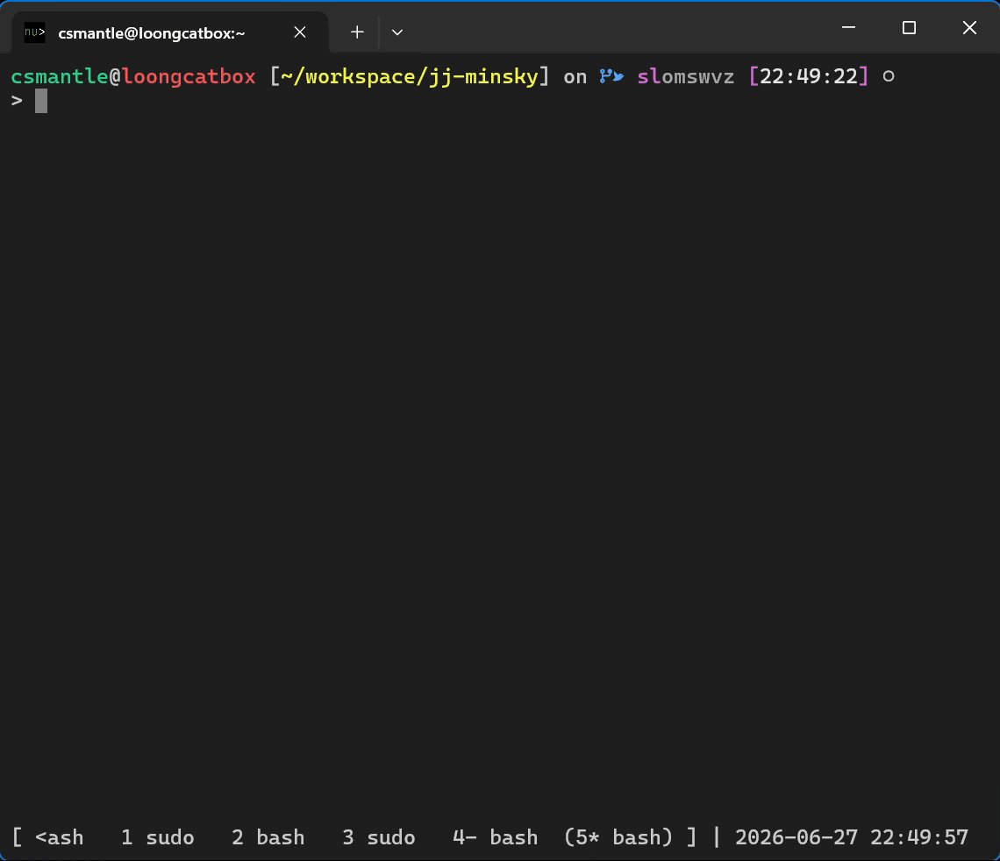

[Jujutsu](https://docs.jj-vcs.dev/latest/) is an ergonomic <abbr title="Distributed Version Control System">DVCS</abbr> interoperable with Git. I first became aware of it when working on the Firefox codebase, where I needed to juggle with multiple stacks of patches simultaneously. Mozilla has an excellent [*Introduction to Jujutsu*](https://firefox-source-docs.mozilla.org/contributing/jujutsu.html#introduction-to-jujutsu) available on their docs site.

Jujutsu has a [templating language](https://docs.jj-vcs.dev/latest/templates/) primarily for customization and theming of almost all human-oriented TUI parts, including jj-log(1), jj-show(1), etc. I daily-drive the [default, built-in theme](https://github.com/jj-vcs/jj/blob/fdc6c5cff05bcf4ebf76db7ad851da1840f72a40/cli/src/config/templates.toml). The templating language supports a plethora of operations, which made me think whether it's possible to build something more than themes out of it.

In [*Jira is Turing-Complete*](https://seriot.ch/computation/jira.html) by Nicolas Seriot, he showed that Jira Automation Rules can be built to simulate a [Minsky machine](https://esolangs.org/wiki/Minsky_machine) by recursion. As Minsky machines with two or more registers can be reduced to Turing machines, he demonstrated the Turing completeness of Jira. In this post, we show that the same is also achievable with Jujutsu templating language as the state transition function, plus jj-revert(1) as the clock driver.

## A Minsky adder

### Design choices

To recap, a Minsky machine has a number of registers plus these two instructions:

1. `inc $r; goto $S`
2. `if $r == 0 goto $S1 else (dec $r; goto $S2)`

The `2+3=5` program we're going to implement then looks like this, with `S0` as its initial state:

```plain-text
S0: if A == 0 goto #HALT else (dec A; goto S1)
S1: inc B; goto S0
#HALT: halt
```

**Encoding machine states.** The first question is where to store the states. Jujutsu templates [forbids recursion](https://github.com/jj-vcs/jj/blob/fdc6c5cff05bcf4ebf76db7ad851da1840f72a40/cli/src/template_parser.rs#L160), so they inherently cannot have memory. However, each commit has a description (also called message, or subject plus body, pick yours), which is suitable for storing data.

Once encoded in the commit description, the value becomes a `String`. There are no easy ways to make `Integer`s out of `String`s in Jujutsu templating language. To circumvent this, we encode the value into length of `String`s, which itself [has](https://docs.jj-vcs.dev/latest/templates/#string-type) `++` concatenation, `.remove_suffix(needle: Stringify) -> String`, `.split(separator: StringPattern, [limit: Integer]) -> List<String>`, and `.len() -> Integer`.

We use the first (subject) line of the description to hold all states, which looks like `$S|$A|$B`. To clearly separate the two registers, we choose different filler chars for them. Thus, the initial state and registers should be as follows:

```plain-text
S0|aa|bbb
```

**Finding a clock source.** Since templates themselves cannot recurse (["combinational"](https://en.wikipedia.org/wiki/Combinational_logic) in this sense), an external excitation is needed to drive the state transition. This source should also be dead simple to avoid the "CSS is as turing complete as [a couple of rocks on the beach](https://xkcd.com/505/)" pitfall[^1].

It turns out that jj-revert(1) is a good candidate. It creates a new commit and sets its description by applying a template to the reverted one. By default, this command produces the following:

```plain-text
Revert "Implement feature foo"

This reverts commit 6987bf02562283e638172d09a1f6822cb67ed73f.
```

... which is created by [this built-in template](https://github.com/jj-vcs/jj/blob/fdc6c5cff05bcf4ebf76db7ad851da1840f72a40/cli/src/config/templates.toml#L37-L43):

```toml
revert_description = '''
concat(
  'Revert "' ++ description.first_line() ++ '"' ++ "\n",
  "\n",
  "This reverts commit " ++ commit_id ++ ".\n",
)
'''
```

So, once we set `revert_description` appropriately, we can simply `jj revert` the previous commit over and over again to advance the clock tick. Since there's no extra decision involved, it's dead simple.

### Implementation

To create the machine, first create a new directory, enter it, and make a fresh Jujutsu repository by `jj git init`. Locally define the templates by `jj config edit --repo`:

```toml
[template-aliases]
"parts(state)" = 'state.trim().split("|")'
"step(state)" = '''
if(
    state.trim() == "#HALT",
    "#HALT",
    if(
        parts(state).get(0) == "S0",
        if(
            parts(state).get(1).len() > 0,
            "S1" ++ "|" ++ parts(state).get(1).remove_suffix("a") ++ "|" ++ parts(state).get(2),
            "#HALT"),
        if(
            parts(state).get(0) == "S1",
            "S0" ++ "|" ++ parts(state).get(1) ++ "|" ++ parts(state).get(2) ++ "b",
            "#HALT")))
'''

[templates]
revert_description = "step(description.first_line())"
```

Next, create the initial state by `jj new zzzzzzzz --message 'S0|aa|bbb|'`[^0], which means "create a new revision on the null commit (absolute root) with its description set to 'S0&#124;aa&#124;bbb'". Then, move the working copy forward one commit by `jj new`.

To run the machine, run `jj revert --revision @- --insert-after @-`, which means "revert revision @- (parent revision of the working copy), and insert the new revision after it". This should advance the machine by 1 cycle.

Finally, use `jj log` to view the evolution of the machine's state.

```console
$ jj log
@  ovkoztws rong.bao@csmantle.top 2026-06-27 22:50:15 1b9b8c24
│  (empty) (no description set)
○  nzqumusm rong.bao@csmantle.top 2026-06-27 22:50:15 460a3af3
│  (empty) #HALT
○  wokvyrzo rong.bao@csmantle.top 2026-06-27 22:50:14 0b813fd9
│  (empty) #HALT
○  uwmxouwr rong.bao@csmantle.top 2026-06-27 22:50:12 fcd66526
│  (empty) S0||bbbbb
○  uozysqkx rong.bao@csmantle.top 2026-06-27 22:50:11 6836aa92
│  (empty) S1||bbbb
○  lyvuvnow rong.bao@csmantle.top 2026-06-27 22:50:10 b01c3f3a
│  (empty) S0|a|bbbb
○  pwsutpts rong.bao@csmantle.top 2026-06-27 22:50:08 3357dbc9
│  (empty) S1|a|bbb
○  owuppqss rong.bao@csmantle.top 2026-06-27 22:50:01 33cda239
│  (empty) S0|aa|bbb|
◆  zzzzzzzz root() 00000000
```

Here's a demo GIF for the same process:



## Conclusion

Jujutsu templates plus jj-revert(1) are Turing complete.

---

[^0]: Edit: This extra trailing pipe character is a typo. This should not affect the behavior of the machine.
[^1]: <https://stackoverflow.com/questions/2497146/is-css-turing-complete#comment96745785_5239256>
